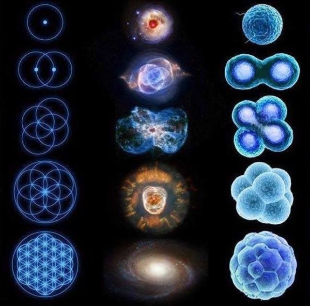
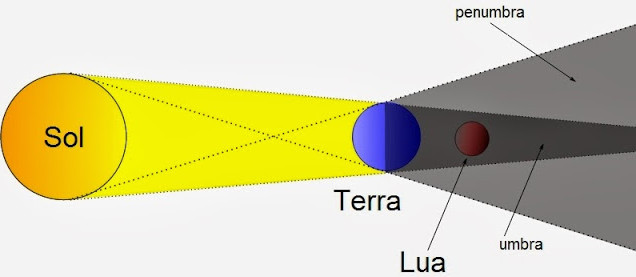
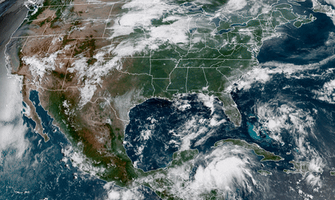
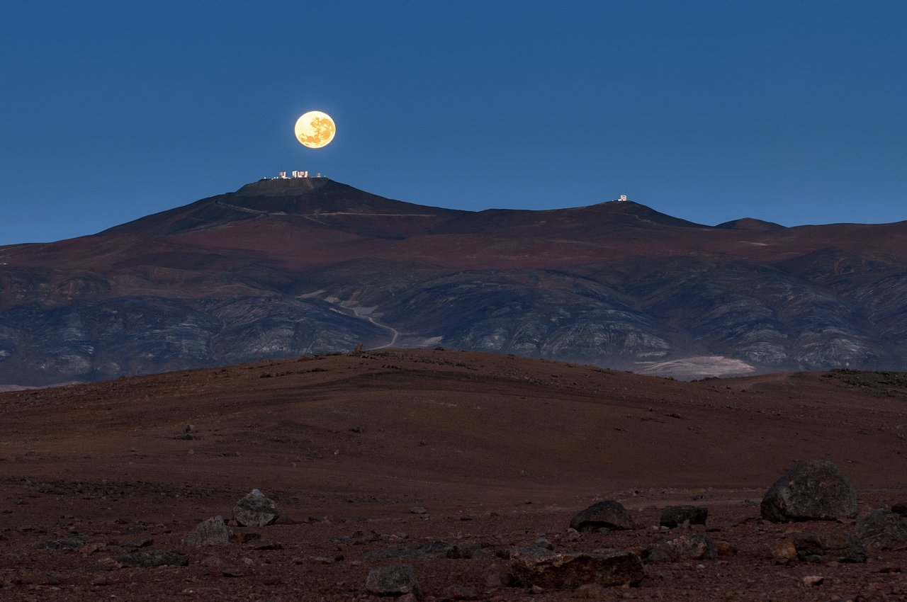
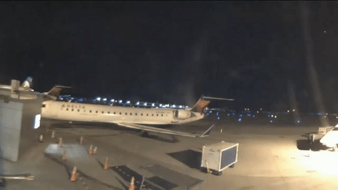
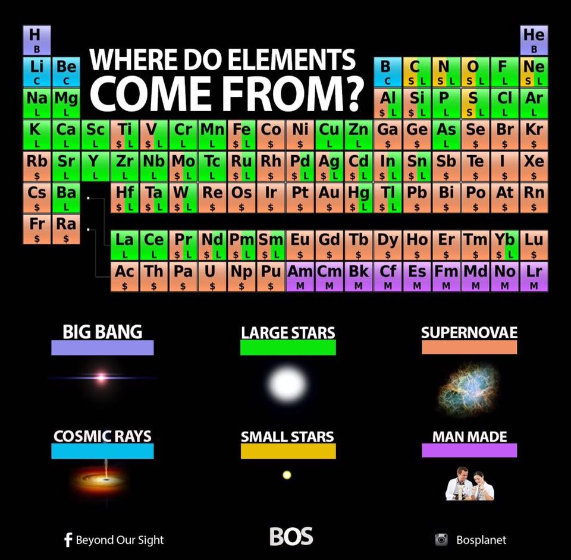
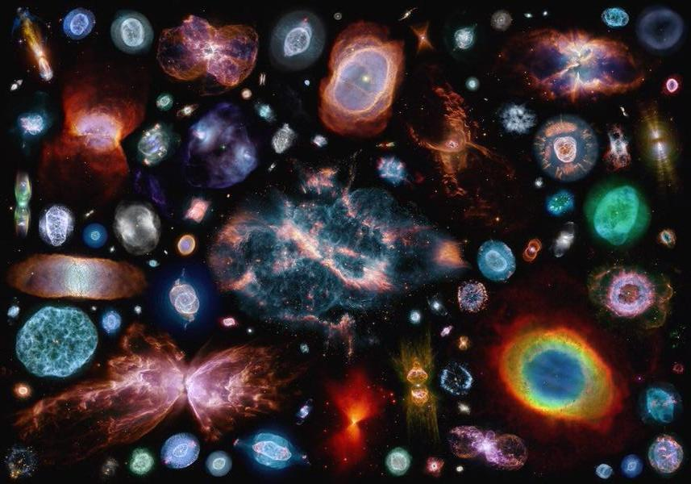
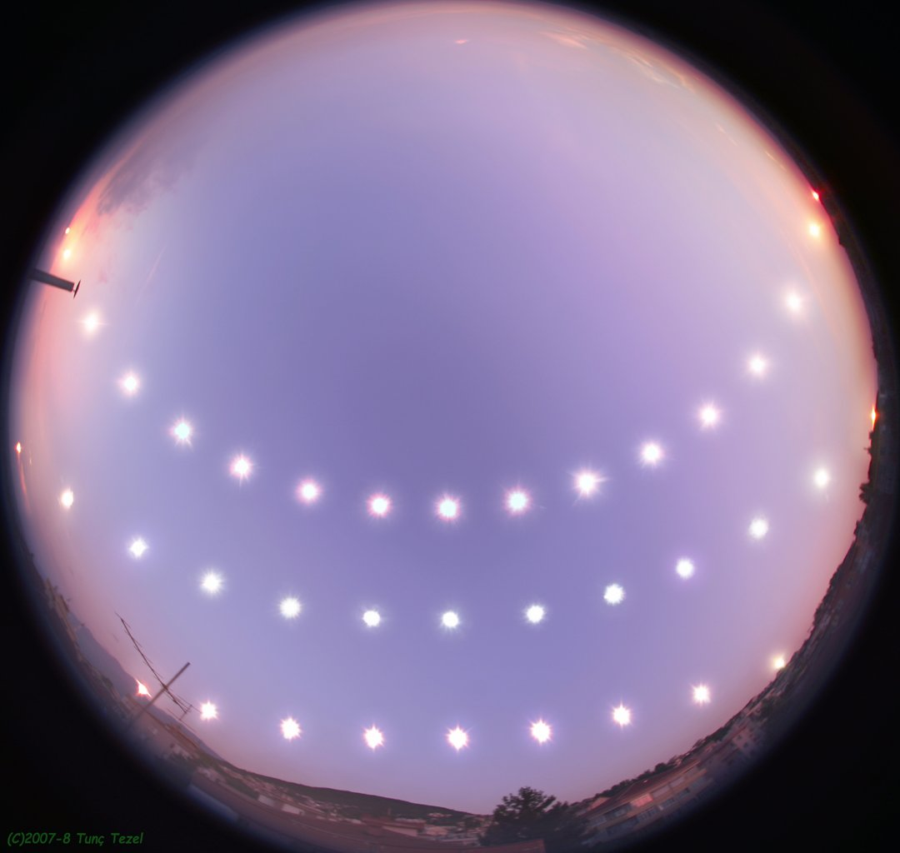

Basic astronomy concepts 
#############################

.. contents:: Table of contents

Em português
**************
.. figure:: ../figs/astro-basics_dreams.jpg
    :width: 300 px

.. figure:: ../figs/astro-basics_starstrees1.jpg
    :align: center

.. figure:: ../figs/astro-basics_starstrees2.jpg
    :align: center

    https://www.lensculture.com/articles/ellie-davies-stars

Links
=======
- Livro gratuito de Astronomia.
    `Astronomia e Astrofísica <http://astro.if.ufrgs.br>`_
    
- The Universe In My Pocket -- textos e fotos acessíveis a crianças de 9 a 99 anos (em português):
    http://www.tuimp.org/

- Excelente blog do Prof. Helder.
    http://navegandopelouniverso.blogspot.com.br/ 

- Revista Latino-Americana de Educação em Astronomia
    http://www.relea.ufscar.br/

- Cálculo do Nascer e Pôr do Sol   
    http://www.inf.ufrgs.br/~cabral/Nascer_Por_Sol.html 

- Análise da superfície de Plutão (2015)
    https://www.youtube.com/watch?feature=player_embedded&v=kbIiYya2LaI

- Análise da Ciência do Filme Interestelar (2015; Prof. Rodrigo Nemmen)
    http://iptv.usp.br/portal/video.action?idItem=28131

- Livro "A Física de Jornada nas Estrelas (Star Trek)".
    Autor: Lawrence M. Krauss

- De volta à Lua:
    https://www.youtube.com/watch?v=MZn7PRctuGw

- Por que a ciência precisa de metafísica?
    http://www.universoracionalista.org/por-que-a-ciencia-precisa-de-metafisica/

- Pesquisa da Nasa diz que ‘motor espacial impossível’, que opera sem combustível, funciona
    http://trabalhounido.blogspot.com.br/2017/01/pesquisa-da-nasa-diz-que-motor-espacial.html

- 22 observatórios e planetários para visitar ao redor do Brasil
    http://revistagalileu.globo.com/Ciencia/noticia/2017/01/22-observatorios-e-planetarios-para-visitar-ao-redor-do-brasil.html

Perguntas e respostas
=======================
P: **Como são formadas as estrelas de maneira geral?**
  
R: Basicamente, elas se foram pela força da gravidade! Há muito gás e poeira espalhados pelo universo. E, como matéria atrai matéria, este material que inicialmente ficava espalhado vai se juntando até formar uma nuvem densa que dá origem à estrela. Em geral, junto com a estrela são formados os planetas (e os outros corpos menores, como os cometas) assim como é o Sistema Solar. 

P: **Pq vocês resolveram estudar bem essas, as Be?**

R: O estudo das Be é interessante por várias razões: para entender como funcionam as estrelas que estão girando muito rápido, entender como se formam e se dissipam estes discos de gás em torno de estrelas, como a luz da estrela interage com este gás, entre outros motivos mais técnicos...

P: **Elas [as estrelas Be] são importantes considerando o ponto de vista de nós, que moramos na Terra? Pq?**

R: Diretamente as Be não estão associadas com a Terra ou o Sistema Solar. Isso porquê são estrelas bem mais jovens (algunas centenas de milhões de anos, enquanto que o Sol tem 4,5 bilhões) e não há planetas ao seu redor. Entretanto, estudando estas estrelas podemos melhorar os modelos físicos que temos (por exemplo, para as questões que enumerei na pergunta anterior) e assim compreender melhor as teorias que explicam o funcionamento do Sol, a origem da Terra (que também foi de um disco circunstelar, estrutura existente nas Be), etc. Como exemplo, gosto sempre de lembrar que o conhecimento da física atômica (e possibilidade de se construir bombas e usinas para geração de energia) surgiu estudando o interior das estrelas). Assim, o estudo das Be oferecem condições de estudos que são únicos e que podem complementar a teoria que aplicamos aqui na Terra.

P: **Por que dizem que uma estrela brilha mesmo depois que ela morreu?**

R: Na verdade isso depende da perspectiva em que se olha. Dizem isso pelo seguinte: a luz demora um certo tempo para percorrer grandes distâncias e, como as estrelas estão muito distantes uma das outras, a luz de uma estrela precisa viajar anos e anos até chegar até nós. Assim, se uma estrela morre agora, nós só vamos descobrir isso depois que essa informação viajar anos e anos até aqui. Por exemplo, imagine um vilarejo em que só podemos obter notícias via carta, e um amigo que morasse lá viesse a falecer. Uma pessoa comunicará a morte do amigo por carta, e a carta só chegará dias depois do falecimento. Até a carta chegar, você pensará que seu amigo está vivo, quando ele não mais está. O mesmo aconteceria com uma estrela que morressse agora: sua luz ainda estaria brilhando no céu, pois esta luz foi enviada antes da estrela morrer. Depois de um certo tempo, proporcional à sua distância, é que ela se apagará no céu.

P: **Desvio para o vermelho mostra o aumento (ou/a) da velocidade de expansão dos corpos celestes?**

R: Nossa compreensão atual é a de que o universo está se expandindo, mas de uma maneira bem lenta, que só pode ser detectada em distâncias muito, muito grandes. E quanto mais longe estiver um corpo celeste, maior será a velocidade com que este se afasta de nós. O desvio para o vermelho é uma medida desta velocidade de afastamento, de onde podemos estimar a distância do corpo celeste.

P: **Mas como podemos detectar essa velocidade se estamos também nessa mesma expansão?**

R: A expansão é bem pequena, sendo detectável somente a grandes distâncias. A questão da expansão do resto do universo então fica relativa a nós e nossa vizinhança. Nós podemos nos considerar parados, e todo o resto do universo parecerá estar se afastando em relação a nós (por exemplo, quando estamos dentro de um trem,  podemos dizer que o trem está parado e o resto é que está se movendo). Para a expansão do universo, costuma-se usar a analogia da bexiga: é como se vivêssemos num ponto desta superfície. Quando a bexiga está murcha, todos os outros ponto da superfície estão próximos. Ao ser inflada, todos os pontos da superfície da bexiga ficarão mais distantes uns dos outros. Esta é a expansão do universo, que ainda está "inflando-se".

P: **Estamos portanto mais próximos do ponto central do Big Bang?**

R: A analogia da bexiga dos dá a ideia de um centro. Mas a bexiga é uma superfície, não tem altura (ou espessura). Nós vivemos num ambiente tridimensional, então tal expansão ocorre em todas as direções, não havendo um "centro" para o universo.

Astronomia amadora
~~~~~~~~~~~~~~~~~~~~~
P: **Eu vi na internet que o IAG-USP tem cursos aos sábados para quem quer iniciar em astronomia amadora.**

R: Sobre astronomia amadora, não há nenhum curso *oficial* no IAG sobre isso. Oficialmente, só disciplinas optativas para alunos-USP e cursos de curta duração (eg., de verão) para graduandos de outras instituições. Aberto a comunidade, há a Astronomia para a 3a idade - e esporadicamente cursos de extensão de professores de ensino fundamental e médio.
São conhecidos  dois grupos de astronomia amadora externo e com alguma presença na USP: 

    - CASP, http://www.astrocasp.com/
    - Sputnik, http://gruposputnik.com/

Sugiro entrar em contato com eles sobre cursos. Um ótimo material para começar é este: 

    - http://pt.wikihow.com/Iniciar-na-Astronomia-Amadora

O IAG tem um curso [online] gratuito sobre Astrobiologia no Coursera:

    - https://www.coursera.org/learn/origensdavida

P: **Quero comprar um binóculo ou telescópio para observar o céu. Qual comprar?**

R: Idealmente, conheça um grupo de astronomia amadora. Você poderá (i) ver na prática o que é possível observar com estes equipamentos e (ii) obter dicas atualizadas sobre modelos e lojas para comprar. A dica geral é sempre começar com um binóculo, para depois investir num telescópio. Aqui está um ótimo vídeo e algumas reportagens sobre o assunto:

    - `Céu da Semana Ep. #15 - Binóculos <https://www.youtube.com/watch?v=QS5YmRmykPk>`_

    - `[Em inglês] Types of Telescopes - Tips for Buying Your First Telescope <https://www.skyandtelescope.com/astronomy-equipment/types-of-telescopes/>`_

Uma *referência* de preços no link abaixo. Contudo, destaco que não conheço nem o avaliador, nem o material, então não são recomendações. Preço de ago/2018:

    - `5 telescópios bons e baratos para quem está iniciando  <https://www.misteriosdoespaco.blog.br/5-telescopios-bons-e-baratos-para-quem-esta-inciando/>`_

P: **Como observar o céu, isto é, como encontrar objetos interessantes?**

R: Sugiro consultar os recursos abaixo:

    - Visitas com observações no IAG-USP: http://www.iag.usp.br/astronomia/atendimento
    - Para se orientar no céu com o PC: http://stellarium.org/
    - Para se orientar no céu com celular (que tenha bússola): https://play.google.com/store/apps/details?id=com.google.android.stardroid
    - Para ver satélites artificias: http://heavens-above.com/Visitas com observações no IAG: http://www.iag.usp.br/astronomia/atendimento

Observacional
~~~~~~~~~~~~~~~
P: **Deve ser uma loucura os equipamentos que precisam estar disponíveis para vcs fazerem esses estudos né?**

R: Sim, são bem complicados e envolvem muita tecnologia. Isso tem a ver como a ciência funciona: quando uma tecnologia aparece, os cientistas a utilizam até o seu limite para estudar e compreender a natureza. Vou dar um exemplo para ficar mais concreto: o tamanho dos telescópios. Assim que o Galileu apontou o telescópio para o céus e fez seus primeiros registros, começou uma corrida para quem conseguia "descobrir o que há no universo". Então, percebeu-se que com lentes maiores, poderia se ver mais coisas... Mas aí, viram que não se podem fabricar lentes muito grandes, então criou-se uma nova tecnologia: os telescópios com espelhos. Primeiro pequenos, depois maiores... A cada passo, novas descobertas. Então, chegamos as dias atuais, onde os cientistas, em geral, só conseguem fazer novas descobertas quando utilizam tecnologia de ponta, em condições que eram inacessíveis anteriormente. Vale destacar aqui que tecnologia de ponta não é uma necessidade: algumas vezes se faz ciência em condições que simplesmente ainda são inexploradas, que por alguma razão os cientistas do passado deixaram de estudar. Por exemplo, estudando algumas estrelas por décadas ou centenas de anos... Nesse aspectos, há incluse uma grande contribuição de astrônomos amadores que podem observar estrelas brilhantes com seus pequenos telescópios e ajudam cientistas em suas pesquisas (como anteceu na minha tese).

P: **E como é na prática [as observações astronômicas], assim, resumindo (lembre-se que eu não entendo nada). Vocês [astrônomos] olham para o céu, conseguem ver essas estrelas e como medem todas aquelas coisas que estão nos descritivos** (*fotometria*, *espectroscopia*, *polarimetria* e *interferometria*) **?**

R: A maior parte do trabalho do astrônomo é feito em escritórios com computadores, incluindo as observações! Aquela cena clássica (e romântica) de um astrônomo pondo o olho numa luneta não acontece mais (descobriu-se que a eletrônica é muito melhor para detectar e registrar a luz que o corpo humano). Assim, numa observação "profissional" o astrônomo comanda o computador, que por sua vez controla a mecânica do telescópio e o mantém apontado para a estrela (lembre-se, por exemplo, que a Terra está girando, e o telescópio precisa acompanhar esse movimento). Assim, só vemos o que o computador vê (essencialmente, uma imagem preto-e-branco; cores por exemplo, são adicionadas depois). As diferentes técnicas observacionais citadas (*fotometria*, *espectroscopia*, *polarimetria* e *interferometria*) implicam em diferentes análises físicas que fazemos com a luz coletada pelo telescópio (por exemplo, fotometria é uma medida de "potência" da luz; espectroscopia é uma medida da "cor" da luz; polarimetria é uma medida da "orientação" da luz, como Norte-Sul ou Leste-Oeste; e interferometria é uma medida que combina a luz de dois ou mais telescópios). Na maioria destes casos não fazemos uma "imagem" da estrela com o telescópio principal (assim, não "vemos" a estrela), mas só o resultado da análise feita com sua luz, pelo computador.

P: **Como eu posso procurar por satélites no céu?**

R: Eu procuro saber de satélites brilhantes neste site: https://heavens-above.com
Faça login ou clique em *Change your observing location*. Depois vá em *Daily predictions for brighter satellites*. Em *Brightness (mag)* quanto menor o valor, mais brilhante é. Em *Highest point / Azimuth* quanto mais perto de 90 graus, mais alto no céu (atualizado em Maio/2018).

P: **É possível saber a idade de um buraco negro, o que levou sua formação e o que ele era?**

R: Não podemos saber a idade de um buraco negro. Só podemos saber a sua origem, e ter uma ideia de suas interações com a vizinhança.
Para você entender o problema da determinação da idade: em objetos sólidos (como o planeta Terra), podemos usar a medida de decaimento de isótopos. Em objetos que geram energia, como as estrelas, podemos medir o seu brilho e a partir de modelos de reações nucleares determinar por quanto tempo ela pode brilhar. Por exemplo, no sistema Solar, as medidas de isótopos e modelos de energia do Sol ambos coincidem numa idade aproximada de 4.5 bilhões de anos -- tendo o Sol combustível para mais uns 5 bilhões de anos. Já um buraco negro, ele não emite nada. Assim, não temos como modelar o que se passa no seu interior e por isso estabelecer um certo "relógio" ou "gasto", como a energia do Sol. A única coisa que podemos saber com certa segurança de um buraco negro é a sua massa. E isso é obtido a partir da análise da trajetória de estrelas próximas, que orbital o buraco negro pela força da gravidade. Sabemos que buraco negro se originam do colapso do núcleo de estrelas muito massivas (de pelo menos uns 30 massas do Sol), quando o "combustível" destas estrelas se esgota. Ou num raro evento de colisão entre duas estrelas. O buraco negro que se resulta possui algumas poucas massas solares, mas se houver gás ou outros estrelas as seu redor, este material será agregado ao buraco negro e sua massa se expandirá. Com a massa crescente, mais material é atraído, e mais o buraco negro cresce. Acredita-se que no centro na maioria das galáxias existe um buraco negro muito massivo (milhões de massas solares), como o que há no centro da Via Láctea.

P: **O professor comentou sobre ondas gravitacionais. Como elas são "captadas"?**

R: Em teoria, as ondas gravitacionais podem ser captadas de várias formas, por diferenças no comportamento do espaço e do tempo. O único método bem sucedido até aqui é baseado na técnica de interferometria. Em resumo, a luz é também uma onda. Ondas, quando combinadas, possuem o fenômeno de combinação (ou interferência) construtiva e negativa (você já deve ter visto isso em ondulatória, que é aplicado em radiocomunicações). Assim, os detectores de ondas gravitacionais monitoram com altíssima precisão o padrão "normal" de interferência da luz, que viaja pelo espaço com velocidade constante. Se uma onda gravitacional atinge o caminho da luz, uma perturbação ocorre neste padrão de interferência. A duração e o formato da perturbação permite determinar as característica da onda gravitacional. Sugiro a leitura do artigo da Wikipedia em inglês https://en.wikipedia.org/wiki/Gravitational_wave

Carreira
~~~~~~~~~~~~~~
P: **Você sabe quantas pessoas no mundo ou no Brasil estudam essas estrelas?**

R: Em junho de 2014 houve uma conferência dedicada ao estudo das estrelas Be no Canadá, onde compareceram 60 participantes. Como nem todos podem participar de eventos como esse, 100 seria um bom número para dizer quantas pessoas estudam especificamente as Be no mundo. No Brasil, até onde sei, estuda-se Be em São Paulo (IAG-USP e UNIFESP), ON (Observatório Nacional, no Rio de Janeiro) e na UFS (Universidade Federal de Sergipe), envolvendo uns 10 especialistas. 

P: **Pq vc resolveu estudar esse tipo de estrela?** Ah, e uma observação, precisa ser muuuito bom para fazer isso.

R: Quanto iniciamos a pós-graduação, uma das exigências para o ingresso é ter um plano de pesquisa e um prof. orientador. Então em geral segue-se a linha de pesquisa de um dos docentes. No meu caso, eu segui a linha de pesquisa de meu orientador no IAG-USP, que me propôs um projeto com o uso de interferometria (técnica que eu estava muito interessado) e que, no IAG, ele era o único especialista. A interferometria (aplicada às Be) é uma técnica que por limitações tecnológicas só ficou possível a partir de 2002. Assim, há muito a ser explorado, e poucos especialistas no Brasil. As Be são bem estudadas por interferometria porque são objetos brilhantes no céu. 
Sobre a observação, leia a resposta da seção `abaixo <astro-basics.html#quero-ser-astronomo-a>`_.

P: **Quantos astrônomos profissionais existem no mundo (e no Brasil) hoje?**

R: Na União Astronômica Internacional (IAU em inglês) existem aprox. 11000 membros cadastrados. Como envolvem taxas e outras obrigações, só uma parcela dos astrônomos são vinculados à IAU (por exemplo, eu não sou). Se você incluir cientistas de outros campos, como física, geologia e engenharia que tem interesses de pesquisas relacionados à astronomia, você certamente pode dobrar o número acima. Na Sociedade Astronômica Brasileira (SAB), existem quase 700 membros, onde a maioria são estudantes de pós-graduação.

P: **Como é a carreira de astrônomo no Brasil?**

R: De uma forma reduzida, a carreira é basicamente a pesquisa acadêmica: fazer o doutorado, e publicar o maior número possível de artigos e tornar-se um professor universitário (em astronomia, 95% destas posições estão em universidades públicas).

------

*Gostou das perguntas e respostas? Veja algumas das aparições do nosso grupo na imprensa neste link*: 

    - `In the press <inthepress.html>`_. 

Quero ser astrônomo(a)
========================
*Olá Daniel! O professor Alex do Instituto de Astronomia da USP (IAG) indicou você para tirar uma dúvida que enviei para ele:*

*Este ano (meu ultimo ano do ensino médio) decidi que prestaria Astronomia pela afinidade com as exatas e o amor gigantesco pelo curso. O ano inteiro tirei minhas duvidas quanto ao curso e decidi que apesar de parecer difícil, estaria estudando algo que gosto. E sempre que gostamos de algo o peso das cobranças ficam mais leves e a vontade de ir para as aulas/trabalho é maior (e a vida mais feliz). Porém, agora nesta reta final e depois da certeza de que quero entrar neste curso veio outra duvida: Quero trabalhar com pesquisas (este é o meu objetivo) e como não tenho ninguém próximo da minha família, não sei como é vida de pesquisador e nem de astrônomo. Queria saber se o meu amor e afinidade pelas exatas/astronomia será o suficiente para me tornar uma boa profissional ou se teria que nascer com um dom ou um gênio para poder exercer tal profissão. Se alguém puder responder sobre como é um dia de um pesquisador/astrônomo e se não precisaria ser um gênio eu agradeceria muito!*

*Atenciosamente, JP*

    Oi JP,

    Fico muito feliz em saber do seu interesse por astronomia. E acho que sei porquê me indicaram: acabei de me formar no doutorado, e creio ser um exemplo de "não-gênio" capaz de superar as dificuldades do estudo e pesquisa profissionais  :-)  Também, acabei sendo o primeiro doutor (PhD) de toda minha família - e portanto, não tive nenhum exemplo familiar deste tipo de carreira.

    A figura do pesquisador, prinicipalmente na área de ciências exatas, está muito ligada à esta figura do "gẽnio", com um dom quase que natural para cálculos e deduções. Mas, como diz uma frase popular (por vezes atribuída ao Thomas Edison), "Talento é 1% inspiração e 99% transpiração". Creio que, com dedição e esforço, é possível sim alguém tornar-se um ótimo pesquisador. Explico-me.

    A astronomia (e por extensão, a astrofísica) é hoje um campo tão vasto e que demanda saberes tão distintos (não só habilidade em cálculo e matemática, mas também em computação, estatística, comunicação de sua pesquisa, etc) que você poderá encontrar um nicho em que terá uma certa "aptidão natural", uma facilidade de desenvolvimento, e onde poderá fazer a diferença.

    E também, aqui no Brasil, pesquisa não é algo muito comum. Em meus estudos fiz vários amigos em situações similares a minha e juntos fomos superando as dificuldades que surgiam... Astronomia é um campo fascinante, e a curiosidade em compreender o cosmos é muitas vezes o pricipal incentivador de que precisamos ter.

    Mas queria dizer também dizer que nem tudo são flores: conheci alguns jovens que tinham certeza de que queria ser astrônomos e acabaram deixando o curso, por diferentes razões. Nem sempre é fácil ter certeza daquilo que queremos para nosso futuro profissional enquanto somos jovens... Quando você enfrentar as primeiras disciplinas de física e cálculo da graduação, por vezes com professores didaticamente bem ruins, é que eu acho que terá uma ideia bem clara se quer ou não tornar-se uma astrônoma.

    Outro problema é o retorno financeiro. Pesquisador em áreas de exatas demora a ter um reconhecimento financeiro proporcional ao esforço desprendido em sua formação. Por exemplo, se você se inscreveu na graduação do IAG-USP, este é um curso integral - e portanto, você não poderá ter um trabalho "regular" enquanto estuda. Durante a graduação, poderá receber 2 formas de auxílio (em geral, do meio do curso em diante): bolsas de monitoria de disciplinas e bolsa de iniciação científica.

    Para você ter uma ideia de valores (pode consultar o site da FAPESP ou CNPq para valores mais precisos), as bolsas de graduação costumam ser de 1/2 salário mínimo. Quando você se formar na graduação e entrar no mestrado, a bolsa é de apenas 2 salários mínimos (muitos profissionais recebem bem mais do que isso quando se formam). No doutorado, isto sobe para 3 salários, talvez um pouco mais. Ao meu ver, é só no pós-doutorado (tipicamente, 6 anos após formado a graduação) é que você terá um salário "de mercado", em torno de 6 a 8 salários mínimos.

    Ao meu ver, estas são as principais questões que um astronômo se defronta no processo de sua formação. Se ficou alguma dúvida, não hesite em me escrever. E boa sorte na prova de ingresso!

    PS: Talvez você ache interessante a leitura deste `link <http://mulherdasestrelas.com/quer_ser_astrnomoa.html>`_. É o site de uma astrônoma brasileira que trabalhou na NASA e que responde à perguntas para quem quer ser astrônomo(a).

Sou engenheir@ e quero trabalhar com astronomia
================================================
Boa tarde professor, sou aluna do segundo ano de engenharia elétrica no IMT e faço aulas extracurriculares de astrofísica com o professor Pedro Beaklini (que enviou seu contado para tirar eventuais dúvidas sobre astrofísica).
Tenho muito interesse no assunto e gostaria de saber se posso trabalhar nesta área mesmo fazendo engenharia?

    Olá!

    Espero que esteja gostando do curso de engenharia e das aulas do professor Pedro.
    E fico contente com seu interesse em astrofísica. 

    Com certeza engenheiros são muito bem-vindos para colaborar nos arranjos experimentais dos físicos. Como você pode deduzir, os arranjos experimentais são complexos, envolvendo múltiplas disciplinas (como Eng. mecânica, eletrônica, óptica, de software, entre outras), e são equipamentos de altíssima tecnologia. Muitas vezes, são desenvolvidas tecnologias especialmente para estes experimentos e que depois chegam no mercado. Como um exemplo, estão os detectores CCD -- que inicialmente foram desenvolvidos para registrar as imagens de telescópios, e hoje estão na maiores das câmeras digitais. Converse com o Prof. Pedro e o Prof. Vanderlei Parro no IMT sobre possibilidades de projetos em astronomia.

Links
======
- http://www.astro.iag.usp.br/~bacharelado/?q=node/5
- http://mulherdasestrelas.com/quer_ser_astrnomoa.html

..  TODO

    Calendários
    =============
    Notas baseadas na apresentação do Prof. Dr. Roberto Boczko (IAG/USP), 08/05/2014, no Astronomia ao Meio-Dia do IAG-USP.
        - https://www.youtube.com/watch?v=54_UidCpIKU

    Introdução
    -----------
    - *Calendários* são a contagem dos dias em números *inteiros*.
    - *Dia* aqui entendido como a sucessão dos ciclos de *nascer* e *ocaso* do Sol.
    - *Mês* está associado ao período de lunação.
    - *Ano*, estações do ano.
    - *Ciclo metônico*, importante para a determinação da páscoa/carnaval.

    Calendários
    -------------
    - Alexandrino: da igreja ortodoxa, continuação do calendário egípcio.
    - Islamita: continuação do calendário babilônico.
    - Romano: evoluiu para o Juliano e então Gregoriano, que é o atual.

    Definições
    -------------
    - Dia (solar): 2 passagens consecutivas pelo meridiano local. 
    - 12h00: ("sombra mínima do dia")

Observatórios Virtuais (VO) e Educação em Astronomia
*******************************************************
From Janet Evans at ADASS/Chile 2017.

- Existem vários links para educadores em http://chandra.harvard.edu

- Muitos links em http://www.sdss.org/  -- tenho contatos com o Jordan Raddick que está bem envolvido com ideias educacionais para o SDSS, por exemplo, http://skyserver.sdss.org/dr14/en/proj/projhome.aspx

Links da IVOA:

- http://wiki.ivoa.net/bin/view/IVOA/IvoaEducation

- http://www.ivoa.net/astronomers/vo_for_public.html : ver EuroVO for Education!

- http://daepo.china-vo.org/ : IAU Inter-Commission B2-C1-C2 WG

- `Data Driven Astronomy Education and Public Outreach (DAEPO) <http://daepo.china-vo.org/>`_

Animations
************
- Awesome pool of animations!
    http://astro.unl.edu/animationsLinks.html

- Seasons illumination.
    https://www.youtube.com/watch?v=LUW51lvIFjg 

- The Dark Side of the moon.
    https://www.youtube.com/watch?v=jdkMHkF7BaA

- Back to the Moon for Good
    https://www.youtube.com/watch?v=OkivPFtLOj4

Pictures
**********
- APOD - Astronomy Picture of the Day
    http://apod.nasa.gov/

.. figure:: ../figs/astro-basics_year.gif
    :align: center

.. figure:: ../figs/astro-basics_north.jpg
    :align: center

.. figure:: ../figs/astro-basics_eclipse2018.jpg
    :align: center

.. figure:: ../figs/astro-basics_milky.jpg
    :align: center

.. figure:: ../figs/astro-basics_agua.jpg
    :align: center

.. figure:: ../figs/astro-basics_loop.gif
    :align: center

    The outer planets movement on the sky.

.. figure:: ../figs/astro-basics_LakeMyvatn_Brady_1080.jpg
    :align: center
    :width: 800 

    Auroras and Star Trails over Iceland
    
.. figure:: ../figs/astro-basics_Comet_Lovejoy.jpg
    :align: center

    Orion constellation and comet Lovejoy day by day

    A bright meteor!

    Another one!!

.. figure:: ../figs/astro-basics_juno.gif
    :align: center

    5 years Juno's journey

.. figure:: ../figs/astro-basics_JupiterMoons.jpg
    :align: center

.. figure:: ../figs/astro-basics_moon-saturn.jpg
    :align: center

.. figure:: ../figs/astro-basics_planets-to-scale.png
    :align: center

.. figure:: ../figs/astro-basics_nebulosa.gif
    :align: center

    Este é o céu da Grécia em três épocas do ano:
    - Início do Verão (linha do Sol mais alta)
    - Início da Primavera e Outono (linha "do meio")
    - Início do Inverno (linha mais próxima do horizonte)
    Cada posição do Sol tem aproximadamente 1hora de diferença.

.. figure:: ../figs/astro-basics_lua.jpg
    :align: center

    Projeto Astronomia Para Todos - Batatais

    Nesta foto a Lua crescente foi fotografada no mesmo dia, quase na mesma hora, porém em hemisférios diferentes.
    Notem que a parte não iluminada está à esquerda em uma foto e à direita na outra.
    A posição da Lua não mudou em relação a Terra, o que mudou foi a localização dos observadores: um está acima da linha do equador e o outro abaixo.
    Um está no hemisfério norte e o outro no hemisfério sul. 
    A Lua orbita a Terra na altura da linha do equador, portanto, um observa a Lua de cima para baixo e o outro de baixo para cima.
    Se houvesse um terceiro observador situado bem em cima da linha do equador, sua foto mostraria a parte iluminada voltada para cima e a parte escura para baixo! Na fase minguante seria ao contrário: a parte iluminada para baixo. A hora está em UTC, sigla em inglês para Tempo Universal Coordenado.

`Eclipse 2018 (MP4) <../movs/astro-basics_eclipse-2018.mp4>`_

`Ondas multi-dimensionais (MP4) <../movs/astro-basics_physics_waves.mp4>`_

`2 Trillion Galaxies (MP4) <../movs/astro-basics_Wonder_of_Science-2_trillion_galaxies.mp4>`_

Sistema solar:
    
    - Sistema solar em escala - Pocket Solar System https://nightsky.jpl.nasa.gov/download-view.cfm?Doc_ID=392  
    - As dobraduras me lembraram da (simples) formulação matemática das distâncias entre os planetas de Tidius-Bode (https://en.wikipedia.org/wiki/Titius%E2%80%93Bode_law)

Observations
***************
- Amazing planetarium.
    http://www.stellarium.org/

- The most popular website for tracking satellites (Iridium and ISS!).
    http://www.heavens-above.com/ 

- List of satellite trackers
    http://en.wikipedia.org/wiki/List_of_satellite_pass_predictors

Authors
***********
Marcelo Gleiser
==================
- The Island of Knowledge: The Limits of Science and the Search for Meaning
    *A ilha do conhecimento*
    
- A Tear at the Edge of Creation: A Radical New Vision for Life in an Imperfect Universe
    *Criação Imperfeita: Cosmo, Vida e o Código Oculto da Natureza*
    
- Cartas a um jovem cientista

- The dancing universe
    *A dança do universo*

George Gamov
===============
- One, two, three... infinity
    *Um, dois, três... infinito*

Links
*********
- Why Science needs metaphysics?
    http://nautil.us/issue/29/scaling/why-science-needs-metaphysics

Brasil and astronomy
***********************
ESO
====
`Letter of Science & Technology minister <../static/astro-basics_carta_do_ministro.pdf>`_ (25/06/2015) saying that the government has still interest in joining ESO.

`Carta da Sociedade Astronômica Brasileira sobre o ESO e as pesquisas brasileiras <https://sab-astro.org.br/carta-eso/>`_: A Sociedade Astronômica Brasileira está em contato contínuo com o MCTIC [governo federal], na busca conjunta por uma forma realista para a efetivação e assinatura do acordo de adesão [do Brasil ao ESO] (15/03/2018). 
