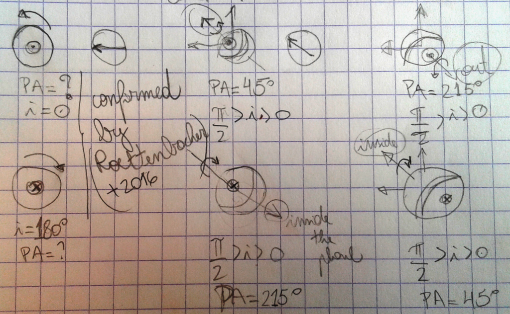
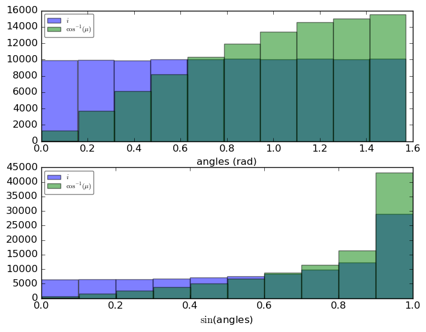
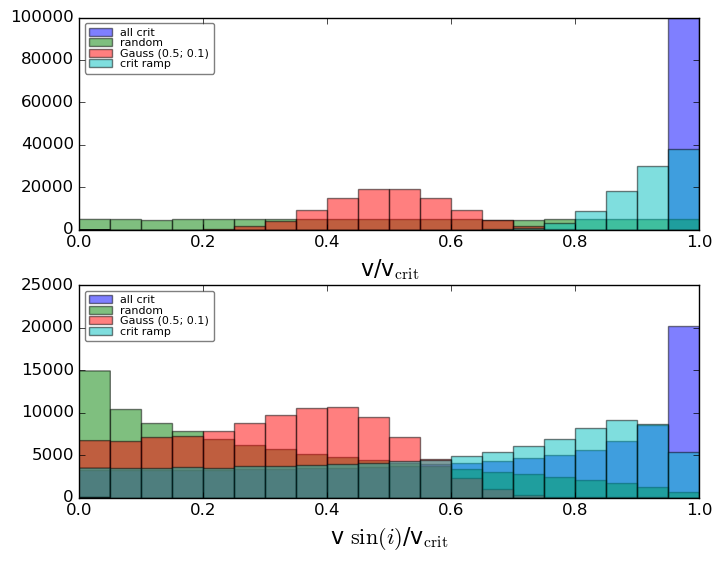
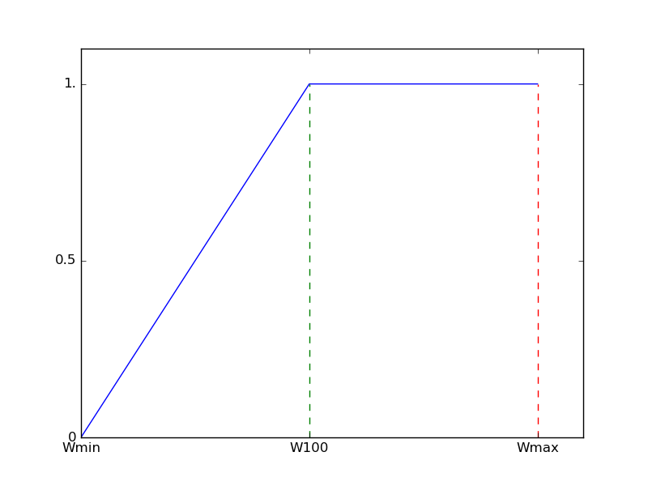

DMF AstroBlog
##############

2016
********
2015-07
===========
TBD

---------

2015-06
===========
File compression with ``bz2``
-----------------------------------
``bz2`` compression library is natively supported by Python (see `the Standard Library docs <https://docs.python.org/2/library/bz2.html>`_). The compression rate is about as ``gunzip``, although the compression is quite faster.

.. warning::

    There is a parallel version of ``bz2`` which is **not** compatible with the native one in Python 2 (`pbzip2 <http://compression.ca/pbzip2/>`_). In Ubuntu, it can be installed with the command ``apt-get install pbzip2`` and on Python with ``pip install bz2file``. Although using the same algorithm to compression, Python 2 **can not read** these files (my tests with Python 3.4 also did not succeed).

From `the Standard Library docs <https://docs.python.org/2/library/bz2.html>`_:

.. note::

    This class does not support input files containing multiple streams (such as those produced by the ``pbzip2`` tool). When reading such an input file, only the first stream will be accessible. If you require support for multi-stream files, consider using the third-party ``bz2file`` module (available from `PyPI <https://pypi.python.org/pypi/bz2file>`_). This module provides a backport of Python 3.3's ``BZ2File`` class, which does support multi-stream files.

------------------------

Compactação de arquivos, imagens e FITS
-------------------------------------------
Existe dois tipos de compactação para arquivos:

- Lossless Compression (zip e cia.); e
- Lossy Compression (jpg e cia.).

O `fpack <https://heasarc.gsfc.nasa.gov/fitsio/fpack/>`_ é específico para o formato FITS e, por padrão, trabalha com a compactação Lossy, desenvolvido especificamente para ignorar o ruído das imagens e manter a informação de ciência. Ele oferece suporte para a compactação Loseless.

É importante saber que a compressão Lossless tem por fundamento evitar redundâncias nos dados - e por isso não há perdas. Também pode-se, com o Python por exemplo, ler um arquivo ``*.zip``, ``*.bz2`` ou ``*.gz`` diretamente para a memória sem de fato descompactar-lo - isto é, grava-lo no disco - o que torna o processo muito rápido.

Os processos Lossy de um lado perdem uma pequena parte da informação. De outro lado, eles ocupam ainda menos espaço em disco - e podem alimentar a memória de uma maneira muito rápida também.

Se alguém souber do algoritmo Lossy do fpack, eu sou todo ouvidos. Outro algoritmo eficiente para a compactação Lossy de imagens é o "kernel-PCA" - mas que ainda não está implementado num programa de fácil acesso (até onde eu sei).

Testes 
^^^^^^^^^^^^^^^^^^^^^^^^^^^^
Fator de compactação (qto maior, melhor):

- Zip ~ Bz2 ~ 7z = 1.15x
- fpack = 7.77x
- `pyfits` lê um "data array" vazio com a compactação fpack...

----------

Rotational rates of Be stars... again
----------------------------------------
The :math:`v\sin(i)` measurement in hot stars is not easy... Some issues for the case of the Be stars:

- There is no photospheric "good line" that can used in the entire B-type spectral range (i.e., working equally good for the B late-types and the B early-types). All the lines present in this spectral range can be *contaminated* by circumstellar (CS) emission features or are *sensible to the rotational effects*.
- What is said for the lines is true for the different methods (EW, FWHM, etc): works fine for some cases, not for others... With that said, there is no big fundamental changes if the method consider - or not - the rotational effects.
- Hydrogen lines are never used to the determination of the :math:`v\sin(i)`.
- Because of the nature of the CS emission:
    
    - The lines are not equally affected. Owing to the emission, some lines will appear narrower than others.
    - With CS emission, **in most cases** the lines will appear narrower that they should be, creating a **systematic underestimation** of the :math:`v\sin(i)` value.
    - **BUT** this depends on the line analyzed, the inclination angle, and the spectral type of the star... In specific cases, the value can be *overestimated*.
    - In general, the methods work fine for low *i*, and increase their underestimation as *i* increases.
    - Rule of thumb: :math:`v\sin(i)` should be used as a **lower limit** value.

- There is a revision on the methodology of measurements of :math:`v\sin(i)` starting in 1975 (and took a while to be used). So, values older than from 1985 should be used with caution (or even don't be used at all). The main difference is that the older values have **overestimated** values when compared to the newer values.
- The main reference for the method of Fremat+ (2005) is Chauville (2001).
- Beyond the systematics of the **method**, the rotational effects tends to **underestimate** the :math:`v\sin(i)` (e.g., Townsend 2004)...
- As seen in Achernar (Rivinius+ 2013), the Be stars do show an intrinsic :math:`\Delta v`, related to the CS activity (:math:`\sim +0.1v\sin(i)`).
- CONCLUSION: the real s:math:`v\sin(i)` (:math:`== v_{rot}` in i.e., BeAtlas) can be much higher than the measured (or "observational") one.

-------------

For second time, LIGO detects gravitational waves
----------------------------------------------------
Signal was produced by two black holes colliding 1.4 billion light years away.

http://news.mit.edu/2016/second-time-ligo-detects-gravitational-waves-0615

------

Rotation in massive stars
---------------------------
by Oscar Ramírez (United Kingdom Astronomy Technology Centre)

    Rotation is a key parameter in the evolution of massive stars (masses larger than 10 solar masses), affecting the evolution, chemical yields, ionizing photon budget, and the final fate as supernovae and long-duration gamma-ray burst. We determine the (projected) rotational velocity for more than 330 O-type stars in 30 Doradus, a starburst region in the Large Magellanic Cloud. It contains the richest population of massive stars in the Local Group and is the best possible laboratory to investigate open questions on the formation and evolution of massive stars. Among our sample stars, we have identified 116 spectroscopic binary systems and 216 presumably single O-type stars. The most distinctive feature of the (projected) rotational velocity distribution of the single star sample is a two-component structure; i.e a low-velocity peak (at ~ 80 km/s) and a high-velocity tail extending up to 600 km/s. We argue that the low-velocity peak is the outcome of formation. The presence of a well populated high-velocity tail is compatible with population synthesis computations that study the effects of binary evolution, i.e. tides and mass transfer (de Mink et al. 2013) and that produces a population of merged objects, and post-mass-transfer binaries that appear as single objects. The distribution of stars in binary systems also presents a low-velocity peak at around the same velocity, as the single sample, however there is no tail of rapidly spinning stars (> 400 km/s). This also concords with binary evolution effects.

-------

Imaging compression by using (kernel) PCA
--------------------------------------------
- http://www.sc.eso.org/~jlillobo/mcmc_coffee/repository.html (2016-06-09)
- https://en.wikipedia.org/wiki/Kernel_principal_component_analysis
- http://scikit-learn.org/stable/auto_examples/decomposition/plot_kernel_pca.html

-----

Periodogram tools
---------------------------
- `VARTOOLS <http://www.astro.princeton.edu/~jhartman/vartools.html>`_
- `Period04 <https://www.univie.ac.at/tops/Period04/>`_
- `NASA Exoplanet Archive Periodogram Service <http://exoplanetarchive.ipac.caltech.edu/cgi-bin/Periodogram/nph-simpleupload>`_

-----

Importance of colors in data analysis
---------------------------------------
- `A Better Default Colormap for Matplotlib <https://www.youtube.com/watch?v=xAoljeRJ3lU>`_.
- `Perceptual Color Maps in matplotlib for Oceanography <https://www.youtube.com/watch?v=XjHzLUnHeM0>`_.
- `Free color blindness simulator <http://colororacle.org/>`_.
- `HTML Color Codes <http://htmlcolorcodes.com/>`_.

---------

Galileo's reputation is more hyperbole than truth
-----------------------------------------------------
"By the 18th century, Galileo was slipping into obscurity outside of Italy. Then he experienced a remarkable resurrection."

https://aeon.co/ideas/galileo-s-reputation-is-more-hyperbole-than-truth

---------

Reading non-standard FITS specs
--------------------------------
E.g.: IUE, ESO-FEROS, ...

.. code:: python

    hdulist  = pyfits.open(fitsfile)
    tbdata   = hdulist[1].data
    wave     = tbdata.field('WAVELENGTH')  #Angs
    flux     = tbdata.field('FLUX')        #erg/cm2/s/A
    sigma    = tbdata.field('SIGMA')
    
------

2016-05
===========
The language of languages 
------------------------------
Languages form the terrain of computing. 

http://matt.might.net/articles/grammars-bnf-ebnf/

-------------

Europe announces that all scientific papers should be free by 2020
------------------------------------------------------------------------------
http://www.sciencealert.com/europe-announces-that-all-scientific-articles-should-be-freely-accessible-by-2020

-------------

How to reduce VLTI-PIONIER data
--------------------------------
This is not *required*, since the PIONIER deliver the data already reduced.

If details/enhanced precision is needed, the reduction is in two steps: https://forge.osug.fr/svn/ipag-sw/PIONIER/trunk/doc/PNR-MAN-PNDRS.pdf , see Sects. 6 and 7.

Only the second, the calibration, should be tweaked. In this particular case: make sure the interpolation of the transfer function is over all calibrators, and possibly chose s different interpolation law. Also, some files have the fits keyword DET.SAT set to "T", try also to reduce the data without these files.

First, just install the software and get the data to play with. The output is very verbose, a lot of things to look at. 

---------

BeSOS in the sky
-----------------
Be Stars Observation Survey (BeSOS) is a catalogue of high resolution spectra, available at http://besos.ifa.uv.cl

-----------

Retrieving and reading IUE spectra
-------------------------------------
Access IUE website https://archive.stsci.edu/iue/search.php

To read them with ``pyfits``:

.. code-block:: python

    hdulist  = pyfits.open(file_iue)
    tbdata   = hdulist[1].data
    wave     = tbdata.field('WAVELENGTH')  #Angs
    flux     = tbdata.field('FLUX')        #erg/cm2/s/A
    sigma    = tbdata.field('SIGMA')

---------

Terraforming: Can We Turn Mars Into Earth 2.0?
-------------------------------------------------
https://www.youtube.com/watch?v=9F1iWp4Gl3k

---------

The Journal of Open Source Software
-------------------------------------------------------
http://www.arfon.org/announcing-the-journal-of-open-source-software

------------

Clues for How Giant Black Holes Formed So Quickly
-------------------------------------------------------
http://hubblesite.org/newscenter/archive/releases/2016/19/

---------

Outreach news
---------------
I have so much fun reading astronomical outreach articles!

`Curiosity Sees Seasonal Trends on Mars <http://www.skyandtelescope.com/astronomy-news/curiosity-sees-seasonal-trends-on-mars/>`_: *The temperature on Mars and Los Angeles (!) follows the same seasonal pattern: higher temperatures during the summer, lower temperatures in the winter*. Brilliant! And, of course, let's compare it with Hollywood! Indeed, who would care about the weather of Arapiraca?

`New Horizons collects first science on a post-Pluto object <http://astronomynow.com/2016/05/19/new-horizons-collects-first-science-on-a-post-pluto-object/>`_ (from an animated gif): *The first two of the 20 observations that New Horizons made of 1994 JR1 in April 2016. The Kuiper Belt object is the bright moving dot indicated by the arrow. The dots that do not move are background stars. The moving feature in the top left is an internal camera reflection* **(a kind of selfie)** *caused by illumination by a very bright star just outside of the field of view; it shows the three arms that hold up the secondary mirror*. Hahahaha! Satellite selfie!!

----------

Sandage's Last Paper
------------------------
`Original article <https://carnegiescience.edu/news/allan-sandage%E2%80%99s-last-paper-unravels-100-year-old-astronomical-mystery>`_.

------------

Por qué se requiere mayor presupuesto para Fondecyt
-----------------------------------------------------
The `Letter <static/astro-blog_mas_presupuesto_para_fondecyt.pdf>`_.

In 2009, the number of post-doc proposals to the Chilean institute Fondecyt was 140. In 2016, it should be ~970! It results in an average grow rate of 32%/year.

------

Cranmer (2005)
----------------
It is a statistical study of the equatorial rotational rates of Be stars. It was found a trend related to the :math:`\bar{v}/V_{crit}` with the spectral time: earlier is the spectral type (Sp), lower is :math:`\bar{v}/V_{crit}` (but all should have members with *Veq=Vcrit*).

Definition: :math:`v\sin(i)` is the empirical (i.e., apparent) value, while :math:`V_{eq}\sin(i)` is the one with known parameter values. Realize the distinction: 

- (i) :math:`v\sin(i)` is the observation (in principle, convolved); 
- (ii) :math:`V_{eq}\sin(i)` is the intrinsic values (not apparent);
- (iii) Exists still :math:`v\sin(i)_{model}` from (ii) into (i). This value is not unique: a different combination of :math:`V_{eq}\sin(i)` leads to the same :math:`v\sin(i)`.

Conclusion from Townsend (2004): GB and OB must be taken into account, otherwise the derived *Veq* will be maximum at ~0.8. Importance of determining *Veq* is to constrain the mass-loss mechanism. 

The work treats separately the Sps and try to recover the *Veq/Vcrit* distribution of each of them, taking into account the OB+GD. "The actual rotation speeds may be even lower if GD is overestimated" (generalization of Townsend's idea).

From Yudin (2001) Sp and Lclass => Teff and Lum from de Jager (1987) => M* from Claret (2004). The derived *Vcrit* are 20% higher than Chauville (2001). Both values were kept to the analysis. Subsamples divided in five groups, from Very-Early to Very-Late types: [VE, E, M, L, VL]. :math:`v\sin(i)/V_{crit}` have a systematic dependence on Teff, but not :math:`\sigma`.

For a given *Veq* (i.e., M*, Sp, etc.) and *i*, a unique line profile is generated. The contrary (i.e., unique profile leads to unique *Veq*) is not true. 

The line profile (:math:`R_\nu`) is calculated by :math:`\int I_{\nu,L}/\int I_{\nu,C}`. *In short*, the line is calculated by a Voigt profile with a thermal broadening and limb-darkening (LB), and the continuum by a Black Body function and (the same) LB coefficient. 

The effects of the rotation in the line profile as assessed by the FWHM measurements: :math:`D=FWHM_{Veq}/FWHM_0`, that allows to determine a :math:`\delta V`, that can used to determine:

.. math::

    \left( \frac{V\sin(i)}{V_{crit}} \right)_{measured} \propto D\sin(i) \left( \frac{V_{eq}}{V_{crit}} \right)

Typically, the errors of :math:`v\sin(i)\sim 10\%` and :math:`v\sin(i)/V_{crit}\sim 30\%`. They were estimated (see below).

To ensure that all Be star *are not* rotating critically (i.e., maximized the derived *Veq*) it is assumed: B9 corrections for :math:`v\sin(i)` to all Sps, and no GB+OB corrections in the measurements of Yudin.

COMMENT: I believe the effects of GD are more extreme in B9 is the relative importance (i.e., contrast) of the flux redistribution (to be checked).

In other contour the ambiguity of the statistical distribution of the rotation rates (:math:`v\sin(i)` is not unique), a Monte-Carlo *forward method* was used to explore the parameters, with the "likelihood" of the models determined by a :math:`\chi^2` based on the number at each bin of *Veq*.

So the incidence of the rotation rates is done by a "trapezoidal" function :math:`\psi(V_{eq})` with 4 parameters, 3 free because one is set by normalization (the function is dependent of *Vmin*, *Vmax*, *b* and *m*; the later two are equivalent to the S and its normalization).

To sample :math:`\psi(V_{eq})`, it is created 80 :math:`\psi_i(V_{eq})=\delta(V_{eq}-V_i)`, so *Veq* is sampled (by MC) will all combination of parameters (i.e., *i* and the observational error :math:`\zeta`).

With this, and applying all methods discussed the bins of the histogram :math:`\phi(v\sin(i))` is created, with weights determined by :math:`\phi(V_{eq})`.
 
The first analysis is to see the expected behavior if all stars were rotating critically (remember, the histograms are of :math:`v\sin(i)` and **not** of :math:`V_{eq}\sin(i)`). So the maximum value was :math:`v\sin(i)/V_{crit}\sim0.68`. Although all efforts were made to agree the observed and the simulated distributions (in terms of hypothesis choices), it was impossible to reproduce the observations. This was taken as an evidence that not all stars are rotating critically.

So the following analysis were done under more realistic assumptions (i.e., not only Chauville *Vcrit*, and proper corrections beyond B9 = proper *D* values).

The influence of the observational errors were studied comparing the quality of the :math:`\chi^2`, and confirmed that they are about 10-20% (in :math:`v\sin(i)` - by the spread of the distributions). COMMENT: we should believe here the author, because I believe than it is intrinsically indistinguishable from a spread in the *Veqs*.

The derived best-fits puts :math:`\bar{V_{eq}})/V_{crit}=0.684-0.854`, and there is a definite dependence of *Vmin* on spectral type. The derived *Vmax* do not change (~0.85 to standard values and ~1.0 to Chauville) and shape of :math:`\psi(V_{eq})` depend rather strongly on the uncertainties. 

Better than determining :math:`\psi(V_{eq})`, it to determine the *Vmin-Vmax* range. While *Vmax* is compatible with 1.0, *Vmin* follows a dependence with the spectral type. Important point: if the gravity darkening effects were overestimated, then *Vmin* values may be lower. 

To understand...
^^^^^^^^^^^^^^^^^^
Statistics: *kurtosis* measures the relative importance between the tails to the peak of the distribution; *skewness* measures the symmetry of the distribution. 

- "The fact that are no stars with measured :math:`v\sin(i)>V_{crit}` tends to the conclusion that Be stars are not all rotating critically". == Depends on GD and observational errors!

- Why the distributions have "no zero tail"? Because of :math:`\cos^{-1}(\mu)`. 

- Why use the :math:`\cos^{-1}(\mu)` angle distribution instead a uniform one for *i*? Because we are interested on the **projection** of the angles, not their (uniform) distribution (as when a spherical area is uniformly described for a given reference direction). 

Investigation of GD
^^^^^^^^^^^^^^^^^^^^
From literature: cooler stars, :math:`\beta \leq 0.1` (convection). :math:`\beta \geq 0.25` from lightcurves of the hot eclipsing binaries. 

The author generalize the idea of Townsend (2004), and shows how stronger GD effects would change the :math:`v\sin i` distribution. Two things to note: the author use GD but it may mean "GD+OB". Second, he says that :math:`\beta=0.25` is the best fit with :math:`\sigma=0.15`, but he fitted :math:`\sigma=0.15` for :math:`\beta=0.25`!!! 

Fundamental stellar parameters + *Veq* = polarization models
^^^^^^^^^^^^^^^^^^^^^^^^^^^^^^^^^^^^^^^^^^^^^^^^^^^^^^^^^^^^^ 
The first idea is that dense CS disks only occur when *Veq > Vmin*. The triangular shape from Yudin (2001) is hard to explain by standard scattering models. The idea is to use the derived distributions of *Veq/Vcrit* to simulate the polarization values. 

The results are highlighted as *only a general consistency test*. 

Use the model of McDavid (2001): (i) sin(*i*) distributions; (ii) Spectral types from Yudin, specified by the non-rotating value of *Teff* and sampled according to the frequency in the database; (iii) *Vmin* (fitted) to *Vmax = Vcrit* is flat; (iv) all stars are in the main sequence; (v) *Tdisk = 0.75*Teq*; (vi) empirical law to :math:`\rho = \rho_0(R/r)^{-3.1} \propto T_{eff}^{2.2}` (empirical).

There are two limiting densities: (i) the photospheric one, using tabulated values of :math:`\kappa_R` (Rosseland's average) and *H* (scale height) from log(*g*), where :math:`\tau_R\approx\kappa_R\rho H=1`. (ii) :math:`\rho` as the sonic point density, once :math:`\dot{M}=\rho4\pi c_s R^2` (where R is the radius at which the radial flow speed equals the sound speed). :math:`\dot{M}` for a wind, from Vink+ (2000). *R = Req*, but for viscous disks is much larger, thus the base of the disk is most likely highly subsonic). 

Opening angle from "the basic theory of Keplerian accretion disks", :math:`\alpha = f\tan^{-1}(c_s/V_{Kep})`, resulting in :math:`3^\circ-10^\circ`. The same of the results do no depend on *f* value. The polarization from an axisymmetric disk is proportional to :math:`\sin\alpha\cos^2\alpha`. More accurate relation that takes account of stellar occultation by a thin disk (Fox & Brown, 1991). 

Left of triangle = :math:`\sin^2(i)` dependence. Right = not so easy to understand. The explanations from Yudin: (i) depolarization from **GD** (exactly happening with *Veq = Vcrit* stars), (ii) lower intrinsic polarization for disks around the later type stars (that also have the highest values of *Veq*) and (iii) disk opening angle inversely proportional to *Veq*. All of them were not thought to be strong enough to produce the observed decreases, and the author claim the reduction of *Teff* to explain the decrease.

WTF "The mass loss from the disk may come to dominate the angular momentum transport, and lower densities may occur because of greater leakage to an equatorial wind"?

"More work needs to be done to compare the derived disk properties of stars with similar Sp but different roation rates".

Conclusions
^^^^^^^^^^^^
"Rotational color effects": *GD* more pronounced in the UV. Critical rotation is unlikely for all Be stars because of the large predicted photospheric shift **above** the main sequence. 

"Measuring the widths of lines that are formed in the narrow 'boundary layer' above the subcritical photosphere, but below the inner edge of the Keplerian disk may be a crucial probe of the physical origin of the Be phenomenon".
 
--------

Hubble Catches Views of a Jet Rotating with Comet 252P/LINEAR
--------------------------------------------------------------------
http://hubblesite.org/newscenter/archive/releases/2016/14/

------

Histograms, centroids and areas
---------------------------------
In an histogram, by definition, :math:`N=\sum_i N_i=(\int n(x) dx)/(\int dx)`. One can also have the area of histogram with :math:`A=\sum_i N_i \Delta x_i=\int n(x) dx`. The formula to calculate the barycenter (or centroid) is

.. math::

    \bar{x} = \frac{\int x n(x) dx}{\int n(x) dx}=\frac{\sum_i N_i x_i \Delta x_i}{A}

These are the magic relations between these quantities. 

One (bad) example: **if** :math:`t=x` and :math:`v(t)=n(x)`, then :math:`\Delta S=\sum_i v_i \Delta t_i=\int v(t) dt`. **But** :math:`v(t)=n(x)` would lose the sense of "counting" a quantity, and would acquire the sense of describing its intensity.

------

Definitions of *i* and PA in astronomy
----------------------------------------
In principle, :math:`-\pi/2 \leq i \leq \pi/2`, but it is often seen as :math:`0 \leq i \leq \pi/2`. With the drawings below (and supported by the work of Roettenbacher+ 2016) I show that :math:`-\pi/2 \leq i \leq \pi/2` is do required and that :math:`i=0` corresponds to the rotational axis pointed to the observers direction (assuming the "right-hand rule" for the 3D rotation.)

     Conclusion of the drawing: :math:`0 \leq i \leq \pi/2` is inconsistent with the "right-hand" rule.

It is possible to see that the same values of (PA, *i*) give different images (or, in other words, for a given image, the choice of PA and *i* leads to different rotation).

My conclusion: :math:`|i|` is taken when analyzing quantities that do not consider the *sense of the rotation* (e.g., imaging or :math:`v\sin(i)` measurements). Otherwise, it *must* be taken into account. 

FITS images standards
^^^^^^^^^^^^^^^^^^^^^^
FITS images are constructed from left to right and **south to north** (that means that the first line is the bottom of the image, and not the opposite). This also means that, by standard, **the east will be in the right direction**, contrary to most of the sky images we see. 

To compensate this, there are two options: mirror the image or add a negative value for the header variable CDELT1 (i.e., *x* coordinate). The same can be done if your image in "top-bottom" (instead of bottom-top). 

------

Rotational rates of Be stars
------------------------------

    Distributions using *i* values from above (and not :math:`\cos^{-1}(\mu)`)

Chandrasekhar (1950): "The probability of occurrence of the inclination angle *i* between *i* and *i+di* is known to be :math:`\sin(i)`". Note that this idea is "compatible" with the following one: image that you have a projected dimension uniformly distributed from 0 to :math:`S_{max}`. What are the intrinsic angles? Answer: the :math:`\cos^{-1}(\mu)` distribution!

Better statement: a quantity that is a perpendicular product to the line of sight and that is randomly distributed will be observed with a probability distribution of :math:`\sin(i)`" (for a parallel product, it will be a :math:`\cos(i)`").

Analogy: a ship traveling perpendicular to the stellar equator at a constant speed. It would quickly cross the equator, but it would take very long to cross the poles; position == :math:`\sin` distribution of the latitude (unless it is seen edge-on)! But most of the time, the a "random" ship would be seen close to the meridian, because the longitude in this case would follow a :math:`\cos` distribution.

:math:`\bar\sin(|i|)` = 0.636, which corresponds to :math:`i` = 39.5 deg.

Given :math:`y=x\sin(i)`, Chandrasekhar do a "bodybuilder" and takes from his hat that :math:`\bar y =  \bar x 4/\pi`. What I found is that is exactly :math:`\bar{y \sin(i)} = \bar{ x \left( \sin (i) \right)^2 }`. This is confirmed using Slettenbah (1949) :math:`v\sin(i)` values.

Porter 1996
^^^^^^^^^^^^^
Things to understand better in the article:

- Is the low number os :math:`w\sin(i) < 0.125` significant, or it is a bias?

- How he estimated 5 deg. as characteristic opening angle?

.. math::

    \arcsin \left( \frac{14}{163} \right)*180/\pi = \sim 5.0

Scenario
^^^^^^^^^^^^^
Let's suppose we have for each spectral type a **constant number of Be stars** from *W100* to *Wmax = 1* (in each sub-interval *dW*). What is the :math:`\bar{W}`?

.. math:: 

    \bar{W} = \frac{Wmax-W100}{2}
    
Rivinius+ (2013) affirms that :math:`\bar{W}` and :math:`W100\sim0.7` do not depend on the spectral type. So, by the above formula :math:`\bar{W}\simeq0.85` (the observed value is :math:`\bar{W}=0.80`).

However, the efficiency to transfer a B-normal star into a Be star *does* depends on the spectral type. Let's suppose a **constant number of B-type stars** for a given rotational rate and the following "efficiency" curve to become a Be star:

where *Wmin* and *W100* have arbitrary values. Using the values from Rivinius+ (2013; i.e., :math:`\bar{W}=0.8`, *W100* = 0.64 to early-type Be stars and *W100* = 0.95 to late-type), which are the values of *Wmin* for them?

*Wmin* = 0.56 for the early-type and *Wmin* = 0.40 for the late ones. Since early-type stars are very efficient to produce the phenomenon, the late-type ones need to have members of lower rotational rates (:math:`W\sim0.4`) in other to keep the same :math:`\bar{W}`.

If the efficiency curve (plus :math:`\bar{W}` and *W100*) are right, the *Wmin* values could be increased if the number of critical rotators are increased for a given spectral type (i.e., change the number of B-type stars as function of the rotational rate).

Conclusion
~~~~~~~~~~~
For a given spectral type, the number of Be stars at a given rotational rate *W* is the product of the number of B-type stars rotating at that level times the efficiency to the star become a Be star (assuming no change in *W* before and after the Be phenomenon).

------

MNRAS 450, 3105
-----------------
Selected article, `Kurtz+ (2015) <http://adsabs.harvard.edu/abs/2015MNRAS.450.3015K>`_. Very interesting!

------

News to the first week of May
-------------------------------
- http://astronomynow.com/2016/05/01/rare-transit-of-mercury-to-take-place-on-9-may/
- http://www.eso.org/public/news/eso1615/?utm_source=feedburner&utm_medium=feed&utm_campaign=Feed%3A+EsoTopNews+%28ESO+Top+News%29
- https://www.sciencemag.org/news/2016/04/whos-downloading-pirated-papers-everyone
- http://www.forbes.com/sites/brucedorminey/2016/04/23/nasa-to-launch-first-ever-balloon-borne-optical-interferometer/

Japan and X-ray satellites
^^^^^^^^^^^^^^^^^^^^^^^^^^^
http://www.nature.com/news/software-error-doomed-japanese-hitomi-spacecraft-1.19835?WT.feed_name=subjects_astronomy-and-astrophysics

Scientists may have to wait for the next large X-ray mission on the books. The European Space Agency-led Athena X-ray observatory is expected to launch in 2028.

NASA partnered with Japan to launch the instrument on an X-ray observatory in 2000. ASTRO-E was to be the Japan's fifth X-ray astronomy mission, but was unfortunately lost during launch (10 Feb 2000). Astro-E was developed at the Japanese Institute of Space and Astronautical Science (ISAS) in collaboration with the US and Japanese institutions. 

------

Close-in planets around giant stars
------------------------------------------------------------
Close-in planets around giant stars: lessons from planet engulfment, by Dr. Jorge LILLO-BOX (ESO, Chile)
 
    Extrasolar planets abound in almost any possible configuration. However, until five years ago, there was a lack of planets orbiting closer than 0.5 au to giant or subgiant stars. Since then, recent detections have started to populate this regime by confirming 13 planetary systems. In this talk I will summarize the results of our recently accepted paper (Lillo-Box et al., 2016) on the properties of these planets in terms of their formation and evolution off the main sequence. Interestingly, we find that 70% of the planets in this regime are inner components of multiplanetary systems. This value is :math:`4.2\sigma` higher than for main-sequence hosts, which we find to be 42%. I will provide the possible interpretations of this observational difference and their implications in our knowledge of the processes of planet migration and planet engulfment.

Jorge started reviewing the history of exoplanets discoveries, starting in the 90's with the pulsar 51 Peg b, coming the the contemporary days where a planet smaller than Mercury was found (Kepler-37 b), reaching a total of ~2000 exoplanets discovered, including many in the habitable zone. This discoveries can be classified in three major groups: transit (light-curve), radial velocities and other techniques.

The theory of planet formation are basically two: models of "core accretion" and "gravitational instability". The point it that these two models do not explain the characteristics of the observed planets, specially the migration one would expect to describe the planets observed (e.g., migration is usually a fast process).

Until 2010 there was a desert of planets close to giant stars. Jorge worked with Kepler data, which may contain a lot of contamination because of its plate scale, of 4"x4" per pixel. During his PhD he found a planet around Kepler-91, so close that the star will wrap the planet when it expand in its later evolution, and that could make the star to become oblate. Another planet may be present in this star 3:1 (period) resonance, that will be confirmed by HARPS observations. Kepler-432 is another Giant star, with a hot-Jupiter and other planet in resonance. 

These are examples that the picture of exoplanets changed from 2010 to 2015, with a lack owing to observational bias. And the new picture points that these planets in massive stars weren't formed *in situ*, but maybe related to outwards-inwards movements, that occurred the in end of the main-sequence. They are usually in multiple systems.

There is a bias that make it hard to detect small planets around the giant stars; planets in main sequence are usually a single Jupiter, while in the giant planets there just are not there ("fall"). Close-in planets in giant stars are rare (they easily fall into the stars in the end of the MS); their survival must be related to pseudo-resonance effects, where the outer one could be anchoring the inner one.

------

Digging into the Milky Way past
------------------------------------------------
Digging into the Milky Way past: the formation of the Galactic Bulge, by Dr. Annalisa CALAMIDA (NOAO, USA)

    *Old low-mass stars are a fundamental tool for understanding stellar evolution and star formation in our Milky Way. Different evolutionary phases can be adopted to probe the chemo-dynamical properties of the oldest stellar populations in the Galaxy, while the last stage of low-mass stars, the white-dwarf cooling sequence, is a valuable tool for understanding the formation history of the Milky Way.
    In this talk I will present results on the characterization of the Galactic bulge stellar populations based on the study of different low-mass star evolutionary phases.
    The work is based on observations collected with the  Advanced Camera for Surveys on the Hubble Space Telescope.
    Very accurate proper motions were measured and allowed me to separate disk and bulge stars and obtain a clean bulge color-magnitude diagram. I then identified for the first time a white-dwarf cooling sequence in the Galactic bulge. By using the same dataset, I also derived the initial mass function of the pure bulge component down to 0.15 Mo, finding that it can be fit with two power laws with a break at M ~ 0.55 Mo, the slope being steeper  (alpha ~ -2.40) for the higher masses, and shallower (alpha ~ -1.25) for the lower masses. The slope of the bulge initial mass function is similar to the slope of the mass function derived for the disk in the high-mass regime, but it is slightly steeper in the low-mass regime.*

Low-mass stars are important mainly by two reasons: they reveal the process of star evolution (ages) and star formation. 

It made use of HST/ACS instrument for surveys and appeared on HST press-release in December last year. Although she thinks the IMF down to ~0.1 Msun is the most important achievement, the majority of news articles focused on the white-dwarf cooling sequence found for the bulge.

Although the MW bulge shows appears to be a classical bulge (high Z, and stars older than 10 Gyr), it also shows evidence to have a 'pseudo-bulge' component (show at least two populations in Z and :math:`\vec{v}`). Examples: [Fe/H] distributions (2 or 3 peaks) and color-mag diagram (K vs J-K, with 2 clumps). Bulge contains 1/4 of the MW mass, and since it was formed first, could have a different IMF. 

With HST/ACS field image at Sagitarius, they performed photometry down to Vmag ~ 30. With this they can access stars to reconstruc the IMF until M < 0.15 Msun, identifying WDs as age indicators. The field of ACS has only 3'x3', but constains up to 2 million stars. Combining field observations from 9 years ago, they derive very accurate proper motions to the stars (<0.5 mas/yr at Vmag=28). Other goals of the survey is to look for long term variability, as microleasing. 

It's not easy to separate bulge and disk stars because there is an overlap in the proper motions. So they selected only stars with a very small proper motion, so losing ~30% of bulge stars. That was not an issue thanks to large number of stars.

The deep observations allowed to identify a number of WDs, stablishing a colling sequence for the bulge. They were individually inspected, and by their type (DA=Hydrogen present; DB=He-core, CO-core) it is possible to fit a cooling sequence. A significant amount of He-core WD have a binary origin, and they could not reproduce the number of red WDs. Also, they found a number of dwarf novae, with :math:`\Delta m < 3`.

To determine the IMF, they set a number of isochrones with different ingredients, being aware of the completeness of the sample because of non-faint detections. Main ingredients: binarity, differential reddening, metallicity and age (with spreads). Total around 10000.

There is no strong depence on age, but metalicity could change the mass values in 8%. Since there is not solid determination of binarity for the bulge, they use the rate of 50% (this is important when determining the IMF of low mass stars). 

They found a 2 slope fitting changing around M=0.5Msun, with high mass in agreement to Salpeter and lower with Kroupa & Chabrier. This results in a similar IMF as determined to the disk, reinforcing the importance of the pseudo-bulge component. 

It is the first time that IMF went down to 0.15 Msun, and new telescopes will be ableto extend this, as well as to this to the MCs and other nearby galaxies. 

------

Mapping the Nuclear Outflow of the Milky Way
------------------------------------------------
Mapping the Nuclear Outflow of the Milky Way: The Kinematics and Spatial Extent of the Fermi Bubbles, Dr. Rongmon BORDOLOI (MIT, USA)

    *Recent observations of gamma rays together with microwaves and polarized radio waves, have detected giant lobes of plasma (Fermi Bubbles) extending above and below the Galactic plane of the Milky Way. These are possible signs of a Nuclear wind powered by either the central black hole or concentrated nuclear star-formation; but our understanding of their origin is hampered by a lack of kinematic information. I will report new observations from a systematic, absorption-line survey that maps the spatial and kinematic properties of the biconical nuclear outflow, using UV spectroscopy of AGN and halo stars lying close on the sky to the Galactic Center. The variation in absorption properties with Galactic latitude allows us to constrain the physical conditions in the outflowing gas. The observed kinematics of absorption components will be discussed and compared to predictions from biconical outflow models. I will show that the observed absorption profiles can be explained by a biconical nuclear wind with a radial velocity of ~ 1000 km/sec, and constrain the kinematic age of the Fermi Bubbles to be ∼6–9 Myrs. Using these estimates, I will constrain the minimum mass of UV absorbing gas entrained in the Fermi Bubbles. These observations illustrate the novel use of UV spectroscopy to constrain the feedback processes that regulate galaxy evolution.*

He presented nicely in ESO on May 2nd (nice slides, figures and clear explanations). The general context is that galactic outflows are important tracers of SFR, AGN activities, age of these events and can help constraining the chemical evolution.

The structure studied was the *Fermi bubble*, whose map was published in 2010 by Su+. It is the X-ray counterpart of the microwave emission structure seen in WMAP and following satellites. It was first thought as a signal of Dark-Matter annihilation, but ruled out by its asymmetric shape. It can also be seen in polarized radio emission (synchrotron, supporting the idea of a bubble of hot gas). The explanation scenarios where mainly two: or a fast AGN-like event or a secular local star formation that launched the material. Until now, only studies involving emission, with no kinematical information. 

The idea of the work was to study the line-absorption profiles in UV over background sources (AGNs), and calibrate them with halo (inside the bubble) and foreground stars (before the bubble). They used HST/COS spectra with resolution of a tens of km/s to see blue and red absorption bands in the line absorption profile. They analyzed the northern part because in the south there is a contamination by the Magellanic stream. 

With the proper projections and velocities to the (V_LSR) The derived kinematics of the bubble is consistent with a biconical wind outflow with velocities up to ~1000-1200 km/s. The absorption in seen in both blue and red shift at lower Galactic latitudes, then only in blue-shift, and then it disappear (in a equivalent height of 7 kpc). This kinematics points to a recent event (6-9 Myr), excluding the scenario of secular nuclear activity. 

Combining UV absorption spectra with UV lines it is possible to derive temperature, density and chemistry of the gas. The Hydrogen column density is log10 N_HI ~ 18.23 cm-2, and the metallicity ranges between 20-30% the solar one. 

With density and kinematics, it is possible to derive a outflow of 0.3-0.5 Msun/yr. Based on some arguments I did not catch about efficiency, the total mass implied inside the Fermi Bubble is ~5e6 Msun. Also, there were questions about the low metallicity of the Hubble (since it is a recent event).

------

The most mysterious star in the universe
-----------------------------------------
Something massive, with roughly 1,000 times the area of Earth, is blocking the light coming from a distant star known as KIC 8462852, and nobody is quite sure what it is. As astronomer Tabetha Boyajian investigated this perplexing celestial object, a colleague suggested something unusual: Could it be an alien-built megastructure? Such an extraordinary idea would require extraordinary evidence. In this talk, Boyajian gives us a look at how scientists search for and test hypotheses when faced with the unknown. 

https://www.ted.com/talks/tabetha_boyajian_the_most_mysterious_star_in_the_universe?language=en

------

News in astronomy
------------------
A list of famous sites, but only the ones which have RSS:

- http://hubblesite.org/newscenter/
- https://www.eso.org/public/news/
- http://www.esa.int/For_Media/Press_Releases

- http://www.nature.com/subjects/astronomy-and-astrophysics
- http://www.skyandtelescope.com/astronomy-news/
- https://astronomynow.com/category/news/

- https://www.aanda.org/2016-press-releases

2016-04
===========
Seminar of Alex Camilo @UC
-----------------------------
Radiative Driven Winds, main parameters are :math:`v_\infty` and :math:`\dot{M}`. The opacity of line transitions makes the particles (atoms) accelerate! 

.. math::

    g_L = g\exp(M(t)) \\
    M(t) = kt^{-\alpha}

:math:`(k, \alpha)` were first estimated by Abbott (1982) through the approximation of Sobolev (a Gaussian absorption profile can the considered as a "hat profile" until a given wavelength, close to :math:`\lambda_0`).

A more precise :math:`M(t)` was derived by Noebauer & Sim (2015), using a Monte-Carlo method to estimate :math:`(k, \alpha)`

.. math::

    M(t)=kt&^{-\alpha}\left( \frac{10*{N_e}}{W} \right)^\delta

where :math:`(k, \alpha)` corresponds to the *fast* component and the other term to the *slow* component. 

At Universidade de Valparaíso, they are using a Hydrodynamics Wind code to derive the radial velocity profile, with atomic information from H to Fe. His current work was presented at SOCHIA 2016 (Antofagasta). 

------

Hubble discovers a new moon in the Solar System
------------------------------------------------
High resolution and S/N images form HST of Makemake revealed a new moon orbiting this dwarf-planet at the edges of the SS. 

http://hubblesite.org/newscenter/archive/releases/2016/18/

------

Techniques of calculating :math:`v\sin i` (Part 2)
--------------------------------------------------------
Actually, there are three (four?) methods to determine the :math:`v\sin i`:
    
    1. From Fourier transform analysis;
    2. From Equivalent Width (EW) measurements
    3. From spectral synthesis.
    4. From the line FWHM

Method 1 relies on some assumptions of the influence of the "non-rotated" line profile and on the limb-darkening coefficients. The foundation of this method is described by Gray `(book) <http://adsabs.harvard.edu/abs/1992oasp.book.....G>`_.

Method 2 must be interesting, because the assumption that EW do not change with rotation is not true... Good reads are `Daflon+ (2007) <http://adsabs.harvard.edu/abs/2007AJ....134.1570D>`_ and `Garmany+ (2015) <http://adsabs.harvard.edu/abs/2015AJ....150...41G>`_.

Method 3 is the most easy to understand, but do not takes into account gravity darkening and oblateness (actually, none of these method does).

------

Variable stars!
----------------
Variable star is an amazing topic! Its complementary topic is the stellar pulsations, with p and g modes... But this is a subject of another topic.

GCVS is the General Catalog of Variable Stars
    http://www.sai.msu.su/gcvs/gcvs/

AAVSO is the American Association of Variable Star Observers
    https://www.aavso.org/

VSX is the AAVSO Star Index. Their type designations are listed here
    https://www.aavso.org/vsx/index.php?view=about.vartypes

A Double Periodic Variable (DPV) is a rare an interesting type of binary star. These systems apparently lose mass cyclically into the interstellar medium. Catalogs of Double Periodic Variables are given by Mennickent, Otero and Kolaczkowski (2016), Pawlak et al. (2013) and Poleski et al. (2010). 

------

Setting fundamental constants of physics and astronomy
--------------------------------------------------------
On physical constants, CODATA (Committee on Data for Science and Technology) release a list of values set in 2014, available here 
    http://arxiv.org/abs/1507.07956

The NIST/CODATA index of constants can be accessed at
    http://physics.nist.gov/cuu/Constants/index.html

On astronomical constants, the IAU release a list of Solar-related constants in 2009 by Luzum+ (2011). However, Prsa & Harmanec (2012) suggested a number of improvements.
Particularly interesting is that the gravity constant :math:`G` still has a big uncertainty in its measurement. So, its recommended determining :math:`GM_*` instead of :math:`M_*` for the celestial bodies - specially exoplanets.

------

Techniques of calculating :math:`v\sin i`
-------------------------------------------
One way for determining the rotational speed of a star is to measure the broadening of its photospheric line profiles due to its rotation. The procedure would be:
1. Determining the resolution of the spectrum with the line profile.
2. Specify the line profile that star would have without rotation.
3. Describe how a line changes with a given rotation rate.
4. Calculate synthetic lines from (2) and (3) and compared with the observed one.

The website http://www.ster.kuleuven.be/~pieterd/python/html/core/scipy_fft.html show us how to do this with Python, in a procedure commonly used (e.g., `Dravins+, 1990 <http://adsabs.harvard.edu/abs/1990A%26A...237..137D>`_) through frequency analysis (FFT).

It must be noted that in this example (2) is assumed to be a Gaussian profile with **arbitrary width**. The right procedure is to have a line synthesized from an stellar atmospheric model. Also, the "broadening core" is based on an **arbitrary limb-darkening coefficient**...

The best procedure to this analysis? I'm still looking for...

------

First-Ever Balloon-Borne Optical Interferometer
-------------------------------------------------
NASA will attempt to mimic the resolution of an 8-meter optical telescope via the light-combining art of interferometry - all while using an instrument platform on a balloon-borne gondola undulating high in Earth's stratosphere.

It should be much easier to keep the fringes interference without the atmosphere!

http://www.forbes.com/sites/brucedorminey/2016/04/23/nasa-to-launch-first-ever-balloon-borne-optical-interferometer/#557b1a816e5e

------

L2 Puppis: the birth of a PN?
-------------------------------
It is a M5III AGB star, with a Mira-like (irregular) variability of P=141d. 

M = 0.7 - 2.0 Msun (Lykou+2015 - Kervella+2014).

Classified as a suspect binary system from Hipparcos.
Second nearest AGB star (64+/-4 pc; closest is R Doradus at 55 pc). 
Mv ~ 5, but is suffering a long term dimming (Bedding+2002).

NACO imaging (1.04-4.05 :math:`\mu` m), confirmed a binary emission (seen at the deconvolved PSF images).
Double emission in J, but not in K and L bands. Separation of ~32 mas = smaller separation measured so far in a "real" image. 
CS emission modeled due to dust, total M ~ 0.08 Mearth.

ALMA observations of L2 Pup: (the most extended configuration available at time, cycle-3) of CO J=3-2 transition (345.8 GHz). Resolution of 0.034", with FoV of 0.04". From analysis of disk dynamics, Mdisk ~ 0.07 Msun.

2016-03
============
The unexpected eccentricity of long period SdB binaries
---------------------------------------------------------
by Joris VOS (Universidad de Valparaiso, Chile)

    Hot subdwarf binaries are evolved core He burning stars with very thin hydrogen envelopes (<0.1 Msol). The only way to form these stars is through binary evolution, which makes then interesting objects to study binary evolution methods.
    Hot subdwarf-B stars in long period binaries are found to be on eccentric orbits, even though current binary evolution theory predicts these systems to circularise before the onset of Roche-lobe overflow.
    We aimed to find binary evolution mechanisms that can explain these eccentric long period orbits, and reproduce the currently observed period-eccentricity diagram. Three different processes are considered; tidally enhanced wind mass loss, phase dependent RLOF on eccentric orbits and the interaction between a circumbinary disk and the binary. To test these processes they were implemented in the binary module of the stellar evolution code MESA.
    We find that a combination of phase dependent mass loss and circumbinary disk interaction can explain the eccentricities of the observed systems, but the models are unable to reproduce the observed trend of higher eccentricities at longer orbital periods. Further observations in combination with theoretical modeling will hopefully solve this discrepancy.

Sub-dwarf B (sdB) are stars at the extreme blue side of the HRD, connecting the most luminous stars to the White dwarfs sequence. They are understood as He burning cores, with a "missing H envelope". M ~ 0.5 Msun, with Teff of 22000-40000 K. 

sdB binaries are long period binaries, understood as the result of a binary interaction: a Red Giant star donates its envelope to a Main Sequence (lower mass) star. The transfer can be as Unstable RLOF (Roche Lobe OverFlow), or a Stable RLOF (e.g., a disk. See Han+ 2003).

The point is: the mass transfer should circularize the orbit of of these systems. What is observed: for periods of until ~700 days, no eccentricity (*e*) is observed; then a linear relation existis between the period and *e*, where *e* = 0.2 corresponds to a period of 1300 days.

Mechanisms to introduce *e*: 
- Phase-dependent mass loss (Soker 2000; Bonacic+ 2008);
- Circumbinary disk, with Lindblad resonance (Dermine+ 2013; Artymowiz & Lubow 1994).

Applying the stellar evolution code MESA, the evolution of these systems were studied. The mass loss fraction were taken from Tauris+ (2006). For the disk, SPH simulations were performed, with :math:`R_{out}` fixed. It was found a possible connection to dusty post-RGB binaries (?).

------

.py in the sky
----------------
Musings on Python, Astronomy, and Open Science

http://astrofrog.github.io/

Blog of Thomas Robitaille.

http://astrofrog.github.io/blog/2015/11/10/and-now-for-something-completely-different/

------

A&A Writing Studio
---------------------
A&A and its publishers, EDP Sciences, just announced the launch of the collaborative platform Writing Studio: http://ws.edpsciences.org 

Writing Studio is a unique LaTex writing solution designed to simplify the process of writing articles collaboratively on a single version of a paper. Reinforcing an open-source strategy, EDP Sciences has chosen the Open Source *ShareLateX* to develop this new service.

------

Gemini Data Reduction User Forum
-----------------------------------
http://drforum.gemini.edu

Also interesting, the *Gemini Focus* magazine with the highlights of Gemini in 2015 

http://www.gemini.edu/node/27

------

Cratera de impacto na periferia de SP
---------------------------------------
Cratera guarda a memória de impacto de corpo celeste na periferia de São Paulo

http://agencia.fapesp.br/cratera_guarda_a_memoria_de_impacto_de_corpo_celeste_na_periferia_de_sao_paulo/22887/

------

Radiative transfer in astrophysics Course
-------------------------------------------
http://www.ita.uni-heidelberg.de/~dullemond/lectures/radtrans_2012/

More softwares here:
http://www.ita.uni-heidelberg.de/~dullemond/software.shtml?lang=en

------

White dwarfs
---------------
Beyond Sirius B, there is no white dwarf (WD) in the sky brighter than mV=12. As an example, Sirius B is one of the most luminous WD, with L~0.03 Lsun. Also, it is the closest one, at 8.61 ly (2.64 pc, absolute magnitude of 11.18). 

.. math::

    \Delta m = m - M = 5\log_{10}(d) - 5

So, the apparent magnitude of Sirius B would be :math:`m=8.3` (8.44 in Wikipedia). 

------

TRILEGAL
-----------
TRILEGAL, or TRIdimensional modeL of thE GALaxy, including a kinematical module, and an tentative to the calibration of Milky Way parameters based on 2MASS and SDSS data.

http://stev.oapd.inaf.it/trilegal

------

Team communication
---------------------
Slack! http://slack.com

Useful tips:
- https://buendia.slack.com/getting-started/users
- https://premium.wpmudev.org/blog/slack-tips/

------

Non-academic-astronomers-network
----------------------------------------
https://aas.org/jobs/non-academic-astronomers-network

More than 50% of post-graduated students do not have a permanent position job offer after finishing their studies
    - http://adsabs.harvard.edu/abs/2015arXiv151202223C 
    - Keynote: http://dl.dropbox.com/u/6569986/transfer/2016-01-15_Jobs_coffee.key

"Training the Next Generation of Astronomers" (2009)
    http://arxiv.org/pdf/0904.2571v1.pdf

Here's an older discussion about the future of the field with some recommendations:
    https://www.iop.org/publications/iop/2015/file_65624.pdf

------

NGC 3201: a cluster from Milky Way of a dwarf Galaxy?
-------------------------------------------------------
- It is a globular cluster
- Analysis form CN-CH diagram (Kaiser+2008)
- Preliminary spectroscopic study using narrow filters (MOS instrument):

    - Ca II (~3900 :math:`\AA`)
    - CN (~4100 :math:`\AA`)
    - G-band (~4350 :math:`\AA`)
    - H:math:`\beta`

- By-modal behavior, indicating galactic origin.

------

Life-time of protoplanetary disks (PPD)
-----------------------------------------
- UV, IR excess and H:math:`\alpha` are good tracers.
- Hernandez+ (2008) found no PPD in stars with age > 10 Myr
- But 20%-30% of pre main-sequence stars (PMS) with +10 Myr have H:math:`\alpha` excess.

------

IC 719: a lenticular galaxy with a *counter-rotating* disk (CRD)
------------------------------------------------------------------
- There is evidence of recent star formation (MUSE high-res data; ring-like structure and clumps at H:math:`\alpha`).
- CRD origin: merger or gas accretion past event
- Two distinct kinematic components: gas, with "perfect" rotation; and stars, with big dispersion and at rest at central regions. 
- H:math:`\beta` and [MgFe] diagram: indication of distinct ages and metallicity in the galaxy (Lick indices? Use of emission lines parameters)

------

CV stars
----------
Cataclysmic Variable stars: probably SN Ia progenitors. Usual components:

- Hot white dwarf
- Cooler red dwarf (donor)
- Hot accretion disk

------

Lines as age indicators in stars
---------------------------------
- Li I 6708 :math:`\AA`
- K I 1.17, 1.25, 1.50 :math:`\mu` m
- Na I 8200 :math:`\AA`, 2.2 :math:`\mu` m

------

Measuring stars separation
---------------------------
================ ===============
Separation (au)  Technique
================ ===============
1000             Direct imaging
10               AO imaging
1                Speckle
0.1              Interferometry
0.001            Radial velocity
================ ===============

------

Hubble Team Breaks Cosmic Distance Record (resolving a galaxy)
----------------------------------------------------------------
Hubble team announced the record of the farthest galaxy ever seen. Named GN-z11, this surprisingly bright, infant galaxy is seen as it was 13.4 billion years in the past. The astronomers saw it as it existed just 400 million years after the big bang. At a spectroscopically confirmed redshift of 11.1, the galaxy is even farther away than originally thought. It existed only 200 million to 300 million years after the time when scientists believe the very first stars started to form. At a billion solar masses, it is producing stars surprisingly quickly for such an early time. This new record will most likely stand until the launch of Hubble's successor, the James Webb Space Telescope, which will look even deeper into the universe for early galaxies.

"We've taken a major step back in time, beyond what we'd ever expected to be able to do with Hubble." Before astronomers determined the distance for GN-z11, the most distant galaxy measured spectroscopically had a redshift of 8.68 (13.2 billion years in the past). GN-z11 is 25 times smaller than the Milky Way and has just one percent of our galaxy's mass in stars.However, it is growing fast, forming stars at a rate about 20 times greater than our galaxy does today. 

2016-02
============
JPAS @ Vitacura
------------------
by Alexander Ederoclite, ceFCA (Spain)

J-PLUS is the photometric calibration to J-PAS (Javalambre Physics Accelerating universe Survey). J-PAS will be performed by a 2.5m telescope, with 3 deg x 3 deg FoV, with a total of 54 narrow filters. It will make use of 14 CCDs of 9k x 9k (81 Mpx).

J-PLUS is using a 80 cm telescope with 2 deg x 2 deg FoV; single 81 Mpx camera and scale-plate of 0.553"/px. It started operating in November 2015. The field of J-PLUS is much bigger than WFPC2 @HST, OSIRIS @GTC or WFC @INT!

The tools of J-PLUS/J-PAS are designed "à la SDSS", with the VO standards. MUFFIT is a SED fitting tool (Díaz García+ 2015); outreach info is available at http://cefca.es/outreach. 

The first call of proposals has alrady opened at http://oajweb.cefca.es/observingtime/description, with 10% reserved to Spanish researchers; 20% to proposasl and 70% to the survey. 

In 7 years is the big survey design and 2/3 years, a short survey release.

------

Installing R in Ubuntu
-----------------------
14.04 LTS has only R 3.0.2. The caret package requires R 3.2+.

So, add `deb http://cran-r.c3sl.ufpr.br/bin/linux/ubuntu trusty/` in the `/etc/apt/sources.list` to upgrade R from CRAN. 

.. code:: bash

    sudo vim /etc/apt/sources.list
    sudo apt-get update
    sudo apt-get install r-base r-base-dev

Then, inside R, type `install.packages("caret")`.

More at https://cran.r-project.org/bin/linux/ubuntu/README

------

ESO TMT: A pragmatic Bayesian perspective on correlation analysis
------------------------------------------------------------------------
Pedro FIGUEIRA, University of Porto. 

    Very often we want to assess the if there is a correlation between two quantities. This is often done in the frequentist framework, using p-value analysis; unfortunately, it has been demonstrated that there are some fundamental flaws behind this kind of null hypothesis testing procedure. We consider the alternative approach of applying the Bayesian framework. To do so, we estimate the probability distribution of the parameter of interest, $\rho$, characterizing the strength of the correlation. We provide an implementation of these ideas and concepts using python programming language and the pyMC module in a very short (~130 lines of code, heavily commented) and user-friendly program. We used this tool to assess the presence and properties of the correlation between planetary surface gravity and stellar activity level as measured by the log(R'_HK) indicator. The results of the Bayesian analysis are qualitatively similar to those obtained via p-value analysis, and support the presence of a correlation in the data. The results are more robust in their derivation and more informative, revealing interesting features such as asymmetric posterior distributions or markedly different credible intervals, and allowing for a deeper exploration. We encourage those interested in this kind of problem to apply our code to his/her own scientific problems. The full understanding of what the Bayesian framework is can only be gained through the insight that comes by handling priors, assessing the convergence of Monte Carlo runs, and a multitude of other practical problems. We hope to contribute so that Bayesian analysis becomes a tool in the toolkit of researchers, and they understand by experience its advantages and limitations. 

http://arxiv.org/abs/1601.05107

------

Vocabulary
------------
- Syllabus: 1. an outline of the subjects in a course of study or teaching; 2. (in the Roman Catholic Church) a summary of points decided by papal decree regarding heretical doctrines or practices.
- quirk (cuãrk): equívoco
- blend: mistura
- "a first": primeira vez
- glimpse: vislumbrar
- currently: atualmente
- variegated: variado
- patch (of a cloud): mancha
- top (axis): pião
- tradeoff: troca, compensação
- chunk: pedaço

------

Plagiarism
-------------
Johns Hopkins University defines plagiarism as "...taking for one's own use the words, ideas, concepts or data of another without proper attribution. Plagiarism includes both direct use or paraphrasing of the words, thoughts, or concepts of another without proper attribution".

This definition is solidly based on the "copyrights" way of thinking. But I have my reservations about it. I will discuss this latter...

Just an example: I just typed "syllabus" on Google, a work in the vocabulary topic of the blog, and it returned 2 definitions, word origin and mentions over time. Source? Not easily accessible... Plagiarism? I never heard that Google did linguistics research...

Typing "source of Google dictionary", the answer Google gives is a C&P from the Wikipedia article https://en.wikipedia.org/wiki/Google_Dictionary... Man, this is a crazy world!

------

Machine learning
------------------
Its all about building and testing prediction functions! Important concepts/tasks: tests sets, overfitting, and error rates. Machine learning methods includes regression, classification trees, Naive Bayes, and random forests. 

Coursera content:
- Prediction study design
- In sample and out of sample errors
- Overfitting (trap! Fitting "in sample" errors that don't belong to the "out of sample" errors, what really matters)
- Receiver Operating Characteristic (ROC) curves
- The caret package in R
- Preprocessing and feature creation
- Prediction with regression
- Prediction with decision trees
- Prediction with random forests
- Boosting
- Prediction blending

"Keep in mind that currently data analysis is as much art as it is science".

Free (good) book: http://statweb.stanford.edu/~tibs/ElemStatLearn/

Kaggle
^^^^^^^
It hosts competitions on data prediction. There is a good section of scripts examples. http://www.kaggle.com .

------

VLTI max resolutions
---------------------
Appling :math:`\theta=1.22\lambda/D` (rad), one have (for 100 m baselines):

- J-band (1.25 um): 0.0032 arcsec
- H-band (1.65 um): 0.0042 arcsec
- K-band (2.20 um): 0.0056 arcsec

What is the physical diameter of a Be star with 10 R* as disk radius, with equatorial radius of 10 Rsun at 100 pc?

1 AU at 1 pc is 1 arcsec. The diameter of the system is 200 Rsun, or 0.93 AU (1 AU is ~215 Rsun). So, the system diameter would be 0.0093 arcsec. So VLTI can "resolve" it!

CHARA
^^^^^^^^^^^^^^^^^^^^^
For 300 m baselines. PAVO limits:

- 630 nm: 0.00053 arcsec
- 900 nm: 0.00076 arcsec

Other:

- J-band (1.25 um): 0.0011 arcsec

CLASSIC/MIRC/CLIMB bands:

- H-band (1.65 um): 0.0014 arcsec
- K-band (2.20 um): 0.0019 arcsec

Vega (equatorial) size is 2.8 Rsun. Its distance is 7.68 pc, resulting in a diameter of 0.0034 arcsec. So it can be easily resolved by PAVO.

------

Hubble info
------------
Mirror diameter: 2.4 m; Focal length: 57.6 m; Resolution at 200nm: 

Wide Field Camera 3 (WFC3): It has two camera channels, the UVIS channel that operates in the ultraviolet and visible bands (from about 200 to 1000 nm), and the IR channel that operates in the infrared (from 900 to 1700 nm). 
There is a small spectrograph (GRISM), covering from 200 nm to 400 nm. WFC3 has ~100 different filters.

IR Channel: 123 x 136 arcsec, pixel size: 0.13 arcsec (Max theoretical resolution at 1225 nm).
UVIS Channel: 162 x 162 arcsec, pixel size: 0.04 arcsec (Max theoretical resolution at 380 nm).

"UV grism provides slitless spectra with useful dispersion covering 200-400 nm". The IR channel on WFC3 represents a major improvement on the capabilities of the NICMOS.

More at http://www.stsci.edu/hst/wfc3/ins_performance/filters/

Space Telescope Imaging Spectrograph (STIS): The field of view (FoV) depends on the detector used. The MAMA (Multi-Anode Microchannel Array) is 25x25 arc-seconds, and the CCD is 52x52 arc-seconds.

Near Infrared Camera and Multi-Object Spectrometer (NICMOS): for infrared imaging and spectroscopic observations. It detects light with wavelengths between 0.8 and 2.5 microns.

More at http://www.stsci.edu/hst/HST_overview

Photometric optical camera (ACS)

------

NASA Introduces New, Wider Set of Eyes on the Universe: WFIRST
-----------------------------------------------------------------
Wide-Field Infrared Survey Telescope (WFIRST). WFIRST will image large regions of the sky in near-infrared light to answer fundamental questions about dark energy and the structure and evolution of the universe. WFIRST will have a mirror the same size as Hubble's, but it will have a 100 times wider view of space. Slated for launch in the mid-2020s, it will complement the capabilities of NASA's other major astrophysical observatories. 

WFIRST will carry a wide-field instrument for surveys, and a coronagraph instrument designed to block the glare of individual stars and reveal the faint light of planets orbiting around them. By blocking the light of the host star, the coronagraph instrument will enable detailed measurements of the chemical makeup of planetary atmospheres.

More at http://hubblesite.org/newscenter/archive/releases/2016/06/

NASA asked for an ESA participation at the WFIRST mission. I'm curious to know how it is different from James Webb, of course beyond having an extended FoV... As I understood, its financial costs is not yet guaranteed. 

------

Hubble Directly Measures Rotation of Cloudy 'Super-Jupiter'
------------------------------------------------------------
THe number of exoplanets is currently roughly 2000 (http://exoplanets.org, http://exoplanet.eu). Hubble Telescope detected the emission of the a giant planet (4 Jupiter mass) 170 light-years from Earth, orbiting a faint brown dwarf (2M1207). The dwarf is so dim and far from the planet that astronomers were able to isolate the planet's glow.

The investigators found a periodic flickering as the planet spins on its axis, interpreted as the movement of the clouds on its atmosphere. "These measurements have led to an estimate of how fast the planet is spinning through direct observation", a first for an exoplanet.

More at http://hubblesite.org/newscenter/archive/releases/2016/05/

Good related article http://www.scientificamerican.com/article/the-truth-about-exoplanets/

------

ESO-MIDAS software
--------------------
Its webpage is `here <http://www.eso.org/sci/software/esomidas//midas-overview.html>`_. Its a software for integration of complex algorithm and handles with optical-interferometry data. Hopefully Python can be an alternative...

------

(Massive) Blue Straggler Stars (BSS)
-------------------------------------
BSS are main-sequence stars in open or globular clusters that are more luminous and bluer than stars at the main-sequence turn-off point for the cluster.

------

arXiv:1601.05084v1
--------------------
Short abstract: stellar mergers could be the origin of the (strong) magnetic field in massive stars.

Selected parts
^^^^^^^^^^^^^^^^^^^^^
~10% of the massive stars have magnetic field, while only ~2% of those are in binary systems.

The B[e] supergiant in the wide binary system R4 (P orb ~ 21 yr) in the Small Magellanic Cloud is suggested to be a merger product and is surrounded by a young (1.2 x 10^4 yr), nitrogen-enriched, bipolar nebula expanding with a velocity of about 100 km s-1 (Pasquali et al. 2000).

Critics
^^^^^^^^
It is hard to have precise age of the stars and the cluster to infer differences.

The article do not discuss if the fact that the presence of the magnetic field in the star could itself make the star appears younger due to its enhanced mixing. 

------

International Astronomy Meetings 
----------------------------------
An updated list of international astronomy meetings is available at the Canadian Astronomy Data Centre page, that even includes an RSS feeder: 

http://www1.cadc-ccda.hia-iha.nrc-cnrc.gc.ca/en/meetings/

Older
********
2015-11
========
Intro do (M)HD codes, Luis Kadowaki @ GAi, day 16
-------------------------------------------------------
Soluções: N-corpos, ou dinâmica de fluidos (como SPH), estes em geral escritos em termos das equações de Euller.

Critérios para ser um fluido:

- Livre caminho médio pequeno no sistema
- Tempo entre colisões >> Tempo de evolução
- Distância média entre colisões << que o tamanho característico do sistema

Como regra, há 6 variáveis e 6 equações a serem resolvidas (7, no caso MHD): 3 momentos, :math:`\rho`, Pressão (Eq. de estado) e Energia.

Métodos: diferenças finitas (funções como "trapézios"). *FTCS: Forward Time, Centered Space*. As equações diferenciais de ordem superior a 1 podem ser classificadas em (i) elípticas, (ii) parabólicas, (iii) hiperbólicas. A eq. de onda (e outras) não Hiperbólicas, e por isso não funcionam no FTCS!

Método de Lax-Friedrichs: funciona para eqs. hiperbólicas. Mas sistema deve satisfazer o critério CFL (Courent-Friedrichs-Levy) para garantir a estabilidade das soluções.

Nos problemas HD, a propagação das condições dá-se pela velocidade do som no meio. Nos problemas MHD, pela velocidade de Alfvén.

*General solution strategy*: (1) discretizar o domínio, (2) definir as condições iniciais, (3) determinar o :math:`\Delta t` permitido pelo CFL, (4) calcular *fluxos*; ... de maneira iterativa.

Método Godunov (ou de Volume Finito): usa a forma integral das equações. Com isso, assume valores **médios** para o interior das células. Mas a solução necessita de valores de fluxos nas **interfaces** das células. Isso pode introduzir **discontinuidades** na resolução, problema conhecido por *Problema de Riemann*. 

Há vários métodos para a solução do problema de Rieman: roc, HLL, HLLC, ... Em geral, usa-se um esquema de reconstrução de 2a ordem para ser usado junto com o método de Riemann, que podem não ser monotônicos (método de mínimo slope). 

Inicialmente resolve-se as variáveis primitivas :math:`v, P` e depois as substitui nas variáveis conservativas :math:`mv, E`...
A estratégia em Godunov é utilizar *sub-time steps* nos cômputos.

2013-04
========
Dark Matter review, ? @ Univ. Toledo, day 04
---------------------------------------------
1930's = Zwicky. "Problem": (1) theory of gravity; (2) assumptions; (3) additional mass.

"Non-virial" condition: :math:`\frac{GM_*}{R^2}\ll \frac{v^2}{R}`.

1970's M51 (Robin). 

1980's Cold Dark Matter model (Peebles): model designed for **simplicity**, not realism.
Cold; non-interacting (or weak-scale); Gaussian, adiabatic initial fluctuation (only gravity).

"It must be wrong!": made to explain galaxies :math:`\rightarrow` whole universe. 
Successfully described the creation of structures in the universe.

Precise tests of gravity: 

- CMB = structures formation (large structure). 
- Solar system dynamics = 13 decimal places of accuracy!
- Lab. tests.

DM options:

- WIMPs = Weakly Interacting Massive Particles (the only strongly motivated model from particle theory)
- Axions or other particle exotica
- Tiny black holes
- ...

2013-02
==========
Zeinab @ OCA, day 18
----------------------
R136 cluster = "star burst"

SPHERE instrument = 10-50 mas; 1.0-2.0 :math:`\mu m`.

AO = Shack Hartmann wave front sensor

Star cluster formation: almost all stars are born in clustered mode:

#. collapse of molecular clouds
#. formation in filaments and radiatively out the residual gas
#. dynamical evolution of the newly formed star cluster

Important *ingredients*:

- mass segregation
- infant mortality
- IMF
- binary fraction

Relation between most massive star and the total cluster mass (Weidner & Kroupa).

<= 2013
=========
Low/High Mass X-ray binaries, Atsuo Okazaki @ IAG
-------------------------------------------------------
X-ray binaries are composed of a star and and compact star.

Low mass (:math:`<1M_\odot`, LMXB) stars usually at galactic bulge (old stars).

High mass (:math:`>10M_\odot`, HMXB) stars are the young population (galactic disk).

Roche lobe overflow: donor gives matter and forms an accretion disk ("low magnetic field NS").

LMXB are very close binaries (e.g., a neutron star as compact star, with P_orb of 5-6 hours).

HMXB have (i) Be stars as donor ("high magnetic field or Black Hole") or (ii) Supergiants (stellar wind or Roche-lobe overflow). Supergiants that have a strong winds, the accretion occurs as the Bondi-Hoyle-Lyttleton accretion.

- HMXB Type I (normal outbursts): mass transfer from truncated Be disk at periastron.
- HMXB Type II (giant outbursts): transfer from warped Be disk?

X-ray binaries with emission > 100 GeV (TeV order): Pulsar Wind (PW) model vs MicroQuasar (MQ) model; emission < 100 GeV: Be binaries.

.. end
.. contents:: Table of Contents
