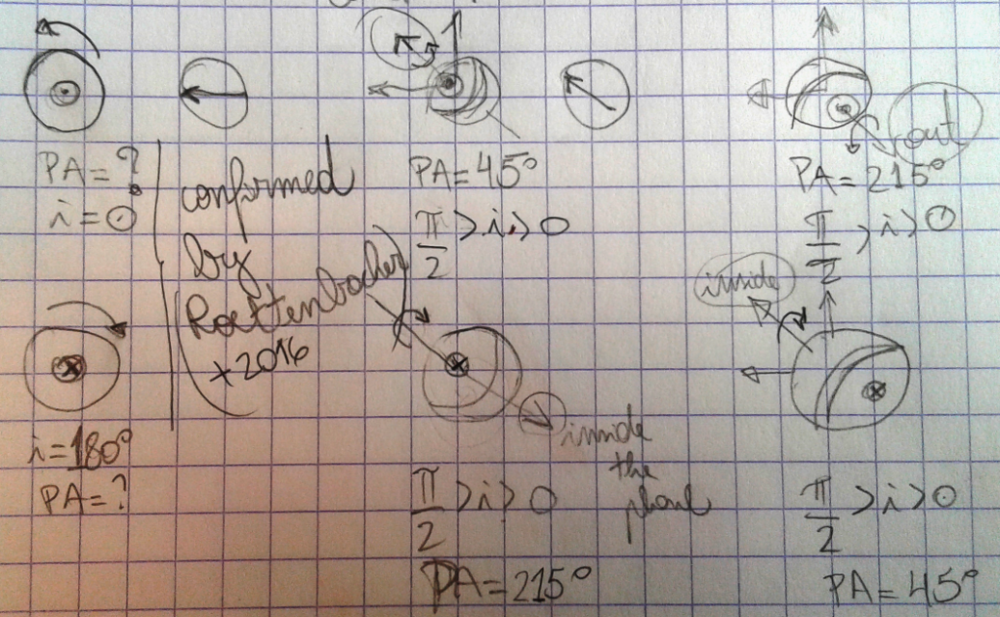
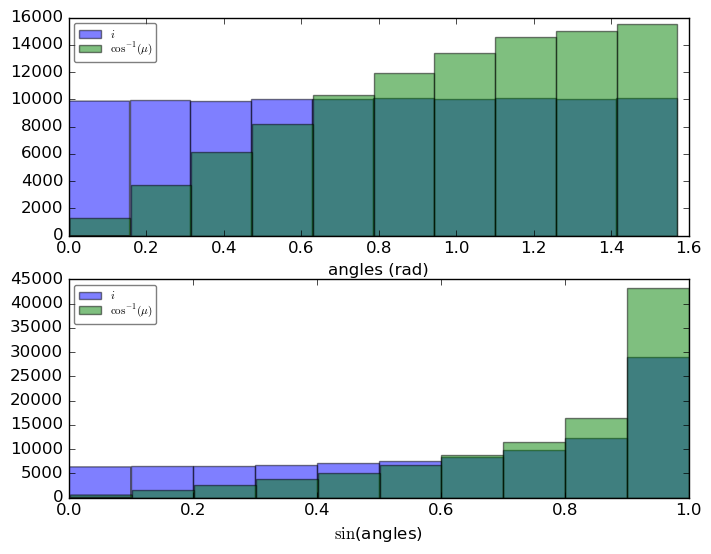
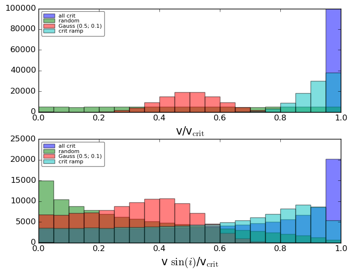
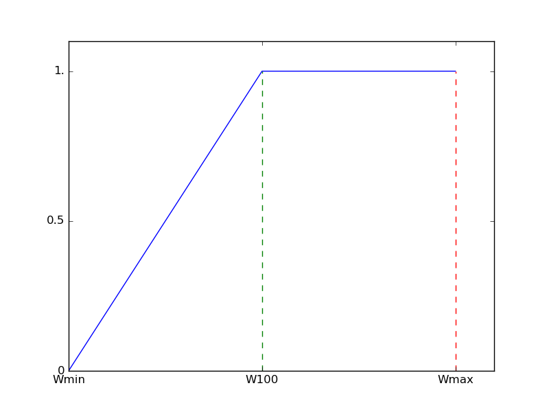
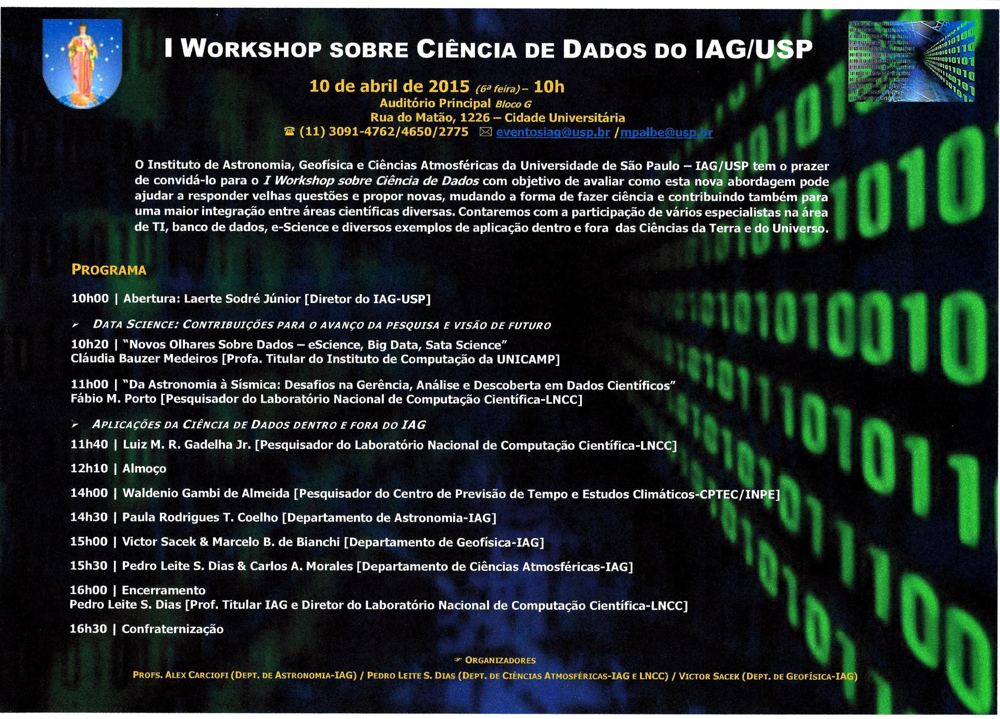

.. sequence: ### *** === --- ^^^ ~~~ 

DMF AstroBlog
##############

2019
**********
2019-04
========
Why Are Two Ghost Galaxies Missing Dark Matter?
-------------------------------------------------
https://www.skyandtelescope.com/astronomy-news/ghost-galaxies-missing-dark-matter/

------

GRAVITY instrument breaks new ground in exoplanet imaging
----------------------------------------------------------
https://www.eso.org/public/news/eso1905/

---------

Searching for FRBs Using Neural Networks and Machine Learning
----------------------------------------------------------------------
https://astrobites.org/2019/04/02/searching-for-fast-radio-bursts-using-neural-networks/

---------

Dust-choked doughnut detected around gargantuan black hole
----------------------------------------------------------
https://astronomynow.com/2019/04/05/dust-choked-doughnut-detected-around-gargantuan-black-hole/

----------

A Study in Stereotypes: What People Think of Physicists vs. Biologists
----------------------------------------------------------------------------
https://astrobites.org/2019/04/05/a-study-in-stereotypes-what-people-think-of-physicists-vs-biologists/

--------

The peculiar stars corner (and AGN)
-------------------------------------
http://www.astrosurf.com/buil/us/peculiar2/peculiar.htm

---------

Prisoner's dilemma
-------------------
https://en.wikipedia.org/wiki/Prisoner's_dilemma

In 2012, William H. Press and Freeman Dyson published a new class of strategies for the stochastic iterated prisoner's dilemma called "zero-determinant" (ZD) strategies.

Yes, Freeman Dyson is the guy from the idea of 

---------

IMPRS Summer School "Instrumentation for Ground-based Optical & Infrared Astronomy"
--------------------------------------------------------------------------------------------
Date: Monday, 9 September 2019 - Friday, 13 September 2019

Location: Heidelberg, Germany

Max Planck Institute for Astronomy - https://www.imprs-hd.mpg.de/Summer-School

2019-03
========
No, Data Is Not the New Oil
--------------------------------------------------------------------
https://www.wired.com/story/no-data-is-not-the-new-oil/

(alternatively: https://trabalhounido.blogspot.com/2019/03/no-data-is-not-new-oil.html)

-------

Building a Data Analytics library from scratch in Python
---------------------------------------------------------------------
Series of videos on how to build a #DataAnalytics library from scratch in #Python by @DunderData https://t.co/GwgCavd8AM #DataScience https://t.co/7MA1TeKfo0
(https://twitter.com/ga_braganca/status/1101569058829414401?s=03)

--------

IGRINS Spectral Library
-------------------------
- https://arxiv.org/abs/1808.06629
- http://starformation.khu.ac.kr/IGRINS_spectral_library.htm

2019-02
=========
New radio map reveals huge number of previously unseen galaxies
------------------------------------------------------------------------
https://astronomynow.com/2019/02/19/new-radio-map-reveals-huge-number-of-previously-unseen-galaxies/

-------

Gravity waves may help resolve Hubble constant conundrum
------------------------------------------------------------------------
https://astronomynow.com/2019/02/16/gravity-waves-may-help-resolve-hubble-constant-conundrum/

-------

Mini-curso Introduction to Deep Learning in Astronomy
------------------------------------------------------------------------
Em fevevereiro de 2009 a SPAnet organizou o mini-curso Introduction to Deep Learning in Astronomy, ministrado pelo Dr. Clécio De Bom  (CEFET/RJ e CBPF), com o apoio de dois de seus estudantes, Luciana e Patrick.

O material do curso (pdf, exercícios), bem como as aulas gravadas, pode ser encontrado no link:

http://www.astro.iag.usp.br/~introDL/

--------

NASA orbiter spots Chinese lander on the Moon
-----------------------------------------------
https://astronomynow.com/2019/02/21/nasa-orbiter-spots-chinese-lander-on-the-moon/

--------

LRS2 Automatic Data Reduction Pipeline
------------------------------------------
Abstract: I will be presenting an overview of the new automatic pipeline for the low resolution spectrograph, LRS2, at the Hobby Eberly Telescope.   LRS2 is an integral field unit spectrograph with 280 fibers covering roughly 7'' x 11" on the sky.  The instrument is comprised of two independent spectrographs, B and R, providing wavelength coverage from 3500-7000A and 6500-10500A for the blue and red side, respectively.  As the HET Data Scientist, I have recently built an automatic pipeline that reduces each new night's dataset from Jan 1st, 2019 and on (the pipeline is publicly available for older data sets and can be run by a user or reduced at request).  The reduction products reside on the Texas Advanced Computing Center (TACC) and can be accessed easily with an account.  The pipeline running the LRS2 reductions is called, Panacea, and documentation related to the code, algorithms, and data products can be found here: https://github.com/grzeimann/Panacea.  Pipelines are always an ongoing process and feedback from the community is highly welcomed and appreciated.

------

Curiosity captures stunning panorama on slopes of Mount Sharp
---------------------------------------------------------------------------
https://astronomynow.com/2019/02/10/curiosity-captures-stunning-panorama-on-slopes-of-mount-sharp/

NASA's Curiosity Mars Rover Departs Vera Rubin Ridge (360 View) in 4k !!
https://www.youtube.com/watch?v=e-gZpz8zuDQ

-----------

Random words
---------------
- front burner: a condition or position of top priority.
- Ceteris paribus: "other things equal". English translations of the phrase include "all other things being equal" or "other things held constant" or "all else unchanged".

GEMMA Big Ideas
------------------------------
Example of a Science survey.
    - GEMMA - Gemini In The Era of Multi-Messenger Astronomy.
    - GNAO - Gemini North AO
    - TDA - Time Domain Astronomy

https://www.gemini.edu/gemma/index.html

-----

New analysis shows Milky Way a decidedly "warped" spiral
------------------------------------------------------------
https://astronomynow.com/2019/02/05/new-analysis-shows-milky-way-a-decidedly-warped-spiral/

-----

Famous Mars rovers
--------------------
"Mars is the only known planet inhabited exclusively by robots".

Mars Exploration Rover
^^^^^^^^^^^^^^^^^^^^^^^^
Launch 2003, landed 2004. The "Spirit" and "Opportunity" rovers were named through a student essay competition. 
    - On January 3 and January 24, 2010, Spirit and Opportunity marked six years on Mars, respectively.
    - On January 26, NASA announced that Spirit will be used as a stationary research platform after several months of unsuccessful attempts to free the rover from soft sand.
    - On May 22, 2011, NASA announced that it will cease attempts to contact Spirit, which has been stuck in a sand trap for two years. 
    - On June 10, 2018, Opportunity stopped communications with Earth after rolling more than 28 miles.
    - Latest news: http://tz.ucweb.com/2_508q4

Curiosity rover
^^^^^^^^^^^^^^^^^^^^^^^^
Curiosity is a car-sized rover (900kg).
    - On September 2018 it already covered 20 km in distance.

------

Six Degrees of Kevin Bacon
----------------------------
https://en.wikipedia.org/wiki/Six_Degrees_of_Kevin_Bacon

2019-01
=========
Understanding Linux (and Android) CPU Loads
----------------------------------------------------------------
http://blog.scoutapp.com/articles/2009/07/31/understanding-load-averages

-------

Celestial Event Dubbed “The Cow” Puzzles Astronomers
----------------------------------------------------------------
https://www.skyandtelescope.com/astronomy-news/cow-celestial-event-puzzles-astronomers/

--------

Billion-dollar telescopes could end up beyond the reach of US astronomers
---------------------------------------------------------------------------
Alternative title: US astronomers face hard decisions

https://www.nature.com/articles/d41586-018-05985-2

------

The Extraordinary Link Between Deep Neural Networks and the Nature of the Universe
------------------------------------------------------------------------------------
https://www.technologyreview.com/s/602344/the-extraordinary-link-between-deep-neural-networks-and-the-nature-of-the-universe/

A physical explanation that shows why neural networks are so efficient although mathematically it is a very complex problem.

------

Opportunity rover logs 15 years on Mars
------------------------------------------
https://astronomynow.com/2019/01/24/opportunity-rover-logs-15-years-on-mars/

-----

O doutorado é prejudicial à saúde mental
------------------------------------------
https://brasil.elpais.com/brasil/2018/03/15/ciencia/1521113964_993420.html

-----

Estudo diz que doutorandos são seis vezes mais propensos a desenvolverem ansiedade ou depressão

We Don't Really Know When the Sun Rises
----------------------------------------------------------
https://www.skyandtelescope.com/astronomy-news/we-dont-really-know-when-the-sun-rises/

-------

Double Star System Flips Planet-Forming Disk into Pole Position
-----------------------------------------------------------------
Press-release: https://astronomynow.com/2019/01/17/binary-star-system-found-with-polar-dust-disc/

Main paper link: https://www.nature.com/articles/s41550-018-0667-x

--------

How "Light Echoes" Revealed a Black Hole’s Feeding Habits
----------------------------------------------------------
https://www.skyandtelescope.com/astronomy-news/how-light-echoes-revealed-black-holes-feeding-habits/

------

Future of Optical-infrared Interferometry in Europe
-----------------------------------------------------
https://link.springer.com/journal/10686/topicalCollection/AC_20a157efd5555be5b10f77fdc1db737d

------

Five Works of Hard Science Fiction That Bypass the Gatekeepers
--------------------------------------------------------------------------
https://www.tor.com/2018/12/17/five-works-of-hard-science-fiction-that-bypass-the-gatekeepers/

----

Optics and Photonics Global Salary Report
------------------------------------------------------------------
https://spiecareercenter.org/survey

----

Space Missions to watch in 2019
---------------------------------
https://www.skyandtelescope.com/astronomy-news/space-missions-to-watch-in-2019/

-------

Solar and Lunar Eclipses in 2019
---------------------------------
https://www.skyandtelescope.com/observing/solar-and-lunar-eclipses-in-2019/

January 20--21: Total Lunar Eclipse. Partial eclipse begins at 9:34pm (CST). Middle of totality, 11:12pm (CST).

2018
*********
2018-12
==========
Top 10 Astronomy News Stories of 2018
--------------------------------------
https://www.skyandtelescope.com/astronomy-news/the-top-10-astronomy-news-stories-of-2018/

------

French astronomer Aims For Space-Based Hypertelescope
------------------------------------------------------
https://trabalhounido.blogspot.com/2018/12/antoine-labeyrie-aims-for-space-based.html

------

NASA Space Telescopes Provide a 3D Journey Through the Orion Nebula
---------------------------------------------------------------------
http://hubblesite.org/news_release/news/2018-04

`Flight Through the Orion Nebula in Visible and Infrared Light [Ultra HD] <https://www.youtube.com/watch?v=07dve0EnUX8>`_

------

ESO to Host Cherenkov Telescope Array-South at Paranal
---------------------------------------------------------------------
ESO enters partnership with the world’s largest gamma-ray observatory

https://www.eso.org/public/news/eso1841/

-------

How to Weigh a Black Hole Using NASA's Webb Space Telescope
--------------------------------------------------------------------------
http://hubblesite.org/news_release/news/2018-37

--------

Key Points a Systems Engineer Needs to Know about Software Engineering
--------------------------------------------------------------------------
https://www.sebokwiki.org/wiki/Key_Points_a_Systems_Engineer_Needs_to_Know_about_Software_Engineering

------

Guia orienta cientistas da USP para se relacionarem com a mídia
----------------------------------------------------------------
Material gratuito da SCS/USP traz orientações práticas sobre comunicação e jornalismo para cientistas que querem divulgar seus trabalhos.

https://jornal.usp.br/ciencias/publicacao-mostra-caminhos-para-transformar-ciencia-em-noticia/

-------

Chang'e 4 Probe Heads to the Lunar Farside
------------------------------------------------------
https://www.skyandtelescope.com/astronomy-news/change-4-probe-heads-to-the-lunar-farside/

----------

How data transformed NBA
---------------------------
https://www.youtube.com/watch?v=oUvvfHkXyOA

--------

What our science fiction says about us
---------------------------------------
http://www.bbc.com/culture/story/20181203-what-our-science-fiction-says-about-us

---------

Does teaching with PowerPoint increase students' learning? A meta-analysis
------------------------------------------------------------------------------
https://www.sciencedirect.com/science/article/pii/S0360131518302070

To provide or not to provide course PowerPoint slides? The impact of instructor-provided slides upon student attendance and performance: https://www.sciencedirect.com/science/article/pii/S0360131515000433

---------

My two cents
--------------
"My two cents" ("my 2¢") and its longer version "put my two cents in" is an American idiomatic expression. It is used to preface a tentative statement of one's opinion or **contribution**. 

https://en.wikipedia.org/wiki/My_two_cents

--------------

A reference of an astronomical instrumentation school
-------------------------------------------------------
University of Copenhagen (Denmark),  July 3-12, 2017 

https://opticon-schools.nbi.ku.dk/other-schools/instrumentation-school/

-------

How science supports São Paulo
--------------------------------------
Brazil's richest state has a long history of applied research. 

https://www.nature.com/articles/d41586-018-07536-1

2018-11
=========
The radius anomaly: a tale told by short-period low-mass eclipsing binaries
------------------------------------------------------------------------------
Patricia Cruz - IAG/USP
 
Eclipsing binaries are an excellent case study for testing stellar evolutionary models, as they allow a complete characterization of their physical and orbital parameters when photometric and spectroscopic data are combined. The majority of short-period low-mass eclipsing binaries in the literature present measured stellar radii that are usually 5 to 20% bigger than the expected values when compared to stellar models. This inflation trend is known as the radius anomaly of low-mass stars. I will present our latest results on the search for new low-mass systems and their place in the present radius inflation scenario.

-------

Water Has Been Detected in The Atmosphere of a Planet 179 Light Years Away
--------------------------------------------------------------------------------------------
From Keck observations...

https://www.sciencealert.com/water-has-been-detected-in-the-atmosphere-of-a-planet-179-light-years-away

Rehearsing for more detailed spectroscopic exoplanet analyses: https://astronomynow.com/2018/11/23/rehearsing-for-more-detailed-spectroscopic-exoplanet-analyses/

--------

Calculate Statistics about the Linux Kernel
--------------------------------------------------------
https://github.com/udoprog/kernelstats

------------

Python para desenvolvedores
----------------------------
http://ricardoduarte.github.io/python-para-desenvolvedores/

--------

Types of Telescopes - Tips for Buying Your First Telescope
----------------------------------------------------------------------------
https://www.skyandtelescope.com/astronomy-equipment/types-of-telescopes/

---------

A revista eletrônica do Laboratório Nacional de Astrofísica
---------------------------------------------------------------------------------
"LNA em dia"!

http://lnapadrao.lna.br/pesquisadores/lna-em-dia

---------

Cientistas desenvolvem combustível líquido que pode armazenar a energia do sol por até 18 anos 
------------------------------------------------------------------------------------------------------------------
Cientistas na Suécia desenvolveram um fluido especializado, chamado de combustível solar térmico, que pode armazenar energia do sol por mais de uma década. 

http://socientifica.com.br/2018/11/cientistas-desenvolvem-combustivel-liquido-que-pode-armazenar-energia-do-sol-por-ate-18-anos/

-----

Twenty things I wish I’d known when I started my PhD
---------------------------------------------------------
https://www.nature.com/articles/d41586-018-07332-x

------

Single conjugate adaptive optics for the ELT instrument METIS
---------------------------------------------------------------
https://arxiv.org/abs/1810.07578

------

Descoberta por acidente, uma pequena estrela da nossa Via Láctea está entre as menores e mais antigas já observadas
--------------------------------------------------------------------------------------------------------------------
No sistema binário 2MASS J18082002-5104378, sua estrela secundária e menor seria um dos astros mais antigos do Universo.

http://scienceblogs.com.br/hypercubic/2018/11/a-estrelinha-mais-velhinha-do-universo/

-----

Astronomers discover new luminous high-redshift quasar
-------------------------------------------------------
Redshift 7.02! So far, only two quasars with redshifts over 7.0 have been identified.

https://phys.org/news/2018-11-astronomers-luminous-high-redshift-quasar.html

-----------

First 3D colour X-ray of a human using CERN technology
----------------------------------------------------------
First human scanned with next–generation 3D colour scanner using CERN technology 

https://home.cern/news/news/knowledge-sharing/first-3d-colour-x-ray-human-using-cern-technology

-----

"An illusion": Grave doubts over LIGO's 'discovery' of gravitational waves
------------------------------------------------------------------------------------
https://www.sott.net/article/399642-An-illusion-Grave-doubts-over-LIGOs-discovery-of-gravitational-waves

------

Adaptive Optics for Extremely Large Telescopes
-----------------------------------------------
https://www.worldscientific.com/doi/abs/10.1142/S2251171719500016?af=R

------

Create a Heat Map from your Google Location History in 3 easy Steps
----------------------------------------------------------------------
https://towardsdatascience.com/create-a-heat-map-from-your-google-location-history-in-3-easy-steps-e66c93925914

-------

OSIRIS-REx captures first clear images of asteroid Bennu
----------------------------------------------------------
During the bare minute elapsed between the first and the last of a total of eight exposures, the asteroid rotated 1.2 degrees. The scientific team used a super-resolution algorithm to combine the eight images and produce a higher resolution view of the asteroid. Although Bennu occupies barely 100 pixels in the detector, it is possible to identify some features on its surface, like large boulders.

https://astronomynow.com/2018/11/03/osiris-rex-captures-first-images-of-asteroid-bennu/

2018-10
=========
Hawaiian Supreme Court Approves TMT on Mauna Kea
----------------------------------------------------
https://www.nytimes.com/2018/10/30/science/hawaii-telescope-mauna-kea.html

--------------------------

CANARY: AO Test Platform
--------------------------
CANARY is an on-sky tomographic adaptive optics demonstrator installed at the 4.2m William Herschel Telescope in the Canary Islands. Since initial commissioning in 2010, it has since provided the first on-sky demonstrations of NGS and LGS MOAO, LTAO and tomographic LQG control as well as hosting several visitor experiments. CANARY was developed by an EU-wide consortium, led by Durham University and Observatoire de Paris, LESIA. The WHT is operated by the Isaac Newton Group of Telescopes (ING).

------

Using National Instruments and Adaptive Optics to Perform Deep-Tissue Cell Imaging
----------------------------------------------------------------------------------------------
http://sine.ni.com/cs/app/doc/p/id/cs-13314

----------

Why NASA is struggling to get its most powerful space telescope off the ground
---------------------------------------------------------------------------------
Many experts argue that the blame for JWST’s woes started in the planning phase.

https://www.theverge.com/platform/amp/2018/8/1/17627560/james-webb-space-telescope-cost-estimate-nasa-northrop-grumman

--------

Why Don't We Put A Space Telescope On The Moon?
--------------------------------------------------
https://www.forbes.com/sites/startswithabang/2018/10/25/why-dont-we-put-a-space-telescope-on-the-moon/

--------

Turbulent fast magnetic reconnection around accretion disk systems: from analytical to numerical studies
--------------------------------------------------------------------------------------------------------------
Luis Henrique Sinki Kadowaki - IAG/USP

Fast magnetic reconnection is a crucial mechanism for understanding particle acceleration and very high-energy (gamma and neutrino) emission in magnetized systems in general. A potential model to explain the transition between the High/Soft and Low/Hard X-ray states observed in black hole binaries (BHBs) and Active Galactic Nuclei (AGNs) can be attributed to fast magnetic reconnection induced in the turbulent corona of accretion disks. According to this model, the power released by fast reconnection between the magnetic field lines arising from the inner accretion disk and the lines anchored into the compact source could accelerate relativistic particles in a first-order Fermi process and produce the observed non-thermal high-energy emission.

In this talk, we will summarize the main insights of our fast magnetic reconnection analytical model and discuss the results of our recent local magnetohydrodynamic (MHD) and global general-relativistic MHD (GRMHD) simulations of accretion disks around black holes, where turbulence is naturally driven by MHD instabilities, such as the magnetorotational instability (MRI) and the Parker-Rayleigh-Taylor instability (PRTI). We will also present studies of magnetic reconnection driven by kink instabilities inside jets employing special relativistic MHD (SRMHD) simulations. Finally, we will present a detailed statistical analysis to identify the presence of fast magnetic reconnection in the turbulent regions of these numerical models. We have determined the magnetic reconnection rates in these systems obtaining averaged reconnection rates comparable with the predictions of the theory of turbulence-induced fast reconnection.

-------

How can planets be heavier than the disks that formed them?
------------------------------------------------------------
https://astrobites.org/2018/10/15/__trashed-8/

-----

The Scientific Paper Is Obsolete. Here's What's Next
------------------------------------------------------
https://www.theatlantic.com/amp/article/556676/

-------

What the New Sokal Hoax Reveals About Academia 
------------------------------------------------
https://www.theatlantic.com/ideas/archive/2018/10/new-sokal-hoax/572212/

------

IPCC e Prêmio Nobel de Economia 2018
---------------------------------------------
PCC faz alerta para a urgência de medidas de redução do ritmo das
mudanças climáticas

http://agencia.fapesp.br/ipcc-faz-alerta-para-a-urgencia-de-medidas-de-reducao-do-ritmo-das-mudancas-climaticas-/28899/

Tema de Nobel, economia tem relação cada vez mais estreita com ecologia

https://www1.folha.uol.com.br/mercado/2018/10/tema-de-nobel-economia-tem-elacao-cada-vez-mais-estreita-com-ecologia.shtml

Especialistas em clima e inovação tecnológica vencem Nobel de Economia

https://www1.folha.uol.com.br/mercado/2018/10/especialistas-em-clima-e-inovacao-tecnologica-vencem-nobel-de-economia.shtml

--------

O que Programação Orientada a Objeto tem a ver com design?
------------------------------------------------------------------------
Herança, encapsulamento, polimorfismo, interfaces, design patterns são conceitos oriundos do Metadesign, que é uma das disciplinas do design, ou uma visão cibernética sobre o ato de fazer design.

-------

The lectures of the IAU 41st International School for Young Astronomers
------------------------------------------------------------------------
The lectures of the IAU 41st International School for Young Astronomers - ISYA 2018, held in Santander, Colombia, 8-28 July ,are now available at:

https://eventos.redclara.net/indico/event/842/material/slides/

------

Gaia spots stars flying between galaxies
-------------------------------------------
https://phys.org/news/2018-10-gaia-stars-galaxies.html

--------

Astronomia ao meio-dia: Super-terras e habitabilidade
----------------------------------------------------------------------------
Sylvio Ferraz Mello, IAG-USP

Data: Quinta-feira, 4 de outubro de 2018 - 12h00

RESUMO:

A zona habitável de uma estrela é a região do espaço, nem tão próxima da estrela que impeça a existência de água na sua superfície, e nem tão distante dela que permita que o CO2 se condense na atmosfera formando nuvens altamente refletoras. É uma definição climatológica, sem outras implicações. Super-terras na zona habitável são alvos de primeira importância entre os planetas descobertos ao redor de outras estrelas da nossa vizinhança pela possibilidade de que possam satisfazer os requisitos necessários para a existência de vida. Diversos sistemas são hoje conhecidos com super-terras na zona habitável: Trappist 1, Kepler 22, Kepler 186, Kepler 452, Proxima Centauri, etc. Porem, não se sabe se as demais condições para a existência de vida ocorrem nesses sistemas. Por outro lado, não é possível excluir outras situações fora da zona habitável propícias à vida. Por exemplo, no nosso Sistema Solar, condições para a existência de vida podem ocorrer nos oceanos existentes sob as crostas de gelo de satélites como Europa, Encélado ou Titan.

Super-terras em sistemas planetários extra-solares não são passíveis de observação direta. Tudo o que observamos são diminuições da luz medida das estrelas quando o planeta passa na frente da estrela (trânsitos). Em alguns casos mais favoráveis, outros efeitos (variações nos tempos dos trânsitos, variações nas velocidades radiais medidas) permitem que se conheça a massa dos planetas. Como o trânsito permite que se avalie o tamanho dos planetas, com as duas informações juntas podemos determinar sua densidade e construir modelos do seu interior. Por exemplo, no caso de Corot-7b, a primeira super-Terra descoberta (que não está em zona habitável), pode-se concluir que possue um grande núcleo metálico (como a Terra) coberto por um manto de silicatos. O estudo das interações entre o planeta e a estrela (marés) permite concluir que sua rotaçao é síncronizada com o movimento orbital de modo que o planeta tem sempre a mesma metade iluminada pela estrela. Por causa da grande proximidade à estrela, essa metade deve estar parcialmente coberta por um oceano de lavas, enquanto a metade escura permanece congelada.

-----

The New Science of Seeing Around Corners
------------------------------------------
https://www.quantamagazine.org/the-new-science-of-seeing-around-corners-20180830/

--------

Hundreds of academics at top UK universities accused of bullying 
------------------------------------------------------------------
https://www.theguardian.com/education/2018/sep/28/academics-uk-universities-accused-bullying-students-colleagues

2018-09
==========
Gemini Observatory to Advance Adaptive Optics and Multi-messenger Astronomy with NSF Award 
----------------------------------------------------------------------------------------------------------------------------
New funding from the National Science Foundation will enable the international Gemini Observatory to advance its position at the forefront of the new era of “multi-messenger astronomy” by enhancing its scientific capabilities in high-resolution and rapid-response astronomy.

---------

Bizarre Particles Keep Flying Out of Antarctica's Ice
--------------------------------------------------------------
And They Might Shatter Modern Physics... The particles physicists know about -- the collection of particles that make up what scientists call the Standard Model (SM) of particle physics -- shouldn't be able to do that. 

https://www.livescience.com/63692-standard-model-broken-supersymmetry-new-physics.html

--------

How to build a teleportation-assisted telescope
--------------------------------------------------------------
https://www.technologyreview.com/s/612177/how-to-build-a-teleportation-assisted-telescope/

Quantum-assisted telescopes could significantly increase the maximum size of optical telescope arrays (and the resolution of the images they can produce). 

When a photon arrives from a distant star, it interacts with one of this pair and is immediately teleported to the interferometer, where it can create an image. In this way, an image can be created without the losses that normally limit performance.

More at http://arxiv.org/abs/1809.03396

-----

Astronomers use novel technique to probe stellar rotation
------------------------------------------------------------------------
https://astronomynow.com/2018/09/21/astronomers-surprised-how-fast-a-sampling-of-sun-like-stars-rotate/

The technique is based on frequencies of light-curve variation, interpreted in terms of asteroseismology. From asteroseismology theory, it is possible to associate the frequencies with differentially rotating outer layers (convection zones) of Sun-like stars. The underlying mechanisms that generate and sustain differential rotation are poorly understood. 

In this work, for the most significant detections, the stars' equators rotate approximately twice as fast as their midlatitudes. The NASA Kepler spacecraft has provided high-precision, long-duration photometric time series for many stars, which is necessary for the study.

This can not be employed to study the differential rotation of hot stars because their outer layers are radiative, instead of convective (this is true for M > 1.5Msun).

More at http://science.sciencemag.org/content/361/6408/1231

--------

SOAR Visiting Astronomer's Guide
------------------------------------
http://www.ctio.noao.edu/soar/content/visiting-astronomers-guide

-------

Python is taking over astronomy
---------------------------------
2018Q3 edition: the curve keeps getting steeper! Updated in collaboration with @_russrussruss and @astrowizicist.

Jupyter notebook here: https://t.co/OAu9qMOn6e

---------

The Southern Photometric Local Universe Survey (S-PLUS)
--------------------------------------------------------------
by A. Molino & V. Placco

The Southern Photometric Local Universe Survey (S-PLUS) is a Brazilian-led project that comprises imaging 9300 square degrees of the celestial sphere in twelve optical bands using a dedicated 0.8m robotic telescope, T80-South, at Cerro Tololo, Chile.  The telescope is equipped with a large-format camera, with a field-of-view of 2 square degrees, with a plate scale of 0.55"/pixel. The survey consists of (1) two non-contiguous fields at high Galactic latitudes, which together cover an area of 8000 sq. degrees and (2)  two areas of the Galactic Plane and Bulge (for an additional 1300 square degrees). S-PLUS uses the Javalambre 12-band magnitude system which includes ugriz broad-band filters and 7 narrow-band filters centered on prominent stellar spectral features: [OII], Ca H+K, Hdelta, G-band, Mgb triplet, Halpha and Ca triplet. The combination of a Wide FoV telescope+camera and choice of filters will allow the study of a large number of scientific topics, from Solar System to Cosmology. In particular, S-PLUS will deliver accurate photo-zs, providing a map of the local universe. It will also allow the study of star formation and  stellar populations in and around the Milky Way and nearby galaxies and search for quasars, variable sources, and low-metallicity and carbon-enhanced metal-poor stars. The consortium is open to all scientists from the participating institutes, as well as any other scientist (through a vigorous external collaborator program). The first data release of the project is being published to the international community in Sep 26th (in https://datalab.noao.edu/splus). In this talk we will present the survey and we will highlight its usefulness for different science topics of interest to the community.

--------

The International School for Advanced Instrumentation (IScAI)
--------------------------------------------------------------
IScAI is a major international initiative in higher education that allows to acquire expertise in all areas related to the construction of cutting-edge scientific instrumentation, with a particular emphasis on astronomical instrumentation.

It has 5 courses, of 20h each:
- Optics -- telescopes, cameras, and spectrographs, and their common components (mirror, lenses, etc.).
- Mechanics -- analysis of precision designs for opto-mechanical and robotic systems, and other related disciplines such as materials, mechanical components, cryogenic systems, vacuum technology, structures and mechanical manufacturing processes.
- Electronics -- focused mainly in the data acquisition systems (getting data with image detectors), in the control systems for mechanisms and other related tasks. A clear procedure will be shown to design, build, integrate and check an entire control system from the beginning until the end of the project.
- Software -- modern tools and the latest trends in software design. The aim is to guarantee the appropriate quality in software development.
- Management -- to describe projects in terms of work packages, to establish a schedule with milestones and deadlines, to control budget and cash flow and to discuss requirements and specifications with both the scientists and the engineers to make them understand the project.

------------------

Holistic spectroscopy using a photonic comb 
--------------------------------------------
Holistic spectroscopy: complete reconstruction of a wide-field, multiobject spectroscopic image using a photonic comb 

*Our approach allows one to reduce the tolerances of the spectrograph design and increase the rigorosity of the reduction process, though at the cost of more complicated analysis.*

https://doi.org/10.1093/mnras/sty2175

----------------------

Surprise Discovery of a 14-Year-Old Supernova
-----------------------------------------------
https://www.skyandtelescope.com/astronomy-news/stellar-science/surprise-discovery-of-a-14-year-old-supernova/

------

Moore's Law is broken (since 2005)
-------------------------------------------
Parece que a Lei de Moore está acabando, ou já acabou e não sabíamos, e vamos ter de nos acostumar com isso:

https://spectrum.ieee.org/nanoclast/semiconductors/devices/what-globalfoundries-retreat-really-means

-----

Plectics
----------
Plectics is the name that Murray Gell-Mann, a Nobel Laureate in Physics, has suggested for the research area described as "a broad transdisciplinary subject covering aspects of simplicity and complexity as well as the properties of complex adaptive systems".

- https://en.wikipedia.org/wiki/Plectics
- https://www.spf.pt/magazines/GFIS/89/article/605/pdf (Portuguese)

---------

Carl Sagan on How Humanity Would Transform if Aliens Contacted Earth
----------------------------------------------------------------------
https://futurism.com/carl-sagan-on-how-humanity-would-transform-if-aliens-contacted-earth/

Carl Sagan em 'Cosmos': "Se um dia fizermos contato com uma civilização extraterrestre mais avançada, será o encontro amplamente pacífico, mesmo na falta de uma comunicação, como aquele dos franceses com os tlingits, ou seguirá algum protótipo mais sinistro, no qual a sociedade um pouco mais avançada destrói a sociedade tecnicamente mais atrasada?

"A preocupação com a possibilidade de haver intenções malévolas numa civilização avançada com que possamos entrar em contato não tem sentido. É mais provável que o mero fato de terem sobrevivido por tanto tempo signifique que aprenderam a viver consigo mesmos e com outros. Talvez nossos temores de contatos extraterrestres sejam mera expressão de nosso próprio atraso, uma expressão de nossa consciência culpada por nossa história pregressa: a devastação causada a civilizações só um pouco mais atrasadas que nós. Lembramo-nos de Colombo e dos aruaques, Cortés e os astecas, mesmo da sina dos tlingits nas gerações posteriores à de La Pérouse..."

--------------

Finding New Limb-Darkening Coefficients for the LSST
-------------------------------------------------------
https://astrobites.org/2018/09/15/finding-new-limb-darkening-coefficients-for-the-lsst/

----------

Astronomia e Sociedade
------------------------
- O artigo do Prof. Moysés publicado na SBF (Física) explicam como os estudos dele sobre o arco-íris estão ajudando nos estudos do clima para a determinação do aquecimento global: `Os principais obstáculos ao desenvolvimento da ciência na América Latina por Moysés Nussenzveig <../static/static/doing-sci_moyses.pdf>`_

- `Descoberta da astronomia poderia levar a tratamento eficaz de câncer <https://hypescience.com/descoberta-da-astronomia-poderia-levar-a-tratamento-eficaz-de-cancer/>`_

- Este excelente artigo traz um bom panorama de `como a astronomia pode contribuir para a sociedade em geral <https://hypescience.com/descoberta-da-astronomia-poderia-levar-a-tratamento-eficaz-de-cancer/>`_.

-----------

Systems Engineering and INCOSE references
------------------------------------------
- http://systemarchitect.mit.edu = very interesting ideas to apply on projects.
- http://ssrc.mit.edu/people/rhodes-0 = Donna Rhodes is an incredible researcher.
- https://www.incose.org/about-incose/foundation = INCOSE...

-------

Museu Virtual do LNA - Laboratório Nacional de Astrofísica
------------------------------------------------------------
http://www.lna.br/~museuvirtual/

-------

IAU Strategic Plan 2020-2030
-------------------------------
Resolution A1 on the new IAU Strategic Plan 2020–2030 was passed at the IAU General Assembly 2018 in Vienna. The planincludes research, education, development and outreach, describing how the different IAU activities fit together and how they complement each other, long-term goals, and the actions and activities required to meet them.

https://www.iau.org/static/education/strategicplan-2020-2030.pdf

-------

Pesquisadores do IAG em Workshop na Academia Brasileira de Ciencias sobre Grandes Projetos
----------------------------------------------------------------------------------------------------------------
Pesquisadores do IAG vao falar sobre grandes projetos internacionais com participacao brasileira, em Workshop da Academia Brasileira de Ciencias nos dias 12 e 13 de setembro. Veja  programa em:

http://www.abc.org.br/wp-content/uploads/2018/09/Programa%C3%A7%C3%A3o_Grandes_Projetos.pdf

-------

Como e por quem a pesquisa científica deve ser avaliada
-----------------------------------------------------------
Ciência básica depende fortemente de recursos públicos e sociedade cobra informações sobre financiamento

https://jornal.usp.br/atualidades/como-e-por-quem-a-pesquisa-cientifica-deve-ser-avaliada/

-------

Morse Code’s Vanquished Competitor: The Dial Telegraph
-----------------------------------------------------------
In 1842, French watchmaker Louis-François Breguet invented a simpler to use but less efficient alternative

https://spectrum.ieee.org/telecom/standards/morse-codes-vanquished-competitor-the-dial-telegraph

--------

2018-08
=========

The Two Miracles of Systems Engineering 
----------------------------------------------------------------------
http://community.vitechcorp.com/index.php/the-two-miracles-of-systems-engineering.aspx

-----------------------------------

Sorting Stars with a Light Touch
-----------------------------------
https://astrobites.org/2018/08/29/sorting-stars-with-a-light-touch/

---------

EASE -- EArly Science with ELTs
---------------------------------
S347: Early Science with ELTs (EASE)

IAU Symposium http://astronomy2018.cosmoquest.org/newspaper/s347-early-science-with-elts-ease/

----------

CCDs in astronomy
-------------------
ASTR 511 (O'Connell) Lecture Notes

http://www.faculty.virginia.edu/rwoclass/astr511/lec11-f03.html

---------

II Workshop Chemical Abundances in Gaseous Nebulae: Open Problems in Nebular Astrophysics
------------------------------------------------------------------------------------------
- Date: Monday, 11 March 2019 - Thursday, 14 March 2019
- Location: São José dos Campos, SP, Brazil
- Contact: Oli Dors
- URL: https://www.univap.br/universidade/instituto-de-pesquisa/agenda-e-eventos/chemical-abundances-in-gaseous-nebulae.html
- Email: olidors@univap.br

-----------

Chamada MCTIC/CNPq Bônus Tecnológico
--------------------------------------
Estão abertas submissão de propostas por Micro e Pequenas Empresas (MPE) para a concessão de Bônus Tecnológico conjugados com Bolsas para formação tecnológica, destinados a Projetos de PD&I para soluções em temas de Manufatura Avançada em produtos e processos, realizados por micro e pequenas empresas brasileiras em parceria com médias e grandes empresas (empresas âncora).

Segue a matéria publicada no `site do MCTIC <http://www.mctic.gov.br/mctic/opencms/salaImprensa/noticias/arquivos/2018/08/Programa_do_MCTIC_vai_destinar_R_2_milhoes_para_inovacao_nas_micro_e_pequenas_empresas.html>`_.

Trata-se da Chamada Pública CNPq/MCTIC/SETEC n° 32/2018, publicado no DOU em 16/08/2018 e disponível na pagina do CNPq, neste `link5 <http://www.cnpq.br/web/guest/chamadas-publicas?p_p_id=resultadosportlet_WAR_resultadoscnpqportlet_INSTANCE_0ZaM&filtro=abertas&detalha=chamadaDivulgada&idDivulgacao=8342>`_.

Em linhas gerais, as principais características dessa Chamada são:

- Chamada Pública lançada pelo CNPq/MCTIC, em parceria com o Sebrae, no valor global de R$1.031.943,00 de concessão de bônus tecnológico + R$ 1.000.000,00 de bolsas;
- Concessão de bônus tecnológico a micro e pequenas empresas (MPE), no valor máximo de R$30mil em custeio (bônus tecnológico) e de bolsas DTI ou EV no valor máximo de R$30mil, totalizando o aporte por empresa de até R$60mil;
- Apoio a projetos em temas de manufatura avançada, nas seguintes áreas tecnológicas estratégicas: tecnologias de informação e comunicação, nanotecnologia, computação em nuvem, sensores e atuadores, big data, novos materiais, fotônica, manufatura aditiva, sistemas ciberfísicos, internet das coisas, automação, energias renováveis, simulação e modelagem, interoperabilidade, segurança cibernética, inteligência artificial e robótica avançada;
- Público-alvo: MPE, incluindo startups, em parceria com empresas âncoras (médias ou grandes empresas);
- Empresas âncoras devem aportar contrapartida mínima de 20%, econômica ou financeira; 
- O bônus tecnológico se destina ao pagamento de serviços a ICT da Rede MCTIC (institutos de pesquisa, Embrapii, organizações sociais do MCTIC), instituições das Redes do Sibratec, laboratórios abertos do SibratecShop, Institutos Senai de Inovação ou de Tecnologia e laboratórios acreditados pela CGCRE/Inmetro;
- As propostas podem ser submetidas na Plataforma Eletrônica do CNPq a partir do dia 24/08/2018 até o dia 02/10/2018.

Uma iniciativa piloto, que pode ser uma oportunidade para se conectar com as startups e o ecossistema de inovação.

----------

Inversão dos polos magnéticos da Terra pode estar próxima
------------------------------------------------------------
Segundo estudo, fenômeno poderá ocorrer mais rápido e mais cedo do que se pensava. Mudança pode afetar satélites na órbita terrestre. Última inversão completa ocorreu há cerca de 780 mil anos.

https://www.dw.com/pt-br/invers%C3%A3o-dos-polos-magn%C3%A9ticos-da-terra-pode-estar-pr%C3%B3xima/a-45153660?xtref=https%253A%252F%252Fm.facebook.com%252F

-------

Spinning Away From the Main Sequence
------------------------------------------
- https://astrobites.org/2018/08/14/spinning-away-from-the-main-sequence/
- https://arxiv.org/abs/1807.10779

---------

Mathematicians solve age-old spaghetti mystery
-----------------------------------------------------------
A problem not completely solved by Feynman.

https://m.phys.org/news/2018-08-mathematicians-age-old-spaghetti-mystery.html

---------

Hubble Paints Picture of the Evolving Universe
-----------------------------------------------------------
Hubble's ultraviolet vision opens a new window on the evolving universe, tracking the birth of stars over the last 11 billion years back to the cosmos' busiest star-forming period, about 3 billion years after the big bang. This photo encompasses a sea of approximately 15,000 galaxies — 12,000 of which are star-forming — widely distributed in time and space. 

http://hubblesite.org/news_release/news/2018-35

---------------------------------

Adafruit Industries
---------------------------------
Adafruit Industries is an open-source hardware company based in New York City. It was founded by Limor Fried in 2005 (MIT). Famous from their fun DIY electronics and kits.

http://adafruit.com

-----

AMADA at Astronomy and Computing 
------------------------------------------
A good example of astronomy-related code publication

http://www.sciencedirect.com/science/article/pii/S2213133715000669

--------------

AstroTaverna
--------------
Astronomy plugins for Taverna Workbench. Apache Taverna is an open source software tool for designing and executing workflows in **Java**.

http://wf4ever.github.io/astrotaverna/

-------

Novel optics for ultrafast cameras create new possibilities for imaging
-------------------------------------------------------------------------------
https://phys.org/news/2018-08-optics-ultrafast-cameras-possibilities-imaging.html

-------------

First Light: Stars, galaxies and black holes in the epoch of re-ionisation
-------------------------------------------------------------------------------
http://www.cadc.hia.nrc.gc.ca/en/meetings/getMeetings.html?number=5749

- Date: Monday, 15 July 2019 - Wednesday, 24 July 2019
- Location: São Paulo, Brazil
- Contact: Roderik Overzier

-------------------

Disk-Bearing Binaries & Potential Tatooines
----------------------------------------------
https://astrobites.org/2018/08/13/disk-bearing-binaries-potential-tatooines/

In a first reading, the analysis appears biased to me: massive stars (Msun > 4) are considerably more likely to be binaries. Also, a large fraction of massive star (up to 1/3) their disks are due the Be phenomenon (4 < Msun < 15) and are not related to planetary structures.

--------

Python Mode for Processing
---------------------------
Processing is a flexible software sketchbook and a language for learning how to code within the context of the visual arts.

Processing was initially released with a Java-based syntax, and with a lexicon of graphical primitives that took inspiration from OpenGL, Postscript, Design by Numbers, and other sources. With the gradual addition of alternative progamming interfaces — including JavaScript, Python, and Ruby — it has become increasingly clear that Processing is not a single language, but rather, an arts-oriented approach to learning, teaching, and making things with code.

https://py.processing.org/

-----------

micro:bit vs sino:bit
----------------------
The Micro Bit (also referred to as BBC Micro Bit, stylized as micro:bit) is an open source hardware ARM-based embedded system designed by the BBC for use in computer education in the UK.

http://microbit.org/

The sino:bit a single-board microcontroller designed for computer education in China.  It is based on the Calliope miniwith permission of the Calliope mini project. While several modifications are planned, the first was to upgrade the LED matrix from 5×5 to 12×12. This allows for support of Chinese, Japanese, Hindi, Arabic and other non-Latin character based languages. Without this, the vast majority of the World’s children cannot experience the thrill of that first "Hello World" in their own language.

The sino:bit was created by Naomi Wu, an Open Source Hardware evangelist and DIY enthusiast. It was executed and engineered by Elecrow Technology, a Shenzhen based electronics company that offers contract manufacturing and engineering services to Maker and Hardware Enthusiasts.

https://github.com/sinobitorg/hardware

-----

ESP8266
---------
The ESP8266 is a low-cost Wi-Fi microchip with full TCP/IP stack and microcontroller capability. For more, search "The Internet of Things with ESP8266". 

http://esp8266.net/

------

MicroPython and pyboard
-------------------------
MicroPython is a software implementation of the Python 3 programming language, written in C, that is optimized to run on a microcontroller.

The MicroPython **pyboard** is a compact electronic circuit board that runs MicroPython on the bare metal, giving you a low-level Python operating system that can be used to control all kinds of electronic projects. 

https://micropython.org

-------

Internet controlled telescopes
-------------------------------
Iniciatives that allow remote operations of telescopes:

- www.itelescope.net
- www.slooh.com

Iniciativas que permitem operação remota de telescópios (em inglês).

--------

Apple ten years of proprietary appsploitation
-----------------------------------------------
App Store anniversary marks this appsploitation.

You can `package for F-Droid <https://gitlab.com/fdroid/rfp>`_, creating a more robust selection of apps available.

http://www.fsf.org/blogs/community/apple-app-store-anniversary-marks-ten-years-of-proprietary-appsploitation

-------

2018 GMT Science Book
-------------------------
Released on Aug 1st!

http://www.gmto.org/astro2020/
 
It can be downloaded directly from this link: 
http://www.gmto.org/wp-content/uploads/GMT%20Science%20Book%202018.pdf

2018-07
=========
Rebutting fake news on full spectral fitting
---------------------------------------------
https://arxiv.org/abs/1807.10423

Abstract
^^^^^^^^^^^^
A recent paper by Ge et al. performs a series of experiments with two full spectral fitting codes, pPXF and starlight, finding that the two yield consistent results when the input spectrum is not heavily reddened. For E(B-V) > 0.2, however, they claim starlight leads to severe biases in the derived properties. Counterintuitively, and at odds with previous simulations, they find that this behaviour worsens significantly as the signal-to-noise ratio of the input spectrum increases. This communication shows that this is entirely due to an A_V < 1 mag condition imposed while initializing the Markov chains in the code. This choice is normally irrelevant in real-life galaxy work but can become critical in artificial experiments. Alleviating this usually harmless initialization constraint changes the Ge et al. results completely, as was explained to the authors before their publication...

Concluding Remarks
^^^^^^^^^^^^^^^^^^^^
A common nightmare among those who offer their codes to public use is that they will be misused or unfairly characterized...

Our Comments
^^^^^^^^^^^^^
The owner of pPXF is from University of Oxford (UK) and is the third author of Ge et al.

-----------

First catalogue of X-ray sources in overlapping observations published
------------------------------------------------------------------------------
https://www.aip.de/en/news/science/digging-deeper-first-catalogue-of-x-ray-sources-in-overlapping-observations-published?set_language=en

-------

Who Should Pay for the Mistakes on NASA's James Webb Telescope?
--------------------------------------------------------------------------
When the concept was first proposed in 1996 as the successor to the famed Hubble Space Telescope, scientists estimated it would cost $500 million and fly by 2007.
By the start of this year (2018), Webb had a price tag of $8.8 billion and a launch date of spring 2019. 
Last month (June 2018), NASA officials made a disappointing announcement: Webb would be delayed, again, this time to spring 2021. And it’s would be even more expensive: $9.66 billion.

https://www-theatlantic-com.cdn.ampproject.org/v/s/www.theatlantic.com/amp/article/566186/?amp_js_v=0.1

--------------

NASA's new planet hunter starts work
-------------------------------------
TESS in operations!

https://astronomynow.com/2018/07/30/nasas-new-planet-hunter-starts-work/

--------

David Bohm, sua estada no Brasil e a teoria quântica
-------------------------------------------------------
Atingido pelo McCarthysm, Bohm perdeu sua posição na Universidade de Princeton e, por isto, veio para o Brasil, onde permaneceu de outubro de 1951 a janeiro de 1955. 

David Bohm ministrou, em português, o curso de Física Teórica durante o ano de 1953 e o de Mecânica Quântica em 1954. As notas do primeiro curso foram objeto de uma publicação interna (12) com o título Curso de física teórica. Entre os alunos estavam Newton Bernardes, Moyses Nussenzveig, Ernst W. Hamburger, Amélia Império, Gerhard Bund e Ewa Cybulska.

http://www.scielo.br/scielo.php?script=sci_arttext&pid=S0103-40141994000100012

---------------------

Produção científica do Brasil e da USP
---------------------------------------
- Parte 1 – `Internacionalização e impacto da produção científica da USP: tendências positivas no horizonte – um estudo SciVal (Elsevier) <http://www.sibi.usp.br/?p=24247>`_
- Parte 2 – `Interesse mundial e a produção científica do Brasil e da USP – um estudo SciVal (Elsevier) <http://www.sibi.usp.br/?p=24517>`_
- Parte 3 – `Quem financia a pesquisa brasileira? Um estudo InCites sobre o Brasil e a USP <http://www.sibi.usp.br/noticias/quem-financia-a-pesquisa-brasileira-um-estudo-incites-sobre-o-brasil-e-a-usp/>`_
- Parte 4 – [TBD] Reputação e confiabilidade da pesquisa: produção intelectual e visibilidade da USP – um estudo BDPI (SIBiUSP)

-------------

Desempenho e tendências na pesquisa brasileira
---------------------------------------------------------
Documento de jan/2018 que tomei conhecimento.
http://www.capes.gov.br/sala-de-imprensa/noticias/8726-documento-disponibilizado-a-capes-apresenta-desempenho-e-tendencias-na-pesquisa-brasileira

"Usando recursos bibliométricos, o relatório analisa o desempenho de trabalhos de pesquisa brasileiros publicados entre 2011 e 2016 na Web of Science (...). O relatório da Clarivate identifica destaques na pesquisa brasileira, comparando o país com pares internacionais. Destaca-se que este relatório não reflete a opinião da CAPES."

Tem uns dados muito interessantes, como o fato dos artigos de Astronomia serem os de maior impacto comparado com outras áreas de conhecimento. Há uma forte correlação disto com colaborações internacionais e nenhuma correlação com o volume de papers - e outras coisas mais...

-------------------

Korea joins Gemini
-------------------
Republic of Korea Becomes a Full Participant in Gemini #astronomynews July 24, 2018

https://www.gemini.edu/node/21083

--------

Plot yerr/xerr as shaded region rather than error bars
--------------------------------------------------------
python plot filled uncertainty

https://stackoverflow.com/questions/12957582/plot-yerr-xerr-as-shaded-region-rather-than-error-bars#13157955

-------

Fractal company
-------------------
FRACTAL S.L.N.E. is a private technological company specialized in astronomical instrumentation and scientific software.

FRACTAL has an expert, stable and committed team. We cover the subjects of Astronomy, Management, System Engineering, Optics, Opto-mechanics, Mechanics, Electro-mechanics, Cryogenics, Detectors, Data Acquisition Systems, and Software (Real Time Systems, Distributed Systems, Mechanisms Control, Data Base, Telescope's Control Systems and Data Reduction). 

-------

All-sky 'like' photometric surveys
----------------------------------
- ASAS http://www.astrouw.edu.pl/asas/ http://adsabs.harvard.edu/abs/2018MNRAS.479.2909B
- KELT https://keltsurvey.org/ http://adsabs.harvard.edu/abs/2017AJ....153..252L
- Evryscope http://evryscope.astro.unc.edu/ TBD

-------

Planck legacy data release
----------------------------
The final data release contains precise polarimetric measurements.

https://astronomynow.com/2018/07/21/planck-confirms-standard-big-bang-model-but-tensions-remain/

---------

Hubble and Gaia Team Up to Fuel Cosmic Conundrum
--------------------------------------------------
Conundrum: anything that puzzles.

Using Hubble and newly released data from Gaia, Riess’ team measured the present rate of expansion to be 73.5 kilometers (45.6 miles) per second per megaparsec. This means that for every 3.3 million light-years farther away a galaxy is from us, it appears to be moving 73.5 kilometers per second faster. However, the Planck results predict the universe should be expanding today at only 67.0 kilometers (41.6 miles) per second per megaparsec. As the teams’ measurements have become more and more precise, the chasm between them has continued to widen, and is now about 4 times the size of their combined uncertainty.

http://hubblesite.org/news_release/news/2018-34

--------

Python - Guido van Rossum: "you all will be on your own"
------------------------------------------------------------
https://mail.python.org/pipermail/python-committers/2018-July/005664.html

---------

Regulamentada a profissão de Físico
---------------------------------------
http://portal.imprensanacional.gov.br/web/guest/materia/-/asset_publisher/Kujrw0TZC2Mb/content/id/29495403/do1-2018-07-11-lei-n-13-691-de-10-de-julho-de-2018-29495398

-------

The HARP Hyperangular Imaging Polarimeter
------------------------------------------------
The HARP Hyperangular Imaging Polarimeter and The Need For Small Satellite Payloads With High Science Payoff For Earth Science Remote Sensing.

Seminário do Laboratório de Física da Atmosfera. Por Vanderlei Martins, Department of Physics, University of Maryland Baltimore County.

Wednesday, 11/July/2018, 11am, Ed. Basílio Jafet, sala 105

Notas
^^^^^^^
Sensores e polarização. 

Cubesats usados como contrapeso em lançamento de satélites maiores ("carga útil").

Compra de kits para CubeSats.

HARP Imaging Polarimeter: 6 inches long, 2 kg.

"cloudbow" = arco-íris em nuvens ("gotas de nuvens"), bem menores que as gotas de chuvas. Dependência padrão = tamanho das gotas.

São necessários 3 ângulos (polaróides) para separar duas componentes polarizadas. 3 imagens simultâneas ("adaptação numa Nikon"). 

Requirements: sem filter wheel, sem 3 lentes: Prisma que divide as imagens em 3 (3 CCDs).

Precisão de apontamento em solo = 100m (dito). No site, 0.66km. UHF radio 3Mbits/s.

ACDS = sigla (desconhecida) para apontamento (?).

Tempo de vida do Satélite = "arrasto" (área) x peso + qualidade de componentes (condições inóspitas).

ISS = 400 km. Um cubesat deve durar ~1 ano, puramente por arrasto (reentrada na atm). 

Nos EUA: salário das pessoas vem do projetos, e é a maior parte do custo de um projeto. 

Imageamento por "fatias". Forte dependência angular nas imagens, e ângulo de espalhamento do Sol. "Multi-angle observation".

Protótipo "AirHarp".

Sunglint = espalhamento do Sol no oceano (?). 

Rugosidade do gelo destrói efeito de arco-íris (<50 microns). 

Complemento in situ: PI-Neph (Polarized Imaging Nephelometer). Measures Scattering Angle (P11 and P12/P11). Espalhamento Mie. Picos e vales dependentes de Lambda. W. Reed Espinosa+2017 - AMT. Determina distribuição de tamanhos de partículas. 

--------

Centro Nacional de Pesquisa em Energia e Materiais - CPNEM
-------------------------------------------------------------------------------
Centro Nacional de Pesquisa em Energia e Materiais (CNPEM) é uma Organização Social supervisionada pelo Ministério da Ciência, Tecnologia, Inovações e Comunicações (MCTIC). É responsável pela gestão dos Laboratórios Nacionais de Luz Síncrotron (LNLS), de Biociências (LNBio), de Ciência e Tecnologia do Bioetanol (CTBE) e de Nanotecnologia (LNNano).

------

Circuito Vale Europeu, uma rota bem estruturada para sua primeira cicloviagem
-------------------------------------------------------------------------------
http://vadebike.org/2018/07/circuito-vale-europeu-santa-catarina-primeira-cicloviagem-cicloturismo/?utm_source=feedburner&utm_medium=email&utm_campaign=Feed%3A+VaDeBike+%28V%C3%A1+de+Bike%21%29

-------

Systems Engineering no Brasil
---------------------------------
E em São Paulo!

http://www.ezute.org.br/

-----------

NASA Sets March 2021 Launch Date for James Webb Space Telescope
------------------------------------------------------------------------
https://www.skyandtelescope.com/astronomy-news/james-webb-space-telescope-march-2021-launch/

-----------

FEI realiza experimento inédito no Brasil
-------------------------------------------
http://www.blogdafei.com.br/?p=6427

------------

Thomas Bayes and the crisis in science
----------------------------------------
https://www.the-tls.co.uk/articles/public/thomas-bayes-science-crisis/

-------------------------------

Free Software Foundation in Brazil and Argentina
----------------------------------------------------
https://www.fsf.org/blogs/rms/may-2018-photos-from-brazil-and-argentina

---------------------

GNU software list!!!
---------------------
https://directory.fsf.org/wiki/GNU

2018-06
==========
Solar System's First Known Interstellar Object Gets Unexpected Speed Boost
------------------------------------------------------------------------------
http://hubblesite.org/news_release/news/2018-25

--------

CNPq lança primeira chamada pública de bolsas especiais
---------------------------------------------------------------
As bolsas especiais do Conselho Nacional de Desenvolvimento Científico e Tecnológico (CNPq), tradicionalmente ofertadas por meio de calendários quadrimestrais, passam, agora, a serem concedidas a partir de chamadas públicas. A primeira Chamada foi lançada nesta quarta-feira para seleção de bolsas no país e no exterior.

A Chamada contempla bolsas no país - Pesquisador Visitante (PV), Pós-Doutorado Junior (PDJ), Pós-Doutorado Sênior (PDS), Doutorado-Sanduíche no País (SWP), Pós-Doutorado Empresarial (PDI) e Doutorado-Sanduíche Empresarial (SWI) - e no exterior - Estágio Sênior (ESN), Pós-Doutorado no Exterior (PDE), Doutorado Sanduíche no Exterior (SWE) e Doutorado Pleno no Exterior (GDE). A modalidade GDE é concedida em caráter excepcional para cursos que não tenham equivalente no País.

Além do ineditismo, a iniciativa se destaca por alterar a periodicidade de quadrimestral para semestral, com seleção em junho e novembro e apresentar os critérios de julgamento, uma reivindicação histórica e um avanço do CNPq na transparência do processo de análise.

O presidente do CNPq, Mario Neto Borges, ressalta que a iniciativa é resultado de discussões da direção do CNPq com os Comitês de Assessoramento na busca de formas de aperfeiçoar a concessão de bolsas. "Por sugestão desses Comitês, decidimos fazer o processo com periodicidade semestral e na forma de Chamada", explicou.

Os prazos para submissão das propostas variam de acordo com as datas de início da vigência da bolsa.

Propostas de bolsas para início entre os meses de março e agosto de 2019, o prazo é até o dia 13 de agosto de 2018 e o julgamento acontecerá em novembro deste ano.

As propostas para bolsas com início entre setembro de 2019 e fevereiro de 2020 podem ser submetidos até o dia 8 de março de 2019. O julgamento dessas propostas será em maio de 2019.

Veja `aqui <https://goo.gl/UtuPva>`_ a chamada na íntegra.

---------

Instrumentation papers on MNRAS
---------------------------------
http://adsabs.harvard.edu/abs/2018MNRAS.478.3189B

http://adsabs.harvard.edu/abs/2018MNRAS.478.3149J

--------

FAPESP PIPE - Pesquisa Inovadora em Pequenas Empresas
---------------------------------------------------------------------------
http://www.fapesp.br/pipe/

-------------------------

Tax (almost) free
-------------------
When going USA, remember checking...

www.taxfreeshopping.com

-------------

Sci-Fi series on Netflix
-------------------------
- Voltron
- Dark Matter
- Mystery Science Theater 3000
- The Real Ghostbusters (1986 - 1992)

-------

Extremely Large, Extremely Expensive: The Race for the Next Giant Telescopes
------------------------------------------------------------------------------
Even as astronomers await a verdict on construction of a huge telescope on Mauna Kea, they are still trying to figure out how to pay for the next stargazing Goliaths.

https://www.nytimes.com/2018/06/11/science/thirty-meter-telescopes-costs.html

--------

ESO Annual Report 2017
----------------------------------------------------------------------
It presents a summary of ESO's many activities throughout the year. The contents include:

- Research highlights from ESO facilities, involving the first detections and discoveries of exotic astronomical objects, and the latest results covering aspects of astronomy ranging from the Sun to planets around other stars and high-redshift galaxies.

- A summary of the activities at ESO's observatories in Chile.

- The latest news from the Atacama Large Millimeter/submillimeter Array (ALMA) and Extremely Large Telescope (ELT) projects.

- News about ESO staff (including the International Staff Association and Local Staff Representatives), new diversity initiatives and ESO buildings -- including the ALMA Residencia and the recently opened ESO Supernova Planetarium & Visitor Centre.

https://www.eso.org/public/archives/annualreports/pdfsm/ar_2017.pdf

----------

New GAIA data reveals mergers in Milky Way
----------------------------------------------------------------------
https://m.phys.org/news/2018-06-gaia-reveals-mergers-milky.html

----------

Helium Loss in the Atmosphere of Wasp-107b
--------------------------------------------------
https://astrobites.org/2018/06/14/deflating_a_planet_helium_loss_in_wasp_107b/

----------

New experiment to probe dark matter interactions
--------------------------------------------------
https://astronomynow.com/2018/06/17/new-experiment-to-probe-dark-matter-interactions/

-----------

'Superblack' bird of paradise feathers absorb 99.95% of light
------------------------------------------------------------------
https://www.sciencemag.org/news/2018/01/superblack-bird-paradise-feathers-absorb-9995-light

-----------

SPIE jobs
-----------
https://spiecareercenter.org/jobs

-------

The Universe Has a Lot More Huge Stars Than Scientists Thought
-----------------------------------------------------------------
http://www.space.com/40841-huge-stars-galaxy-evolution-discovery.html

-----

Microsoft Buys GitHub: The Linux Foundation’s Reaction
---------------------------------------------------------------
https://www.linuxfoundation.org/blog/microsoft-buys-github-the-linux-foundations-reaction/

-------

On Elo based prediction models for the FIFA Worldcup 2018
---------------------------------------------------------------
https://arxiv.org/abs/1806.01930

-------

Experimental Tests of Spirituality
-----------------------------------
https://arxiv.org/abs/1806.01661v1

-------

ALMA and VLT Find Too Many Massive Stars in Starburst Galaxies, Near and Far
-------------------------------------------------------------------------------
http://www.eso.org/public/news/eso1817/

-------

Team discover how microbes survive clean rooms and contaminate spacecraft
-------------------------------------------------------------------------------------
https://phys.org/news/2018-06-team-microbes-survive-rooms-contaminate.html

2018-05
==========
Photometric variability of Be stars
------------------------------------------------
An investigation of the photometric variability of confirmed and candidate Galactic Be stars using ASAS-3 data

https://arxiv.org/abs/1805.07665

----

Rival giant telescopes join forces to seek U.S. funding
------------------------------------------------------------
http://www.sciencemag.org/news/2018/05/rival-giant-telescopes-join-forces-seek-us-funding

-----

RADMC-3D
---------------
RADMC-3D is a code package for diagnostic radiative transfer calculations in astronomy and astrophysics.

http://www.ita.uni-heidelberg.de/~dullemond/software/radmc-3d/

-----

Observatório do CTA/ITA
---------------------------
http://press.exoss.org/observatorio-do-cta-e-sua-historia-a-servico-da-astronomia-brasileira/

http://www.iae.cta.br/index.php/observatorio-sobre

--------

Observatório do Pico da Cabras
-------------------------------
Ou Observatório Municipal "Jean Nicolini", Campinas, São Paulo

http://www.campinas.sp.gov.br/governo/cultura/museus/omcjn/index.php?idMuseu=11&sigla=OMCJN

---------

Rotation of the Large Magellanic Cloud
----------------------------------------------------
https://apod.nasa.gov/apod/ap180516.html

First determined with Hubble, the rotation of the LMC is presented with fine data from the Sun-orbiting Gaia satellite. Gaia measures the positions of stars so accurately that subsequent measurements can reveal slight proper motions of stars not previously detectable. 

--------------------------

Exo-Life Finder Telescope
--------------------------
https://www.kickstarter.com/projects/exocube/

A bicycle-shaped telescope!

-----------

SVG = Gráfico Vetorial Escalável
------------------------------------------------------------------------------
Do inglês, "Scalable Vector Graphics". O site 

http://maujorsvg.com.br/

tem por finalidade difundir a SVG. Aqui você encontrará matérias comentando as especificações do W3C para a SVG e matérias explicando detalhadamente as funcionalidades da linguagem.

-------------------------------

Disruption of circumstellar discs by large-scale stellar magnetic fields
------------------------------------------------------------------------------
Asif ud-Doula, Stanley Owocki, Nathaniel Kee

Penn State Scranton, University of Delaware and University of Tubingen

Spectropolarimetric surveys reveal that 8-10% of OBA stars harbor large-scale magnetic fields, but thus far no such fields have been detected in any classical Be stars. Motivated by this, we present here MHD simulations for how a pre-existing Keplerian disc -- like that inferred to form from decretion of material from rapidly rotating Be stars -- can be disrupted by a rotation-aligned stellar dipole field. For characteristic stellar and disc parameters of a near-critically rotating B2e star, we find that a polar surface field strength of just 10 G can significantly disrupt the disc, while a field of 100 G, near the observational upper limit inferred for most Be stars, completely destroys the disc over just a few days. Our parameter study shows that the efficacy of this magnetic disruption of a disc scales with the characteristic plasma beta (defined as the ratio between thermal and magnetic pressure) in the disc, but is surprisingly insensitive to other variations, e.g. in s!
 tellar rotation speed, or the mass loss rate of the star's radiatively driven wind. The disc disruption seen here for even a modest field strength suggests that the presumed formation of such Be discs by decretion of material from the star would likely be strongly inhibited by such fields; this provides an attractive explanation for why no large-scale fields are detected from such Be stars.

Reference: MNRAS

Weblink: https://arxiv.org/abs/1805.03001

------------

Google’s Android Things is a new OS for the Internet of Things 
------------------------------------------------------------------
https://www.digitaltrends.com/home/google-android-things/

-----------

ALMA System Astronomer
------------------------
https://recruitment.eso.org/jobs/2018_0017

(Announced in May 08, 2018).

The Data Management Group:

The JAO Department of Science Operations (DSO) is responsible for the ALMA observations. It consists of three groups: the Array Operations Group (AOG), the Program Management Group (PMG), which is responsible for scheduling and tracking of projects as well as data quality assurance during the observations, and the Data Management Group (DMG), which is responsible for determining the performance of the array, the development and optimization of the array including the calibration plan as well as pipeline operations and data quality assurance. The DMG consists of the Head and Deputy Head of the group, eight System Astronomers and ten Science Archive Content Managers/pipeline operators. The System Astronomers report directly to the Deputy Head of the Data Management Group.
Duties and responsibilities:

ALMA system astronomers are the experts on the ALMA observatory and its performance, and provide advice and assistance to ALMA operations. They work closely with the ALMA Regional Centers, the system engineers in the ALMA Department of Engineering and the staff in the ALMA Department of Computing. Their duties consist of:

- Monitoring and determining of the long-term performance of the array based on trend analysis.
- Setting requirements and performing tests and evaluations of the on-line software system, including the correlator software.
- Optimizing and developing observing sequence execution.
- Investigating and potentially contributing to corrective action on system level problems discovered in software/hardware.
- Participating in development and commissioning of new capabilities of ALMA.
- Maintenance, development, optimization and execution of the ALMA calibration plan.
- Optimization and development of pipeline software and operations and data quality assurance. 

The System Astronomers also contribute to science operations as Astronomers On Duty, and participate in tests and evaluation of the ALMA software systems relevant to operations (pipeline, data quality assurance, scheduling etc.).

The successful candidate is expected and encouraged to conduct his/her own astronomical research. Research in areas directed towards use of ALMA.

Professional requirements/qualifications:

- PhD in Astronomy or Physics.
- At least 3 years of relevant experience after the PhD.
- A strong interest for investigating technical issues, either in software or in hardware.
- Experience in millimeter/sub-mm radio astronomy, either through commissioning or science operations.
- Experience in programming in Python.
- Experience in data reduction of radio astronomical data (using any of the standard packages GILDAS, AIPS, MIRIAD, CASA, etc) will be considered an asset. The successful candidate is expected to master CASA once hired.
- Experience in statistical analysis and programming (using dedicated languages such as R), will be considered an asset.
- Proven track record of scientific research.
- Fluency in the English language (oral and written).
- Proven good interpersonal communication skills and ability to work in a multidisciplinary team, including operators, astronomers and system/software engineers.

Due to travel requirements and work at high altitudes, a successful high altitude medical check is a necessary condition of employment for this position.

Duty Station / Location of Position

Duty stations: Santiago and the Operations Support Facility (OSF) near San Pedro de Atacama, Chile. The successful applicant will be required to do an average of 8 shifts (' 30%) working at the ALMA sites at OSF (2900m elevation) and, on rare occasions, at the Array Operations Site (5000m elevation). (One shift lasts 8 days and is followed by 6 days of rest.)
Contract

Depends on Executive
Remuneration

ALMA International Staff will be recruited as employees of ESO, AUI/NRAO or NAOJ. Each of these employers offer competitive remuneration packages including a competitive salary as well as comprehensive social benefits, and provide financial support in relocating families. Furthermore, if applicable, an expatriation allowance as well as some other allowances will be added.
Application Process

Qualified applicants are invited to apply by submitting an application to one of the ALMA Executives. Applications must be written in English and include:

- Cover Letter addressing the requirements detailed above;
- Curriculum Vitae;
- Research interest statement and list of publications;
- Three reference letters.

Applicants submitting their application to ESO are invited to apply online at http://recruitment.eso.org/. Reference letters should be sent to vacchile@eso.org.

Applicants submitting their application to AUI/NRAO are invited to apply online at http://jobs.jobvite.com/nrao/jobs. Reference letters should be sent to Candice Waller at cwaller@nrao.edu.

Applicants submitting their application to NAOJ are invited to send their application and reference letters to apply-alma-dmg20180531@nao.ac.jp.

The initial deadline for receipt of applications to be considered for the position is 31 May 2018 . However, applications will continue to be accepted until the position is filled. 

2018-04
==========
First low-mass star detected in globular cluster
-------------------------------------------------
From 2011...

https://phys.org/news/2011-12-low-mass-star-globular-cluster.html

---------

Casting a $20 Million Mirror for the World’s Largest Telescope 
----------------------------------------------------------------
How to achieve sub-micrometric precision in a mirror with 8 meters in diameter and 15 tons so it can be used in modern astronomical observatories?

https://www.youtube.com/watch?v=M2f4zepwcy8

----------

Optical/Infrared properties of Be stars in X-ray Binary systems
----------------------------------------------------------------
Be/X-ray binaries, consisting of a Be star and a compact object (neutron star), form the largest subclass of High Mass X-ray Binaries. The orbit of the compact object around the Be star is wide and highly eccentric. Neutron stars in the Be/X-ray binaries are generally quiescent in X-ray emission. Transient X-ray outbursts seen in these objects are thought to be due to the interaction between the compact object and the circumstellar disk of the Be star at the periastron passage. Optical/infrared observations of the companion Be star during these outbursts show that the increase in the X-ray intensity of the neutron star is coupled with the decrease in the optical/infrared flux of the companion star. Apart from the change in optical/infrared flux, dramatic changes in the Be star emission line profiles are also seen during X-ray outbursts. Observational evidences of changes in the emission line profiles and optical/infrared continuum flux along with associated X-ray outbursts from the neutron stars in several Be/X-ray binaries are presented in this paper.

https://popups.uliege.be/0037-9565/index.php?id=7625

---------

Telescópio robótico de 40cm do OPD (ROBO40)
------------------------------------------------
http://lnapadrao.lna.br/OPD/telescopios/telescopio-robotico-de-40cm-do-opd-robo40

--------

A Hyper Quick Return to Hypervelocity Stars
------------------------------------------------
https://astrobites.org/2018/05/01/a-hyper-quick-return-to-hypervelocity-stars/

--------

Gaia Data Release 2: Observational Hertzsprung-Russell diagrams
----------------------------------------------------------------
Recomendo. Os HRDs mais bonitos que já vi.
Dá para ver nitidamente os eventos de metalicidade. Também alguns efeitos de idade e binaridade.

https://arxiv.org/abs/1804.09378v1

Motion of variable stars in the Gaia colour magnitude diagram:
https://www.youtube.com/watch?v=Pcy4U5uvL8I

--------

Timeline of astronomy
------------------------
From Galileo (actually, much earlier) to the James Webb Space telescope!

https://en.wikipedia.org/wiki/Timeline_of_astronomy

--------

IAG no GAIA
-----------------
Com Ramachrisna Teixeira, Ronaldo Eustáquio de Souza e Sandra dos Anjos:

"Nosso envolvimento se dá em uma unidade de trabalho que se chama Development Group (DU470) - Extended Objects". O grupo, que está inserido na unidade de processamento de objetos do DPAC (Consórcio de Análise e Processamento de Dados), tem como objetivo o aproveitamento científico dos objetos extensos como galáxias e nebulosas planetárias que serão detectados pelo satélite.

http://www.iag.usp.br/noticia/esa-gaia-satelite-ramachrisna-teixeira

------------

Using the SVO to construct Stellar Reference Sets
----------------------------------------------------------------
In this era of Big Data in Stellar Spectroscopic Surveys it is essential to have comprehensive sets of reference stars that span the parameter space and have spectra at a variety of resolutions and wavelengths. Constructing such reference sets takes a lot of volunteered time and effort, which are often hard to come by.

What if there was a tool that did the hard work for you?
There is! You can find it here: http://svo2.cab.inta-csic.es/theory/libtest/index.php

The Spanish Virtual Observatory (SVO) and the producers of a range of empirical and theoretical stellar libraries have worked together to create this SVO resource. This is an outcome of the IAU C5 Working Group on Stellar Libraries, established to consider the effectiveness of stellar libraries, which was initiated by the International Workshop on Spectral Stellar Libraries (IWSSL) series.

We warmly encourage you to use this tool for your stellar analysis efforts and to also freely distribute the link to any of your colleagues who may find it useful.

We welcome any feedback on the tool (via the SVO helpdesk), and also any suggestions for other libraries that could be included.

If you are interested to know more about the work of the IAU C5 Working Group please get in touch.

Best wishes,

The SVO and the IAU C5 Working Group on Stellar Libraries
https://www.iau.org/science/scientific_bodies/working_groups/306/
----

Integrating optical components into existing chip designs
---------------------------------------------------------------
https://phys.org/news/2018-04-optical-components-chip.html

----

Espectrômetro de infravermelho que cabe em um chip
---------------------------------------------------
http://agencia.fapesp.br/espectrometro_de_infravermelho_que_cabe_em_um_chip/27628/

-----

There's No Consistent Measuring System For Space, And It's Hurting Astronomy 
------------------------------------------------------------------------------
https://www.sciencealert.com/retired-professor-calls-for-standard-measurements-in-astronomy-astrophysics

---------

ASTERIA: Arcsecond Space Telescope Enabling Research in Astrophysics
--------------------------------------------------------------------------
https://www.jpl.nasa.gov/cubesat/missions/asteria.php

JPL said Asteria’s payload achieved a rpointing stability of 0.5 arcseconds RMS.
http://www.pasadenanow.com/main/astrophysics-cubesat-demonstrates-big-potential-in-a-small-package-for-planet-seeking/#.WteFveZG2yI

--------

Sirius qualifica fornecedores para mercado de alta tecnologia
---------------------------------------------------------------
Interessante e importante!

http://agencia.fapesp.br/sirius_qualifica_fornecedores_para_mercado_de_alta_tecnologia/27503/

--------

The first spacecraft that will "touch the Sun"
------------------------------------------------
http://bgr.com/2018/04/09/solar-probe-parker-nasa-touch-the-sun-mission

--------

Online book depository
------------------------
Free delivery worldwide!!

https://www.bookdepository.com/

-------

A ferramenta gerencial SWOT
-----------------------------
Pontos fortes, fracos, oportunidades e ameaças.

https://neigrando.wordpress.com/2011/11/24/a-ferramenta-estrategica-de-analise-swot-e-fofa/

-------

How Do You Count Endangered Species? Look to the Stars
--------------------------------------------------------
An effort to apply tools from astronomy to help conservationists and fight poaching...

https://www.nytimes.com/2018/04/05/science/drones-infrared-cameras-animals.html

2017-03
========
``parsl``
-------------
A Parallel Scripting Library for Python. 

http://parsl-project.org/

Green flash
------------
It's a rare phenomenon

https://en.wikipedia.org/wiki/Green_flash

-------------

Is there a perfect calendar?
-------------------------------
https://www.timeanddate.com/date/perfect-calendar.html

----------------------

Opticon
----------
Optical Infrared Coordination Network for Astronomy, an organization with the goal of integrating all of European astronomers. Currently at the project "Horizon 2020".

http://www.astro-opticon.org/

----------

Edward Norton Lorenz
------------------------
Edward Norton Lorenz (1917 – 2008) was an American mathematician, meteorologist, and a pioneer of `chaos theory <https://en.wikipedia.org/wiki/Chaos_theory>`_, along with Mary Cartwright. He introduced the `strange attractor <https://en.wikipedia.org/wiki/Attractor#Strange_attractor>`_ notion and coined the term `butterfly effect <https://en.wikipedia.org/wiki/Butterfly_effect>`_.

2017-02
=========
Brasileiro trabalhando na Atlassian no desenvolvimento do JIRA
----------------------------------------------------------------
http://luizricardo.org/2015/12/hello-jira/

----------------

Why Self-Taught Artificial Intelligence Has Trouble With the Real World
------------------------------------------------------------------------
https://www.quantamagazine.org/why-self-taught-artificial-intelligence-has-trouble-with-the-real-world-20180221/

----------------

Amateur astronomer took a Picture of a Supernova While Setting Up His New Camera
---------------------------------------------------------------------------------
https://www.nytimes.com/2018/02/21/science/supernova-photo-camera.html

----------------

QFitsView
----------------
http://www.mpe.mpg.de/~ott/QFitsView/

At least until version 2, QFitsView only accepts wavelength in **Angstroms**.

----------------

CASSIS and IRS
----------------
CASSIS is the Combined Atlas of Sources with Spitzer IRS Spectra.

http://cassis.sirtf.com/

------------

FITS - The Astronomical Image and Table Format
-------------------------------------------------
Software tools for image viewing, analysis, and format conversion 

https://fits.gsfc.nasa.gov/fits_viewer.html

------------

Bitcoin and CPU time
-----------------------
- Vs Science 1: http://www.bbc.com/news/technology-43056744
- Vs Science 2: http://www.independent.co.uk/news/world/europe/russia-bitcoin-cryptocurrencies-sarov-supercomputer-federal-nuclear-centre-latest-a8204161.html

---------

As universidades federais
---------------------------
`Os gastos das federais <http://opiniao.estadao.com.br/noticias/geral,os-gastos-das-federais,70002191213>`_

`Eles temem o que não entendem <http://www.tijolaco.com.br/blog/eles-temem-o-que-nao-entendem-por-nilson-lage/>`_

------------------------

A Picture-Perfect Solar Eclipse Experiment
-------------------------------------------
http://www.skyandtelescope.com/astronomy-news/a-picture-perfect-solar-eclipse-experiment/

------------------------------------------

NASA's James Webb Space Telescope Early Science Observations Revealed
----------------------------------------------------------------------
http://hubblesite.org/news_release/news/2017-39

--------

ESO's VLT Working as 16-metre Telescope for First Time
----------------------------------------------------------------
http://www.eso.org/public/news/eso1806/?utm_source=feedburner&utm_medium=feed&utm_campaign=Feed%3A+EsoTopNews+%28ESO+Top+News%29

--------

'Still working': Astronomers explain why they don't publish
---------------------------------------------------------------
http://www.sciencemag.org/news/2018/02/still-working-astronomers-explain-why-they-don-t-publish?utm_source=sciencemagazine&utm_medium=facebook-text&utm_campaign=dontpublish-17906

-------

USP libera na íntegra aulas de 27 disciplinas de graduação e pós-graduação
------------------------------------------------------------------------------
https://canaldoensino.com.br/blog/usp-libera-na-integra-aulas-de-27-disciplinas-de-graduacao-e-pos-graduacao

--------

Why Elon Musk's SpaceX launch is utterly depressing
------------------------------------------------------------
There is, perhaps, no better way to appreciate the tragedy of 21st-century global inequality than by watching a billionaire spend $90m launching a $100,000 car into the far reaches of the solar system.

https://www.theguardian.com/commentisfree/2018/feb/07/elon-musk-spacex-launch-utterly-depressing

2017-01
=========
Prof. Krieger na PRP da USP
------------------------------
Memória de Atividades da Pró-reitoria de Pesquisa (PRP) no período 2014-2017

As atividades de pesquisa desenvolvidas na USP representam uma parcela importante dos resultados na área de pesquisa e desenvolvimento no Estado e no País. A USP responde por quase 23% das publicações do país em periódicos especializados em todas as áreas do conhecimento; obtém de maneira competitiva cerca de 45-48% dos recursos desembolsados anualmente pela FAPESP (R$ 520 milhões em 2016); coordena 11 dos 17 Projetos FAPESP CEPIDs vigentes, 2 CEPIDs FAPESP/Empresas e participa ou lidera praticamente todos os grandes projetos de pesquisa nacionais. Recentemente, a participação de estrangeiros em publicações envolvendo pesquisadores USP ultrapassou a casa dos 40% e as citações, indicador de relevância de pesquisa, a USP ultrapassou a média mundial. Estes indicadores dão ideia da pujança da pesquisa na Universidade e remetem aos desafios para torná-la mais competitiva e relevante internacionalmente, objeto de ação da Pró-reitoria de Pesquisa (PRP).

As ações da PRP nos últimos quatros anos desta gestão focaram-se em três pilares: Primeiro, desenvolver e aprimorar os programas da PRP com ênfase em aumentar o número de pós-doutores na Universidade. O segundo é oferecer infraestrutura de pesquisa competitiva aos pesquisadores da Universidade de maneira racional e sustentável. O terceiro, aumentar a interação entre os pesquisadores da USP com pesquisadores de outras Universidades no país e no mundo e com representantes dos setores público e privado que produzem ou consomem conhecimento em intensidade. Por fim, visou-se adensar as interações com a sociedade em geral para aumentar as possibilidades de os cidadãos tomarem decisões com bases científicas.

A USP graduou nos últimos oito anos cerca de 6 mil mestres/doutores por ano o que resulta em uma relação de quase 1 mestre/doutor por ano por docente (somos cerca de 6000 docentes). Esta relação cai para 0,3 pós-doutores por docente, que é uma relação baixa comparada àquela observada nas melhores Universidades de pesquisa americanas e VIII europeias, que chega a 3 pós-doutores por docente. Os pós-doutores são vistos nas Universidades de pesquisa como fator essencial para desenvolvimento de resultados relevantes, graças ao seu status de pesquisador quase independente, que domina o método científico, está focado inteiramente na atividade de pesquisa, pois é protegido de qualquer atividade administrativa, e que não tem um produto acabado, dissertação ou tese, para entregar ao final do processo. A formação de mestres e doutores ainda é muito importante para o país, pois por um lado precisa expandir o número de doutores per capita e por outro aumentar a relevância dos resultados da pesquisa, que exige concentração de massa crítica e recursos e. Alcançar esta meta requer um sistema universitário balanceado onde instituições com diferentes vocações desempenham papeis distintos, contrariamente à cultura da isonomia irrestrita vigente no país. Neste sistema, a USP é uma das chamadas Universidades de pesquisa, que são caras, e que têm o desafio de aumentar a relevância dos resultados de pesquisa, enquanto outras, com estruturas mais enxutas, podem concentrar-se mais na formação de recursos especializados para a sociedade. A PRP ao longo destes 4 anos desenvolveu ações para estimular o pós-doc na USP e incluem a regulamentação do programa de pós-doutorado no que diz respeito às suas atividades de pesquisa e participação em atividades didáticas e implementou programas para estimular docentes a solicitar bolsas de pós-doutorado na FAPESP, entre outras. Rebalancear a atividade na formação de mestres/doutores e a supervisão de pós-doutores deve ter impactos importantes para a produção científica da Universidade, que aumentou muito em número nas ultimas 4 décadas, e que só nos últimos 3 anos começa a ver o desejado aumento na relevância mundial.

O desafio de prover infraestrutura de pesquisa competitiva vai além do estímulo à formação de laboratórios multipropósito na Universidade, requer arranjos com agências de fomento, Universidades, Laboratórios de Pesquisa Públicos e Privados no país e no exterior para que os pesquisadores USP tenham acesso a insumos e plataformas tecnológicas necessárias ao desenvolvimento de suas pesquisas. Esta ação coordenadora só pode ser realizada de forma centralizada por uma Universidade de grande porte que tem os meios para isto, não deve ser uma ação do indivíduo. É por isto que culturalmente teremos que compatibilizar a aparente perda de independência, “eu faço tudo no meu laboratório, departamento ou na minha Unidade", para como fazer muito mais na Universidade. Vários passos estão sendo dados nesta direção e incluem a organização da pesquisa em grupos temáticos estimulados internamente como, por exemplo, os Núcleos de Apoio à Pesquisa (NAPs) e os grupos incentivados pelas agências de fomento como os INCTs e CEPIDs.

A PRP vem, ao longo de diferentes gestões, criando mecanismos para racionalizar a infraestrutura de pesquisa e hoje dispomos de várias redes de serviço como a rede de produção de animais de laboratório, serviços internuvem e computação de alto desempenho, entre outras.

A PRP em conjunto com a STI disponibilizou o WeR_USP, que é uma ferramenta corporativa, integra informações de diversos bancos de dados da própria Universidade e de provedores públicos e privados para visualizar indicadores de produção científica de docentes, departamentos, unidades e da universidade como um todo sem que tenhamos que solicitar uma única informação a qualquer pessoa. Uma segunda ferramenta, o GiP, é uma ferramenta de gestão para facilitar aos pesquisadores acompanhar a gestão administrativa e financeira dos seus projetos que deverá ser realizada por escritórios de apoio a gestão de pesquisa da Universidade. Esta ferramenta está em vias de ser integrada ao Agilis-FAPESP o que dispensará também o retrabalho na hora da prestação de contas. Além disto, semelhantemente ao primeiro, é uma plataforma corporativa e se conecta aos demais sistemas USP e à medida que os escritórios de apoio a pesquisa sejam consolidados na Universidade é possível vislumbrar que a ferramenta seja também usada para compras de insumos/equipamentos no país e no exterior com os devidos ganhos de escala que hoje são perdidos pois compras e negociações para serviços são realizados individualmente. 

A incorporação de novos métodos de pesquisa específicos e diversos para um mesmo projeto e a organização em grupos temáticos influenciam a forma como fazemos e divulgamos os resultados de pesquisa. A nova cultura de pesquisa é um desafio mundial e requer a institucionalização deste processo. A criação de um Comitê de Boas Práticas em Pesquisa forneceu instrumentos para auxiliar o pesquisador e os estudantes a se adaptar rapidamente aos novos padrões para garantir a qualidade e a reprodutibilidade dos dados gerados na Universidade. Isto permitirá a Universidade rapidamente disponibilizar plataformas de capacitação e educação continuada para pesquisadores e estudantes combinando tecnologias de informação e ações presenciais.

A sofisticação dos problemas sob investigação nas diferentes áreas do saber exige que pesquisadores de diferentes áreas interajam e que desenvolvam um mínimo de familiarização com processos para os quais não foram treinados. A PRP implementou os Workshops Estratégicos para, de maneira rápida, eficiente e com mínimo de burocracia, reunir pesquisadores de diferentes áreas para discutir temáticas complexas com o intuito de mapear expertises dentro e fora da Universidade e promover a organização de novos arranjos de pesquisa (desde setembro de 2015 31 reuniões foram realizadas). A divulgação de conhecimentos também é uma oportunidade única para a comunidade USP se atualizar sobre assuntos relevantes e discutir sobre o futuro da Universidade. A série USP Lectures visa promover palestras de pesquisadores da USP, de outras Universidades, da sociedade e recipientes de prêmios, como os agraciados com o Nobel para se dirigirem à comunidade USP. A PRP organizou vários destes eventos e se associou a docentes, departamentos e Unidades para apoiá-las e prestigiá-las nesse sentido.

A Universidade tem um papel importante também na difusão de conhecimento para tornar o cidadão mais sábio e capaz de tomar decisões com base em dados científicos. As series USP Talks, realizada na última quarta-feira do mês às 18:30 h no teatro do prédio da Gazeta, e TEDx_USP realizada no campus foram implementadas para atender esta demanda. A primeira foi uma iniciativa das Pró-reitorias de Pesquisa e Gradução com a participação do jornal Estado de São Paulo e apoio inicial da Livraria Cultura e mais recentemente da Fundação Cásper Líbero. Nos dois casos as sessões são transmitidas on line e o material digital e disponibilizado pelos canais da USP e do Youtube.

Finalmente, queremos salientar o esforço realizado por esta gestão na institucionalização das ações da PRP por meio de processos bem estabelecidos, de um staff profissional, enxuto e dedicado, assistidos por docentes (pró-reitor, assessores e colaboradores) e estagiários. As ações da PRP são capilarizadas para a comunidade USP por meio das Comissões de Pesquisa e ganham enorme apoio dos diversos serviços da Universidade a disposição da PRP.

No link são detalhadas a principais atividades da PRP no período: http://prp.usp.br/wp-content/uploads/2018/01/RelatorioPRP.pdf

-- 
Jose E. Krieger MD, PhD

---------

Airglow 
----------
https://www.eso.org/sci/publications/messenger/archive/no.163-mar16/messenger-no163-40-42.pdf

--------

A new definition of a planet
------------------------------
https://astronomynow.com/2018/01/22/astrophysicist-proposes-new-definition-of-a-planet/

2017
**********
2017-12
==========
A&A Writing Studio
-------------------
https://writingstudio.aws.edpsciences.org/login

--------------

Five Reasons Going To Mars is a TERRIBLE Idea
--------------------------------------------------------
https://youtu.be/ESQ1bKd7Los

----------------------------

How Layers in a Latte Form
----------------------------
https://www.nytimes.com/2017/12/12/science/lattes-layers-coffee-milk.html?rref=collection%2Fsectioncollection%2Fscience&_r=0

------------------------

Astronomy and Computing
------------------------
Astronomy and Computing is a peer-reviewed journal that focuses on the broad area between astronomy, computer science and information technology. 

https://www.journals.elsevier.com/astronomy-and-computing

----------------------

Code publication and citation
--------------------------------------------
Aqui sugere publicar no Zenodo. A parte de "Software Citation Principles" também é legal

https://github.com/BES2016Workshop/CodePublication-and-citation

----------------------

Publish your computer code: it is good enough
------------------------------------------------------------
Freely provided working code — whatever its quality — improves programming and enables others to engage with your research, says Nick Barnes.

http://www.nature.com/news/2010/101013/full/467753a.html

------------------------------

Astrophysics Source Code Library
----------------------------------
http://ascl.net/

https://en.wikipedia.org/wiki/Astrophysics_Source_Code_Library

----------

The Scallop Sees With Space-Age Eyes -- Hundreds of Them
---------------------------------------------------------
https://www.nytimes.com/2017/11/30/science/scallops-eyes.html?rref=collection%2Fsectioncollection%2Fscience&referer=

2017-11
=========
Robotic Astronomy
-------------------
https://www.hindawi.com/journals/aa/si/898351/

-------------------

First Interstellar Asteroid is Like Nothing Seen Before
---------------------------------------------------------------
A dark, reddish and highly-elongated object

http://www.eso.org/public/news/eso1737/?utm_source=feedburner&utm_medium=feed&utm_campaign=Feed%3A+EsoTopNews+%28ESO+Top+News%29

---------

The Science of Systems Engineering
-------------------------------------
http://se-scholar.com/se-blog/2017/1/12/science-of-se

----------

Update on 'Oumuamua', the First Interstellar Object
---------------------------------------------------
http://www.skyandtelescope.com/astronomy-news/update-on-interstellar-object-oumuamua/

----------

The path length of light in opaque media
-----------------------------------------
A seemingly paradoxical prediction in physics has now been confirmed in an experiment: No matter whether an object is opaque or transparent, the average length of the light's paths through the object is always the same. 

https://m.phys.org/news/2017-11-path-length-opaque-media.html

----------

Cosmic rays reveal unknown void in the Great Pyramid of Giza
-------------------------------------------------------------
http://www.sciencemag.org/news/2017/11/cosmic-rays-reveal-unknown-void-great-pyramid-giza?utm_source=sciencemagazine&utm_medium=facebook-text&utm_campaign=cosmicrays-16152

---------

Hubble Sees Nearby Asteroids Photobombing Distant Galaxies
-------------------------------------------------------------
http://hubblesite.org/news_release/news/2017-33

--------

We Exist in a Cyclical Universe
----------------------------------
Chinese Scientists Measure Cosmic Expansion With a 'Magic Ruler'.

http://www.dailygalaxy.com/my_weblog/2017/11/we-exist-in-a-cyclical-universe-chinese-astronomers-measure-cosmic-expansion-with-a-magic-ruler-2.html

-------------

Karuro
--------
Kakuro (or Kakkuro) is a kind of logic puzzle that is often referred to as a mathematical transliteration of the crossword.

----------

Observing with NASA
--------------------
Control your OWN telescope using the MicroObservatory Robotic Telescope Network

http://mo-www.cfa.harvard.edu/OWN/index.html

--------

What are the Most Disliked Programming Languages? 
--------------------------------------------------
https://stackoverflow.blog/2017/10/31/disliked-programming-languages/

2017-10
=========
Astronomers Spot First-Known Interstellar Comet
--------------------------------------------------
http://www.skyandtelescope.com/astronomy-news/astronomers-spot-first-known-interstellar-comet/

Important: with current astronautics technology, it would be impossible to "get a ride" on it.

-----------

Antes do Big Bang
-------------------
http://agencia.fapesp.br/antes_do_big_bang/26516/

--------

Vulcano, o planeta que Einstein 'expulsou' do céu
---------------------------------------------------
Procurado por mais de meio século...

http://www.bbc.com/portuguese/curiosidades-41304844

-----

Astronomers discover exoplanet where it rains sunscreen
----------------------------------------------------------------------------
https://www.salon.com/2017/10/29/astronomers-discover-exoplanet-where-it-rains-sunscreen/

------------------------------------------

Gravitational Waves and Gamma-ray Bursts
------------------------------------------
http://briangrefenstette.com/2017/10/17/ligo-grb/

--------

Telescopes and instruments!
----------------------------
Here an updated list: http://ast.noao.edu/observing/current-telescopes-instruments

-----

Tools from amateur astronomers to focus telescopes
---------------------------------------------------
`Hartmann telescope <https://en.wikipedia.org/wiki/Hartmann_mask>`_, and a much better one, `Bathtinov <https://en.wikipedia.org/wiki/Bahtinov_mask>`_.

---------

Novo satélite sino-brasileiro e a ciência nacional sem rumo
------------------------------------------------------------
http://www.redebrasilatual.com.br/revistas/133/enquanto-china-prepara-lancamento-de-satelite-sino-brasileiro-ciencia-nacional-afunda

---------

Sputnik 1: Celebrating 60 Years of Spaceflight
-------------------------------------------------
http://www.skyandtelescope.com/astronomy-news/sputnik-1-60-years-of-spaceflight/

-------

What happened to the scientist who stuck his head inside a particle accelerator
-----------------------------------------------------------------------------------
The dangerous of science.

https://qz.com/964065/this-is-what-happened-to-the-scientist-who-stuck-his-head-inside-a-particle-accelerator/?utm_source=kwfb&kwp_0=398325&kwp_4=1721733&kwp_1=737045

2017-09
=========
Physics and music
-------------------
How Transgender Composer Wendy (Walter) Carlos Changed Music Forever

http://www.wfmt.com/2016/11/17/transgender-composer-wendy-carlos-changed-music-forever/

-----------

HST Guide Star Catalog
------------------------
This is the first full sky star catalog created specifically for navigation in outer space. 945,592,683 stars out to magnitude 21. 

http://gsss.stsci.edu/Catalogs/Catalogs.htm

---------

ALMA memo series
------------------
Very interesting material on radio astronomy!!

https://science.nrao.edu/facilities/alma/aboutALMA/Technology/ALMA_Memo_Series

--------

Comet or Asteroid?
--------------------
Hubble Discovers that a Unique Object is a Binary

http://hubblesite.org/news_release/news/2017-32

-------------

Astro-tech coursera course
-----------------------------
Astronomy and Technology: https://www.coursera.org/learn/astronomy-technology/

Six big revolutions:

- Invention of the telescope ("bigger pupils")
- Spectroscopy
- Photography (save data & longer exposure times)
- Multi-wavelength astronomy
- Space astronomy
- Computer revolution

--------

Optical physics: A laser model for cosmology
------------------------------------------------
http://www.nature.com/nature/journal/v549/n7671/full/549163a.html?WT.feed_name=subjects_astronomy-and-astrophysics

----------------

STK software
----------------
Systems Tool Kit (formerly Satellite Tool Kit) or just STK, is a physics-based software package from Analytical Graphics, Inc. that allows engineers and scientists to perform complex analyses.

https://en.wikipedia.org/wiki/Systems_Tool_Kit

----

Columbia Disaster: What Happened, What NASA Learned
-------------------------------------------------------
https://www.space.com/19436-columbia-disaster.html

-----------

Richard Feynman, The Challenger Investigation, And One of History's Greatest Speeches
------------------------------------------------------------------------------------------
https://www.farnamstreetblog.com/2013/02/richard-feynman-the-challenger-investigation-and-one-of-historys-greatest-speeches/

The speech: http://www.americanrhetoric.com/speeches/ronaldreaganchallenger.htm

---------------

ESA Exploration of the Moon
------------------------------
The Deep Space Gateway will be humanity's first spaceship, a crewed platform in deep space from which human exploration of the Solar System can set forth.

http://exploration.esa.int/moon/59374-overview/

2017-08
===========
Estimating costs in astronomical instrumentation
--------------------------------------------------
TSIP (Telescope System Instrumentation Program) Funding and Public Access Summary: http://ast.noao.edu/system/tsip/more-info/funding-summary .

Many spectrographs for ~8m telescopes costed US$ ~2.5-6.0 Million. This resulted in US$~50,000 Cost/night or US$~600 Cost/night/m2.

-----------

Optical schemes made easy
----------------------------
Para os amigos da Ótica desenharem esquemas de experimentos no Inkscape sem esforço, é só baixar o .svg com a biblioteca de elementos óticos e sair control-c-control-v-zando, com licença Creative Commons!

http://www.gwoptics.org/ComponentLibrary/

--------------

Eclipse alignment
--------------------------
Lining up the Sun, Moon and ISS: Image of 21th August 2017.

https://earthobservatory.nasa.gov/IOTD/view.php?id=48442

https://www.youtube.com/watch?v=lepQoU4oek4&feature=youtu.be

---------

Contingency rate
----------------------
Vitruvius Pollio  (born c. 80--70 BC, died after c. 15 BC) was a Roman author, architect and engineer. His discussion of perfect proportion in architecture and the human body, led to the famous Renaissance drawing by Da Vinci of Vitruvian Man.

Vitruvius wrote in "The Ten Books on Architecture":

   In the famous and important Greek city of Ephesus there is said to be an ancient ancestral law, the terms of which are severe, but its justice is not inequitable. When an architect accepts the charge of a public work, he has to promise what the cost of it will be. His estimate is handed to the magistrate, and his property is pledged as security until the work is done. When it is finished, if the outlay agrees with his statement, he is complimented by decrees and marks of honour. If no more than **a fourth** has to be added to his estimate, it is furnished by the treasury and no penalty is inflicted. But when more than one fourth has to be spent in addition on the work, the money required to finish it is taken from his property. 

---------

Machine learning vs. Statistics?
----------------------------------
Many people have this doubt, what's the difference between statistics and machine learning? 

http://www.datasciencecentral.com/profiles/blogs/machine-learning-vs-statistics

-----------------

Catalog of visualization graphical types 
------------------------------------------------------
There are a lot of visualization methods to choose from, and it can be daunting finding the right visual for your data, especially for those just starting out. The Data Viz Project (http://datavizproject.com/) is a work-in-progress catalog that aims to make the picking process a bit easier. Start with a bunch of chart types and filter by things like shape, purpose, and data format. If you’re stuck, this should help get the juices going.

-----------------

New type of optical fiber
---------------------------
Researchers develop a novel type of optical fiber that preserves the properties of light

https://phys.org/news/2017-07-optical-fiber-properties.html

---------

Curved image sensor
----------------------
CEA-Leti has developed a fully-functional curved full-frame image sensor

https://www.dpreview.com/news/1869782227/cea-leti-has-developed-a-fully-functional-curved-full-frame-image-sensor

---------

Cortes na ciência brasileira
-----------------------------
http://www.nature.com/news/brazilian-scientists-reeling-as-federal-funds-slashed-by-nearly-half-1.21766

""A Coréia do Sul vai investir 5% do seu PIB em ciência. Isso dá em torno de 70,5 bilhões de dólares.

O Brasil vai investir 0,89 bilhões de dólares em ciência. Isso já seria ruim por si só. Mas quando a gente compara com o PIB do Brasil isso significa investir 0,05%, literalmente 100 vezes menos que a Coréia.

Mas comparar com a Coréia é sacanagem. Eles investem pesado em ciência. Vamos comparar com outro país, vamos comparar com a Índia. Para 2017, o orçamento para ciência do país é de 8 bilhões de dólares, 10 vezes maior que o do Brasil. Isso dá um investimento baixíssimo, de 0,3%, o que foi motivo de matéria na Science, inclusive. E é seis vezes mais do que o Brasil vai investir em ciência.

Mas a Índia é de uma realidade muito distinta. E todo mundo sabe de quantos cientistas indianos trabalham nas áreas de física e matemática. É uma realidade totalmente diferente da América Latina. Então vamos comparar com o México. O México também está em crise. Por isso, vai reduzir os investimentos em ciência para 12,9 bilhões de dólares nos EUA, mais de 10 vezes mais dinheiro que o Brasil. O que comparado com o PIB do México é 1,1%, proporcionalmente mais de 20 vezes o que o Brasil vai investir.

Mas vamos pegar um hermano bem lascado mesmo, que esteja vivendo uma crise pesada, os argentinos. Os cortes lá foram severos, reduzindo o orçamento para a ciência para apenas 2,1 bilhões de dólares, pouco mais que o dobro do brasileiro. Porém, quando se compara com o PIB argentino, isso significa um investimento de 0,6%, mais de 10 vezes maior que no Brasil.
Nem vou falar da Nigéria, que também tem um ministério da ciência e tecnologia unido ao de comunicações. Afinal, o orçamento deles é de 23 bilhões, 3% do PIB nigeriano.

Pensei em comparar com a Etiópia, mas só achei dados de 2013. Neste período, trinta anos já tinham se passado desde a terrível fome que chocou o mundo em fotos que circulam até hoje de crianças desnutridas. A Etiópia estava se reconstruindo com uma ditadura que já durava 21 anos. Havia saltado de um PIB de 8 bilhões de dólares em 1984 para 47 bilhões. Um crescimento impressionante, mas ainda distante dos 1,8 trilhão do Brasil em crise de 2017. Mas ainda assim eles investiam 0,6% do PIB em ciência. Doze vezes mais do que o Brasil em 2017."

"Atualização: Resolvi comparar com o Uganda, por razões de Book of Mormon. O Uganda vai investir míseros 18 milhões de dólares em ciência! Ganhamos!! Mas, peralá. E o PIB? O Uganda não é rico. Mas eles investem pouco mesmo. Menos de 0,1% do PIB!! Vão investir ridículos 0,06% do PIB!!
Mas é mais que os 0,05% do Brasil."

---------

MAX30105
--------------
Um fantástico dispositivo para ensino (mesmo ao nível de PG). Mede 3 bandas espectrais simultaneamente (algo como V,R,I) com uma grande faixa dinâmica e excelente resolução no tempo. Muito bom para medidas da irradiância solar (acho que precisaria de filtro de densidade). Opera com um Arduino, software livre. São necessários quatro cabinhos para conectá-lo ao microprocessador.

https://learn.sparkfun.com/tutorials/max30105-particle-and-pulse-ox-sensor-hookup-guide#example-1---reading-redirgreen

Datasheet bem caprichado em: https://cdn.sparkfun.com/.../learn.../5/7/7/MAX30105_3.pdf

--------

Astrofísica na banheira
--------------------------
http://revistapesquisa.fapesp.br/2017/07/18/astrofisica-na-banheira/

--------

Nano space travel
--------------------
This paper discusses the physics, engineering and mission architecture relating to a gram-sized interstellar probe propelled by a laser beam...

https://arxiv.org/pdf/1708.03556.pdf

-------

Nuclear weapons experiments
-------------------------------
- `Castle Bravo <https://en.wikipedia.org/wiki/Castle_Bravo>`_
- `Starfish Prime <https://en.wikipedia.org/wiki/Starfish_Prime>`_

--------

Experimental Astronomy Journal
---------------------------------
Revista em instrumentação astronômica, https://link.springer.com/journal/10686.

ISSN: 0922-6435 (Print); 1572-9508 (Online).

Description

Many new instruments for observing astronomical objects at a variety of wavelengths have been and are continually being developed. Consequently, a vast amount of effort is being put into new data analysis techniques to cope with rivers of data collected by these instruments.

Experimental Astronomy is a medium for the publication of papers of contemporary scientific interest on astrophysical instrumentation and methods necessary for the conduct of astronomy at all wavelength fields.

Experimental Astronomy publishes full-length articles, research letters and reviews on developments in detection techniques, instruments, and data analysis and image processing techniques. Occasional special issues are published, giving an in-depth presentation of the instrumentation and/or analysis connected with specific projects, such as satellite experiments or ground-based telescopes, or of specialized techniques.

Commonly used title abbreviations: Exp. Astron., Exp Astron, ExA

-------

Áudios em Astronomia - João Steiner
------------------------------------
Excelentes temas: http://jornal.usp.br/radio-usp/perfis/joao-steiner/

2017-07
===========
Statistical methods in astronomy
------------------------------------
https://arxiv.org/abs/1707.05834

------------

Detector sampling of optical/IR spectra: how many pixels per FWHM?
---------------------------------------------------------------------
https://arxiv.org/abs/1707.06455

------------

Book review: Giant Telescopes
------------------------------
Giant Telescopes: Astronomical Ambition and the Promise of Technology by the historian Patrick McCray

http://www.astrobetter.com/blog/2012/02/01/gemini-book-review/

-----------

Building the Giant Magellan Telescope 
----------------------------------------
Dr. James (Jim) Fanson

https://www.youtube.com/watch?v=2GufF3pfIyA

------------

The Uninhabitable Earth
------------------------------------
Famine, economic collapse, a sun that cooks us: What climate change could wreak — sooner than you think.

------------

Why Does Movie Popcorn Cost So Much?
--------------------------------------
A marketing professor says the high price of popcorn at most movie theater concession stands actually benefits moviegoers.
https://www.gsb.stanford.edu/insights/why-does-movie-popcorn-cost-so-much

----------

Optical interferometry in a balloon
--------------------------------------
BETTII: Balloon Experimental Twin Telescope for Infrared Interferometry: https://asd.gsfc.nasa.gov/bettii/

Although it says "infrared", it is **very far** infrared: 30-90 mm, well beyond ALMA. ALMA operates at wavelengths of 0.32 to 3.6 mm (http://www.eso.org/public/teles-instr/alma/).

--------

Astronomers find two classes of gas giant planets
----------------------------------------------------
Evidence indicates giant planets form differently depending on their mass. 

http://www.astronomy.com/news/2017/07/two-classes-of-gas-giants

------

AdOptica: adaptive optics manufacturer
---------------------------------------
http://www.adoptica.com/

--------

First discovery of an exoplanet with SPHERE/VLT
------------------------------------------------
https://www.sciencedaily.com/releases/2017/07/170706072540.htm

------

Book Review: The Art Of The Patent
------------------------------------
http://hackaday.com/2017/07/05/book-review-the-art-of-the-patent/

-----

Experiência encerrada - o custo do Ciências sem Fronteiras
----------------------------------------------------------------------
http://revistapesquisa.fapesp.br/2017/06/19/experiencia-encerrada/

Além dos problemas já conhecidos (como não exigir contrapartida dos bolsistas), nada como ver os números: Fiquei CHOCADO ao ver que:
- Quase metade do orçamento foi para universidades estrangeiras (ou seja, financiamos a educação superior alheia enquanto a nossa está tão precária).
- Incrível (80% !!!) ênfase na *graduação*. Se a proposta é ciência, porque não privilegiar a pós??
- Incríveis 0,9% para atrair jovens talentos (mesmo argumento do acima). 
Já temos poucos recursos, e sendo gastos desta forma...

2017-06
========
Stellar magnetic activity and their effects on exoplanets
-----------------------------------------------------------
Aline Vidotto, Trinity College Dublin:

In this talk I will review some recent works on the magnetic activity of Sun-like stars, their winds and potential impact on surrounding exoplanets. Stellar magnetic fields drive space weather on (exo)planets, being responsible for the ejection of stellar winds and bursty events, such as flares and coronal mass ejections. The dramatic differences in the Physical properties of the host stars compared to the properties of our Sun, in addition to the extreme architecture of most of the known exoplanetary systems, can give rise to physical interactions that might not even be recognised in the solar system. These interactions can generate observable signatures, thus providing other avenues for characterising exoplanetary systems, which would otherwise remain unknown.

-----------------------------

ESO Period 100 Proposal Submission Statistics
----------------------------------------------
http://www.eso.org/sci/publications/announcements/sciann17026.html

From Dr. Bruno Dias:
- 1) X-shooter (since 2009) = 287 nights
- 2) MUSE (since 2014) = 266 nights
- 3) FORS2 (since 1998!) = 196 nights

FORS on its way to 20 years!! 

-------

Telescopes and spectrographs - Free course
-------------------------------------------
http://www.open.edu/openlearn/science-maths-technology/science/telescopes-and-spectrographs/content-section-0#tabs-2

------------------

NASA Planetary Spectrum Generator (PSG) 
------------------------------------------
https://ssed.gsfc.nasa.gov/psg/

---------

Books!!! Forgotten and from NASA
-----------------------------------
http://www.nasa.gov/connect/ebooks/

https://www.forgottenbooks.com/

-----

Answering Fundamental Scientific Questions with the GMT
------------------------------------------------------------
Andy Szentgyorgi (CfA). Streamed live on Dec 3, 2015

https://www.youtube.com/watch?v=jLjX7OkGDGI

-----

Forgotten Books
------------------
https://www.forgottenbooks.com/

----------

Da série "nada dá certo neste país": satélite SGDC 
------------------------------------------------------------
Satélite subiu, mas antenas de terra não estão prontas.

http://meiobit.com/367679/satelite-sgdc-subiu-mas-antenas-de-terra-nao-estao-prontas-licitacao-saiu-so-agora/

--------

Supernova Cosmology: Thirty Years of Watching Stars Blow Up
------------------------------------------------------------
Nicholas B. Suntzeff, Texas A&M University:

"Starting in 1986, Mark Phillips, Mario Hamuy, and I began the study of the properties of nearby supernovae, and were the first to produce a light curve based on CCD data. With Jose Maza, in 1989, we began the concentrated study of nearby supernovae called the Calan/Tololo Survey, which led to discoveries including the establishment of Type Ia supernovae as standardizable candles, the deeper understanding of reddening and temperature effects in light curves and spectra, and with the HST calibration of distances to nearby host galaxies of these SNe, the modern value of the Hubble constant based on the quiet Hubble flow defined by supernovae. In 1994, Brian Schmidt and I founded the High-Z Supernova Team utilizing the Calán/Tololo results and MLCS techniques developed by Riess et al. The image subtraction software was developed by Schmidt and later Tonry. These techniques underlie the discovery by both the HZT and the Supernova Cosmology Project of Saul Perlmutter et al (who developed independent software) of the apparent accelerated expansion of the Universe. All these discoveries rest on the rickety photometric system astronomers have organically developed over the last 70 years. With the improvement in the fundamental calibration system led by HST astronomers, and a reanalysis of astronomical photometric techniques by Stubbs and Tonry, we now see the results of supernova cosmology are limited by the systematic errors in how we do photometry. We founded the Carnegie Supernova Project to create a new and precisely calibrated set of nearby supernovae to dig into these systematic effects and to anchor the acceleration results. In this talk, I will present the background of supernova cosmology and reveal the strengths and pitfalls of this field."

------------

15 anos de pesquisa por nada
-----------------------------
Nova revisão invalida milhares de estudos sobre o cérebro. Falha de informática e más práticas generalizadas põem em questão 15 anos de pesquisas.

http://brasil.elpais.com/brasil/2016/07/26/ciencia/1469532340_615895.html?id_externo_rsoc=FB_CC

--------------

Stars are born in pairs
---------------------------
"The model can explain the Perseus observations only if all sunlike stars are born with a companion."

Read more at: https://phys.org/news/2017-06-evidence-stars-born-pairs.html#jCp
https://phys.org/news/2017-06-evidence-stars-born-pairs.html

---------------------------

Can We Explain the Curious Case of Tabby’s Star?
-------------------------------------------------
http://www.skyandtelescope.com/astronomy-news/explaining-curious-case-tabbys-star/

------------

Wow! Signal explained?!
------------------------------------------
40 years later...

https://astronomynow.com/2017/06/11/comet-claim-for-mysterious-wow-signal-sparks-controversy/

Portuguese: http://g1.globo.com/ciencia-e-saude/blog/observatorio/post/uau-era-um-cometa.html

------------

Einstein's challenge
------------------------
Hubble Astronomers Develop a New Use for a Century-Old Relativity Experiment to Measure a White Dwarf's Mass

http://hubblesite.org/news_release/news/2017-25

------------------------

Chernobyl and the small rate in the decomposition of plant material
------------------------------------------------------------------------------
https://link.springer.com/article/10.1007%2Fs00442-014-2908-8

Portuguese: http://diariodebiologia.com/2017/06/existe-um-lugar-no-mundo-onde-nada-se-decompoe-desde-1986-cientistas-estao-verdadeiramente-preocupados/

------------------------

Astrostatistics and data visualization
-----------------------------------------
Data visualization: http://iopscience.iop.org/journal/1538-3873/page/Techniques-and-Methods-for-Astrophysical-Data-Visualization

Astrostatistics: http://rpubs.com/rafael_astro/270596 (Rafael Souza)

-----------

NASA's asteroid-hunting spacecraft a discovery machine
---------------------------------------------------------------
https://phys.org/news/2017-06-nasa-asteroid-hunting-spacecraft-discovery-machine.html

---------

Os cometas na astronomia da "Revolução Científica" 
----------------------------------------------------
Por Thomas Haddad:

O estudo dos cometas teve um papel de grande destaque na astronomia do período geralmente conhecido como "Revolução Científica". Notadamente entre 1577 e o fim do século XVII, podemos identificar três frentes de investigação sobre esses corpos celestes que foram muito ativas e produziram impactos profundos sobre as ciências modernas como um todo: 

(1) o problema da determinação de órbitas cometárias a partir de dados observacionais, que adquire grande importância a partir do emprego do método da paralaxe por Tycho Brahe ainda em 1577, e se estabiliza somente mais de um século depois, com a abordagem de Halley e Newton, na década de 1680; 

(2) o debate sobre a natureza celeste ou atmosférica da matéria de que seriam feitos os cometas, que envolve a questão anterior, mas também uma série de considerações filosóficas, e atinge o ponto culminante na polêmica entre Galileu e o padre Orazio Grassi, por volta de 1620; 

(3) a discussão astrológica a respeito da possível influência dos cometas sobre acontecimentos naturais e sociais, que atravessa toda essa época e só perde a força já na virada para o século XVIII. 

A partir de alguns casos selecionados, relativos a cada um desses três grandes eixos que estruturaram o estudo dos cometas no período considerado (incluindo registros e interpretações de observações cometárias nas Américas, particularmente na Bahia colonial), o seminário também buscará apontar para problemas mais gerais da história das ciências, tais como sua relação com a religião e o papel da matemática na intermediação entre teorias e observações.

http://www.astro.iag.usp.br/~astro12h/files/2017/0806.html

2017-05
========
It's time for academics to take back control of research journals
----------------------------------------------------------------------------------------
https://www.theguardian.com/higher-education-network/2017/may/25/its-time-for-academics-to-take-back-control-of-research-journals?CMP=share_btn_fb

-----------

Secondary mirror of ELT successfully cast—largest convex mirror blank ever created
----------------------------------------------------------------------------------------
https://phys.org/news/2017-05-secondary-mirror-elt-successfully-castlargest.html?utm_source=nwletter&utm_medium=email&utm_campaign=daily-nwletter

-----------

'Alien Megastructure' Star Keeps Getting Stranger
--------------------------------------------------------
http://www.space.com/34303-alien-megastructure-star-strange-dimming-mystery.html

---------

Gestão de Projetos
---------------------
J.R. Santiago http://www.jrsantiago.com.br/

----------

Stars as random number generators 
-----------------------------------
Stars as random number generators could test foundations of physics

https://phys.org/news/2017-05-stars-random-foundations-physics.html

----------

WWII interactive photos
-------------------------
http://interactive.guim.co.uk/embed/2014/apr/image-opacity-slider-master/index.html?ww2-dday

----------

50 Perguntas Que Irão Libertar Sua Mente
------------------------------------------
Um Ótimo Questionário Para Reflexão

http://www.fasdapsicanalise.com.br/50-perguntas-que-irao-libertar-sua-mente-um-otimo-questionario-para-reflexao/

2017-04
==========
Luz de bactérias
------------------
http://www.bbc.com/portuguese/noticias/2016/03/160303_iluminacao_bacterias_df

--------

Anyone Can Do Astronomy with Python and Open Data
---------------------------------------------------
https://www.numfocus.org/blog/anyone-can-do-astronomy-with-python-and-open-data/

---------

A História da Astronomia no Brasil
--------------------------------------
Livro eletrônico (e-book) gratuito.

http://www.mast.br/HAB2013/index.html

-----

A Reflection on Astrophysical Simulations
---------------------------------------------
https://astrobites.org/2014/05/14/a-reflection-on-astrophysical-simulations/

----------

A História e nós
---------------------
17 fatos que vão bagunçar totalmente a sua percepção do tempo

https://www.buzzfeed.com/andyneuenschwander/17-fatos-que-vao-baguncar-totalmente-a-sua-percepcao-de-temp?utm_term=.gpP3jGyGW#.joegDA0AZ

--------

Cassini's gran finale
------------------------
https://www.youtube.com/watch?v=xrGAQCq9BMU

2017-03
=============
How to hunt for a black hole with a telescope the size of Earth
------------------------------------------------------------------------
Astronomers hope to grab the first images of an event horizon -- with the Event Horizon Telescope (EHT), a team-up of radio telescopes stationed across the globe to create a virtual observatory.

http://www.nature.com/news/how-to-hunt-for-a-black-hole-with-a-telescope-the-size-of-earth-1.21693?WT.feed_name=subjects_astronomy-and-astrophysics

------------

Bringing zombie astrophotos back to life
------------------------------------------------
Astronomy Rewind is the latest citizen-science program on the Zooniverse platform...

https://m.phys.org/news/2017-03-astronomy-rewind-citizen-scientists-zombie.html

--------------

Lançado primeiro instituto privado de apoio à ciência
------------------------------------------------------------------------
João Moreira Salles e sua mulher criaram fundo de R$ 350 milhões para financiar doutores em Medicina, Biologia, Matemática, Química e Física

http://ciencia.estadao.com.br/noticias/geral,lancado-1-instituto-privado-de-apoio-a-ciencia,70001710386

--------------

Diploma inútil? Por que tantos brasileiros não conseguem trabalho em suas áreas
------------------------------------------------------------------------------------------------
"instituições privadas [são] responsáveis por 87,4% da educação superior no país [Brasil]."

http://www.bbc.com/portuguese/brasil-37867638?ocid=socialflow_facebook

-------------

Lixo espacial 
------------------------
J002E3 é a designação dada a um suposto asteroide, posteriormente identificado com sendo o terceiro estágio do foguete Saturno V que lançou a Apollo 12. O objeto J002E3 foi descoberto pelo astrônomo amador Bill Yeung no dia 3 de setembro de 2002. Quando foi visto, rapidamente se soube que o objeto estava em uma órbita em torno da Terra. Os astrônomos ficaram surpresos com isso já que a Lua é o único grande objeto em uma órbita ao redor da Terra e qualquer outra coisa teria sido ejetada a um tempo atrás, devido a perturbações com a Terra, a Lua e o Sol. Por isso, o objeto deve ter entrado em órbita da Terra muito recentemente, e não havia nenhuma nave espacial recém-lançada que combinava com a órbita do J002E3.

Astrônomos na Universidade do Arizona descobriram que o espectro eletromagnético do objeto era consistente com o branco da pintura de dióxido de titânio, a mesma tinta utilizada pela NASA para os foguetes Saturno V. Voltando o traçado de sua órbita em simulação por computador, os astrônomos descobriram que o objeto está orbitando o Sol há 31 anos e esteve em 1971 nas proximidades da Terra. Isso parece sugerir que era uma parte da missão Apollo 14, mas a NASA sabia o paradeiro de todo o hardware utilizado para esta missão, a terceira fase, por exemplo, foi deliberadamente colidida com a Lua para estudos sísmicos.

A única explicação era que o J002E3 é na verdade o S-IVB, a terceira fase da foguete Saturno V da missão Apollo 12. A NASA tinha planejado originalmente dirigir o S-IVB em uma órbita solar com uma longa queima extra dos motores no espaço; contudo, a descoberta significa que a queima do restante do combustível no tanque do S-IVB não deu energia suficiente para o estágio do foguete escapar do sistema Terra-Lua, e em vez disso o estágio acabou em uma órbita semi-estável em torno da Terra.

Fonte: texto do Facebook
Refs: NASA (http://neo.jpl.nasa.gov/news/news136.html) e Wikipédia (https://en.wikipedia.org/wiki/J002E3)

---------

Hubble Discovery of Runaway Star Yields Clues to Breakup of Multiple-Star System
---------------------------------------------------------------------------------------------
http://hubblesite.org/news_release/news/2017-11

--------

Teachers must ditch 'neuromyth' of learning styles, say scientists 
------------------------------------------------------------------------
Teaching children according to their individual "learning style" does not achieve better results and should be ditched by schools in favour of evidence-based practice, according to leading scientists.

https://www.theguardian.com/education/2017/mar/13/teachers-neuromyth-learning-styles-scientists-neuroscience-education?CMP=fb_gu

------

Interesting e-learning 
------------------------
- `Data-Driven Astronomy <https://pt.coursera.org/learn/data-driven-astronomy>`_
- `Google Machine Learning made simple(r) <http://hackaday.com/2017/03/14/google-machine-learning-made-simpler/>`_

---------

Science journalism can be evidence-based, compelling -- and wrong
------------------------------------------------------------------
A ranking of the best science-news outlets misjudges the relationship between research and reporting.

http://www.nature.com/news/science-journalism-can-be-evidence-based-compelling-and-wrong-1.21591?WT.mc_id=FBK_NatureNews

The previous article:

http://acsh.org/news/2017/03/05/infographic-best-and-worst-science-news-sites-10948

--------

Percepção musical em crianças pode predizer dificuldades de aprendizagem
-------------------------------------------------------------------------------------b
Pesquisadores brasileiros desenvolvem teste para avaliar percepção musical e, com base no resultado, identificar crianças predispostas a apresentar problemas na aquisição de linguagem oral e escrita.

http://agencia.fapesp.br/percepcao_musical_em_criancas_pode_predizer_dificuldades_de_aprendizagem/24882/
 

2017-01
=============
NZstars2016 conference material
------------------------------------
In the links below you’ll find the PDFs of the talks and posters of the New Zealand meeting. You’ll find useful material on binary stars, binary star evolution, winds, SNe, etc.

- `Talks <https://drive.google.com/drive/folders/0B7vqPPPgOdtId0RTaFZoQWhUbHc?usp=sharing>`_
- `Posters <https://drive.google.com/drive/folders/0B7vqPPPgOdtIOFZ1UDdFVlhUT0k?usp=sharing>`_

----------

System Engineering in SPIE
-------------------------------
Volume 9911 -- Modeling, Systems Engineering, and Project Management for Astronomy VI. June, 2016.

http://proceedings.spiedigitallibrary.org/volume.aspx?volumeid=17724

-----------

The Mauna Kea land fight
---------------------------
In 2014, this mountaintop was the scene of a cosmic traffic jam: honking horns, vans and trucks full of astronomers, V.I.P.s, journalists, businesspeople, politicians, protesters and police — all snarled at a roadblock just short of the summit.

https://mobile.nytimes.com/2016/10/04/science/hawaii-thirty-meter-telescope-mauna-kea.html

-----

Our place in Space
----------------------
Since the dawn of civilization, we have gazed into the night sky and attempted to make sense of what we saw there, asking questions such as: Where do we come from? What is our place in the universe? And are we alone? As we ask those questions today and new technology expands our horizons further into space, our yearning for their answers only grows. For 26 years, the NASA/ESA Hubble Space Telescope has been expanding our cosmic horizons. In capturing an astronomical number of images, Hubble has revealed and shared the beauty, wonder, and complexity of the Universe.

Hubble-inspired art works by contemporary Italian artists: 

http://www.spacetelescope.org/news/heic1701

-----------

Space collisions
-----------------
Space collisions is a very interesting topic!

https://en.wikipedia.org/wiki/Satellite_collision

-----------

Venus surf
------------
A Japanese spacecraft has spotted a massive gravity wave in Venus' atmosphere

http://www.theverge.com/2017/1/16/14264886/japanese-spacecraft-akatsuki-gravity-wave-venus-atmosphere

----------

Specs search
----------------
Specifications, Standards, Handbooks and Mil-Spec documents

http://everyspec.com/

Open ESA Software Engineering and Standardisation

http://www.esa.int/TEC/Software_engineering_and_standardisation/TECBUCUXBQE_0.html

------------

Big science is hard but worth it
-------------------------------------
Editorial article in Science magazine, written by Michael S. Turner (University of
Chicago).

http://science.sciencemag.org/content/348/6233/375

-----------

Python versions and AstroPy
-------------------------------------
The newly-released Python 3.6 appears to run *astropy* faster... 

https://twitter.com/GeertHub/status/817857735484198912

-------------

ESO Long Term Perspectives
-------------------------------
Reaching New Heights in Astronomy...

https://arxiv.org/abs/1701.01249

------------------

Cylindrical lens
------------------
A cylindrical lens is a lens which focuses light into a line instead of a point, as a spherical lens would. The lens compresses the image in the direction perpendicular to this line, and leaves it unaltered in the direction parallel to it (in the tangent plane).

From: https://en.wikipedia.org/wiki/Cylindrical_lens

-----------

ArXiv to Bibtex
----------------
Very useful!!

https://arxiv2bibtex.org/

2016
********
2016-12
=============
Why research papers have so many authors
--------------------------------------------
`Scientific papers get more authors <http://www.economist.com/blogs/graphicdetail/2016/11/daily-chart-18>`_

`Scientific publications are getting more and more names attached to them <http://www.economist.com/news/science-and-technology/21710792-scientific-publications-are-getting-more-and-more-names-attached-them-why>`_

-----------

A Física das Alianças
----------------------------
Diretor do Fermilab fala sobre o megaexperimento sobre neutrinos DUNE (Deep Underground Neutrino Experiment).

http://revistapesquisa.fapesp.br/2015/09/15/a-fisica-das-aliancas/?cat=ciencia

-----------

Eureqa: finding the best mathematical equation to your correlation
-------------------------------------------------------------------
From https://en.wikipedia.org/wiki/Eureqa: "Eureqa is a proprietary A.I.-powered modeling engine... that uses evolutionary search to determine mathematical equations that describe sets of data in their simplest form."

-------

Identificação de subestruturas no halo galáctico através de estrelas azuis tardias
------------------------------------------------------------------------------------------------------------------
Defesa em 01 de dezembro. 

Boas estrelas para indicação de metalicidade/idade:

- BHB, Blue Horizontal Branch = gigantes no ramo horizontal
- BSS, Blue Stragglers Stars = estrelas mais quentes que o "contínuo" visto na saída da sequência principal e entrada no ramo das gigantes.

A colisão estelar só é esperada no centro de aglomerados. Fora desta região, a interação deve-se dar por transferência de massa (estruturas tipo disco).

A binaridade das BSS está entre 60%-70%. As BSS não-binárias teriam origem extragalática.

As BSS são estrelas de tipo A, com <log(g)> = 4.3. As BHB, <log(g)> = 3.4. O limite de massa das BSS/BHB é de 2.5 Msun.

--------

The scientific mind on the US army
--------------------------------------
It was `Vannevar Bush <https://en.wikipedia.org/wiki/Vannevar_Bush>`_, one of the most important usian of the XX century. 

----------

Rockets and People
---------------------
Free NASA books based on the memories of Boris Chertok. 

https://www.nasa.gov/connect/ebooks/rockets_people_vol1_detail.html

Founding fathers of Rocket Science
^^^^^^^^^^^^^^^^^^^^^^^^^^^^^^^^^^^^
- In Soviet Union: Konstantin Tsiolkovsky (1857-1935)
- In Germany: Hermann Oberth (1894-1989)
- In USA: Robert Goddard (1882-1945)

More info at http://blog.sfgateway.com/index.php/the-founding-fathers-of-rocket-science/

--------

Space exploration problem: Galileo antenna
------------------------------------------------
`The Galileo high gain antenna deployment anomaly <https://ntrs.nasa.gov/search.jsp?R=19940028813>`_

-------

Space engineering problem: Vacuum cold welding
----------------------------------------------------
NASA Technical Report 32-1547: `Cold-Welding Test Environment <https://ntrs.nasa.gov/search.jsp?R=19720016873>`_

-----

Scilab - Scientific software
--------------------------------------------------
Open-source alternative (or combination) to Matlab and Octave. Natively available on Ubuntu.

-----

25 Gmail Keyboard Shortcuts That Save Me 60 Hours Per Year
-----------------------------------------------------------
https://blog.hubspot.com/sales/gmail-keyboard-shortcuts#sm.000hdsmnn1049f4uws92c4dyzzbvk

------------------

12 Books Every Software Engineer Needs to Read
--------------------------------------------------
https://jasonroell.com/2015/03/16/12-most-infuential-books-every-software-engineer-needs-to-read/

2016-11
=============
Adaptive Optics in Brazil
----------------------------
Prof. Alexandre Mello, UTFPR

http://paginapessoal.utfpr.edu.br/ajmello/optica-adaptativa

2016-10
=============
Digital photography tutorials and info
------------------------------------------
Nice website: http://digital-photography-school.com/

-------

STScI Newly Created Data Science Mission Office
----------------------------------------------------------------------
The Data Science Mission Head is responsible for maximizing the scientific returns from a huge archive containing astronomical observations from 17 space astronomy missions and ground-based observatories.

`Link Data Sci Mission <http://hubblesite.org/newscenter/archive/releases/2016/44/>`_

---------

Marginal evidence for cosmic acceleration from Type Ia supernovae
----------------------------------------------------------------------
Statistics don't show expansion acceleration in the Universe. 
`More here <http://www.nature.com/articles/srep35596?WT.feed_name=subjects_astronomy-and-astrophysics>`_

------------

Phase Function - light scattering
-----------------------------------
The phase function is the angular distribution of light intensity scattered by a particle at a given wavelength. It is given at an angle :math:`\theta` which is relative to the incident beam. The phase function is the intensity (radiance) at :math:`\theta` relative to the normalized integral of the scattered intensity at all angles. As defined by Seinfeld & Pandis ('Atmospheric Chemistry and Physics'):

.. math::

    P(\theta) = \frac{F(\theta)}{\int_0^\pi F(\theta)\sin\theta\,d\theta}

where :math:`F` is intensity (radiance).

----------

Supernovae and the "RV problem"
-----------------------------------------
There is in the literature the conclusion thate either the dust affecting the luminosities of SNe Ia has a different extinction law (RV = 1.8) than that in the Milky Way (where RV = 3.1), or that there is an additional intrinsic color
term with luminosity for SNe Ia, independent of the decline rate. Understanding and disentangling these effects is critical for minimizing the systematic uncertainties in future SN Ia cosmology studies (see, e.g., `<https://arxiv.org/pdf/0907.4524>`_).

2016-09
===========
News on Dark Matter
----------------------
Acceleration relation found among spiral and irregular galaxies challenges current understanding of dark matter

Read more at: http://phys.org/news/2016-09-spiral-irregular-galaxies-current-dark.html#jCp

-------------

In Siberia 1908, a huge exposion came out of nowhere
------------------------------------------------------------
Over 100 years after the most powerful explosion in documented history, researchers are still trying to figure out exactly what happened. The `Tunguska mistery <http://www.bbc.com/earth/story/20160706-in-siberia-in-1908-a-huge-explosion-came-out-of-nowhere>`_.

----------

Learn statistics with Scipy!
------------------------------
There is a nice tutorials in this page: http://docs.scipy.org/doc/scipy-0.14.0/reference/tutorial/index.html

You can also view all functions available in the code here: http://docs.scipy.org/doc/scipy-0.14.0/reference/stats.html#module-scipy.stats

----------

Python 3 for Scientists
---------------------------
The primary aim of the page is to share information about useful new Python 3 features that may be useful to scientists for everyday work, as well as information about things you can do right now to prepare for the Python 3 transition, and how to try Python 3.

http://python-3-for-scientists.readthedocs.io/en/latest/

-------------

Kernel Density Estimation in Python
--------------------------------------
Nice article here: https://jakevdp.github.io/blog/2013/12/01/kernel-density-estimation/

--------------

ArXiV minimal statistics checklist
---------------------------------------
`This checklist <http://astrost.at/istics/minimal-statistics-checklist.html>`_ should help you identify and fix common errors/misinterpretation in your analysis, or of a paper you are refereeing. I tried to keep it short so you can read the entire document, and provide links if you want to learn more (and find out why something is an error).

-------------

*astroplan*
--------------
`astroplan <https://astroplan.readthedocs.io>`_ is an open source Python package to help astronomers plan observations.

----------

PiPresents
------------
PiPresents is a very flexible **presentation** tool that runs on the Raspberry Pi.

Nice PiPresents Tutorial: https://www.youtube.com/watch?v=BzuZ2gzXYk4

----------

Astroconda
-------------
Forget about `Ureka <http://ssb.stsci.edu/ureka/>`_. The trend now is `Astroconda <https://jwst.stsci.edu/news/News%20items/astroconda-new-release-of-science-software>`_, from the STScI (NASA's James Webb telescope).

----------

NAS4free
----------
`NAS4Free <http://www.nas4free.org/>`_ is an Open Source Storage NAS (Network-Attached Storage) distribution based on FreeBSD.

The NAS4Free operating system can be installed on virtually any hardware platform to share computer data storage over a computer network.

--------

AstroGen
----------------------------
`Astronomy Genealogy Project (AstroGen) <https://astrogen.aas.org/>`_ is a project of the AAS Historical Astronomy Division . The project will list as many as possible of the world's astronomers with their academic parents (i.e., thesis advisors and supervisors) and enable the reader to trace both academic ancestors and descendants. 

Publications and presentations about AstroGen can be found at https://astrogen.aas.org/PublicationsAndTalks/index.html.

----------------------------

The Journal of Brief Ideas
----------------------------
`The Journal of Brief Ideas <http://beta.briefideas.org/about>`_ is a research journal, composed entirely of 'brief ideas'. The goal here is to provide a place for short ideas to be described - in 200 words or less - for these ideas to be archived (courtesy of `Zenodo <http://zenodo.org>`_), searchable and citable.

--------------

Philae found!
--------------
The philae probe was found in a high-resolution `image of the comet 67P <http://www.esa.int/Our_Activities/Space_Science/Rosetta/Philae_found>`_.

`APOD 2016-09-12 <http://apod.nasa.gov/apod/ap160912.html>`_ about it.

-------------

ZFOURGE
-------------
`ZFourge <http://zfourge.tamu.edu/DR2016/data.html>`_ is a very interesting astronomical survey...

-------------

Social media of ArXiv
----------------------
`Vox Charta <http://harvard.voxcharta.org/>`_ is the way Institutes organize and share the new articles discussions from ArXiv

2016-08
===========
Star-disk gap in Be stars
------------------------------------------------------
Assuming a spheric star (radius :math:`R`)

.. math::

    \tan\theta= \frac{R}{R+\Delta R_{max}}

    \tan(90-i)=\frac{R}{R+\Delta R_{max}}

    \Delta R_{max}+R = \frac{R}{\tan(90-i)}

    \frac{\Delta R_{max}}{R} = \left( \frac{1}{tan(90-i)}-1 \right)

---------------

Combining uncertainties from multiple measurements
------------------------------------------------------
.. math::

    \sigma_f^2=\sum_i^n\frac{\sigma_i^2}{n^2}

    \sigma_f = \frac{1}{n}\sqrt{\sum(\sigma_i^2)}

---------------

Tabby's star faded throughout the Kepler mission
--------------------------------------------------------------
It seems that Tabby's star has more tricks up in its sleeve than previously thought: a pre-print shows evidence that the WTF star has actually dimmed during the 4-year long Kepler... `Link 4 <https://astrobites.org/2016/08/11/tabbys-star-faded-throughout-the-kepler-mission/>`_

-------------------------------

Nobels and credit for science
-------------------------------
Eu não sabia, mais a academia sueca de ciências não dá o prêmio postumamente. Isso poderia explicar porque o Gamow não ganhou o Nobel (quando detectaram a radiação cósmica de fundo), mas é fato é que demoraram tanto para premiar a estrutura do DNA que a Rosalind já havia falecido - reforçando o sexismo na ciência.

`Rosalind Franklin <http://news.nationalgeographic.com/news/2013/13/130519-women-scientists-overlooked-dna-history-science/>`_

    *Born in 1920 in London, Rosalind Franklin used x-rays to take a picture of DNA that would change biology.*

    *Hers is perhaps one of the most well-known -- and shameful -- instances of a researcher being robbed of credit...*

`George Gamow <http://m.teachastronomy.com/astropedia/article/Discovery-of-the-Microwave-Background-Radiation>`_

-----------

Playing with 3D 
------------------
- `Leap Motion 3D Controller Mouse Gesture Motion Control For Mac PC <https://www.youtube.com/watch?v=15jgL83VlIQ>`_.
- `Mayavi Project <http://code.enthought.com/projects/mayavi/>`_
- `Blender: light-interaction 3D environments <https://www.blender.org/>`_

Blender specify how light interacts with distinct surfaces.

XPD file is a standard on 3 specifications (from Mayavi to Blender).

---------

Finding references
----------------------
`Library Genesis <http://libgen.io/>`_ for Scientific articles, Fiction, Comics, Standards and Magazines.

Or `Bookzz <http://bookzz.org/>`_. It automatically search inside `Sci-Hub <http://sci-hub.cc/>`_.

Free books from `Packt <http://bit.ly/1zNpVt0>`_!!

---------

Types of astronomical observations with CCDs
---------------------------------------------
- *Imaging*: faithfully (in some way) record of the spatial (angular) distribution of brightness on the sky
- *Astrometry*: faithfully record the relative or absolute positions of sources on the sky (regardless of brightness)
- *Photometry*: faithfully record the relative or absolute brightness of sources on the sky (regardless of position and possibly regardless of how flux is distributed on the sky)
- *Spectroscopy*: faithfully record the relative or absolute flux density as a function of wavelength or frequency
- *Kinematics*: faithfully record the relative or absolute velocities of objects or parts thereof with respect to a suitable standard of rest
- *Polarimetry*: faithfully record (relative) polarizations (degree and linear/circular)
- *Interferometry*: faithfully record (relative) phases or phase distributions of one or more sources
- *Photon timing*: faithfully record (relative) arrival times of photons from one or more sources
- mixtures of any of the above: e.g., *surface photometry*, *spectrophotometry*, *integral field spectroscopy*, etc

For imaging, one has to consider the *plate scale* and *geometric distortions* (the latter particularly for off-axis instruments), but depending on the telescope- and instrument-design, even on-axis instruments may show significant geometric distortions.

For photometry, one has to consider *detection* vs. *measurement* (cf. imaging), *aperture* photometry, *curve of growth* photometry, *PSF fitting*, or *differential* photometry. Calibration onto an absolute flux system (*AB magnitudes*) or relative system (e.g., with respect to Vega).

*(from: R. A. Jansen thesis)*

2016-07
=========
How to set your code version
------------------------------
Just be consistent with `semantic versioning <http://semver.org>`_.

-----------

Object-Oriented vs Functional Programming
-----------------------------------------------
Benefits of OO programming: Inheritance, Encapsulation, and Polymorphism (the "Three Pillars of the Paradigm"). However, they can be source of problems: see `Goodbye Object Oriented Programming <https://medium.com/@cscalfani/goodbye-object-oriented-programming-a59cda4c0e53#.uofu6c4zr>`_.

A possible alternative: `Functional programming <https://en.wikipedia.org/wiki/Functional_programming>`_.

.. code:: python

    # Printing first 10 fibonacci numbers, iterative
    def fibonacci(n, first=0, second=1):
        while n != 0:
            print(first, end="\n") # side-effect
            n, first, second = n - 1, second, first + second # assignment
    fibonacci(10)

    # Printing first 10 fibonacci numbers, functional expression style
    fibonacci = (lambda n, first=0, second=1:
        "" if n == 0 else
        str(first) + "\n" + fibonacci(n - 1, second, first + second))
    print(fibonacci(10), end="")

    # Printing a list with first 10 fibonacci numbers, with generators
    def fibonacci(n, first=0, second=1):
        while n != 0:
            yield first
            n, first, second = n - 1, second, first + second # assignment
    print(list(fibonacci(10)))

    # Printing a list with first 10 fibonacci numbers, functional expression style
    fibonacci = (lambda n, first=0, second=1:
        [] if n == 0 else
        [first] + fibonacci(n - 1, second, first + second))
    print(fibonacci(10))

-------------

NASA's Hubble Telescope Makes First Atmospheric Study of Earth-Sized Exoplanets
------------------------------------------------------------------------------------
http://hubblesite.org/newscenter/archive/releases/2016/27/

-------

Mystery of the hyper-resolution measurements
------------------------------------------------
- What is a "reflex velocity"? How a velocity of ~100 cm/s can be measured in a spectrograph with R = 100000 = 3 km/s?

Simple: with a **precise** wavelength calibration + fitting of line profile over **hundreds** of HR lines.

-------

Julian Day(s)
--------------
===== ============= ===================== =======================
Short Name          Epoch                 Calculation
===== ============= ===================== =======================
RJD   Reduced JD    12h Nov 16, 1858      JD − 2400000
MJD   Modified JD   0h Nov 17, 1858       JD − 2400000.5
TJD   Truncated JD  0h May 24, 1968       JD − 2440000.5
RD    Rata Die      Jan 1, 1              JD − 1721424.5
===== ============= ===================== =======================

https://en.wikipedia.org/wiki/Julian_day

-------

Red-shift and Lyman :math:`\alpha`
-----------------------------------
Lyman :math:`\alpha \approx 1215 \AA`

.. math::

    z = \frac{\lambda_{obs}-\lambda_{em}}{\lambda_{em}} 

    \lambda_{obs} = \lambda_{em}(1+z) \\
    \lambda_{obs}(z=1.9) = 3500 \AA \\
    \lambda_{obs}(z=7.2) = 10000 \AA

-------

ESO VLT instruments
----------------------------
Instruments on the VLT (at 2015):

=== ============== ================= =============== =================
UT# Telescope name  Cassegrain-Focus Nasmyth-Focus A Nasmyth-Focus B
=== ============== ================= =============== =================
1   Antu            FORS2              NACO           KMOS
2   Kueyen          X-Shooter          FLAMES         UVES
3   Melipal         VISIR              SPHERE         VIMOS
4   Yepun           SINFONI            HAWK-I         MUSE
=== ============== ================= =============== =================

- AMBER: Astronomical Multi-Beam Recombiner. 3 Telescope, R < 15000, JHK bands.
- CRIRES: Cryogenic Infrared Echelle Spectrograph. R < 100,000, 1 to 5 microns.
- ESPRESSO: Echelle Spectrograph for Rocky Exoplanet- and Stable Spectroscopic Observations. Fiber-fed capable of operating in 1-UT mode and in 4-UT mode (using all four UT telescopes). Commissioning in 2016.
- FLAMES/GIRAFFE: Fibre Large Array Multi-Element Spectrograph, fibre feed unit for UVES and GIRAFFE, the latter allowing the capability for simultaneously studying hundreds of individual stars in nearby galaxies at moderate spectral resolution in the visible.
- FORS (1/2): Focal Reducer and Low Dispersion Spectrograph. Multi Object Spectrograph with a 6.8 arcminute field of view (up to 19 simultaneous objects). 
- GRAVITY: 4 Telescope, R < 5000, H(?) bands. Commissioning in 2016. 
- HAWK-I: The High Acuity Wide field K-band Imager. Field of view 8x8 arcminutes.
- ISAAC: The Infrared Spectrometer And Array Camera (replaced by HAWK-I and KMOS).
- KMOS: cryogenic near-infrared multi-object spectrometer, observing 24 objects simultaneously.
- MATISSE: Multi Aperture Mid-Infrared Spectroscopic Experiment. 4 Telescope, R < 1500, LMN bands. Commissioning in 2017.
- MIDI: 2 Telescope, H(?) band. Retired in March 2015.
- MOONS: Multi-Object Optical and Near-infrared Spectrograph, currently (mid-2016) in conceptual design.  The aim is to start operations by 2019 (500 sq. arcmin; 1024 fibers).
- MUSE: High resolution(?) and wide-field IFU.
- NACO: Nasmyth Adaptive Optics System + Coude Near Infrared Camera. It is an adaptive optics facility, and includes spectroscopic, polarimetric and coronagraphic capabilities.
- PIONIER: 4 telescopes, H band. 3 or 9 channels (resolution).
- SINFONI: Spectrograph for Integral Field Observations in the Near Infrared. It is a medium resolution, near-infrared (1-2.5 microns) IFU.
- SPHERE: Spectro-Polarimetric High-Contrast Exoplanet Research.
- UVES: Ultraviolet and Visual Echelle Spectrograph (high-resolution)
- VIMOS: Visible Multi-Object Spectrograph delivers visible images and spectra of up to 1,000 galaxies at a time in a 14 x 14 arcmin field of view.
- VINCI: test instrument of VLTI (not in use).
- VISIR: VLT spectrometer and imager for the mid-infrared (10 and 20 microms).
- X-Shooter: very wide-band [UV to near infrared] single-object spectrometer.

Visitor instruments:
    - DAZZLE: A visitor instrument; guest focus (?)
    - ULTRACAM: ?

Groups:
    - VLTI: VINCI, MIDI, AMBER, GRAVITY, PIONIER

Other instruments:
    - HARPS (La Silla, 3.6m): High Accuracy Radial velocity Planet Searcher. Fibre-fed high resolution echelle spectrograph.
    - 4MOST (VISTA Telescope): fibre-fed spectroscopic survey facility with a large enough field-of-view to survey a large frac­tion of the southern sky in a few years. The facility will be able to simultaneously obtain spectra of ~2400 objects distributed over an hexagonal field-of-view of 4 square degrees.

---------

Rare data from a lost satellite
------------------------------------
The Hitomi astronomical satellite observed gas motions in the Perseus galaxy cluster shortly before losing contact with Earth. Its findings are invaluable to studies of cluster physics and cosmology. 
`Nature link3 <http://www.nature.com/nature/journal/v535/n7610/full/535040a.html?WT.feed_name=subjects_astronomy-and-astrophysics>`_

The main result is that the velocities of the gas are quite low, approximately 150 kilometres per second. A notable implication of this is that the additional contribution to the pressure that is associated with turbulence is constrained to be only a few per cent of the thermal pressure (the main component of the total pressure). This means that measurements of cluster mass based on X-ray observations of hot gas, assuming hydrostatic equilibrium and neglecting turbulent pressure, will have only small associated errors. This is good news for studies that use the masses as the basis for constraining cosmological parameters4.

However, these measurements were made for only one cluster and only in the cluster's central region, and are therefore not necessarily applicable to clusters in general.

---------

No neutrinos from black hole smash
--------------------------------------------------------------
The first hunt for neutrinos coming from the merger of two black holes -- which last year produced the first direct detection of gravitational waves -- has come up empty.
`Nature link2 <http://www.nature.com/nature/journal/v535/n7610/full/535010c.html?WT.feed_name=subjects_astronomy-and-astrophysics>`_

The question is: would neutrino emission be expected? What does the no detection imply?

-------------------------------

Martian moons formed in situ
-------------------------------
The moons of Mars may have formed from a disk of debris kicked up by the impact of a giant meteorite on the planet. 
`Nature link <http://www.nature.com/nature/journal/v535/n7610/full/535011a.html?WT.feed_name=subjects_astronomy-and-astrophysics>`_

-------------------------------

Challenges in magnetic studies of Herbig Ae/Be stars
------------------------------------------------------
Swetlana HUBRIG (Leibniz Institute for Astrophysics, Potsdam)

    Magnetic fields are of fundamental importance for the intermediate-mass star formation and accretion-ejection processes.
    Models of magnetically driven accretion and outflows successfully reproduce many observational properties of the classical T Tauri stars, but the picture is less clear for higher-mass stars, the Herbig Ae/Be stars, due to the poor knowledge of their magnetic field topology. So far, the magnetic field geometry is constrained only for two Herbig Ae/Be stars, and only about 20 Herbig stars were reported to host magnetic fields. Studies of the magnetic field topology using spectropolarimetry are extremely important because they enable us to improve our insight into how the magnetic fields in these stars are generated and how they interact with their environment, including the impact on the planet formation processes and the planet-disk interactions. In this talk, I will present the status of the spectropolarimetric studies of Herbig Ae/Be stars carried out during 
    the last years.

---------

Exploring Markdown
--------------------
Markdown is the official syntax of IPython Notebook, and also appears on Slack. It main advantage to reST is when writing LaTeX inputs: ``$\alpha$`` and ``$$f(x) = x$$`` are valid entries. 

However the built-in Sublime render is not able to solve Latex. Then I needed to install ``pandoc``:

.. code:: bash

    sudo apt-get install pandoc

Then you can create HTML with the command:

.. code:: bash

    pandoc test.md -f markdown -t html -s -o test.html
    # To include support to equations:
    pandoc test.md -f markdown -t html -s -o test.html --mathjax=https://cdn.mathjax.org/mathjax/latest/MathJax.js?config=TeX-AMS-MML_HTMLorMML -H header

Where the ``header`` file has the following content:

.. code:: html

    

----------

Speeding up Python
--------------------
About benchmark and languages: `The Computer Language Benchmarks Game <http://benchmarksgame.alioth.debian.org>`_

In IPython, you can measure how long a command takes for running with 

.. code:: bash

    %time command

*OpenCV* is a Python library optimized for RGB images manipulation. 

Python can be "as fac as plain C":
    - Cython, scipy.weave
    - JIT (Just-in Time "compilation"); numba, pypy

or "Faster than plain C":
    - GPU (CUDA, OpenCL...)
    - Parallelization (MPI, openMP)

Module *multiprocessing*: a lot o limitations: 
    - large overheads
    - increased memory usage
    - Do not work with Classes and Objects

CS: Computational Scientist

---------

The ways of detecting an exoplanet **atmosphere**
------------------------------------------------------
Basically, only three methods:

- *Coronagraphy*: blocks the stellar surface, and the the exoplanet appears from the reflected light. Only 4 or 5 possible targets nowadays (2010s).
- *Spectral subtraction*: just before an exoplanet being occulted (i.e., the planet is about of passing behind the star for the observer) a significant fraction of the stellar flux is reflected, and it can be observed by the subtraction of the spectrum opposite to the occultation.
- *Transit*: during the transit, the presence of the exoplanet changes the **colors** of the stellar flux, mainly in the IR. These changes reveal the molecular properties of the exoplanet atm.

-----------

Beta Pictoris moving group
----------------------------
It is a young moving group of stars located relatively near Earth. A moving group, in astronomy, is a group of stars that share a common motion through space as well as a common origin. This moving group is named for `Beta Pictoris <https://en.wikipedia.org/wiki/Beta_Pictoris>`_.

The Beta Pictoris Moving Group is an important object for astronomical study as it is the closest youthful group of stars to the Earth. The group covers a region of space for the most part visible only in the Southern Hemisphere.

Discovery
^^^^^^^^^^
An early estimated age for the star Beta Pictoris at about 10 million years proved problematic due to the star's apparent isolation in space. According to current theory regarding stellar evolution, extremely young stars of this age should be located near other young stars that formed from the same region in space. It is not until significantly later that gravitational interactions with other stars causes stellar 'siblings' to disperse.

In 1999 the situation was resolved by the discovery of a pair of dim red dwarf stars that were found to have a similar velocity and age to β Pictoris, lending credence to the estimated age of the star.

Further work published in 2001 identified a total of 17 stellar systems with a similar motion and age as the Beta Pictoris moving group, named for the primary member of the association.

-----------

How to call for volunteers 
------------------------------
    *As it happens many times in life: the more we give, the more we receive. In a troubled world, generosity and kindness are safe investments which will pave your way to a mindset of service (not to be mistaken with slavery) and hence to greatness and fulfilment.*

    *This is achieved by exercising those qualities in every occasion life invite us. This call is one of those.*

    *Don’t miss the chance. Learn by doing.*

-----------

Research fellowships applicable for astronomers in Europe
-------------------------------------------------------------
- `Marie Curie <http://ec.europa.eu/research/mariecurieactions/>`_
- `ERC <https://erc.europa.eu/funding-and-grants/funding-schemes/starting-grants>`_
- `Humboldt <https://www.humboldt-foundation.de/web/programmes-by-target-group.html>`_
- `RAS (UK) <https://www.ras.org.uk/awards-and-grants/fellowships>`_
- `Royal Society <https://royalsociety.org/grants-schemes-awards/grants/university-research/>`_ (not the astronomical one)
- `Leverhulme Trust <https://www.leverhulme.ac.uk/funding/grant-schemes/early-career-fellowships>`_. This is a **partial** fellowship (host department complements the salary/costs).

-----------

O Futuro da Astronomia Brasileira
-----------------------------------
https://t.co/W6fcZ4jXry

----------

PyAstro16
-------------
The final (un)proceedings document for the #pyastro16 meeting is now online! 

http://https://t.co/AZiDJQCtA6 #dotastro #python #astronomy

---------

Matemática explica defeitos encontrados em cristais líquidos esméticos
-----------------------------------------------------------------------
http://jornal.usp.br/ciencias/ciencias-exatas-e-da-terra/matematica-explica-defeitos-encontrados-em-um-tipo-de-cristal-liquido/

----------

Ultra-powerful radio bursts: the most perplexing mystery in astronomy
-------------------------------------------------------------------------------
http://www.nature.com/news/why-ultra-powerful-radio-bursts-are-the-most-perplexing-mystery-in-astronomy-1.20175?WT.mc_id=TWT_NatureNews

`Microwave oven blamed for radio-telescope signals <http://www.nature.com/news/microwave-oven-blamed-for-radio-telescope-signals-1.17510>`_

2016-06
===========
Hubble Captures Vivid Auroras in Jupiter's Atmosphere
------------------------------------------------------------
http://hubblesite.org/newscenter/archive/releases/2016/24/

---------

Hubble Reveals Stellar Fireworks in 'Skyrocket' Galaxy
------------------------------------------------------------
http://hubblesite.org/newscenter/archive/releases/2016/23/

---------

File compression with ``bz2``
-----------------------------------
``bz2`` compression library is natively supported by Python (see `the Standard Library docs <https://docs.python.org/2/library/bz2.html>`_). The compression rate is about as ``gunzip``, although the compression is quite faster.

.. warning::

    There is a parallel version of ``bz2`` which is **not** compatible with the native one in Python 2 (`pbzip2 <http://compression.ca/pbzip2/>`_). In Ubuntu, it can be installed with the command ``apt-get install pbzip2`` and on Python with ``pip install bz2file``. Although using the same algorithm to compression, Python 2 **can not read** these files (my tests with Python 3.4 also did not succeed).

From `the Standard Library docs <https://docs.python.org/2/library/bz2.html>`_:

.. note::

    This class does not support input files containing multiple streams (such as those produced by the ``pbzip2`` tool). When reading such an input file, only the first stream will be accessible. If you require support for multi-stream files, consider using the third-party ``bz2file`` module (available from `PyPI <https://pypi.python.org/pypi/bz2file>`_). This module provides a backport of Python 3.3's ``BZ2File`` class, which does support multi-stream files.

------------------------

Compactação de arquivos, imagens e FITS
-------------------------------------------
Existe dois tipos de compactação para arquivos:

- Lossless Compression (zip e cia.); e
- Lossy Compression (jpg e cia.).

O `fpack <https://heasarc.gsfc.nasa.gov/fitsio/fpack/>`_ é específico para o formato FITS e, por padrão, trabalha com a compactação Lossy, desenvolvido especificamente para ignorar o ruído das imagens e manter a informação de ciência. Ele oferece suporte para a compactação Loseless.

É importante saber que a compressão Lossless tem por fundamento evitar redundâncias nos dados - e por isso não há perdas. Também pode-se, com o Python por exemplo, ler um arquivo ``*.zip``, ``*.bz2`` ou ``*.gz`` diretamente para a memória sem de fato descompactar-lo - isto é, grava-lo no disco - o que torna o processo muito rápido.

Os processos Lossy de um lado perdem uma pequena parte da informação. De outro lado, eles ocupam ainda menos espaço em disco - e podem alimentar a memória de uma maneira muito rápida também.

Se alguém souber do algoritmo Lossy do fpack, eu sou todo ouvidos. Outro algoritmo eficiente para a compactação Lossy de imagens é o "kernel-PCA" - mas que ainda não está implementado num programa de fácil acesso (até onde eu sei).

Testes 
^^^^^^^^^^^^^^^^^^^^^^^^^^^^
Fator de compactação (qto maior, melhor):

- Zip ~ Bz2 ~ 7z = 1.15x
- fpack = 7.77x
- `pyfits` lê um "data array" vazio com a compactação fpack...

----------

Rotational rates of Be stars... again
----------------------------------------
The :math:`v\sin(i)` measurement in hot stars is not easy... Some issues for the case of the Be stars:

- There is no photospheric "good line" that can used in the entire B-type spectral range (i.e., working equally good for the B late-types and the B early-types). All the lines present in this spectral range can be *contaminated* by circumstellar (CS) emission features or are *sensible to the rotational effects*.
- What is said for the lines is true for the different methods (EW, FWHM, etc): works fine for some cases, not for others... With that said, there is no big fundamental changes if the method consider - or not - the rotational effects.
- Hydrogen lines are never used to the determination of the :math:`v\sin(i)`.
- Because of the nature of the CS emission:
    
    - The lines are not equally affected. Owing to the emission, some lines will appear narrower than others.
    - With CS emission, **in most cases** the lines will appear narrower that they should be, creating a **systematic underestimation** of the :math:`v\sin(i)` value.
    - **BUT** this depends on the line analyzed, the inclination angle, and the spectral type of the star... In specific cases, the value can be *overestimated*.
    - In general, the methods work fine for low *i*, and increase their underestimation as *i* increases.
    - Rule of thumb: :math:`v\sin(i)` should be used as a **lower limit** value.

- There is a revision on the methodology of measurements of :math:`v\sin(i)` starting in 1975 (and took a while to be used). So, values older than from 1985 should be used with caution (or even don't be used at all). The main difference is that the older values have **overestimated** values when compared to the newer values.
- The main reference for the method of Fremat+ (2005) is Chauville (2001).
- Beyond the systematics of the **method**, the rotational effects tends to **underestimate** the :math:`v\sin(i)` (e.g., Townsend 2004)...
- As seen in Achernar (Rivinius+ 2013), the Be stars do show an intrinsic :math:`\Delta v`, related to the CS activity (:math:`\sim +0.1v\sin(i)`).
- CONCLUSION: the real :math:`v\sin(i)` (:math:`== v_{rot}` in i.e., BeAtlas) can be much higher than the measured (or "observational") one.

-------------

For second time, LIGO detects gravitational waves
----------------------------------------------------
Signal was produced by two black holes colliding 1.4 billion light years away.

http://news.mit.edu/2016/second-time-ligo-detects-gravitational-waves-0615

------

Rotation in massive stars
---------------------------
by Oscar Ramírez (United Kingdom Astronomy Technology Centre)

    Rotation is a key parameter in the evolution of massive stars (masses larger than 10 solar masses), affecting the evolution, chemical yields, ionizing photon budget, and the final fate as supernovae and long-duration gamma-ray burst. We determine the (projected) rotational velocity for more than 330 O-type stars in 30 Doradus, a starburst region in the Large Magellanic Cloud. It contains the richest population of massive stars in the Local Group and is the best possible laboratory to investigate open questions on the formation and evolution of massive stars. Among our sample stars, we have identified 116 spectroscopic binary systems and 216 presumably single O-type stars. The most distinctive feature of the (projected) rotational velocity distribution of the single star sample is a two-component structure; i.e a low-velocity peak (at ~ 80 km/s) and a high-velocity tail extending up to 600 km/s. We argue that the low-velocity peak is the outcome of formation. The presence of a well populated high-velocity tail is compatible with population synthesis computations that study the effects of binary evolution, i.e. tides and mass transfer (de Mink et al. 2013) and that produces a population of merged objects, and post-mass-transfer binaries that appear as single objects. The distribution of stars in binary systems also presents a low-velocity peak at around the same velocity, as the single sample, however there is no tail of rapidly spinning stars (> 400 km/s). This also concords with binary evolution effects.

-------

Imaging compression by using (kernel) PCA
--------------------------------------------
- http://www.sc.eso.org/~jlillobo/mcmc_coffee/repository.html (2016-06-09)
- https://en.wikipedia.org/wiki/Kernel_principal_component_analysis
- http://scikit-learn.org/stable/auto_examples/decomposition/plot_kernel_pca.html

-----

Periodogram tools
---------------------------
- `VARTOOLS <http://www.astro.princeton.edu/~jhartman/vartools.html>`_
- `Period04 <https://www.univie.ac.at/tops/Period04/>`_
- `NASA Exoplanet Archive Periodogram Service <http://exoplanetarchive.ipac.caltech.edu/cgi-bin/Periodogram/nph-simpleupload>`_

-----

Importance of colors in data analysis
---------------------------------------
- `A Better Default Colormap for Matplotlib <https://www.youtube.com/watch?v=xAoljeRJ3lU>`_.
- `Perceptual Color Maps in matplotlib for Oceanography <https://www.youtube.com/watch?v=XjHzLUnHeM0>`_.
- `Free color blindness simulator <http://colororacle.org/>`_.
- `HTML Color Codes <http://htmlcolorcodes.com/>`_.

---------

Galileo's reputation is more hyperbole than truth
-----------------------------------------------------
"By the 18th century, Galileo was slipping into obscurity outside of Italy. Then he experienced a remarkable resurrection."

https://aeon.co/ideas/galileo-s-reputation-is-more-hyperbole-than-truth

---------

Reading non-standard FITS specs
--------------------------------
E.g.: IUE, ESO-FEROS, ...

.. code:: python

    hdulist  = pyfits.open(fitsfile)
    tbdata   = hdulist[1].data
    wave     = tbdata.field('WAVELENGTH')  #Angs
    flux     = tbdata.field('FLUX')        #erg/cm2/s/A
    sigma    = tbdata.field('SIGMA')
    

2016-05
===========
The language of languages 
------------------------------
Languages form the terrain of computing. 

http://matt.might.net/articles/grammars-bnf-ebnf/

-------------

Europe announces that all scientific papers should be free by 2020
------------------------------------------------------------------------------
http://www.sciencealert.com/europe-announces-that-all-scientific-articles-should-be-freely-accessible-by-2020

-------------

How to reduce VLTI-PIONIER data
--------------------------------
This is not *required*, since the PIONIER deliver the data already reduced.

If details/enhanced precision is needed, the reduction is in two steps: https://forge.osug.fr/svn/ipag-sw/PIONIER/trunk/doc/PNR-MAN-PNDRS.pdf , see Sects. 6 and 7.

Only the second, the calibration, should be tweaked. In this particular case: make sure the interpolation of the transfer function is over all calibrators, and possibly chose s different interpolation law. Also, some files have the fits keyword DET.SAT set to "T", try also to reduce the data without these files.

First, just install the software and get the data to play with. The output is very verbose, a lot of things to look at. 

---------

BeSOS in the sky
-----------------
Be Stars Observation Survey (BeSOS) is a catalogue of high resolution spectra, available at http://besos.ifa.uv.cl

-----------

Retrieving and reading IUE spectra
-------------------------------------
Access IUE website https://archive.stsci.edu/iue/search.php

To read them with ``pyfits``:

.. code-block:: python

    hdulist  = pyfits.open(file_iue)
    tbdata   = hdulist[1].data
    wave     = tbdata.field('WAVELENGTH')  #Angs
    flux     = tbdata.field('FLUX')        #erg/cm2/s/A
    sigma    = tbdata.field('SIGMA')

---------

Terraforming: Can We Turn Mars Into Earth 2.0?
-------------------------------------------------
https://www.youtube.com/watch?v=9F1iWp4Gl3k

---------

The Journal of Open Source Software
-------------------------------------------------------
http://www.arfon.org/announcing-the-journal-of-open-source-software

------------

Clues for How Giant Black Holes Formed So Quickly
-------------------------------------------------------
http://hubblesite.org/newscenter/archive/releases/2016/19/

---------

Outreach news
---------------
I have so much fun reading astronomical outreach articles!

`Curiosity Sees Seasonal Trends on Mars <http://www.skyandtelescope.com/astronomy-news/curiosity-sees-seasonal-trends-on-mars/>`_: *The temperature on Mars and Los Angeles (!) follows the same seasonal pattern: higher temperatures during the summer, lower temperatures in the winter*. Brilliant! And, of course, let's compare it with Hollywood! Indeed, who would care about the weather of Arapiraca?

`New Horizons collects first science on a post-Pluto object <http://astronomynow.com/2016/05/19/new-horizons-collects-first-science-on-a-post-pluto-object/>`_ (from an animated gif): *The first two of the 20 observations that New Horizons made of 1994 JR1 in April 2016. The Kuiper Belt object is the bright moving dot indicated by the arrow. The dots that do not move are background stars. The moving feature in the top left is an internal camera reflection* **(a kind of selfie)** *caused by illumination by a very bright star just outside of the field of view; it shows the three arms that hold up the secondary mirror*. Hahahaha! Satellite selfie!!

----------

Sandage's Last Paper
------------------------
`Original article <https://carnegiescience.edu/news/allan-sandage%E2%80%99s-last-paper-unravels-100-year-old-astronomical-mystery>`_.

------------

Por qué se requiere mayor presupuesto para Fondecyt
-----------------------------------------------------
The `Letter <../static/astro-blog_mas_presupuesto_para_fondecyt.pdf>`_.

In 2009, the number of post-doc proposals to the Chilean institute Fondecyt was 140. In 2016, it should be ~970! It results in an average grow rate of 32%/year.

------

Cranmer (2005)
----------------
It is a statistical study of the equatorial rotational rates of Be stars. It was found a trend related to the :math:`\bar{v}/V_{crit}` with the spectral time: earlier is the spectral type (Sp), lower is :math:`\bar{v}/V_{crit}` (but all should have members with *Veq=Vcrit*).

Definition: :math:`v\sin(i)` is the empirical (i.e., apparent) value, while :math:`V_{eq}\sin(i)` is the one with known parameter values. Realize the distinction: 

- (i) :math:`v\sin(i)` is the observation (in principle, convolved); 
- (ii) :math:`V_{eq}\sin(i)` is the intrinsic values (not apparent);
- (iii) Exists still :math:`v\sin(i)_{model}` from (ii) into (i). This value is not unique: a different combination of :math:`V_{eq}\sin(i)` leads to the same :math:`v\sin(i)`.

Conclusion from Townsend (2004): GB and OB must be taken into account, otherwise the derived *Veq* will be maximum at ~0.8. Importance of determining *Veq* is to constrain the mass-loss mechanism. 

The work treats separately the Sps and try to recover the *Veq/Vcrit* distribution of each of them, taking into account the OB+GD. "The actual rotation speeds may be even lower if GD is overestimated" (generalization of Townsend's idea).

From Yudin (2001) Sp and Lclass => Teff and Lum from de Jager (1987) => M* from Claret (2004). The derived *Vcrit* are 20% higher than Chauville (2001). Both values were kept to the analysis. Subsamples divided in five groups, from Very-Early to Very-Late types: [VE, E, M, L, VL]. :math:`v\sin(i)/V_{crit}` have a systematic dependence on Teff, but not :math:`\sigma`.

For a given *Veq* (i.e., M*, Sp, etc.) and *i*, a unique line profile is generated. The contrary (i.e., unique profile leads to unique *Veq*) is not true. 

The line profile (:math:`R_\nu`) is calculated by :math:`\int I_{\nu,L}/\int I_{\nu,C}`. *In short*, the line is calculated by a Voigt profile with a thermal broadening and limb-darkening (LB), and the continuum by a Black Body function and (the same) LB coefficient. 

The effects of the rotation in the line profile as assessed by the FWHM measurements: :math:`D=FWHM_{Veq}/FWHM_0`, that allows to determine a :math:`\delta V`, that can used to determine:

.. math::

    \left( \frac{V\sin(i)}{V_{crit}} \right)_{measured} \propto D\sin(i) \left( \frac{V_{eq}}{V_{crit}} \right)

Typically, the errors of :math:`v\sin(i)\sim 10\%` and :math:`v\sin(i)/V_{crit}\sim 30\%`. They were estimated (see below).

To ensure that all Be star *are not* rotating critically (i.e., maximized the derived *Veq*) it is assumed: B9 corrections for :math:`v\sin(i)` to all Sps, and no GB+OB corrections in the measurements of Yudin.

COMMENT: I believe the effects of GD are more extreme in B9 is the relative importance (i.e., contrast) of the flux redistribution (to be checked).

In other contour the ambiguity of the statistical distribution of the rotation rates (:math:`v\sin(i)` is not unique), a Monte-Carlo *forward method* was used to explore the parameters, with the "likelihood" of the models determined by a :math:`\chi^2` based on the number at each bin of *Veq*.

So the incidence of the rotation rates is done by a "trapezoidal" function :math:`\psi(V_{eq})` with 4 parameters, 3 free because one is set by normalization (the function is dependent of *Vmin*, *Vmax*, *b* and *m*; the later two are equivalent to the S and its normalization).

To sample :math:`\psi(V_{eq})`, it is created 80 :math:`\psi_i(V_{eq})=\delta(V_{eq}-V_i)`, so *Veq* is sampled (by MC) will all combination of parameters (i.e., *i* and the observational error :math:`\zeta`).

With this, and applying all methods discussed the bins of the histogram :math:`\phi(v\sin(i))` is created, with weights determined by :math:`\phi(V_{eq})`.
 
The first analysis is to see the expected behavior if all stars were rotating critically (remember, the histograms are of :math:`v\sin(i)` and **not** of :math:`V_{eq}\sin(i)`). So the maximum value was :math:`v\sin(i)/V_{crit}\sim0.68`. Although all efforts were made to agree the observed and the simulated distributions (in terms of hypothesis choices), it was impossible to reproduce the observations. This was taken as an evidence that not all stars are rotating critically.

So the following analysis were done under more realistic assumptions (i.e., not only Chauville *Vcrit*, and proper corrections beyond B9 = proper *D* values).

The influence of the observational errors were studied comparing the quality of the :math:`\chi^2`, and confirmed that they are about 10-20% (in :math:`v\sin(i)` - by the spread of the distributions). COMMENT: we should believe here the author, because I believe than it is intrinsically indistinguishable from a spread in the *Veqs*.

The derived best-fits puts :math:`\bar{V_{eq}})/V_{crit}=0.684-0.854`, and there is a definite dependence of *Vmin* on spectral type. The derived *Vmax* do not change (~0.85 to standard values and ~1.0 to Chauville) and shape of :math:`\psi(V_{eq})` depend rather strongly on the uncertainties. 

Better than determining :math:`\psi(V_{eq})`, it to determine the *Vmin-Vmax* range. While *Vmax* is compatible with 1.0, *Vmin* follows a dependence with the spectral type. Important point: if the gravity darkening effects were overestimated, then *Vmin* values may be lower. 

To understand...
^^^^^^^^^^^^^^^^^^
Statistics: *kurtosis* measures the relative importance between the tails to the peak of the distribution; *skewness* measures the symmetry of the distribution. 

- "The fact that are no stars with measured :math:`v\sin(i)>V_{crit}` tends to the conclusion that Be stars are not all rotating critically". == Depends on GD and observational errors!

- Why the distributions have "no zero tail"? Because of :math:`\cos^{-1}(\mu)`. 

- Why use the :math:`\cos^{-1}(\mu)` angle distribution instead a uniform one for *i*? Because we are interested on the **projection** of the angles, not their (uniform) distribution (as when a spherical area is uniformly described for a given reference direction). 

Investigation of GD
^^^^^^^^^^^^^^^^^^^^
From literature: cooler stars, :math:`\beta \leq 0.1` (convection). :math:`\beta \geq 0.25` from lightcurves of the hot eclipsing binaries. 

The author generalize the idea of Townsend (2004), and shows how stronger GD effects would change the :math:`v\sin i` distribution. Two things to note: the author use GD but it may mean "GD+OB". Second, he says that :math:`\beta=0.25` is the best fit with :math:`\sigma=0.15`, but he fitted :math:`\sigma=0.15` for :math:`\beta=0.25`!!! 

Fundamental stellar parameters + *Veq* = polarization models
^^^^^^^^^^^^^^^^^^^^^^^^^^^^^^^^^^^^^^^^^^^^^^^^^^^^^^^^^^^^^ 
The first idea is that dense CS disks only occur when *Veq > Vmin*. The triangular shape from Yudin (2001) is hard to explain by standard scattering models. The idea is to use the derived distributions of *Veq/Vcrit* to simulate the polarization values. 

The results are highlighted as *only a general consistency test*. 

Use the model of McDavid (2001): (i) sin(*i*) distributions; (ii) Spectral types from Yudin, specified by the non-rotating value of *Teff* and sampled according to the frequency in the database; (iii) *Vmin* (fitted) to *Vmax = Vcrit* is flat; (iv) all stars are in the main sequence; (v) *Tdisk = 0.75*Teq*; (vi) empirical law to :math:`\rho = \rho_0(R/r)^{-3.1} \propto T_{eff}^{2.2}` (empirical).

There are two limiting densities: (i) the photospheric one, using tabulated values of :math:`\kappa_R` (Rosseland's average) and *H* (scale height) from log(*g*), where :math:`\tau_R\approx\kappa_R\rho H=1`. (ii) :math:`\rho` as the sonic point density, once :math:`\dot{M}=\rho4\pi c_s R^2` (where R is the radius at which the radial flow speed equals the sound speed). :math:`\dot{M}` for a wind, from Vink+ (2000). *R = Req*, but for viscous disks is much larger, thus the base of the disk is most likely highly subsonic). 

Opening angle from "the basic theory of Keplerian accretion disks", :math:`\alpha = f\tan^{-1}(c_s/V_{Kep})`, resulting in :math:`3^\circ-10^\circ`. The same of the results do no depend on *f* value. The polarization from an axisymmetric disk is proportional to :math:`\sin\alpha\cos^2\alpha`. More accurate relation that takes account of stellar occultation by a thin disk (Fox & Brown, 1991). 

Left of triangle = :math:`\sin^2(i)` dependence. Right = not so easy to understand. The explanations from Yudin: (i) depolarization from **GD** (exactly happening with *Veq = Vcrit* stars), (ii) lower intrinsic polarization for disks around the later type stars (that also have the highest values of *Veq*) and (iii) disk opening angle inversely proportional to *Veq*. All of them were not thought to be strong enough to produce the observed decreases, and the author claim the reduction of *Teff* to explain the decrease.

WTF "The mass loss from the disk may come to dominate the angular momentum transport, and lower densities may occur because of greater leakage to an equatorial wind"?

"More work needs to be done to compare the derived disk properties of stars with similar Sp but different roation rates".

Conclusions
^^^^^^^^^^^^
"Rotational color effects": *GD* more pronounced in the UV. Critical rotation is unlikely for all Be stars because of the large predicted photospheric shift **above** the main sequence. 

"Measuring the widths of lines that are formed in the narrow 'boundary layer' above the subcritical photosphere, but below the inner edge of the Keplerian disk may be a crucial probe of the physical origin of the Be phenomenon".
 
--------

Hubble Catches Views of a Jet Rotating with Comet 252P/LINEAR
--------------------------------------------------------------------
http://hubblesite.org/newscenter/archive/releases/2016/14/

------

Histograms, centroids and areas
---------------------------------
In an histogram, by definition, :math:`N=\sum_i N_i=(\int n(x) dx)/(\int dx)`. One can also have the area of histogram with :math:`A=\sum_i N_i \Delta x_i=\int n(x) dx`. The formula to calculate the barycenter (or centroid) is

.. math::

    \bar{x} = \frac{\int x n(x) dx}{\int n(x) dx}=\frac{\sum_i N_i x_i \Delta x_i}{A}

These are the magic relations between these quantities. 

One (bad) example: **if** :math:`t=x` and :math:`v(t)=n(x)`, then :math:`\Delta S=\sum_i v_i \Delta t_i=\int v(t) dt`. **But** :math:`v(t)=n(x)` would lose the sense of "counting" a quantity, and would acquire the sense of describing its intensity.

------

Definitions of *i* and PA in astronomy
----------------------------------------
In principle, :math:`-\pi/2 \leq i \leq \pi/2`, but it is often seen as :math:`0 \leq i \leq \pi/2`. With the drawings below (and supported by the work of Roettenbacher+ 2016) I show that :math:`-\pi/2 \leq i \leq \pi/2` is do required and that :math:`i=0` corresponds to the rotational axis pointed to the observers direction (assuming the "right-hand rule" for the 3D rotation.)

     Conclusion of the drawing: :math:`0 \leq i \leq \pi/2` is inconsistent with the "right-hand" rule.

It is possible to see that the same values of (PA, *i*) give different images (or, in other words, for a given image, the choice of PA and *i* leads to different rotation).

My conclusion: :math:`|i|` is taken when analyzing quantities that do not consider the *sense of the rotation* (e.g., imaging or :math:`v\sin(i)` measurements). Otherwise, it *must* be taken into account. 

FITS images standards
^^^^^^^^^^^^^^^^^^^^^^
FITS images are constructed from left to right and **south to north** (that means that the first line is the bottom of the image, and not the opposite). This also means that, by standard, **the east will be in the right direction**, contrary to most of the sky images we see. 

To compensate this, there are two options: mirror the image or add a negative value for the header variable CDELT1 (i.e., *x* coordinate). The same can be done if your image in "top-bottom" (instead of bottom-top). 

------

Rotational rates of Be stars
------------------------------

    Distributions using *i* values from above (and not :math:`\cos^{-1}(\mu)`)

Chandrasekhar (1950): "The probability of occurrence of the inclination angle *i* between *i* and *i+di* is known to be :math:`\sin(i)`". Note that this idea is "compatible" with the following one: image that you have a projected dimension uniformly distributed from 0 to :math:`S_{max}`. What are the intrinsic angles? Answer: the :math:`\cos^{-1}(\mu)` distribution!

Better statement: a quantity that is a perpendicular product to the line of sight and that is randomly distributed will be observed with a probability distribution of :math:`\sin(i)`" (for a parallel product, it will be a :math:`\cos(i)`").

Analogy: a ship traveling perpendicular to the stellar equator at a constant speed. It would quickly cross the equator, but it would take very long to cross the poles; position == :math:`\sin` distribution of the latitude (unless it is seen edge-on)! But most of the time, the a "random" ship would be seen close to the meridian, because the longitude in this case would follow a :math:`\cos` distribution.

:math:`\bar\sin(|i|)` = 0.636, which corresponds to :math:`i` = 39.5 deg.

Given :math:`y=x\sin(i)`, Chandrasekhar do a "bodybuilder" and takes from his hat that :math:`\bar y =  \bar x 4/\pi`. What I found is that is exactly :math:`\bar{y \sin(i)} = \bar{ x \left( \sin (i) \right)^2 }`. This is confirmed using Slettenbah (1949) :math:`v\sin(i)` values.

Porter 1996
^^^^^^^^^^^^^
Things to understand better in the article:

- Is the low number os :math:`w\sin(i) < 0.125` significant, or it is a bias?

- How he estimated 5 deg. as characteristic opening angle?

.. math::

    \arcsin \left( \frac{14}{163} \right)*180/\pi = \sim 5.0

Scenario
^^^^^^^^^^^^^
Let's suppose we have for each spectral type a **constant number of Be stars** from *W100* to *Wmax = 1* (in each sub-interval *dW*). What is the :math:`\bar{W}`?

.. math:: 

    \bar{W} = \frac{Wmax-W100}{2}
    
Rivinius+ (2013) affirms that :math:`\bar{W}` and :math:`W100\sim0.7` do not depend on the spectral type. So, by the above formula :math:`\bar{W}\simeq0.85` (the observed value is :math:`\bar{W}=0.80`).

However, the efficiency to transfer a B-normal star into a Be star *does* depends on the spectral type. Let's suppose a **constant number of B-type stars** for a given rotational rate and the following "efficiency" curve to become a Be star:

where *Wmin* and *W100* have arbitrary values. Using the values from Rivinius+ (2013; i.e., :math:`\bar{W}=0.8`, *W100* = 0.64 to early-type Be stars and *W100* = 0.95 to late-type), which are the values of *Wmin* for them?

*Wmin* = 0.56 for the early-type and *Wmin* = 0.40 for the late ones. Since early-type stars are very efficient to produce the phenomenon, the late-type ones need to have members of lower rotational rates (:math:`W\sim0.4`) in other to keep the same :math:`\bar{W}`.

If the efficiency curve (plus :math:`\bar{W}` and *W100*) are right, the *Wmin* values could be increased if the number of critical rotators are increased for a given spectral type (i.e., change the number of B-type stars as function of the rotational rate).

Conclusion
^^^^^^^^^^^^
For a given spectral type, the number of Be stars at a given rotational rate *W* is the product of the number of B-type stars rotating at that level times the efficiency to the star become a Be star (assuming no change in *W* before and after the Be phenomenon).

------

MNRAS 450, 3105
-----------------
Selected article, `Kurtz+ (2015) <http://adsabs.harvard.edu/abs/2015MNRAS.450.3015K>`_. Very interesting!

------

News to the first week of May
-------------------------------
- http://astronomynow.com/2016/05/01/rare-transit-of-mercury-to-take-place-on-9-may/
- http://www.eso.org/public/news/eso1615/?utm_source=feedburner&utm_medium=feed&utm_campaign=Feed%3A+EsoTopNews+%28ESO+Top+News%29
- https://www.sciencemag.org/news/2016/04/whos-downloading-pirated-papers-everyone
- http://www.forbes.com/sites/brucedorminey/2016/04/23/nasa-to-launch-first-ever-balloon-borne-optical-interferometer/

Japan and X-ray satellites
^^^^^^^^^^^^^^^^^^^^^^^^^^^
http://www.nature.com/news/software-error-doomed-japanese-hitomi-spacecraft-1.19835?WT.feed_name=subjects_astronomy-and-astrophysics

Scientists may have to wait for the next large X-ray mission on the books. The European Space Agency-led Athena X-ray observatory is expected to launch in 2028.

NASA partnered with Japan to launch the instrument on an X-ray observatory in 2000. ASTRO-E was to be the Japan's fifth X-ray astronomy mission, but was unfortunately lost during launch (10 Feb 2000). Astro-E was developed at the Japanese Institute of Space and Astronautical Science (ISAS) in collaboration with the US and Japanese institutions. 

------

Close-in planets around giant stars
------------------------------------------------------------
Close-in planets around giant stars: lessons from planet engulfment, by Dr. Jorge LILLO-BOX (ESO, Chile)
 
    Extrasolar planets abound in almost any possible configuration. However, until five years ago, there was a lack of planets orbiting closer than 0.5 au to giant or subgiant stars. Since then, recent detections have started to populate this regime by confirming 13 planetary systems. In this talk I will summarize the results of our recently accepted paper (Lillo-Box et al., 2016) on the properties of these planets in terms of their formation and evolution off the main sequence. Interestingly, we find that 70% of the planets in this regime are inner components of multiplanetary systems. This value is :math:`4.2\sigma` higher than for main-sequence hosts, which we find to be 42%. I will provide the possible interpretations of this observational difference and their implications in our knowledge of the processes of planet migration and planet engulfment.

Jorge started reviewing the history of exoplanets discoveries, starting in the 90's with the pulsar 51 Peg b, coming the the contemporary days where a planet smaller than Mercury was found (Kepler-37 b), reaching a total of ~2000 exoplanets discovered, including many in the habitable zone. This discoveries can be classified in three major groups: transit (light-curve), radial velocities and other techniques.

The theory of planet formation are basically two: models of "core accretion" and "gravitational instability". The point it that these two models do not explain the characteristics of the observed planets, specially the migration one would expect to describe the planets observed (e.g., migration is usually a fast process).

Until 2010 there was a desert of planets close to giant stars. Jorge worked with Kepler data, which may contain a lot of contamination because of its plate scale, of 4"x4" per pixel. During his PhD he found a planet around Kepler-91, so close that the star will wrap the planet when it expand in its later evolution, and that could make the star to become oblate. Another planet may be present in this star 3:1 (period) resonance, that will be confirmed by HARPS observations. Kepler-432 is another Giant star, with a hot-Jupiter and other planet in resonance. 

These are examples that the picture of exoplanets changed from 2010 to 2015, with a lack owing to observational bias. And the new picture points that these planets in massive stars weren't formed *in situ*, but maybe related to outwards-inwards movements, that occurred the in end of the main-sequence. They are usually in multiple systems.

There is a bias that make it hard to detect small planets around the giant stars; planets in main sequence are usually a single Jupiter, while in the giant planets there just are not there ("fall"). Close-in planets in giant stars are rare (they easily fall into the stars in the end of the MS); their survival must be related to pseudo-resonance effects, where the outer one could be anchoring the inner one.

------

Digging into the Milky Way past
------------------------------------------------
Digging into the Milky Way past: the formation of the Galactic Bulge, by Dr. Annalisa CALAMIDA (NOAO, USA)

    *Old low-mass stars are a fundamental tool for understanding stellar evolution and star formation in our Milky Way. Different evolutionary phases can be adopted to probe the chemo-dynamical properties of the oldest stellar populations in the Galaxy, while the last stage of low-mass stars, the white-dwarf cooling sequence, is a valuable tool for understanding the formation history of the Milky Way.
    In this talk I will present results on the characterization of the Galactic bulge stellar populations based on the study of different low-mass star evolutionary phases.
    The work is based on observations collected with the  Advanced Camera for Surveys on the Hubble Space Telescope.
    Very accurate proper motions were measured and allowed me to separate disk and bulge stars and obtain a clean bulge color-magnitude diagram. I then identified for the first time a white-dwarf cooling sequence in the Galactic bulge. By using the same dataset, I also derived the initial mass function of the pure bulge component down to 0.15 Mo, finding that it can be fit with two power laws with a break at M ~ 0.55 Mo, the slope being steeper  (alpha ~ -2.40) for the higher masses, and shallower (alpha ~ -1.25) for the lower masses. The slope of the bulge initial mass function is similar to the slope of the mass function derived for the disk in the high-mass regime, but it is slightly steeper in the low-mass regime.*

Low-mass stars are important mainly by two reasons: they reveal the process of star evolution (ages) and star formation. 

It made use of HST/ACS instrument for surveys and appeared on HST press-release in December last year. Although she thinks the IMF down to ~0.1 Msun is the most important achievement, the majority of news articles focused on the white-dwarf cooling sequence found for the bulge.

Although the MW bulge shows appears to be a classical bulge (high Z, and stars older than 10 Gyr), it also shows evidence to have a 'pseudo-bulge' component (show at least two populations in Z and :math:`\vec{v}`). Examples: [Fe/H] distributions (2 or 3 peaks) and color-mag diagram (K vs J-K, with 2 clumps). Bulge contains 1/4 of the MW mass, and since it was formed first, could have a different IMF. 

With HST/ACS field image at Sagitarius, they performed photometry down to Vmag ~ 30. With this they can access stars to reconstruc the IMF until M < 0.15 Msun, identifying WDs as age indicators. The field of ACS has only 3'x3', but constains up to 2 million stars. Combining field observations from 9 years ago, they derive very accurate proper motions to the stars (<0.5 mas/yr at Vmag=28). Other goals of the survey is to look for long term variability, as microleasing. 

It's not easy to separate bulge and disk stars because there is an overlap in the proper motions. So they selected only stars with a very small proper motion, so losing ~30% of bulge stars. That was not an issue thanks to large number of stars.

The deep observations allowed to identify a number of WDs, stablishing a colling sequence for the bulge. They were individually inspected, and by their type (DA=Hydrogen present; DB=He-core, CO-core) it is possible to fit a cooling sequence. A significant amount of He-core WD have a binary origin, and they could not reproduce the number of red WDs. Also, they found a number of dwarf novae, with :math:`\Delta m < 3`.

To determine the IMF, they set a number of isochrones with different ingredients, being aware of the completeness of the sample because of non-faint detections. Main ingredients: binarity, differential reddening, metallicity and age (with spreads). Total around 10000.

There is no strong depence on age, but metalicity could change the mass values in 8%. Since there is not solid determination of binarity for the bulge, they use the rate of 50% (this is important when determining the IMF of low mass stars). 

They found a 2 slope fitting changing around M=0.5Msun, with high mass in agreement to Salpeter and lower with Kroupa & Chabrier. This results in a similar IMF as determined to the disk, reinforcing the importance of the pseudo-bulge component. 

It is the first time that IMF went down to 0.15 Msun, and new telescopes will be ableto extend this, as well as to this to the MCs and other nearby galaxies. 

------

Mapping the Nuclear Outflow of the Milky Way
------------------------------------------------
Mapping the Nuclear Outflow of the Milky Way: The Kinematics and Spatial Extent of the Fermi Bubbles, Dr. Rongmon BORDOLOI (MIT, USA)

    *Recent observations of gamma rays together with microwaves and polarized radio waves, have detected giant lobes of plasma (Fermi Bubbles) extending above and below the Galactic plane of the Milky Way. These are possible signs of a Nuclear wind powered by either the central black hole or concentrated nuclear star-formation; but our understanding of their origin is hampered by a lack of kinematic information. I will report new observations from a systematic, absorption-line survey that maps the spatial and kinematic properties of the biconical nuclear outflow, using UV spectroscopy of AGN and halo stars lying close on the sky to the Galactic Center. The variation in absorption properties with Galactic latitude allows us to constrain the physical conditions in the outflowing gas. The observed kinematics of absorption components will be discussed and compared to predictions from biconical outflow models. I will show that the observed absorption profiles can be explained by a biconical nuclear wind with a radial velocity of ~ 1000 km/sec, and constrain the kinematic age of the Fermi Bubbles to be ∼6–9 Myrs. Using these estimates, I will constrain the minimum mass of UV absorbing gas entrained in the Fermi Bubbles. These observations illustrate the novel use of UV spectroscopy to constrain the feedback processes that regulate galaxy evolution.*

He presented nicely in ESO on May 2nd (nice slides, figures and clear explanations). The general context is that galactic outflows are important tracers of SFR, AGN activities, age of these events and can help constraining the chemical evolution.

The structure studied was the *Fermi bubble*, whose map was published in 2010 by Su+. It is the X-ray counterpart of the microwave emission structure seen in WMAP and following satellites. It was first thought as a signal of Dark-Matter annihilation, but ruled out by its asymmetric shape. It can also be seen in polarized radio emission (synchrotron, supporting the idea of a bubble of hot gas). The explanation scenarios where mainly two: or a fast AGN-like event or a secular local star formation that launched the material. Until now, only studies involving emission, with no kinematical information. 

The idea of the work was to study the line-absorption profiles in UV over background sources (AGNs), and calibrate them with halo (inside the bubble) and foreground stars (before the bubble). They used HST/COS spectra with resolution of a tens of km/s to see blue and red absorption bands in the line absorption profile. They analyzed the northern part because in the south there is a contamination by the Magellanic stream. 

With the proper projections and velocities to the (V_LSR) The derived kinematics of the bubble is consistent with a biconical wind outflow with velocities up to ~1000-1200 km/s. The absorption in seen in both blue and red shift at lower Galactic latitudes, then only in blue-shift, and then it disappear (in a equivalent height of 7 kpc). This kinematics points to a recent event (6-9 Myr), excluding the scenario of secular nuclear activity. 

Combining UV absorption spectra with UV lines it is possible to derive temperature, density and chemistry of the gas. The Hydrogen column density is log10 N_HI ~ 18.23 cm-2, and the metallicity ranges between 20-30% the solar one. 

With density and kinematics, it is possible to derive a outflow of 0.3-0.5 Msun/yr. Based on some arguments I did not catch about efficiency, the total mass implied inside the Fermi Bubble is ~5e6 Msun. Also, there were questions about the low metallicity of the Hubble (since it is a recent event).

------

The most mysterious star in the universe
-----------------------------------------
Something massive, with roughly 1,000 times the area of Earth, is blocking the light coming from a distant star known as KIC 8462852, and nobody is quite sure what it is. As astronomer Tabetha Boyajian investigated this perplexing celestial object, a colleague suggested something unusual: Could it be an alien-built megastructure? Such an extraordinary idea would require extraordinary evidence. In this talk, Boyajian gives us a look at how scientists search for and test hypotheses when faced with the unknown. 

https://www.ted.com/talks/tabetha_boyajian_the_most_mysterious_star_in_the_universe?language=en

------

News in astronomy
------------------
A list of famous sites, but only the ones which have RSS:

- http://hubblesite.org/newscenter/
- https://www.eso.org/public/news/
- http://www.esa.int/For_Media/Press_Releases

- http://www.nature.com/subjects/astronomy-and-astrophysics
- http://www.skyandtelescope.com/astronomy-news/
- https://astronomynow.com/category/news/

- https://www.aanda.org/2016-press-releases

2016-04
===========
Seminar of Alex Camilo @UC
-----------------------------
Radiative Driven Winds, main parameters are :math:`v_\infty` and :math:`\dot{M}`. The opacity of line transitions makes the particles (atoms) accelerate! 

.. math::

    g_L = g\exp(M(t)) \\
    M(t) = kt^{-\alpha}

:math:`(k, \alpha)` were first estimated by Abbott (1982) through the approximation of Sobolev (a Gaussian absorption profile can the considered as a "hat profile" until a given wavelength, close to :math:`\lambda_0`).

A more precise :math:`M(t)` was derived by Noebauer & Sim (2015), using a Monte-Carlo method to estimate :math:`(k, \alpha)`

.. math::

    M(t)=kt&^{-\alpha}\left( \frac{10*{N_e}}{W} \right)^\delta

where :math:`(k, \alpha)` corresponds to the *fast* component and the other term to the *slow* component. 

At Universidade de Valparaíso, they are using a Hydrodynamics Wind code to derive the radial velocity profile, with atomic information from H to Fe. His current work was presented at SOCHIA 2016 (Antofagasta). 

------

Hubble discovers a new moon in the Solar System
------------------------------------------------
High resolution and S/N images form HST of Makemake revealed a new moon orbiting this dwarf-planet at the edges of the SS. 

http://hubblesite.org/newscenter/archive/releases/2016/18/

------

Techniques of calculating :math:`v\sin i` (Part 2)
--------------------------------------------------------
Actually, there are three (four?) methods to determine the :math:`v\sin i`:
    
    1. From Fourier transform analysis;
    2. From Equivalent Width (EW) measurements
    3. From spectral synthesis.
    4. From the line FWHM

Method 1 relies on some assumptions of the influence of the "non-rotated" line profile and on the limb-darkening coefficients. The foundation of this method is described by Gray `(book) <http://adsabs.harvard.edu/abs/1992oasp.book.....G>`_.

Method 2 must be interesting, because the assumption that EW do not change with rotation is not true... Good reads are `Daflon+ (2007) <http://adsabs.harvard.edu/abs/2007AJ....134.1570D>`_ and `Garmany+ (2015) <http://adsabs.harvard.edu/abs/2015AJ....150...41G>`_.

Method 3 is the most easy to understand, but do not takes into account gravity darkening and oblateness (actually, none of these method does).

------

Variable stars!
----------------
Variable star is an amazing topic! Its complementary topic is the stellar pulsations, with p and g modes... But this is a subject of another topic.

GCVS is the General Catalog of Variable Stars
    http://www.sai.msu.su/gcvs/gcvs/

AAVSO is the American Association of Variable Star Observers
    https://www.aavso.org/

VSX is the AAVSO Star Index. Their type designations are listed here
    https://www.aavso.org/vsx/index.php?view=about.vartypes

A Double Periodic Variable (DPV) is a rare an interesting type of binary star. These systems apparently lose mass cyclically into the interstellar medium. Catalogs of Double Periodic Variables are given by Mennickent, Otero and Kolaczkowski (2016), Pawlak et al. (2013) and Poleski et al. (2010). 

------

Setting fundamental constants of physics and astronomy
--------------------------------------------------------
On physical constants, CODATA (Committee on Data for Science and Technology) release a list of values set in 2014, available here 
    http://arxiv.org/abs/1507.07956

The NIST/CODATA index of constants can be accessed at
    http://physics.nist.gov/cuu/Constants/index.html

On astronomical constants, the IAU release a list of Solar-related constants in 2009 by Luzum+ (2011). However, Prsa & Harmanec (2012) suggested a number of improvements.
Particularly interesting is that the gravity constant :math:`G` still has a big uncertainty in its measurement. So, its recommended determining :math:`GM_*` instead of :math:`M_*` for the celestial bodies - specially exoplanets.

------

Techniques of calculating :math:`v\sin i`
-------------------------------------------
One way for determining the rotational speed of a star is to measure the broadening of its photospheric line profiles due to its rotation. The procedure would be:
1. Determining the resolution of the spectrum with the line profile.
2. Specify the line profile that star would have without rotation.
3. Describe how a line changes with a given rotation rate.
4. Calculate synthetic lines from (2) and (3) and compared with the observed one.

The website http://www.ster.kuleuven.be/~pieterd/python/html/core/scipy_fft.html show us how to do this with Python, in a procedure commonly used (e.g., `Dravins+, 1990 <http://adsabs.harvard.edu/abs/1990A%26A...237..137D>`_) through frequency analysis (FFT).

It must be noted that in this example (2) is assumed to be a Gaussian profile with **arbitrary width**. The right procedure is to have a line synthesized from an stellar atmospheric model. Also, the "broadening core" is based on an **arbitrary limb-darkening coefficient**...

The best procedure to this analysis? I'm still looking for...

------

First-Ever Balloon-Borne Optical Interferometer
-------------------------------------------------
NASA will attempt to mimic the resolution of an 8-meter optical telescope via the light-combining art of interferometry - all while using an instrument platform on a balloon-borne gondola undulating high in Earth's stratosphere.

It should be much easier to keep the fringes interference without the atmosphere!

http://www.forbes.com/sites/brucedorminey/2016/04/23/nasa-to-launch-first-ever-balloon-borne-optical-interferometer/#557b1a816e5e

------

L2 Puppis: the birth of a PN?
-------------------------------
It is a M5III AGB star, with a Mira-like (irregular) variability of P=141d. 

M = 0.7 - 2.0 Msun (Lykou+2015 - Kervella+2014).

Classified as a suspect binary system from Hipparcos.
Second nearest AGB star (64+/-4 pc; closest is R Doradus at 55 pc). 
Mv ~ 5, but is suffering a long term dimming (Bedding+2002).

NACO imaging (1.04-4.05 :math:`\mu` m), confirmed a binary emission (seen at the deconvolved PSF images).
Double emission in J, but not in K and L bands. Separation of ~32 mas = smaller separation measured so far in a "real" image. 
CS emission modeled due to dust, total M ~ 0.08 Mearth.

ALMA observations of L2 Pup: (the most extended configuration available at time, cycle-3) of CO J=3-2 transition (345.8 GHz). Resolution of 0.034", with FoV of 0.04". From analysis of disk dynamics, Mdisk ~ 0.07 Msun.

2016-03
============
The unexpected eccentricity of long period SdB binaries
---------------------------------------------------------
by Joris VOS (Universidad de Valparaiso, Chile)

    Hot subdwarf binaries are evolved core He burning stars with very thin hydrogen envelopes (<0.1 Msol). The only way to form these stars is through binary evolution, which makes then interesting objects to study binary evolution methods.
    Hot subdwarf-B stars in long period binaries are found to be on eccentric orbits, even though current binary evolution theory predicts these systems to circularise before the onset of Roche-lobe overflow.
    We aimed to find binary evolution mechanisms that can explain these eccentric long period orbits, and reproduce the currently observed period-eccentricity diagram. Three different processes are considered; tidally enhanced wind mass loss, phase dependent RLOF on eccentric orbits and the interaction between a circumbinary disk and the binary. To test these processes they were implemented in the binary module of the stellar evolution code MESA.
    We find that a combination of phase dependent mass loss and circumbinary disk interaction can explain the eccentricities of the observed systems, but the models are unable to reproduce the observed trend of higher eccentricities at longer orbital periods. Further observations in combination with theoretical modeling will hopefully solve this discrepancy.

Sub-dwarf B (sdB) are stars at the extreme blue side of the HRD, connecting the most luminous stars to the White dwarfs sequence. They are understood as He burning cores, with a "missing H envelope". M ~ 0.5 Msun, with Teff of 22000-40000 K. 

sdB binaries are long period binaries, understood as the result of a binary interaction: a Red Giant star donates its envelope to a Main Sequence (lower mass) star. The transfer can be as Unstable RLOF (Roche Lobe OverFlow), or a Stable RLOF (e.g., a disk. See Han+ 2003).

The point is: the mass transfer should circularize the orbit of of these systems. What is observed: for periods of until ~700 days, no eccentricity (*e*) is observed; then a linear relation existis between the period and *e*, where *e* = 0.2 corresponds to a period of 1300 days.

Mechanisms to introduce *e*: 
- Phase-dependent mass loss (Soker 2000; Bonacic+ 2008);
- Circumbinary disk, with Lindblad resonance (Dermine+ 2013; Artymowiz & Lubow 1994).

Applying the stellar evolution code MESA, the evolution of these systems were studied. The mass loss fraction were taken from Tauris+ (2006). For the disk, SPH simulations were performed, with :math:`R_{out}` fixed. It was found a possible connection to dusty post-RGB binaries (?).

------

.py in the sky
----------------
Musings on Python, Astronomy, and Open Science

http://astrofrog.github.io/

Blog of Thomas Robitaille.

http://astrofrog.github.io/blog/2015/11/10/and-now-for-something-completely-different/

------

A&A Writing Studio
---------------------
A&A and its publishers, EDP Sciences, just announced the launch of the collaborative platform Writing Studio: http://ws.edpsciences.org 

Writing Studio is a unique LaTex writing solution designed to simplify the process of writing articles collaboratively on a single version of a paper. Reinforcing an open-source strategy, EDP Sciences has chosen the Open Source *ShareLateX* to develop this new service.

------

Gemini Data Reduction User Forum
-----------------------------------
http://drforum.gemini.edu

Also interesting, the *Gemini Focus* magazine with the highlights of Gemini in 2015 

http://www.gemini.edu/node/27

------

Cratera de impacto na periferia de SP
---------------------------------------
Cratera guarda a memória de impacto de corpo celeste na periferia de São Paulo

http://agencia.fapesp.br/cratera_guarda_a_memoria_de_impacto_de_corpo_celeste_na_periferia_de_sao_paulo/22887/

------

Radiative transfer in astrophysics Course
-------------------------------------------
http://www.ita.uni-heidelberg.de/~dullemond/lectures/radtrans_2012/

More softwares here:
http://www.ita.uni-heidelberg.de/~dullemond/software.shtml?lang=en

------

White dwarfs
---------------
Beyond Sirius B, there is no white dwarf (WD) in the sky brighter than mV=12. As an example, Sirius B is one of the most luminous WD, with L~0.03 Lsun. Also, it is the closest one, at 8.61 ly (2.64 pc, absolute magnitude of 11.18). 

.. math::

    \Delta m = m - M = 5\log_{10}(d) - 5

So, the apparent magnitude of Sirius B would be :math:`m=8.3` (8.44 in Wikipedia). 

------

TRILEGAL
-----------
TRILEGAL, or TRIdimensional modeL of thE GALaxy, including a kinematical module, and an tentative to the calibration of Milky Way parameters based on 2MASS and SDSS data.

http://stev.oapd.inaf.it/trilegal

------

Team communication
---------------------
Slack! http://slack.com

Useful tips:
- https://buendia.slack.com/getting-started/users
- https://premium.wpmudev.org/blog/slack-tips/

------

Non-academic-astronomers-network
----------------------------------------
https://aas.org/jobs/non-academic-astronomers-network

More than 50% of post-graduated students do not have a permanent position job offer after finishing their studies
    - http://adsabs.harvard.edu/abs/2015arXiv151202223C 
    - Keynote: http://dl.dropbox.com/u/6569986/transfer/2016-01-15_Jobs_coffee.key

"Training the Next Generation of Astronomers" (2009)
    http://arxiv.org/pdf/0904.2571v1.pdf

Here's an older discussion about the future of the field with some recommendations:
    https://www.iop.org/publications/iop/2015/file_65624.pdf

------

NGC 3201: a cluster from Milky Way of a dwarf Galaxy?
-------------------------------------------------------
- It is a globular cluster
- Analysis form CN-CH diagram (Kaiser+2008)
- Preliminary spectroscopic study using narrow filters (MOS instrument):

    - Ca II (~3900 :math:`\AA`)
    - CN (~4100 :math:`\AA`)
    - G-band (~4350 :math:`\AA`)
    - H:math:`\beta`

- By-modal behavior, indicating galactic origin.

------

Life-time of protoplanetary disks (PPD)
-----------------------------------------
- UV, IR excess and H:math:`\alpha` are good tracers.
- Hernandez+ (2008) found no PPD in stars with age > 10 Myr
- But 20%-30% of pre main-sequence stars (PMS) with +10 Myr have H:math:`\alpha` excess.

------

IC 719: a lenticular galaxy with a *counter-rotating* disk (CRD)
------------------------------------------------------------------
- There is evidence of recent star formation (MUSE high-res data; ring-like structure and clumps at H:math:`\alpha`).
- CRD origin: merger or gas accretion past event
- Two distinct kinematic components: gas, with "perfect" rotation; and stars, with big dispersion and at rest at central regions. 
- H:math:`\beta` and [MgFe] diagram: indication of distinct ages and metallicity in the galaxy (Lick indices? Use of emission lines parameters)

------

CV stars
----------
Cataclysmic Variable stars: probably SN Ia progenitors. Usual components:

- Hot white dwarf
- Cooler red dwarf (donor)
- Hot accretion disk

------

Lines as age indicators in stars
---------------------------------
- Li I 6708 :math:`\AA`
- K I 1.17, 1.25, 1.50 :math:`\mu` m
- Na I 8200 :math:`\AA`, 2.2 :math:`\mu` m

------

Measuring stars separation
---------------------------
================ ===============
Separation (au)  Technique
================ ===============
1000             Direct imaging
10               AO imaging
1                Speckle
0.1              Interferometry
0.001            Radial velocity
================ ===============

------

Hubble Team Breaks Cosmic Distance Record (resolving a galaxy)
----------------------------------------------------------------
Hubble team announced the record of the farthest galaxy ever seen. Named GN-z11, this surprisingly bright, infant galaxy is seen as it was 13.4 billion years in the past. The astronomers saw it as it existed just 400 million years after the big bang. At a spectroscopically confirmed redshift of 11.1, the galaxy is even farther away than originally thought. It existed only 200 million to 300 million years after the time when scientists believe the very first stars started to form. At a billion solar masses, it is producing stars surprisingly quickly for such an early time. This new record will most likely stand until the launch of Hubble's successor, the James Webb Space Telescope, which will look even deeper into the universe for early galaxies.

"We've taken a major step back in time, beyond what we'd ever expected to be able to do with Hubble." Before astronomers determined the distance for GN-z11, the most distant galaxy measured spectroscopically had a redshift of 8.68 (13.2 billion years in the past). GN-z11 is 25 times smaller than the Milky Way and has just one percent of our galaxy's mass in stars.However, it is growing fast, forming stars at a rate about 20 times greater than our galaxy does today. 

2016-02
============
JPAS @ Vitacura
------------------
by Alexander Ederoclite, ceFCA (Spain)

J-PLUS is the photometric calibration to J-PAS (Javalambre Physics Accelerating universe Survey). J-PAS will be performed by a 2.5m telescope, with 3 deg x 3 deg FoV, with a total of 54 narrow filters. It will make use of 14 CCDs of 9k x 9k (81 Mpx).

J-PLUS is using a 80 cm telescope with 2 deg x 2 deg FoV; single 81 Mpx camera and scale-plate of 0.553"/px. It started operating in November 2015. The field of J-PLUS is much bigger than WFPC2 @HST, OSIRIS @GTC or WFC @INT!

The tools of J-PLUS/J-PAS are designed "à la SDSS", with the VO standards. MUFFIT is a SED fitting tool (Díaz García+ 2015); outreach info is available at http://cefca.es/outreach. 

The first call of proposals has alrady opened at http://oajweb.cefca.es/observingtime/description, with 10% reserved to Spanish researchers; 20% to proposasl and 70% to the survey. 

In 7 years is the big survey design and 2/3 years, a short survey release.

------

Installing R in Ubuntu
-----------------------
14.04 LTS has only R 3.0.2. The caret package requires R 3.2+.

So, add `deb http://cran-r.c3sl.ufpr.br/bin/linux/ubuntu trusty/` in the `/etc/apt/sources.list` to upgrade R from CRAN. 

.. code:: bash

    sudo vim /etc/apt/sources.list
    sudo apt-get update
    sudo apt-get install r-base r-base-dev

Then, inside R, type `install.packages("caret")`.

More at https://cran.r-project.org/bin/linux/ubuntu/README

------

ESO TMT: A pragmatic Bayesian perspective on correlation analysis
------------------------------------------------------------------------
Pedro FIGUEIRA, University of Porto. 

    Very often we want to assess the if there is a correlation between two quantities. This is often done in the frequentist framework, using p-value analysis; unfortunately, it has been demonstrated that there are some fundamental flaws behind this kind of null hypothesis testing procedure. We consider the alternative approach of applying the Bayesian framework. To do so, we estimate the probability distribution of the parameter of interest, $\rho$, characterizing the strength of the correlation. We provide an implementation of these ideas and concepts using python programming language and the pyMC module in a very short (~130 lines of code, heavily commented) and user-friendly program. We used this tool to assess the presence and properties of the correlation between planetary surface gravity and stellar activity level as measured by the log(R'_HK) indicator. The results of the Bayesian analysis are qualitatively similar to those obtained via p-value analysis, and support the presence of a correlation in the data. The results are more robust in their derivation and more informative, revealing interesting features such as asymmetric posterior distributions or markedly different credible intervals, and allowing for a deeper exploration. We encourage those interested in this kind of problem to apply our code to his/her own scientific problems. The full understanding of what the Bayesian framework is can only be gained through the insight that comes by handling priors, assessing the convergence of Monte Carlo runs, and a multitude of other practical problems. We hope to contribute so that Bayesian analysis becomes a tool in the toolkit of researchers, and they understand by experience its advantages and limitations. 

http://arxiv.org/abs/1601.05107

------

Plagiarism
-------------
Johns Hopkins University defines plagiarism as "...taking for one's own use the words, ideas, concepts or data of another without proper attribution. Plagiarism includes both direct use or paraphrasing of the words, thoughts, or concepts of another without proper attribution".

This definition is solidly based on the "copyrights" way of thinking. But I have my reservations about it. I will discuss this latter...

Just an example: I just typed "syllabus" on Google, a work in the vocabulary topic of the blog, and it returned 2 definitions, word origin and mentions over time. Source? Not easily accessible... Plagiarism? I never heard that Google did linguistics research...

Typing "source of Google dictionary", the answer Google gives is a C&P from the Wikipedia article https://en.wikipedia.org/wiki/Google_Dictionary... Man, this is a crazy world!

------

Machine learning
------------------
Its all about building and testing prediction functions! Important concepts/tasks: tests sets, overfitting, and error rates. Machine learning methods includes regression, classification trees, Naive Bayes, and random forests. 

Coursera content:
- Prediction study design
- In sample and out of sample errors
- Overfitting (trap! Fitting "in sample" errors that don't belong to the "out of sample" errors, what really matters)
- Receiver Operating Characteristic (ROC) curves
- The caret package in R
- Preprocessing and feature creation
- Prediction with regression
- Prediction with decision trees
- Prediction with random forests
- Boosting
- Prediction blending

"Keep in mind that currently data analysis is as much art as it is science".

Free (good) book: http://statweb.stanford.edu/~tibs/ElemStatLearn/

Kaggle
^^^^^^^
It hosts competitions on data prediction. There is a good section of scripts examples. http://www.kaggle.com .

------

VLTI max resolutions
---------------------
Appling :math:`\theta=1.22\lambda/D` (rad), one have (for 100 m baselines):

- J-band (1.25 um): 0.0032 arcsec
- H-band (1.65 um): 0.0042 arcsec
- K-band (2.20 um): 0.0056 arcsec

What is the physical diameter of a Be star with 10 R* as disk radius, with equatorial radius of 10 Rsun at 100 pc?

1 AU at 1 pc is 1 arcsec. The diameter of the system is 200 Rsun, or 0.93 AU (1 AU is ~215 Rsun). So, the system diameter would be 0.0093 arcsec. So VLTI can "resolve" it!

CHARA
^^^^^^^^^^^^^^^^^^^^^
For 300 m baselines. PAVO limits:

- 630 nm: 0.00053 arcsec
- 900 nm: 0.00076 arcsec

Other:

- J-band (1.25 um): 0.0011 arcsec

CLASSIC/MIRC/CLIMB bands:

- H-band (1.65 um): 0.0014 arcsec
- K-band (2.20 um): 0.0019 arcsec

Vega (equatorial) size is 2.8 Rsun. Its distance is 7.68 pc, resulting in a diameter of 0.0034 arcsec. So it can be easily resolved by PAVO.

------

Hubble info
------------
Mirror diameter: 2.4 m; Focal length: 57.6 m; Resolution at 200nm: 

Wide Field Camera 3 (WFC3): It has two camera channels, the UVIS channel that operates in the ultraviolet and visible bands (from about 200 to 1000 nm), and the IR channel that operates in the infrared (from 900 to 1700 nm). 
There is a small spectrograph (GRISM), covering from 200 nm to 400 nm. WFC3 has ~100 different filters.

IR Channel: 123 x 136 arcsec, pixel size: 0.13 arcsec (Max theoretical resolution at 1225 nm).
UVIS Channel: 162 x 162 arcsec, pixel size: 0.04 arcsec (Max theoretical resolution at 380 nm).

"UV grism provides slitless spectra with useful dispersion covering 200-400 nm". The IR channel on WFC3 represents a major improvement on the capabilities of the NICMOS.

More at http://www.stsci.edu/hst/wfc3/ins_performance/filters/

Space Telescope Imaging Spectrograph (STIS): The field of view (FoV) depends on the detector used. The MAMA (Multi-Anode Microchannel Array) is 25x25 arc-seconds, and the CCD is 52x52 arc-seconds.

Near Infrared Camera and Multi-Object Spectrometer (NICMOS): for infrared imaging and spectroscopic observations. It detects light with wavelengths between 0.8 and 2.5 microns.

More at http://www.stsci.edu/hst/HST_overview

Photometric optical camera (ACS)

------

NASA Introduces New, Wider Set of Eyes on the Universe: WFIRST
-----------------------------------------------------------------
Wide-Field Infrared Survey Telescope (WFIRST). WFIRST will image large regions of the sky in near-infrared light to answer fundamental questions about dark energy and the structure and evolution of the universe. WFIRST will have a mirror the same size as Hubble's, but it will have a 100 times wider view of space. Slated for launch in the mid-2020s, it will complement the capabilities of NASA's other major astrophysical observatories. 

WFIRST will carry a wide-field instrument for surveys, and a coronagraph instrument designed to block the glare of individual stars and reveal the faint light of planets orbiting around them. By blocking the light of the host star, the coronagraph instrument will enable detailed measurements of the chemical makeup of planetary atmospheres.

More at http://hubblesite.org/newscenter/archive/releases/2016/06/

NASA asked for an ESA participation at the WFIRST mission. I'm curious to know how it is different from James Webb, of course beyond having an extended FoV... As I understood, its financial costs is not yet guaranteed. 

------

Hubble Directly Measures Rotation of Cloudy 'Super-Jupiter'
------------------------------------------------------------
THe number of exoplanets is currently roughly 2000 (http://exoplanets.org, http://exoplanet.eu). Hubble Telescope detected the emission of the a giant planet (4 Jupiter mass) 170 light-years from Earth, orbiting a faint brown dwarf (2M1207). The dwarf is so dim and far from the planet that astronomers were able to isolate the planet's glow.

The investigators found a periodic flickering as the planet spins on its axis, interpreted as the movement of the clouds on its atmosphere. "These measurements have led to an estimate of how fast the planet is spinning through direct observation", a first for an exoplanet.

More at http://hubblesite.org/newscenter/archive/releases/2016/05/

Good related article http://www.scientificamerican.com/article/the-truth-about-exoplanets/

------

ESO-MIDAS software
--------------------
Its webpage is `here <http://www.eso.org/sci/software/esomidas//midas-overview.html>`_. Its a software for integration of complex algorithm and handles with optical-interferometry data. Hopefully Python can be an alternative...

------

(Massive) Blue Straggler Stars (BSS)
-------------------------------------
BSS are main-sequence stars in open or globular clusters that are more luminous and bluer than stars at the main-sequence turn-off point for the cluster.

------

arXiv:1601.05084v1
--------------------
Short abstract: stellar mergers could be the origin of the (strong) magnetic field in massive stars.

Selected parts
^^^^^^^^^^^^^^^^^^^^^
~10% of the massive stars have magnetic field, while only ~2% of those are in binary systems.

The B[e] supergiant in the wide binary system R4 (P orb ~ 21 yr) in the Small Magellanic Cloud is suggested to be a merger product and is surrounded by a young (1.2 x 10^4 yr), nitrogen-enriched, bipolar nebula expanding with a velocity of about 100 km s-1 (Pasquali et al. 2000).

Critics
^^^^^^^^
It is hard to have precise age of the stars and the cluster to infer differences.

The article do not discuss if the fact that the presence of the magnetic field in the star could itself make the star appears younger due to its enhanced mixing. 

------

International Astronomy Meetings 
----------------------------------
An updated list of international astronomy meetings is available at the Canadian Astronomy Data Centre page, that even includes an RSS feeder: 

http://www1.cadc-ccda.hia-iha.nrc-cnrc.gc.ca/en/meetings/

2016-01
=========
The discovery of a supernova type Ia progenitor at the heart of a planetary nebula
------------------------------------------------------------------------------------------
David Jones (Instituto de Astrofísica de Canarias)

    I will present the discovery of a super-Chandrasekhar double-degenerate binary system at the heart of the planetary nebula Hen 2-428.  Planetary nebulae (PNe) represent the final stage in the evolution of low- and intermediate-mass stars, forming from the mass ejected by the star during its AGB evolution before being ionised by the star's, now exposed, core.  As binarity is expected to play a key role in the formation of aspherical PN morphologies, we have been intensively searching for new binary central stars in a push towards a statistical sample.  One of our newly-discovered binary systems had a further surprise to reveal, with observations and modelling showing the system to consist of twin evolved stars with a total mass greater than the Chandrasekhar limit.  The short period of the system, only 4.2 hours, means that the two stars will merge together in approximately 700 Myr, resulting in a Supernova Type Ia.  While the super-Chandrasekhar merger of two white dwarfs has long been considered a formation pathway for SN Ia, this is the first system found that is confirmed to be both massive enough and in a tight enough orbit to merge in less than a Hubble time.

References:
    - Passy+ 2012
    - Tovmassion+ 2010

Conclusions: "Double-degenerated stars should be rare... but they are not!"

2015-12
=========
Wolf-Rayet stars as the key for understanding massive stars
------------------------------------------------------------
Wolf-Rainer HAMANN (University of Potsdam)

    Wolf-Rayet (WR) stars are characterized by bright and broad emission lines in their optical spectra. Those lines give evidence for strong stellar winds. The quantitative analysis of such spectra requires adequate non-LTE model atmospheres, which account for the absence of local thermodynamical equilibrium and the atmospheric expansion. State-of-the-art model atmospheres, such as the Potsdam Wolf-Rayet (PoWR) code, can reproduce the observed WR spectra sufficiently and thus allow their reliable analysis. The results confirm that WR atmospheres are composed mainly by helium and nitrogen (WN types) and by helium, carbon and oxygen (WC and WO subtypes). A subgroup of WN stars also contain more or less hydrogen, while all other WR stars are hydrogen free. Models for the evolution of WR stars thus have to explain how the hydrogen-rich envelope has been lost. The WR populations of the Milky Way, the Magellanic Clouds, and some other nearby galaxies have been analysed comprehensively. The comparison with stellar evolution tracks reveals yet poor agreement, and demonstrates a strong dependence on the metallicity of the respective population. Interesting questions refer to the physics of the mass loss. As for other hot stars, radiation pressure is probably the main driving force. Such stellar winds are obviously inhomogeneous, which implies questions on the precision of empirical mass-loss rates, and is also relevent for the unsettled problem how such stars generate their X-ray emission. The feedback of hot massive stars by their ionizing radiation and wind has a strong impact on their environment, creating circumstellar nebulae and driving the evolution of their parental clusters. 

Wolf & Rayet were French astronomers that in 1867 detected broad emission lines in some stars (FWHM :math:`\Delta\lambda=24\AA` ~1500 km/s in HeII 4686 :math:`\AA`).
    - The emission can reach 4x the continuum
    - Seen in O-type stars 
    - Beals (1929) call them "Wolf-Rayet stars"
    - Velocities up to :math:`v_\infty=3000` km/s
    - :math:`\dot{M}=10^{-4}` Msun/yr

UV resonance lines in **all** O star spectra show *P-Cygni profiles*
    - Morton & Underhill (1977)
    - Also seen in CIV, NV, OIV, SiIV

P-Cygni profile:
    - blue-shifted absorption
    - red-shifted emission

WR H-deficient... How to get rid of H?
    - Paczynski (1967): Roche-lobe overflow to a binary
    - Conti (1975) scenario: stellar wind (H -> He)

Line-driven stellar winds:
    - Wind transparent in continuum but opaque in many lines
    - Absorption in radial direction and isotropic remission
    - Acceleration of the CS material: Doppler shift of the lines
    - Wind accel. driven by >100 lines: :math:`\dot{M}` dominates stellar evolution

:math:`L/c < \dot{m}v_\infty`
    - mass loss exceeds single-scattering limit
    - multiple scattering can drive WR (Gräfener & Hamann 2005, 2008)

CAK theory: 
    - In **one** line, the intercepted momentum per time is :math:`L_{\nu0}\Delta\nu/c=Lv_\infty/c^2`
    - :math:`\Delta\nu=\nu_0 v_\infty/c^2`; :math:`L\approx L_{\nu0}\nu_0`
    - Wind momentum: :math:`\dot{M}v_\infty`
    - Mass loss by :math:`n_{eff}` thick lines: :math:`\dot{M}=n_{eff}L/c^2`
    - :math:`L = dE/dA = d/dt(Mc^2)`

Non-LTE solutions are required:
    - Solution: iteration with Approx. :math:`\lambda` Operators (ALI)
    - Mihalas, Kunasz & Hummer (1975, 1976): Radiative transfer in the CoMoving Frame (CMF)

Detailed model atoms are required:
    - All relevant transition rates accounted for
    - Line oscillator strengths
    - Photo-ionization cross sections
    - Collisional cross sections

Equivalent non-LTE codes:
    - PoWR (Postdam)
    - CMFGEN (Hillier)
    - FastWind (Pulst)

----------------

The "missing water" mistery in exoplanets
--------------------------------------------
http://hubblesite.org/newscenter/archive/releases/2015/44/

A survey of 10 hot, Jupiter-sized exoplanets conducted with NASA's Hubble and Spitzer space telescopes has led a team to solve a long-standing mystery -- why some of these worlds seem to have less water than expected. The telescope's Wide Field Camera 3 is capable of detecting water vapor in such exoplanets - but at least half of them had no signal of water.

This study analyzed only **transit** exoplanets. Observing these passages, the difference in planetary radius as measured between visible and infrared wavelengths was used to indicate the type of planetary atmosphere being observed for each planet in the sample, whether hazy or clear. A cloudy planet will appear larger in visible light than at infrared wavelengths, which penetrate deeper into the atmosphere. 

"Our results suggest it's simply clouds hiding the water from prying eyes, and therefore rule out dry hot Jupiters," explained co-author Jonathan Fortney of the University of California, Santa Cruz. "The alternative theory to this is that planets form in an environment deprived of water, but this would require us to completely rethink our current theories of how planets are born."

---------

Chronography of MW Halo with BHB stars
-------------------------------------------------
BHB: Blue Horizontal Branch 

Preston (1991): BHB stars in halo, colors shift with distance. Variation of ages of halo stars = a few Gyr. 

Mean colors of BHB stars shift with increasing distance from Galactic Center. Age distance of 2-2.5 Gyr out to ~50kpc, with the oldest stars concentrated in the central ~15kpc of the Galaxy. 

ACS: Ancient Chronographic Sphere (r < 15 kpc)
    - :math:`\Delta` color = 0.05 (~0.8 Gyr
    - Includes the Solar Neighborhood.

-------

Compositional diversity of main belt asteroids
-------------------------------------------------
Asteroids are classified according to the reflectance spectrum (De Meo+ 2009).

Asteroids with meteoritic analogues = spectrum comparison:
    - 1/3 mass of belt = metallic, rocky and hydrated (x-OH)
    -  2/3 mass of belt = low-density, icy asteroids (C-, P- and D-types)

These 2/3 types are unsampled in our terrestrial meteorite collections. Why? volative-rich components = comet-like activity.

Evidence: icy bodies are compatible with compatible with anhydrous (without water) interplanetary dust particles (IDPs).

Themis (a collisional asteroid) family: outer portions of the asteroid belt. One of the more populous families. 

-------

Mystery of "Born again" stars
-------------------------------
http://hubblesite.org/newscenter/archive/releases/star-cluster/2015/43/

Some stars weren't evolving as predicted: `Blue-stragglers <https://en.wikipedia.org/wiki/Blue_straggler>`_ are hotter and bluer than they should for their advanced age, appearing to be "reinvigorated". 

Theory: an aging star spills material onto a smaller companion star. The small star bulks up, and become hotter and bluer. The aging star (the donor) collapses to a white dwarf. 

NGC 188 has 21 blue-stragglers (BS): Hubble detected 7 WD companions and in other 7 there is evidence of mass-transfer events.

So ~2/3 of the BS in NGC 188 formed through mass transfer. This is the 1st fraction estimative of BS. BS represent ~25% of evolved stars.

Importance on stellar evolution models and their applications.

-----------

Stellar associations and the different age scales: How far can we go?
------------------------------------------------------------------------
David Barrado (Center of Astrobiology, INTA-CSIC) 

    A significant fraction of what we know about stellar properties depend on stellar associations, since they are open windows to understand stellar evolution. Specifically, they allow us to understand the change with time and mass. Thus, they are our laboratories where different theories can be tested. However, age is a key parameter and its estimation is not an easy task. A overview of the different methodologies will be presented, focusing on open clusters, moving groups and star forming regions, and their validity and limits will be discussed.

Main idea: different set of models leads to different answers.

Only two absolute anchors: 
    - (i) Big Bang 13.799(21) Gyr; 
    - (ii) Solar System (Sun & asteroids) 4.57 Gyr; 
    - (Nothing at Myr age scale!!)

LDB: Lithium Depletion Boundary - is a method proposed for dating open clusters based on a determination of the lithium abundances of a cluster's stars whose masses are at about the hydrogen burning mass limit.

Problem: Gaia was blind to very young star associations.

Siz techs to determining ages (Mermilhod 2000):
    - turn-off
    - morphological
    - isochrone
    - ...(?)

Methods for Globular clusters:
    - LF (luminosity function; age and distance)
    - WD cooling time
    - Asterosismology (Moya+ 2010)
    - Power spectrum of the light-curve (Lillo-Box+ 2014)

Cornerstone: Pleiades (David+ 2015)
    - LDB in Pleiades: Stauffer+ (1009)
    - CMD: Colour-Mag Diagram = 15 < age < 450 Myr
    - Interferometry: Jones+ (2015)
    - Gyrochronology: Barnes (2007); Mamajek & Hillenbrand (2008)

Refs
^^^^^
- Hansen & Kawaler (1994): depence of mass and age
- Chaboyer (2001): ingredients to models
- Soderblom (2010, 2013): methods classification

2015-11
========
Intro do (M)HD codes, Luis Kadowaki @ GAi, day 16
-------------------------------------------------------
Soluções: N-corpos, ou dinâmica de fluidos (como SPH), estes em geral escritos em termos das equações de Euller.

Critérios para ser um fluido:
    - Livre caminho médio pequeno no sistema
    - Tempo entre colisões >> Tempo de evolução
    - Distância média entre colisões << que o tamanho característico do sistema

Como regra, há 6 variáveis e 6 equações a serem resolvidas (7, no caso MHD): 3 momentos, :math:`\rho`, Pressão (Eq. de estado) e Energia.

Métodos: diferenças finitas (funções como "trapézios"). *FTCS: Forward Time, Centered Space*. As equações diferenciais de ordem superior a 1 podem ser classificadas em (i) elípticas, (ii) parabólicas, (iii) hiperbólicas. A eq. de onda (e outras) não Hiperbólicas, e por isso não funcionam no FTCS!

Método de Lax-Friedrichs: funciona para eqs. hiperbólicas. Mas sistema deve satisfazer o critério CFL (Courent-Friedrichs-Levy) para garantir a estabilidade das soluções.

Nos problemas HD, a propagação das condições dá-se pela velocidade do som no meio. Nos problemas MHD, pela velocidade de Alfvén.

*General solution strategy*: (1) discretizar o domínio, (2) definir as condições iniciais, (3) determinar o :math:`\Delta t` permitido pelo CFL, (4) calcular *fluxos*; ... de maneira iterativa.

Método Godunov (ou de Volume Finito): usa a forma integral das equações. Com isso, assume valores **médios** para o interior das células. Mas a solução necessita de valores de fluxos nas **interfaces** das células. Isso pode introduzir **discontinuidades** na resolução, problema conhecido por *Problema de Riemann*. 

Há vários métodos para a solução do problema de Rieman: roc, HLL, HLLC, ... Em geral, usa-se um esquema de reconstrução de 2a ordem para ser usado junto com o método de Riemann, que podem não ser monotônicos (método de mínimo slope). 

Inicialmente resolve-se as variáveis primitivas :math:`v, P` e depois as substitui nas variáveis conservativas :math:`mv, E`...
A estratégia em Godunov é utilizar *sub-time steps* nos cômputos.

2015-04 
==========
III Workshop High Performance Computing -- USP - Rice University
=================================================================
Programação (parcial)
-----------------------
- 8:30 Registration, welcome reception and breakfast/café da manhã.
- 9:15 Opening talk. Vision of collaborative efforts between the universities and student exchanges. Prof. Dr. Vahan Agopyan (Vice-Reitoria da USP), Prof. Dr. José Eduardo Krieger (Pró-Reitoria de Pesquisa), Prof. Dr. José Onuchic (Rice University), Prof. Dr. João Eduardo Ferreira (STI – USP) and Prof. Dr. Carlos Antônio Ruggiero (IFSC) .
- 10:00 Prof. Dr. Paul Whitford (Rice University). The BG collaboration, Past, Present, Future. The new available resources.
- 10:30 Prof. Dr. Alfredo Goldman (IME) – Aula sobre Paralelização Automática.
- 11:45 Open forum for new and existing users’ questions and answers. Traditional HPC and regular cluster usage. 
- 12:00 Lunch Time
- 14:00 Eduardo Rodrigues – IBM Research Brasil:  “Programação paralela híbrida com MPI e OpenMP – uma abordagem prática”.

Infos
----------
- 24,576 cores = 84 teraflops

- Low-power processors, but massively parallel

- SMP mode ...
- VN (virtual node) 4 independent MPI process
- DUAL (dual node) 2 processors, 2 threads each

- SUSE Linux
- ppc450 compute cores

- BG/Q also requires cross compilation

"You should always start with scalability tests".

MPI, openMP, hybrid MPI+openMP...

Performance reproductible = compare the computing time a few times (and see if they are the same).

HPC Toolkit (Mellor-Crunmmey) = compreensive resources information (idle processors, etc...)

Possible competitive allocation process
- User need to show scaling data !!!!

USP-Rice Resources 
^^^^^^^^^^^^^^^^^^^
    **BG/Q**:

    - 2,1 GFLOPS/W
    - 16384
    - 16+1spare+1for O/S (cores per node)
    - 16GB per node
    - Possible threads per core 4
    - minimum nodes/job 32 (512 physical cores)
    - Scratch disk space 120TB (2 weeks)
        
    **DaVinci**:

    - 25 TeraFLOPS
    - GPGPUs (Fermi)
    - 2,8GHz intel westmere

    **PowerOmics**

    - 10 TeraFLOPS
    - 3,0GHz POWER8 12 core processors
    - For applications with very high memory demands

Other resources and infos
^^^^^^^^^^^^^^^^^^^^^^^^^^^^^^^^^^^^^^
If you need MILLIONS of CPU hours, XSEDE is for you.

- XSEDE requires a US researcher to be part of the them.
- In Europe, there is PRACE = similar opportunities.

AGORA: Transição no cluster, do "BlueGene P" para "BlueGene Q".

Paul Whitford (available for help) pcw2@rice.edu

10h30: Paralelização automática
---------------------------------
Modelo *polyhedral*

Exemplos práticos indo fonte original para GPU.

Evolução HPC rápida: heterogeneidade dos elementos de processadomente, GPU, FPGAS (Xilinx, Altera), Xeon Phi (arranjo de processadores).

Não há uma migração automática para usar as novas plataformas. Kits de desenvolvimento ainda não são maduros.

- Tradução *source-to-source* (via fonte)
- Tradução via binários!!!

Abordagens

    - Uso de diretivas de Compilação (principalmente C e Fortran). 
    - Paralelização automática

Diretivas de compilação:

    O código é anotado com diretivas de preprocessamento (``#pragma``)

    - OpenMP
    - hiCUDA
    - CGCM
    - PGI: OpenACGG
    - OpenMC (OpenMP para GPUs)

Paralelização automática:

    Nenhuma auteração do código

    - Par4All
    - KernelGen
    - PPCG
    - C-to-CUDA

Modelo Polyhedral a partir de laços.
Domínio, *scatering*, função de acesso à memória. **SCoPs**

Ferramentas que extraem: SCoPs, clan e pet

Gerador de código para C: ClooG...

PPCG usa as bibliotecas pet e isl ...

O Polly é um projeto do LLVM que implementa o modelo polyhedral para código intermediário (LLVM-IR).

LLVM (http://llvm.org) é um projeto que fornece uma infraestrutura para a construção de compiladores (University of Illinois at Urbana-Champaign).

Contato: Rogério Gonçalves (rogerioag@utfpr.edu.br) e Alfredo Goldman (gold@ime.usp.br).

14h00: IBM (HPC) Eduardo Rodrigues
---------------------------------------
Tutorial - Programação paralela hĩbrida com MPI e open MP = uma abordagem prãtica

IBM Research... Jobs open!

AMPI - load balancing

Paralelizações:

- Fork-join (compartilhamento de memória = multi-cores)
- Message passing

Why MPI/openMP ?? Answer: They are open standards !

MPI
^^^^^^^^^^^^^^^^^^^
6 comandos básicos:

- MPI_Init
- MPI_Finalize
- MPI_Comm_rank (tipo de id)
- MPI_Comm_size
- MPI_Send
- MPI_Recv

.. code::

    #include <mpi.h>
    #include <stdio.h>

    int main(int argr, char**, argv...)

    ...

    mpi_finalize();
    return 0

Send/Recv flavors

- MPI_Send, MPI_Recv (processador pára)
- MPI_Isend, MPI_Irecv (processador non-idle)
- MPI_Bsend
- MPI_Ssend
- MPI_Rsend

Collective communication (Broadcast)

- MPI_Bast
- MPI_All_Reduce

Livro: Peter Pacheco - Introduction to  pararallel...

(Some) New features

- Process creation (MPI_Comm_spawn); *não disponível no BG*.
- MPI I/O (melhor HDF5 sobre MPI I/O)
- Non-blocking collectives;
- One-sided communication

(Tudo isso sem se preocupar com threads).

4 Tipos de níveis:

- MPI_THREAD_SINGLE (sem threads)
- MPI_THREAD_FUNNELED - level 1: só um thread gera chamadas/comunicações
- MPI_THREAD_SERIALIZED - level 2: vários podem chamar, mas 1 de cada vez
- MPI_THREAD_MULTIPLE - level 3: todos ao mesmo tempo

int MPI_Init_thread(...)

openMP
^^^^^^^^^^^^^^^^^^^
...  OpenPower

AMPI
^^^^^^^^^^^^^^^^^^^
MPI em Charm++

Benefícios da virtualização: .......

14h45: Solving QCD: do BG/P ao BG/Q
---------------------------------------
Atillio IFSC

Quantum Chromodynamics (análogo a Eletrodinâmica).

QCD vs. QED !

Técnica: QCD on a Lattice

Workshop Ciência de Dados IAG
---------------------------------

Apresentação Laerte
^^^^^^^^^^^^^^^^^^^^

3 itens importantes: (i) Atualidade, (ii) Importância Institucional e (iii) Visibilidade.
Presença de big data nos 3 departamentos do IAG. Desafios: armazenamento, transferência e processamento.

Muitos post-docs estão arrumando empregos em ciência de dados. Exemplo Nature: PhD da Inglaterra trabalha com desenvolvimento de algoritmos para clientes escolherem suas roupas. 

Exemplo Astro: SDSS. Bilhôes de objetos, desde Sist.Solar à extra-gal.

Importância para o Instituto: 3 deptos. não interagem entre si. Big-data pode ser a ponta que falta para solidificar; Algoritmos e machine-learning para todos.
II Workshop internacional com 3 áreas: único. Visibilidade. Realizar a Escola FAPESP.

Claudia Bauzer Medeiros
^^^^^^^^^^^^^^^^^^^^^^^^^^^^^^
Urban Informatics: sistema público da cidade de Nova York (CUSP-statistics2014, MPCSTAR 5.3)

Computational issues: to extract and present trends, patterns, anomalies, correlations from a (huge) set of *Heterogeneous data*, to *people* ...

Technologies: Hadoop, MapReduce...

eScience: *Joint* research effort (Comp. Science + {X}). With results in computation beyond {X}.

BigData: 3V
    - Volume
    - Velocity
    - Variety
    - Veracity (4V)
    - Variability (6V)
    - Visibility (6V)

Data Science = Big Data + Big Analytics (extrair informações dos dados).

Livros: data scientists at work; Hadoop for Dummies.

Revista básica: Communications of the ACM.

ukdataservice.ac.uk

Paradigma: de "quais dados tem tal valor" para quais dados "possuem determinado perfil"?

Fábio M. Porto (LNCC)
^^^^^^^^^^^^^^^^^^^^^^^^^
DEXL Lab: Dados crus, integração, análise

"Desenvolver técnicas, métodos, algoritmos para apoio à Gerência e Análise de Dados Científicos".

* Prêmio desafios da computação

"Scientists are spending most of their time manipulating, organizing, finding and moving data, instead of researching. And it's going to get worse".

Início: origem do dados humana. Quantidade podia ser analisada por um único homem.
Hoje: origem é automática/mecânica. Quantidade deve ser analisada de forma idêntica.

Cada dado tem VÁRIAS dimensões: valor, veracidade, velocidade, etc.
"One size does not fit all".

OLTP : Main memory database (comércio...)
OLAP : Column Stores
NoSQL : Grande scala
SciDB, Neo... = formas de acessar os dados (tecnologias).

* Procurar padrões

* Projeto NoDB (EPFL), SimDB (Dexl-MACC)...

Gruber : ontologia é uma conceitualização formal e compartilhada da especificação de um domínio.

Hive... = language do Handoop+HDFS+....

1 vs grupo e dados distribuídos = Handoop + Map-Reduce

MayBMS = banco de dados "incertos".

Bernardo Gonçalves, Fabio Porto, PVLDB 2014

Considerações finais:
    - Interesse em diversas versões (a medida q é processado)
    - O ponto de intervenção
    - Identificacao da essencia do problema

    
Luiz M. R. Gadelha Jr.
^^^^^^^^^^^^^^^^^^^^^^^^^
Gerenciamento biodiversidade...

iNaturalist = registro de ocorrências naturais, como identificação de espécies.

Paulo Rodrigues T. Coelho (Astro)
^^^^^^^^^^^^^^^^^^^^^^^^^^^^^^^^^^^
Virtual Observatory: an Astronomy's answer to Big Data

Dados complexos e heterogêneos.

VO:

* The vision that astronomical datasets and other resources should work as a seamless whole (IVOA)
* A collection of interoperating data archives and software tools which utilize the internet to form an environment... (Wiki)
* A data discovery, access and integration facility (B. Hanisch)

Common language (standards, protocols, data models, etc).

* Standards (Registry, Protocols, Data Models)
* Tools (30+ VO-enabled applications, from 10+ VO projects)
* 300+ refereed papers (2015)

VO complied: Canadian Astronomy Data Centre; CdS; ESA (Archives)

BRAVO:

* To stimulate and to encourage the projrects...
* Organize workshops and schools
* Act as a partner of the IVOA

I e II WCCA
Track Astronomy in SBCC
Desafio BraVO
BraVO VO Schools (* Escola latino-americana)

VO Day = SAB 2012
IVOAInterop = 2012

Cluster LAi (FAPESP, 2012) e gina (INCT-A, 2011)

Casos de usuário (2011-2015?)

Victor Sacek & Marcelo B. de Bianchi (Geofísica)
^^^^^^^^^^^^^^^^^^^^^^^^^^^^^^^^^^^^^^^^^^^^^^^^^^
Victor: "Experiências do passado e desafios do futuro".

1957-1958 = Ano internacional Geofísico (IGY, em inglês).
* Teoria que unificou as feições da terra (continentes, cordilheiras, placas tecntônicas, etc). 

IGY World Data Centers (WDC): all observational data shall be available to scientists and scientific institutions in all countries.

* EarthCube
    * EC3
    * GeoDeepDive (Exemplo: comparação com Paleobiology Database)

Bianchi:
Grupo de sismologia. Dados e organização.

Seedlink? (protocol), StationXML... UML organizador.

http://en.wikipedia.org/wiki/Natural_language_processing, Machine learning,
iniciativa transversal. 

Pedro Leite S. Dias & Sergio... (Meteorologia)
^^^^^^^^^^^^^^^^^^^^^^^^^^^^^^^^^^^^^^^^^^^^^^^^^^
Modelos e evolução meteorologia... Centros regionais: problemas de padronização.

Meteorology ... University of Moscow.

IBM: How big data can boost weather forecasting

http://chuvaonline.iag.usp.br
http://www.starnet.iag.usp.br
(http://radar.iag.usp.br)

Sergio ... Ferreira... (CPTEC)
^^^^^^^^^^^^^^^^^^^^^^^^^^^^^^^^^^^
[*Já cansado demais... detalhes de operação e armazenamento*]

(Encerramento)
^^^^^^^^^^^^^^^
Pela 1a. vez IAG se reune para discutir problemas históricos.

Dificuldade de recursos humanos = institutos como o IAG não podem contratar especialistas em computação. Necessidade de instituto transversais.

IME tem suporte para desenvolvimento de software livre.

Falta à universidade e ao Brasil uma programa de produção científica. Hoje os esforços são iniciativas individuais.

"Ciência da computação se confunde com a tecnologia da informação". 

Outros
--------
Banco de dados relacional (MySQL; aplicações comerciais) versus não relacional (aplicações científicas; dados complexos).

Older
********
2013-04
========
Dark Matter review, ? @ Univ. Toledo, day 04
---------------------------------------------
1930's = Zwicky. "Problem": (1) theory of gravity; (2) assumptions; (3) additional mass.

"Non-virial" condition: :math:`\frac{GM_*}{R^2}\ll \frac{v^2}{R}`.

1970's M51 (Robin). 

1980's Cold Dark Matter model (Peebles): model designed for **simplicity**, not realism.
Cold; non-interacting (or weak-scale); Gaussian, adiabatic initial fluctuation (only gravity).

"It must be wrong!": made to explain galaxies :math:`\rightarrow` whole universe. 
Successfully described the creation of structures in the universe.

Precise tests of gravity: 
    - CMB = structures formation (large structure). 
    - Solar system dynamics = 13 decimal places of accuracy!
    - Lab. tests.

DM options:
    - WIMPs = Weakly Interacting Massive Particles (the only strongly motivated model from particle theory)
    - Axions or other particle exotica
    - Tiny black holes
    - ...

2013-02
==========
Zeinab @ OCA, day 18
----------------------
R136 cluster = "star burst"

SPHERE instrument = 10-50 mas; 1.0-2.0 :math:`\mu m`.

AO = Shack Hartmann wave front sensor

Star cluster formation: almost all stars are born in clustered mode:
    #. collapse of molecular clouds
    #. formation in filaments and radiatively out the residual gas
    #. dynamical evolution of the newly formed star cluster

Important *ingredients*:
    - mass segregation
    - infant mortality
    - IMF
    - binary fraction

Relation between most massive star and the total cluster mass (Weidner & Kroupa).

<= 2013
=========
Low/High Mass X-ray binaries, Atsuo Okazaki @ IAG
-------------------------------------------------------
X-ray binaries are composed of a star and and compact star.

Low mass (:math:`<1M_\odot`, LMXB) stars usually at galactic bulge (old stars).

High mass (:math:`>10M_\odot`, HMXB) stars are the young population (galactic disk).

Roche lobe overflow: donor gives matter and forms an accretion disk ("low magnetic field NS").

LMXB are very close binaries (e.g., a neutron star as compact star, with P_orb of 5-6 hours).

HMXB have (i) Be stars as donor ("high magnetic field or Black Hole") or (ii) Supergiants (stellar wind or Roche-lobe overflow). Supergiants that have a strong winds, the accretion occurs as the Bondi-Hoyle-Lyttleton accretion.

- HMXB Type I (normal outbursts): mass transfer from truncated Be disk at periastron.
- HMXB Type II (giant outbursts): transfer from warped Be disk?

X-ray binaries with emission > 100 GeV (TeV order): Pulsar Wind (PW) model vs MicroQuasar (MQ) model; emission < 100 GeV: Be binaries.

.. end
.. contents:: Table of Contents
