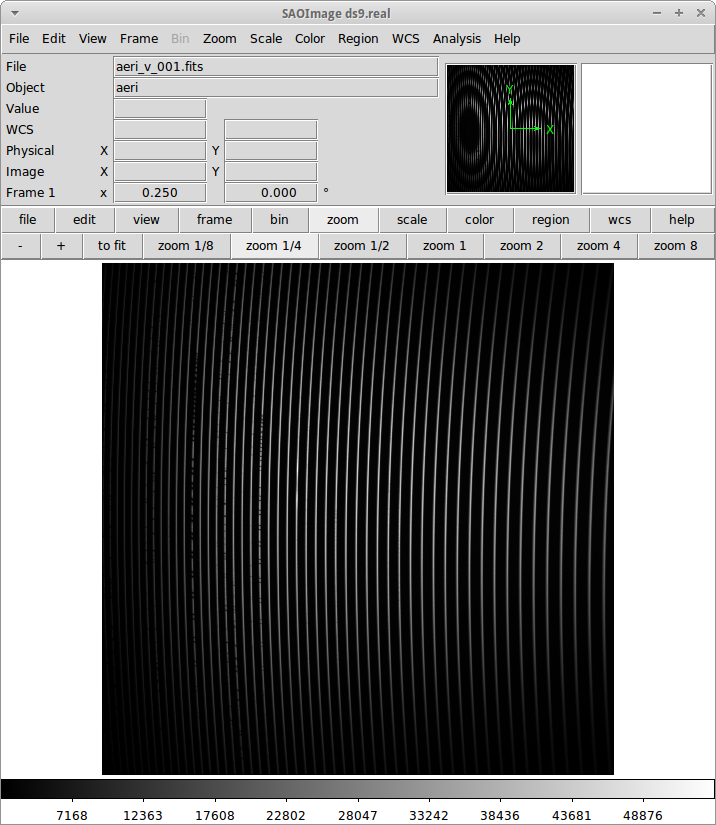
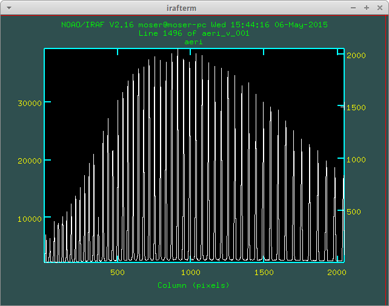
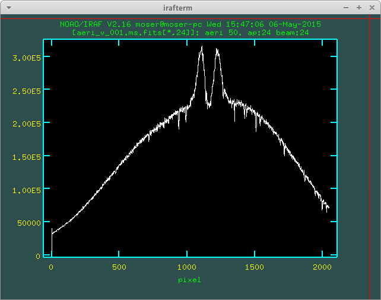

Observação e redução
######################

.. contents:: Índice

Info and Links
*****************
http://beacon.iag.usp.br/joomla/

http://beacon.iag.usp.br/astroweb/admin/

Observacional
**************
Filtro de densidade
=====================

Filtro de densidade é um filtro "espectralmente cinza", reduzindo em :math:`10^{-n}` o fluxo luminoso, onde :math:`n` é o valor do filtro. Exemplo: filtro de densidade "0.6" reduz em 75% o fluxo. Em magnitudes, isto dá +1.5 mag = :math:`-2.5 \log_{10}(10^{-0.6})=-2.5\times0.6`. Assim, um filtro de densidade "1" reduz 2.5 mag.

:math:`\frac{F}{F_0}=10^{-d}` ou :math:`d=-\log_{10} \left(\frac{I}{I_0}\right)`

Estes podem ser também chamados de *ND filters*.

==== ===== ================ ===============
ND   area  optical density  transmittance
==== ===== ================ ===============
ND2  1/2   0.3              50%
ND4  1/4   0.6              25%
ND8  1/8   0.9              12.5%
\    \     1.0              10%
==== ===== ================ ===============

Em condições ótimas, o CCD satura com integração mínima (0.15 s) numa estrela de mag 4.0 na banda *V*. 

Exercício: qual o filtro de densidade necessário para Achernar (magV = 0.5) para que o CCD não sature? Resp.: é preciso aumentar a mag. em 3.5. Para isso, usamos um filtro de densidade de d = 1.4 ou maior (:math:`3.5=2.5\times1.4`).

Cálculo de tempos 
===================================
Tempo de integração:

.. math::

    t = \frac{t_0}{\text{Pre-gain}} \times 10^{\frac{-m_{\text{alvo}} + m_{\text{min}} + m_{\text{ND}} + m_{\text{ceu}} }{2.5}}

Exemplos: :math:`t=t_0/\text{Pre-gain}` para uma estrela de mag 4.0 e para Achernar com filtro ND1.4.

Tempo de **execução** por filtro:

.. math::

    t_{\text{exc}} \sim 2\text{ min } + n_{\text{pos}}\times t\times n_{\text{frames}}

Relações vácuo/ar e ar/vácuo
===============================
The IAU standard for conversion from air to vacuum wavelengths is given by Morton (1991; ApJS, 77, 119).

From VAC to AIR (:math:`\AA`):

AIR = VAC/(1.0 + 2.735182e-4 + 131.4182/VAC^2 + 2.76249e8/VAC^4

From AIR to VAC (:math:`\AA`, reciprocal fitting done):

VAC = AIR/(1.0 - 2.73443e-4 - 131.275255/AIR^2 - 2.75708212e8/AIR^4

(Note que o inverso das operações **não é** somente a inversão de sinal nos fatores).

Exemplo: VAC = 3000.0 :math:`\AA`, AIR = 2999.12566 :math:`\AA`.

Sinal/Ruído (S/R)
===================
.. math::

    \text{S/R} = \frac{C t}{\sqrt{C t+(S+D)t+ n_i\sigma^2}} \simeq \sqrt{t}

onde :math:`C` é o ganho (:math:`e^-`/s), :math:`S` é a emissão de céu, :math:`D` a de *dark*, :math:`n_i` o número de imagens somadas, e :math:`\sigma` o erro de leitura do CCD.

Interferometria
================
Visibilidade (complexa) de um disco uniforme é :math:`V(u)=\frac{J_1(\pi a u)}{\pi a u}`, onde :math:`u=\|\vec{u}\|=\frac{\|\vec{B}_\text{proj}\|}{\lambda}` e :math:`a` é o diâmetro do disco.

1 mas = 4.8481368e-9 rad e 1 rad = 206264.8 arcsec (").

Cálculo de deslocamento espacial e angular
--------------------------------------------
.. math::

    \Delta\theta = \vec{u}\times\vec{r} = \frac{\vec{B}_\text{proj}}{\lambda}\times\frac{\Delta S}{d}

Para o modelo de referência de Faes+2013, :math:`\frac{\vec{B}_\text{proj}}{d} = 1` m/pc e :math:`\Delta\theta = 8.5^\circ`. Logo, deduz-se que :math:`\Delta S \simeq 14.3 R_\odot`.

OPD
***********
Geral
==========
Modo EM do CCD iXon **inverte o campo** do CCD (*espelho*).

Valores CCD *iXon*:

- gain 1x, sensitivity: 3.8, noise (ADU): (8.2/3.8=) 2.16
- gain 5x, sensitivity: 0.7, noise (ADU): (5.7/0.7=) 8.14

Valores CCD *iKon*:
- gain 4x, sensititvity = 0.9 e readnoise = 6.66.

Valores CCD *105* (ECASS):

- sensititvity 2.5x, noise (ADU): 2.5

Zeiss
==========
Campo buscadora do Zeiss :math:`\sim 2.5` arcmin (minutos!).

Redução
**********
Geral IRAF
========================
Saber a data e duração da exposição (iKon/iXon; a confirmar no 301/305):
::

    beacon> hselect *.fits DATE-OBS,EXPOSURE,$I yes

Lembrete: ``DATE`` refere-se a data de última modificação.

Eu criei uma variável no header dos arquivos FITS para corrigir a calibração em comprimento de onda: 'WLSHIFT', qual que o vetor :math:`\lambda_f=\lambda_0+`
WLSHIFT.

Para salvar uma janela do IRAF = ``:. snap eps``.

Uso do `splot` ou `identify`:

- Usar ``a+a`` no lugar de ``w+e+e``.
- Usar ``w+f`` para inverter imagem.

Instalação pacote Beacon
----------------------------
.. code:: bash

    # sudo chmod -R 777 /data/Softwares/Ureka/iraf/extern
    ln -s /data/Dropbox/Scripts/beacon /data/Softwares/Ureka/iraf/extern/beacon 
    subl /data/Softwares/Ureka/iraf/unix/hlib/extern.pkg

.. code:: 

    reset beacon         = iraf$extern/beacon/
    task beacon.pkg      = beacon$beacon.cl

Compilar fortran dentro do ambiente CL:

.. code:: 

    # copy and paste is impossible???
    cd iraf$
    cd extern/beacon/pccd/
    del pccd2000gen05.mac.e 
    del ccdrap_e.e
    # fc pccd2000gen05.mac.f -o pccd2000gen05.mac.e
    !fort77 pccd2000gen05.mac.f -o pccd2000gen05.mac.e
    # fc ccdrap_e.f -o ccdrap_e.e
    !fort77 ccdrap_e.f -o ccdrap_e.e

    # Opcional (na atual versao)
    # unlearn datapars
    # unlearn findpars
    # unlearn centerpars
    # unlearn fitskypars
    # unlearn photpars
    # unlearn daopars
    # unlearn setimpars

Tips
======
Keyboard input problem at epar
--------------------------------
Ubuntu 14.04.3, 64-bits, LANG=pt_BR.UTF-8

.. code::

    # to type quotation mark (quote)
    alt gr + ' 

Big images (i.e., px > 512) not entirely displayed in DS9
-------------------------------------------------------------
Solution 1:
- `display.fill = yes`

Solution 2:
- In the *login.cl* file, change `stdimage` to `imt2048` (or the desired number of pixels)

Fatiamento (slicing)
-------------------------
O IRAF tem uma imagem embutida nele que se chama ``dev$pix``. Você pode testar os comandos abaixo com dela.

.. code:: 

    display image[10:20,*]
    # Exibe as colunas de 10 a 20, e todas as "linhas" da imagem
   
    imstat cube[*, *, 3]
    #Roda o comando somente na 3a imagem do cubo FITS

Redução ECASS
=================
Nome lâmpada
-------------
Há vários padrões possíveis, como *pref\*lamp\*filter* (recomendado) ou
*pref\*filter\*lamp*. Exemplo: *aeri_lamp_r_0001.fits*.

Dica *identify*
-----------------
Para inverter :math:`\lambda`, digite 'w+f'.

Problema *rvcor*
-------------------
::

    Warning: Image header parameter not found (UT)

Digite em 'y:':
::

    0:0:0
    

Erro T_CONVOLVE
------------------
::
    
    Error smoothing image: avg_flat_r
    Warning: T_CONVOLVE: Image dimension > 2.
    norm_flat_r is not an image or a number

    beacon> imhead avg_*
    avg_bias.fits[645,2048,1][real]: zero
    avg_flat_r.fits[645,2048,1][real]: flat

Solução: aplicar o read3Dfits nas imagens!!!
::

    beacon> read3Dfits bias_*.fits
    beacon> del bias_*.fits
    beacon> !renlist.py
        'cp_'
        ''
    beacon> !renlist.py
        '_0001.'
        '.'

Redução IAGPOL
=================
Pacote disponível no *github*.

Padronização
--------------
Nome dos arquivos = ``(obj)_(suf)_(filter)_0*``, onde ``obj`` é o nome tabelado (planilha xls), ``suf`` é um sufixo da configuração do CCD (e.g., ``_g5``, ``_full``).

Cada sequência de um dado alvo é salvo numa pasta.

A pasta ``calib`` é reservada para os arquivos de calibração.

Não há procedimento específico para diferenciar padrões observadas nas 2 calcitas. Em geral, modifica-se o nome da pasta (e a rotina de redução identifica a calcita pelo ângulo das estrelas).

Nome dos resultados da redução = ``w(obj)_(filter)_(pos)00*.(version).out`` e ``JD_(obj)_(filter)``.

Redução MUSICOS
=================
The new (Jan. 2015) are: *calib_mus* and *reduce_mus*. With MUSICOS **both** flats are important: CCD and dome. MUSICOS use Ikon CCD: gain is 0.9 and readnoise(:math:`e^-`) is 6.66 (1MHz, gain *x4*).

*calib_mus*: combine bias; combine CCD flats; apply bias+CCDflat to dome flats\*; combine dome flats\*; mark apertures on the flat; apply bias+flat to lamps; identify lamps within marked lamps. PS: \* are optional steps.

*reduce_mus*: apply bias+flat to obj. images; extract and combine obj. images; apply lamp; normalize spectra (*continuum*); create *cont*. spec.: spec/norm-spec; combine apertures with sum to combined obj. and normalized spec.; final product is summed combined obj./summed normalized spec.

Atenção no *fit* das ordens: use 'k' (razão; ou 'j', resíduo) para ter uma ideia
de como ficará o resultado. Recomendação é marcar regiões foram da linha com
's+s'. Porém, na janela seguinte, as regiões **precisam ser removida** ('t+f').

'h' volta para o gráfico inicial.

A linha :math:`H\alpha` está na ordem 24 do vermelho.

Lâmpadas devem estar no formato *lamp\*filter\**. Exemplo: *lamp_v_0001.fits*.

Normalização linhas de emissão
--------------------------------
Para imendar as ordens, usa-se a rotina *continuum*. Porém, ela parece não
funcionar muito bem na presença de linhas de emissão...

Exemplo: na estrela spec_14nov18/bcmi, o :math:`H\alpha` esperado era minímo ~
0.85 e máximo ~ 1.7. Entretando, obteve-se minímo ~
0.55 e máximo ~ 1.1 disforme.

Criei então a opção *doextr*. Se *yes* (padrão), faz a estração das ordens
(\*.ms\*). Se *no*, só re-faz a normalização, para correção deste erro.

Redução MUSICOS com OPERA
===========================
Instalação
-------------
Usar ``cfitsio`` antigo no caso de problemas...

2+1 arquivos são necessários: opera.zip e fftw.zip, +cfitsio.zip. Após descompactá-los:

.. code:: bash

    cd opera-1.0
    ./configure --prefix=/path/to/opera-1.0
    # se não funcionar,
    #more DEPENDENCIES (gcc, cfitsio, fftw3, zlib, Autotools, gnuplot)
    #autoconf/bootstrap.sh

    #sudo apt-get install automake autoconf libtool
    #DEP > cfitsio (3.2.9)
    #DEP > fftw3

    #sudo apt-get install fitsverify

    cd ../fftw-x
    ./configure
    make
    sudo make install
    cd ../opera-1.0

    make
    make install
    #. ./setup.sh
    #To uninstall:
    #make distclean

Uso
-------------
As rotinas precisam que o header esteja corretamente configurado. Entre as exigências, estão:

    - EXPTIME (ou outra KEYWORD) esteja em notação americana, isto é, float divido por "." (e não ",").
    - "R" ou "B" em FILTER.
    - Objeto (FLAT, BIAS, etc) corretamente identificados.
    - Para tudo isso, eu criei um script python ``prepare_header_opera.py``. É só rodar na pasta da noite.
    - Além disso, todos os arquivos devem estar na raiz da noite.

Abaixo, o PATH **do script** é ``$HOME/opera-1.0/pipeline/pyMusicos/``

.. code:: bash

    cd /data/MUSICOS/14set05_R
    operaQueryImageInfo -r ./ -e "INSTMODE OBSTYPE OBJECT EXPTIME2 DATE MODDATA"

    operaMusicos.py --datarootdir=/data/MUSICOS/ --pipelinehomedir=$HOME/opera-1.0 --productrootdir=$HOME/Reductions/MUSICOS/ --night=14set05_R --product="CALIB" -pvts
    # "-s" means SIMULATION of the reduction...

    operaMusicos.py --datarootdir=/data/MUSICOS/ --pipelinehomedir=$HOME/opera-1.0 --productrootdir=$HOME/Reductions/MUSICOS/ --night=14set05_R --product="OPSPC" -pvt

Exemplo:

.. code:: bash

    cd /data/spec_15set25/
    python prepare_header_opera.py

    /data/Softwares/opera-1.0/bin/operaQueryImageInfo -r ./ -e "INSTMODE OBSTYPE OBJECT EXPTIME2 DATE MODDATA"
    
    geany /data/Softwares/opera-1.0/pipeline/pyMusicos/operaMusicos.py
    # edit 1st line!

    operaMusicos.py --datarootdir=/data/ --pipelinehomedir=/data/opera-1.0 --productrootdir=/data/Reductions/ --night=spec_15set25 --product="CALIB" -pvts
    operaMusicos.py --datarootdir=/data/ --pipelinehomedir=/data/opera-1.0 --productrootdir=/data/Reductions/ --night=spec_15set25 --product="CALIB" -pvt
    # my laptop, 2 cores = only 1 used; 1200 MB memory used
    # my laptop, 1 bias, 1 flat, 1+1 ThAr = X min

    operaMusicos.py --datarootdir=/data/ --pipelinehomedir=/data/opera-1.0 --productrootdir=/data/Reductions/ --night=spec_15set25 --product="OPSPC" -pvt
    # my laptop, 6 files, 1 tgt = X min

Resultados
------------
.. code:: bash

    $HOME/opera-1.0/pipeline/pySpectralAnalysis/plotSpectrum.py —spectrumfile=HR8634_R_001.spc.gz
    
    gunzip -c HR8634_R_002.spc.gz > HR8634_R_002.spc
    gnuplot -persist ../14set05Plots/HR8634_RED.gnu
    gnuplot -persist ../14set05Plots/HR8634_RED_norm.gnu

Problemas
-----------
- Não encontra *object*. Solução: verificar header.

Stavros - Redução *beacon*
==============================

Critérios:
------------
#. Pastas: PATH/calib e PATH/prefix

#. Nomes: bias_0#.fits; flat_F_0#.fits; onde F é um dos filtros [u,b,v,r,i]

#. Rodar ``ecl> calib``

#. Na pasta do prefix, Rodar ``ecl> reduce`` e ``suffix =``

Dicas:
---------
- ``ccdrap``, e ``reject = 70000``

- ``polrap``, ``pout = 02 01 08``, significa 2 pontos excluídos: o primeiro (01) e o último (08).

- CTRL+U+L > vai para o final da linha no epar !

- ``polrap``, ``n = 4``, agrupamentos de 4 posições.

amdlib
=========
...

Notas sobre correções em comprimento de onda
*********************************************
As diferenças em :math:`\lambda` (em relação ao repouso) se dão por 4(+1) motivos:

1. Problema na calibração do comprimeto de onda. 
2. Calibração de onda "no vácuo" vs "no ar" (padrão usual)
3. Ajuste de velocidade heliocêntrica
4. Velocidade radial da estrela
5. (Diferenças para com o HDUST)

Problema na calibração do comprimeto de onda
==============================================
No padrão de espectro FITS, os espectros são salvos numa única tabela de fluxo. Para isso, o espectro é **linearizado** :math:`(\lambda(p_x)=f(p_x)=a\times p_x+b)`, e a info da função do comprimento de onda é salva no *header* da imagem sob os parâmetros *b = CRVAL1* e *a = CDELT1*. 

Assim, quando temos problemas de calibração, eles podem ser em *a*, em *b*, ou em ambas.

Veja que isso não é mandatório: o ESO, por exemplo, salva uma tabela para o fluxo e outra para o comprimento de onda. Pode-se inclusive ter uma tabela para a incerteza no fluxo. 

Calibração de onda "no vácuo" vs "no ar"
=========================================================
O padrão nas observações é comprimento de onda no ar. O *HDUST* é padronizado para o vácuo. Para passar de um para o outro no *PyHudst*, use as funções presentes no ``spectools`` (``vac2air`` e ``air2vac``).

Ajuste de velocidade heliocêntrica
=====================================
A velocidade da Terra girando e se movendo ao redor do Sol faz com que não vejamos os astros sempre com a mesma velocidade de nós. Obviamente, esta correção depende de quando realizamos a observação (ou da Terra com respeito ao Sol). 

Apesar de envolver a Terra, essa correção é chamada de correção "heliocêntrica", pois calcula a velocidade para um observador que estivessse no Sol. A rotina que calcula isso no IRAF é a ``rvcorrect``. Veja o que diz o seu manual (http://stsdas.stsci.edu/cgi-bin/gethelp.cgi?rvcorrect):

    The observed radial velocity is corrected for the motion of the observer in the direction of the observation. The components of the observer's motion corrected are those due to the Earth's rotation (diurnal velocity), the motion of the Earth's center about the Earth-Moon barycenter (lunar velocity), the motion of the Earth-Moon barycenter about the center of the Sun (annual velocity), and the motion of the Sun (solar velocity) relative to some specified standard of rest. 

Ao ser executado, o ``rvcorrect`` salvará no *header* do arquivo um campo com a flag *VHELIO*. Este valor é aplicado usando a rotina ``dopcor`` ("Doppler correction"), que alterará os valores de  *CRVAL1* e *CDELT1* de acordo com *VHELIO*.  

É possível mostrar que as correções são feitas de acordo com as equações abaixo:

.. math::

    \lambda_0(p_x) = a\times p_x + b \\
    \frac{\lambda-\lambda_0}{\lambda} = \frac{\Delta v}{c} \\
    \lambda = \frac{\lambda_0 c}{c-\Delta v} \\
    \lambda = \frac{a c}{c-\Delta v}p_x + \frac{b c}{c-\Delta v}\\
    \lambda(p_x) = a'\times p_x + b' 

Velocidade radial da estrela
===============================
Mesmo que tudo seja perfeitamente calibrado, o centro da linha da sua estrela estará deslocado do :math:`\lambda_0`. Isto porque ela deve ter um movimento relativo em relação ao Sol, chamado de "velocidade radial". 

Note que a velocidade radial de uma estrela deve variar se ele tiver outro corpo em seu campo gravitacional, como num sistema binário ou se tiver planetas.

Diferenças para com o HDUST
============================
Por melhor que sejam os modelos do átomo de Hidrogênio, efeitos quânticos complicados (como "acoplamento spin-órbita") nos impede de *precisamente* determinar o comprimento de onda das transições eletrônicas (como na fórmula de Rydberg).

Assim, o valor do :math:`\lambda_0` no arquivo *simulation* do *HDUST* só pode ser determinado "empiricamente" - ou se você recuperar a fórmula e todos os valores das constantes utilizados no programa.

Interferometry
***************
- ``OIDATA_APP``: all observational info (big files, no plot gen.)
- ``OIDATA_APP_AVG``: average of observ. info (small files, plot)
- ``OIDATA_APP_AVG_SPEC_PRO``: wavelength corrected (``SPEC``) + V2+DP corrected from calibrators (nights without calibrators not have these files)

Logs
********
Noites spec
============
14ago11
---------------------
Observada por D. Bednarski e André Luiz. Sem calibração e lâmpadas !!!

Copiei *bias* e *flat* da noite de spec_14jul15 e, deslocando e redimensionando
cada uma das aberturas **aparentemente** funcionou:
::

    a (All flag - keep on)
    s+'yes' (aperture 1)
    g (recenter)
    z (resize)

Alvos spec
===========
Achernar
---------
Noites com dados na fase ativa de 2013+:
- 130925, ECASS,
- 130926, ECASS, 
- 131111, MUSICOS,
- 131112, MUSICOS,
- 131209, MUSICOS,
- 140715, MUSICOS,
- 140811, MUSICOS,
- 141013, MUSICOS,
- 141118, MUSICOS,
- 150924, MUSICOS,
- 151028, MUSICOS,

Alpha Col
----------
Pedido Xuxu, entregue em 14/03/15. Noites com dados:
- 111020, ECASS, R, 6 specs, 1 summed.
- 120405, ECASS, R, 10 specs, 1 summed.
- 120910, ECASS, B, 11 specs, 1 summed.
- 121120, ECASS, R, 20 specs, 1 summed.
- 130926, ECASS, R, 30 specs, 2 summed.
- 131111, MUSICOS, B, 10 specs, *error orders 75/76*.
- 131112, MUSICOS, R, 5 specs, 1 summed.
- 131209, MUSICOS, R, 8 specs, 1 summed.
- 140225, MUSICOS, R, 5 specs, 1 summed.
- 141013, MUSICOS, R, 3 specs, *error order 42*.
- 141118, MUSICOS, R, 3 specs, *error order 26*.
- 150402, MUSICOS, R, 5 specs, *error cpp*.

