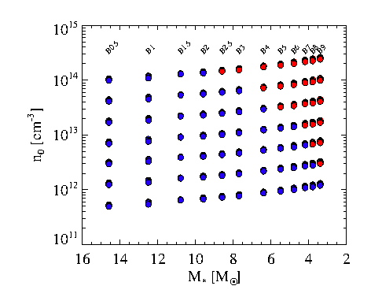

BeAtlas
############

.. contents:: Table of contents

Notas
==========
Idealmente, teríamos 4 trabalhos para o BeAtlas:
    #. Fotosférico, apresentação e "calibração"
    #. Fotosférico, aplicação Be e Bn
    #. Com disco, apresentação e "calibração"
    #. Com disco, aplicação Be e Bn

Comparações entre observações e valores intrínsecos: Analizando Fremat+ 2005, vemos que a tabela de valores foca apenas nas grandezas APARENTES, e não intrínsecas. O modelo PNRC está como referência para recuperar-se os valores intrínsecos.

Fremat+ 2005 compara os casos com GD e OB com ou sem estes efeitos (PNRC). Como resultado, GD+OB **sempre** diminuem *Teff, log(g) Vsin(i)*, sendo as alterações mais sensíveis em altas taxas de rotação - e para altos ângulos de inclinação (i.e., edge-on), e (devem) variar entre tipos espectrais.

Além das fórmulas dadas no artigo, pode-se recuperar as grandezas intrínsecas como um "teste de sanidade":

.. math::
 
    \log_{10}g = \log_{10}\left( \frac{GM}{R_e^2} \right)

    V_c = \sqrt{\frac{GM}{R_e}}

    M = V_c^2 R_e / G

    V_c^2 = 10^{\log g} R_e

    R_e = V_c^2/10^{\log g}

.. code:: python

    R = (vc*1e5)**2/10**logg/phc.Rsun.cgs

Parameters and conversion
===========================

====================== ===== ===== ===== ===== ===== ===== ===== ===== ===== ===== ===== =====
mass (:math:`M_\odot`) 14.6  12.5  10.8  9.6   8.6   7.7   6.4   5.5   4.8   4.2   3.8   3.4
====================== ===== ===== ===== ===== ===== ===== ===== ===== ===== ===== ===== =====
spectral type          B0.5  B1    B1.5  B2    B2.5  B3    B4    B5    B6    B7    B8    B9
====================== ===== ===== ===== ===== ===== ===== ===== ===== ===== ===== ===== =====

    Converged in blue and not in red.

Simulations
--------------
9 parâmetros no total: :math:`\Sigma_0`, nr, ht, Renv, M, ob, Hf, Z, :math:`\cos(i)`.

Se :math:`\Sigma_0=0` deve-se replica-lo para todos os parâmetros da grade... Na verdade, a única propagação (neste momento) é para nr. Futuramente, para Renv, e ht (ou seja, propação só para parâmetros do disco, não fotosféricos).

A escolha para a grade é escala :math:`\Sigma_0` como s (escala de densidade). Há uma função no ``pyhdust.beatlas`` para isto.

Por enquanto:
    - s [0-1]
    - nr [3.0-4.5]
    - ht (72)
    - Renv (40)
    - M [03.8-14.6]
    - ob [1.10-1.45]
    - Hf [0.08-0.77]
    - Z (0.014)
    - :math:`\cos(i)` [0-1]

