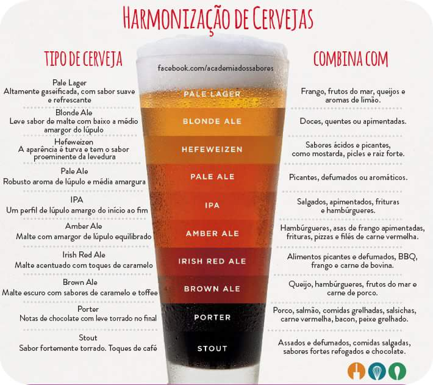

.. role:: strike
    :class: strike

.. contents:: Table of Contents

Beer space
###########

Untappd activities
**********************
- https://untappd.com/user/dmoser
- via `RSS <https://untappd.com/rss/user/dmoser?key=de344df62d9587d6227f8bead7a90d3c>`_

Badges info
============
- 12 beers in 1 day
- 3 light americans
- :strike:`15x same beer w/30d`
- Birthday check-in
- 10x comments w/30d
- :strike:`"Blonde" beers`
- 5 "pints" between 4PM-6PM w/30d
- 5 checks between 12PM-2PM w/30d, Monday to Friday only
- :strike:`Dubbel/Triplel styles ("Belgium")`
- :strike:`10 beers of the same brewery w/30d`
- Fruit beers
- :strike:`New Brew Thursday - 3 thursdays w/30d`

Beers
=======
Kuntsmann
-----------
- Trigo
- Lager
- :strike:`Lager sin Filtrar`
- Torobayo
- :strike:`Bock`
- :strike:`Original Anwandter Rezept`
- Alkoholfrei
- Honig Ale
- Heidelbeere
- :strike:`Gran Torobayo`
    
Country list (level 3)
=======================
#. Australia
#. Austria
#. Belgium
#. Bolivia
#. Brazil
#. Canada
#. Chile
#. Czech
#. Denmark
#. England
#. Germany
#. Holland
#. Ireland
#. Mexico
#. Russia
#. Spain
#. USA

Types
*******
http://bendbrewfest.com/beers.html

All beers, no matter how great or small, are made from a basic combination of water, malts, hops (*lúpulo*), and yeast (*fermento*). So then what really distinguishes an **ale** from a **lager**?

The difference is yeast. Not whether or not it's used, but the specific type. But from this relatively small variant comes a whole slew of changes and differences that make these two beers very unique.

Is one style better than the other? Definitely not. It's all a matter of personal taste or what we're craving at that particular moment.

Ales
=====
Ales are brewed (*fermentadas*) with a top-fermenting yeast that thrives at mid-range room temperatures. For this reason, ales are typically stored between 60o and 75o Fahrenheit during the fermentation stage. This type of yeast and the fermentation temperature tend to give ales a fruitier and spicier flavor than lagers. In general, ales are more robust and complex. Common styles of ale include **pale ale**, **India pale ale**, **amber ale**, **porters**, and **stouts**.

- Stout: dark beer made using roasted malt or roasted barley (*cevada*).  Come in five major categories: Irish Dry, Sweet (Cream), Oatmeal, Foreign and Imperial. Stouts are black in color with the exception of oatmeal and imperial stouts, which can vary from dark copper to black.
- Porter: (a kind of stout) developed in London from well-hopped (*alto lúpulo*) beers made from brown malt.
- IPA: strong and hoppy beers.

The Difference Between A Pale Ale And An IPA
---------------------------------------------
http://vinepair.com/wine-blog/difference-pale-ale-ipa/

There are no two more prominent styles of beers that beer geeks and brewers - both home and professional - obsess over more than Pale Ale and India Pale Ale - better known as IPA - but what's the actual difference between these two hoppy beers, and how did both become so popular in the craft (*ofício*) community? The answer to both questions lies in some truth, with a bit of legend and myth thrown in, as well as a lot of good old fashioned American pride.

The first time the term Pale Ale was used in regards to describing a style of beer goes way back to 1703 when a batch of beers that were being made in England utilized malt that happened to be roasted with coke (the coke we're referring to here is a fuel derived from coal that has very little impurities and a very high carbon content, so it doesn't create much smoke, creating a dry heat rather than a smoky heat). The resulting roasted malt was lighter because of the lack of smoke and it wound up creating beers that were lighter in color than others on the market at the time, resulting in the name Pale Ale, since the ale in the glass was visibly lighter when placed next to the other beers at the bar. In addition to the lighter color, because the resulting malt had a milder flavor, the hops were able to shine through more prominently, thus Pale Ales came to be associated not only with their pale color, but their mild (*suave*) hop flavor as well.

Pale Ales became quite popular in Britain, where customers would often also refer to them as **Bitters**, due to the hop profile, and they remained the only hoppy beers on the market for a little over 100 years. That is until 1829, when we have the first record of the name IPA being used as a descriptor for a hoppy beer specifically prepared for India that appeared in an ad in the Sydney Gazette And New South Wales Advertiser. This is where much of the legend and myth surrounding the birth of the IPA really takes place.

As legend has it, prior to that ad appearing in the newspaper for this new style of beer, Brits who had ventured to their new Indian colony were becoming homesick for the beers from back home and so they began to request that their favorite Pale Ales be shipped halfway across the world to India. Fearing the beers would not make the journey and would ultimately arrive sour (*azedo, ácido*) and flat, it's said brewers fortified them with a much stronger backbone of hops and alcohol, protecting them on their six-month journey across the sea. When they arrived, the beers not only survived the journey, but many preferred their hoppier flavor. And thus, the IPA was born.

The reason this tale may only be a legend is because at the same time period, stouts and porters were also shipped to both India and America from England, and neither of these styles had their hops increased, yet both survived the journey just fine. This has caused some people to call into question whether this tale is simply a nice way to easily explain how beers called IPAs wound up with stronger hop characteristics than their Pale Ale siblings.

However IPAs came to be, they really took off during America's current craft beer boom. Starting around 1980, Sierra Nevada began experimenting with the classic Pale Ale style using American hops, which were brighter, fruitier and more resinous than their English counterparts. They released their Sierra Nevada Pale Ale in 1981 and the style took off. The result was an American Pale Ale that was hoppy and distinctly American, due to its inclusion of the American hops - Cascade being the most prevalent. When brewers naturally sought to make a beer even more hoppier than the Pale Ale, of course they referred to it as an IPA.

So all an IPA technically is, is a more assertively hopped and stronger version of a Pale Ale, yet what that actually means differs depending on the brewer making both beverages. While a Pale Ale is the milder version of a brewer's IPA, the lines definitely blur and you can have a Pale Ale by one brewer than seems just as hoppy as the IPA of another; it all depends on what that brewer's definition of the two terms, since there are no formal rules.

To make things a bit more confusing, American styles of IPAs also traditionally differ depending on which coast of the United States your beer happened to have been brewed on. West Coast IPAs, which are typically the IPAs most people seem to prefer, are known for their much more intense hop characteristics - paying homage to the plethora of fresh hops available to brewers in the Pacific Northwest. IPAs made on the East Coast, on the other hand, traditionally use a stronger malt presence to bring more balance to the hop intensity.

Lagers
=======
By contrast, lagers are made with bottom-fermenting yeast that work best at cooler temperatures, between 35o and 55o Fahrenheit. Fermentation happens more slowly and the beer is more stable, so it can be stored (or "lagered") for longer than ales. This yeast tends to have less presence in the finished beer. As compared to ales, lagers have a cleaner and crisper quality with emphasis on the hops and malt flavors. The lager family includes **pilsners**, **bocks**, and **dunkels**.

Lager vs. Pilsen
------------------
Na verdade as Lagers americanas (i.e., cervejas comuns brasileiras) foram feitas com base na receita original de cervejas Pilsens, porém elas usam outros ingredientes para baratear o custo de produção, nesse caso, milho ou arroz ou açúcar ou uma mistura do que for mais barato na cotação do momento. Isso com certeza acaba prejudicando não só o sabor, como a qualidade do produto final. Seria mais ou menos como se acrescentássemos "suco tang" de uva pra aumentar a produção de um vinho, ou diluir álcool de posto em cachaça...

Useful Info
*************
Terms
========
- Hefe: (German) Means "with yeast". Applies to unfiltered, or bottle-conditioned beers.
- Cask or Bottle-Conditioning: Beer is put into kegs (casks) or bottles with still-active yeasts before fermentation has finished, sometimes with the addition of new fermentables (sugars) so it may naturally carbonate and cask-condition under pressure prior to being dispensed for consumption.
- Hops: A climbing vine (*Humulus lupulus*) that produces flowers or "cones" which contribute bitterness and aroma in beer. Hops also act as a natural preservative and help clarify the beer during the brewing process. Active ingredient: alpha acid.
- Imperial: any beer style that includes the word "Imperial" is usually quite high in hops and most certainly higher in alcohol. Another invention of necessity, "Imperials" were usually beers that were made in one country and shipped to another, often bound for the lips of royalty (hence the name Imperial). It's another case of long journeys calling on the properties of higher alcohol and hops to act as preservatives.
- Red Beers: Mainly from West Flanders, they are the more sharply acidic, reddish, half-brothers to the Brown Beers of East Flanders, with the additional difference that they are often filtered and pasteurized. The sharp acidity and some of the color is derived from aging in large wooden tuns.

Wine space
#############

Vivino activities
*********************
- https://www.vivino.com/users/danmoser

Blog
*****
- `Parte 1 <http://decfrance.blogspot.cl/2013/01/registro-44-tudo-sobre-vinhos.html>`_
- `Parte 2 <http://decfrance.blogspot.cl/2013/01/registro-45-tudo-sobre-vinhos-parte-2.html>`_
- `Parte 3 <http://decfrance.blogspot.cl/2013/01/registro-46-tudo-sobre-vinhos-parte-3.html>`_
- `Parte 4 (extra) <http://decfrance.blogspot.cl/2013/01/registro-47-traducao-experiencia-com.html>`_
- `Parte 5 <http://decfrance.blogspot.cl/2013/01/registro-48-tudo-sobre-vinhos-parte-5.html>`_

Vinhos tintos
***************
Cepas chilenas
===============
- **Carménère** = origem Médoc, Francia. Foram confundidos com Merlot até que em 1944 um especialista identificou no Chile. Tem aroma de "berries", em geral um pouco mais suave que o CS.
- **Cabernet sauvignon** (CS) = origem Bordeux, Francia. Conhecido por produzir vinhos "frutosos", concentrados, com alto valor de tanino.
- **Merlot** = irmã menor da CS, sendo mais suave.
- **Syrah** = origem Rhône, Francia. Cor escura, alto tanino, aroma intenso. Demanda bom envelhecimento.
- **Pinot noir** = origem Borgoña, Francia. Cepa muito sensível ao clima. Aroma a frutas y sabor suave, com pouco tanino.

Cepas argentinas
=================
- **Malbec** = conhecido pela coloração escura.

Cepas majoritariamente francesas
=================================
- **Cabernet franc**

Vinhos brancos
****************
- **Riesling** = a mais doce?
- **Chardonnay** = mais popular branco do mundo.
- **Sauvignon blanc** = ácido, melhor bebido envelhecido.

Vinhos rosé
****************
Até onde descobri, são sempre misturas não muito bem regulares.

