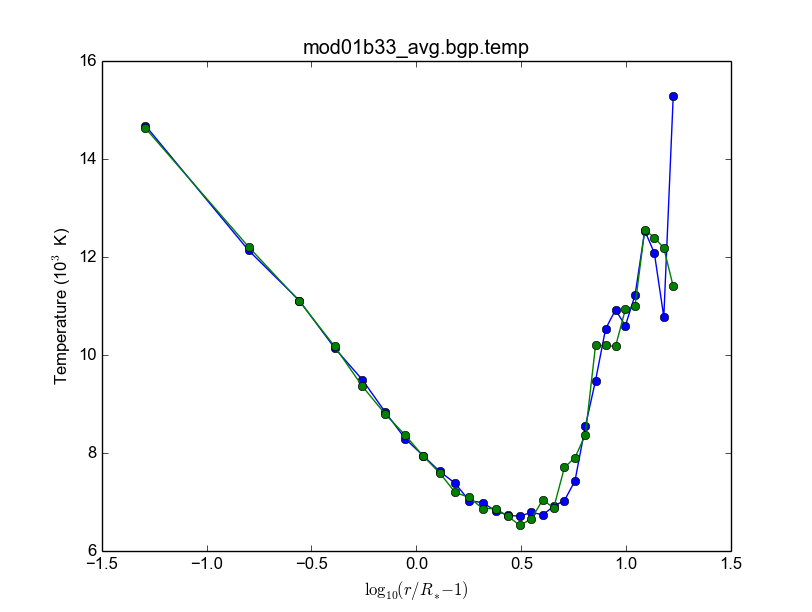
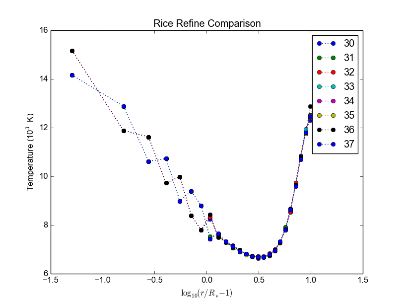

.. role:: bash(code)
   :language: bash

Codes Usage

.. contents:: Table of contents

Hdust
########
Flags
======

=========== ========= =========== ========= ================================== =============
Compiler    FC (s)    CFLAGS (s)  FC (par)  CFLAGS (par)                       clusters
=========== ========= =========== ========= ================================== ============= 
intel       ifort     -132        mpif90    -132 -xHost -O3 -ipo -no-prec-div  acrux, lical
path_scale  pathf95   \           mpif90    -apo -Ofast                        projekct
gfortran    gfortran  \           mpif90    -O2                                acrux
=========== ========= =========== ========= ================================== =============

Computational time 
===================

============ ======== =========== ==== ================= =======
Step         n_f      time (min)  ncr  :math:`\Sigma_0`  n_proc
============ ======== =========== ==== ================= =======
1            2.5e6    1.5         ?    ?                 48
1            2.5e7    15          ?    ?                 48
1            2.0e7    53          40   ?                 48
1            7.5e8    390         40   ?                 48
5, Sob 1     5.0e6    3           ?    ?                 48
5, Sob 1     5.0e7    30          ?    ?                 48
5, Sob 0     2.0e7    2           ?    ?                 48
============ ======== =========== ==== ================= =======

Valores para teste (execução em aprox. 1 min em ``mpirun -np 3``):

- step1: 30000
- SED: 500000 (Sob 0)
- Ha: 50000 (Sob 1)
- com poeira: 520 (Sob 1; teste para Cesar em 2016-06-17, gridBBre)
- (valores podem variar de até um fator 1/2 ou 2, dependendo dos parâmetros e máquina usada).

Bugs
=====
Afirmação de 17/06/2013: ``NaN`` não é um problemas de compilador ou cluster. Resultados idẽnticos no cluster projekct e na alphacrucis.

.. code::

    forrtl: severe (408): fort: (18): Dummy character variable 'MODE' has length 5 which is greater than actual variable length 1

Na versão serial: ocorre devido a flag ``-C`` na compilação.

.. code::

    forrtl: severe (71): integer divide by zero

Na versão paralela: ocorre devido a um arquivo mal especificado no input!

.. code::

    Program received signal SIGFPE: Floating point...

    Backtrace for this error:

Na versão paralela: ocorre devido a um ausência do mpirun no comando de execução!

Mesocentre
=============
Comandos:

.. code:: bash

    ssh $USER@ssh-n.oca.eu 
    ssh $USER@licallo.oca.eu

    # Tunel por uma porta:
    alias lical="echo '# Redirecting licallo to port 7025...'; ssh -l $USER -L 7025:licallo.oca.eu:22 ssh-n.oca.eu -N"

    # Copiar arquivos:
    scp hdust.zip $USER@licallo.oca.eu:/beegfs/home/USER

    scp -P7025 $USER@localhost:/beegfs/home/USER/hdust/runs/hdust/R82/models.tar .
    scp -P7025 *.oar $USER@localhost:/beegfs/home/USER/hdust/runs/hdust/
    scp -P7025 *.oar *.inp $USER@localhost:/beegfs/home/USER/hdust/runs/hdust

    scp -P7025 $USER@localhost:/beegfs/home/USER/hdust/runs/hdust/be_pol_lines/mod01/* .

Exemplos: https://www.oca.eu/fr/acces-fonctionnement/gestion-des-jobs/1340-exemples-de-scripts

Comandos: https://www.oca.eu/fr/acces-fonctionnement/gestion-des-jobs/1359-commencer-avec-slurm

VPN: https://dsi.oca.eu/spip.php?article912

Para compilar o HDUST, Mudar no XDR makefile:
    - gcc -> icc
    - gfortran -> ifort

Comandos: 

.. code:: bash

    chmod +x mod01.slurm
    sbatch ./mod01c.slurm
    squeue | grep acar
    scancel numero_do_job

Old (2017 and before)
------------------------
Or Licallo at CRIMSON. Info at https://crimson.oca.eu/spip.php?rubrique57

.. code:: bash

    #!/bin/bash
    #OAR -n hdust_dmf
    #OAR -l /core=24,walltime=12:00:00
    #OAR -p gpu='NO'
    #OAR -O out.%jobid%
    #OAR -E err.%jobid%

    source /softs/env_default.sh
    mpiexec.hydra  -machinefile $OAR_FILE_NODES \
    -bootstrap ssh -bootstrap-exec /usr/bin/oarsh \
    -envall ./hdustparv2.02.bc input = hdust_bestar2.02.inp

The submission is

.. code:: bash

    chmod a+x job.oar
    oarsub -S ./job.oar

    oarstat

Running times
~~~~~~~~~~~~~~~
- bestar2.02, step1, 500000/24, one \.temp in 30 sec.
- bestar2.02, SED, ?

``precalcs``
==============
Run it:

.. code:: bash

    ./precalcs < dust.pre > dust.bin

Tlusty + Synspec 
###################
Tlusty: A computer program for calculating non-LTE stellar atmosphere models. The hybrid CL/ALI method + superlevels and supertransitions are treated by Opacity Distribution Functions (ODF).

To compile:

.. code:: bash

    gfortran -fno-automatic -O3 -ffixed-line-length-none -std=legacy -o tlusty200 tlusty200.f

Error in line 1365 (*Tlusty200*):

.. code::

    -* ’QTLAS ’,’ITLUCY’,’IACLT ’,’IACLDT

Synspec: a general spectrum synthesis program. It assumes an existing atmospheric model (Tlusty or Kurucz).

Synplot: a wrapper for Synspec.

Kurucz
==========
http://kurucz.harvard.edu/

Hdust uses ``ap00k1.pck``, with Solar abundances from Anders & Grevesse (1989). In this format, all models are inside a single file.

hdust.pro
===========
ilow = 2; transitions starting at Balmer series (n = ilow = 2).

Nlower = 6; it will consider the following Nlower series (ilow_max = 2+6-1 = 7).

Nupper = 12; each series above (Nlower) will have Nupper transitions.

Nlines = Nupper\Nlower; this is the total number of transitions considered.

Synspec + Synplot
====================
Arquivos necessários para rodar o synspec:

- synspec (EXE) + rotin (EXE)
- synplot.pro (IDL)
- entrada.5 ("main input"). Aqui também o ``.dat``, arquivos com as informações das transições das linhas (atom models, no site do Tlusty).
- kurucz.dat. Modelos de atm. do Kurucz - ou do Tlusty.

.. code::

    IDL > synplot49, 0, 0, 0, wsta=6530, we=6600, vrot=0, atmos=['atmos.5', $
    'ap00k1tef15000g3.0.dat'], wd=0.5, imode=2, /kurucz, x, y

    IDL > synplot49, 0, 0, 0, wsta=6530, we=6600, vrot=0, atmos=[$
    'BG15000g300v2'], wd=0.5, imode=2, x, y  ;+ nst file

fort.5 = std input; fort.8 = model.

"Bug" no synspec: se o modelo de atmosfera for de 72 (Kurucz), com ``dens=0`` ele trava (acontece no último nível de atm. Deve-se remover). 

Synspec
--------
Para compilar com o synspec com gfortran, vc precisar deixar a linha 1558 e seguinte assim:

.. code::

      IF(FINSTD.NE.BLNK)
     *   OPEN(UNIT=INPFI,FILE=FINSTD,STATUS='UNKNOWN')

(acho que é só trocar NAME por FILE).

.. code:: bash

    $ gfortran -g -fno-automatic -static -o synspec49.exe synspec49.f

VARTOOLS
###########
http://www.astro.princeton.edu/~jhartman/vartools.html

Basic/help commands
=====================
.. code:: bash

    vartools -listcommands
    vartools -help
    vartools -help $commnad
    vartools -example $command

Basic RMS
----------
:bash:`vartools -i EXAMPLES/1 -rms`

``-i $file``, input of single file

``-rms``, calculate the RMS of the lightcurve.

Basic list RMS
-------------------
:bash:`vartools -l EXAMPLES/lc_list -rms`

``-l $file``, where ``$file`` is a filename list containing the light curves, a (sub)file per line. The subfile contains a single lightcurve, 3 col: [JD, mag, errmag].

Site examples
==============
Fitting a quadratic polynomial in JD to a list of light curves
-----------------------------------------------------------------
:bash:`vartools -l EXAMPLES/lc_list -rms -decorr 1 1 1 0 1 1 2 0 -rms -chi2 -tab`

``-decorr B B B # # B``, decorrelates the light curve against specified signals
    - 0/1 enable/disable
    - 0/1 zero point term is included
    - 0/1 subtract the first term
    - 0/Nglobalterms globalfileN orderN, number of global files (files with JD and signal) + syntax
    - Nlcterms lccolumnN lcorderN, is the number of light curve specific signals. The columns of these signals are given by lccolumn1...lccolumnN. The orders of the polynomials are given by lcorder1...lcorderN.
    - 0/1 output mode, 0 our [dir]. If 1, the output contains the decorrelated signal.

``-chi2``, Calculate chi2 per dof (degree of freedom) for the light curves. The output will include chi2 and the error weighted mean magnitude.

``-tab`` format do output

Minha interpretação: 112 do final do comeando indica que só há um ajust por arquivo (1), as colunas destes sinais são as primeiras, do JD (1), e o polinômio a ser ajustado é de ordem 2 (2). Não faço ideia do pq nao se especifica os dois primeiros termos com ``-i``.

Performing a Lomb-Scargle period search on a light curve and fitting a harmonic series to the light curve
------------------------------------------------------------------------------------------------------------------------
:bash:`vartools -i EXAMPLES/2 -LS 1.0 2.0 0.01 1 0 -Killharm ls 0 0 1 EXAMPLES/OUTDIR1 -oneline`

``-LS``, Perform a Generalized Lomb-Scargle (L-S) search of the light curves for periodic sinusoidal signals. The search is done over frequencies between fmin = 1/maxp to fmax = 1/minp, with a uniform frequency step-size of Delta f = subsample/T, where T is the time-span of the observations.
    - minp maxp subsample Npeaks o(uput)periodogram

``-Killharm``, This command whitens light curves against one or more periods. The mean value of the light curve, the period of the light curve and the cos and sin coefficients are output.
    Killharm_Per1_Amplitude_1 = Max-Min
    

``-oneline``, Output each statistic on a separate line rather than using the default of outputing a table. This option can provide more readable output when processing a single light curve. It is not suggested when processing a list of light curves.

amdlib
##########
http://www.jmmc.fr/data_processing_amber.htm

Install
=========
It worked on Ubuntu 13.10 32-bits (v3.0.6+) and 14.04 64-bits (v3.0.9). Problems with Ubuntu 14.04  and (v3.0.[6-8]) (32-bits and 64-bits).

.. code:: bash

    sudo apt-get install yorick

Simply unzip the corresponding bin zip and add /path/amdlib-VERSION/bin/amdlib to your `~/.bashrc`:

.. code:: bash

    alias amdlib="$HOME/amdlib/bin/amdlib"

Running
=========
.. code::

    // Access help
    help,amdlibFunction
    // To run a script
    include,"/path/to/script.i";

compiling errors
##################
``ld: cannot find -lm``
==========================
It means that an required static library was not found. You can:
- (Install the library)
- Specify library location using ``-L`` flag (``-L/usr/lib/x86_x64/``)
- Or add the location of libraries to ``LIBRARY_PATH`` variable
- Or don't use the ``-static`` or ``-fast`` compiler options.

USP-Rice
############

Antigo (Usando os recursos Rice)
===================================

Usando o BG/P
------------------------

E-mail + conversa no lcca@usp.br. Então, aprovação do Paul (ele me mandou um e-mail).

Acesso a máquina **bluegene.rice.edu** (aliased to bgp-fn.rcsg.rice.edu). If you are not on the Rice network, this is accomplished by tunneling a connection through shark.lcca.usp.br or gw.rcsg.rice.edu.

If you do not have an account on shark, contact LCCA.

gw.rcsg.rice.edu will use your Rice NetID account information.

*When using secure shell to transfer files, it helps to employ a simpler encryption algorithm, use '-c arcfour' to speed up transfers.*

E-mail para o lcca@usp.br em 17/04/15:

::

    Eu já recebi a aprovação do Paul. Quais são os próximos passos???
    
    - O username (Rice NetID) será automaticamente gerado??

        Foi. Userr dm#
    
    - Minha conta será para o BG/P, Q ou ambos? Pelo que eu entendi, o endereço bluegene.rice.edu apontará para o Q.
    Como acessar o P?

        Só o P. 
    
    - No site rice.usp.br, quando eu clico em "Getting Started on BG/P" ele automaticamente vai para a página do "Q"...
    Os procedimentos são os mesmos em ambos?
    
    - O número mínimo de cores a serem solicitados no Q são 512? Como (e onde) fazer os testes com meu código?
    Os testes deveriam ser feitos com menos cores...
    
    A referência do código desenvolvido pelo meu orientador é http://adslabs.org/adsabs/abs/2006ApJ...639.1081C/

Compilando
----------------------
mpi/gcc - erro no mpif90. Serial ok.

mpi/fast (XL IBM compiler). mpif90/mpif77; Não usar xlf90/xlf ou xlc, 
usar **bgxlf_r** e **bgxlc_r**; 

.. code::

    ...
    (.text+0x1f258): undefined reference to `fxdrrl'
    inicializa.o: In function `create_averaged_temp_file':
    (.text+0x1f9d0): undefined reference to `fxdrrl'
    inicializa.o: In function `create_averaged_temp_file':
    (.text+0x1f9ec): undefined reference to `fxdrrl'
    inicializa.o:(.text+0x1fa04): more undefined references to `fxdrrl' follow
    inicializa.o: In function `create_averaged_temp_file':
    (.text+0x1fb8c): undefined reference to `fxdrcls'
    inicializa.o: In function `create_averaged_temp_file':
    (.text+0x20050): undefined reference to `fxdrini'
    inicializa.o: In function `create_averaged_temp_file':
    ...
    make: *** [../../runs/hdust/hdustparv2.02.bc] Error 1

Help: https://docs.rice.edu/confluence/display/ITDIY/Request+Help+with+Research+Computing+Resources

The above link and HelpDesk are the same!!

Queues + Running
----------------------------
https://docs.rice.edu/confluence/display/ITDIY/IBM+Blue+Gene+Documentation

.. code::

    #@ job_name = hello_dm#
    #@ comment = "Hdust test"
    #@ error = $(job_name).$(jobid).err
    #@ output = $(job_name).$(jobid).out
    #@ environment = COPY_ALL
    #@ wall_clock_limit = 00:30:00
    #@ notification = error
    #@ job_type = bluegene
    #@ class = devel
    #@ group = pcw2
    #@ bg_size = 128
    #@ queue
     
    /bgsys/drivers/ppcfloor/bin/mpirun -exe /bgpscratch/dm#/hdust/hdustparv2.02.bc \
    -mode VN -np 512 -args " = hdust_bestar2.02.inp"

The queue managener commands ``llsubmit ./sample.bgq``, ``llq`` and ``llcancel bgp-fn.xxx``.

Tests
-----------------
*bestar2.02/mod01/mod01b.txt*; step1 = 500,000 photons; 33 \*.temp files in 20 minutes.

*bestar2.02/mod01/mod01b.txt*; step1 = 2,000,000 photons; 33 \*.temp files in 35 minutes.

Figure below: blue, distribution; green, BG/P.

Usando os recursos Rice II - Set/2015-Jan/2016
===============================================

Inscrição 
-----------

Os passos são:

#. E-mail para o LCCA pedindo uma conta (com info. do HDUST e mini-projeto)
#. (LCCA vai confirmar as infos. com o Alex, que responderá com um ok)
#. (O LCCA vai encaminhar um e-mail ao Paul, na Rice)
#. Preenche-se um formulário solicitando um Rice NetID (coloca-se senha, mas sem *username*). Informar o Paul como *sponsor*.
#. Receber o Rice NetID (*username*)
#. Preencher um segundo formulário pedindo acesso ao BG/Q
#. (O Paul vai liberar o acesso) e pronto! (UFA)

- Send the following information from your USP email address to lcca@usp.br: Your name, position (i.e. grad student, post-doc, professor), department, the name of the PI (make sure to cc the PI when making the request, since they will need to confirm the request), software you want to use on the BG, estimated number of cores per calculation, and a 1-2 paragraph description of the types of calculations you want to perform.

| Name: Daniel Moser Faes
| Position: PhD Student
| PI: Professor Alex Cavalieri Carciofi
| Institution: IAG-USP
| Code: User developed gfortran code with MPI
| Description of research problem: 3D Non-LTE Monte Carlo simulations of radiative transfer in astrophysics environments (HDUST Code). Our code is capable of simulate winds, disks and dust in interaction with a given radiation field. Our goal is to study the circumstellar disks around Be stars.
| Required software: Fortran and C compilers; MPI
| Requested number of core hours and the number cores per job: Initially, we will study around a hundred of models. Each model will require approximately one hour of computation in 256 core of 3GHz.

- After you receive confirmation from LCCA, request a Rice Guest Account here (https://my.rice.edu/GuestAccount/form.jsp). When requesting the Rice Account, indicate pcw2@rice.edu as your sponsor (DO NOT select "BlueGene USP Allocation" as the sponsor), and forward the LCCA approval email to that address. It is VERY important that you provide a valid email address when you request an account. If we can not contact you, then your accounts may be terminated without notice. Finally, if you do not obtain approval from LCCA first, the Rice Guest Account will not be approved.

When your guest account is approved, you will be assigned a Rice NetID.  This will be your login information for all resources located at Rice, so don't lose it. Typically, the Rice ID will be activated within 24 hours. Once the Rice ID is active, we will activate your account on the BG/P. You will also be added to the USP BGP listserve. If you don't receive confirmation within 3 business days about the listserve, or BG/P account, please inquire with the sponsor (Paul Whitford, pcw2@rice.edu).

Once your account is activated on the BG, you will need to connect via secure shell (bluegene.rice.edu). If you are not on the Rice network, this is accomplished by tunneling a connection through shark.lcca.usp.br or gw.rcsg.rice.edu. If you do not have an account on shark, contact LCCA. gw.rcsg.rice.edu will use your Rice NetID account information.

Dúvidas aqui:
http://usp.rice.edu

Primeiros passos
------------------
https://docs.rice.edu/confluence/display/ITDIY/Bluegene+Q+Getting+Started+Guide

1. $ ssh dm#@gw.rcsg.rice.edu
2. $ ssh bluegene.rice.edu
3. Módulos https://docs.rice.edu/confluence/display/ITDIY/Customizing+Your+Environment+with+the+Module+Command

    | $ module avail
    | $ module load mpi
    | $ module list
    | # $ module purge

4. mkdir /bgpscratch/`whoami`

Submit ALL jobs from your scratch directory, and job output should only be written to the scratch directory. Executables may remain in your home directory, but do not write to the home during a job.
Purge Policies

Files in the scratch directory that are more than 2 weeks old will be removed automatically.

5. Job scheduling is done via Loadleveler.

Cores are allocated in blocks of 512 CORES [bg_size=128(\*4)]. If you request less than this, you will still be allocated 512 CORES, meaning that the additional cores are going to be sitting idle. Whenever your number of cores is not an integer multiple of 512, there will be idle cores. Please ensure that you do not waste cycles unintentionally.

Exemplo transferencia de arquivos
-----------------------------------
.. code:: bash

    $ scp /data/hdust.zip dm#@gw.rcsg.rice.edu:/tmp
    The Rice University Network - Unauthorized access is prohibited
    dm#@gw.rcsg.rice.edu's password: 
    hdust.zip                         100%   35MB   3.9MB/s   00:09    

    $ scp gw.rcsg.rice.edu:/tmp/hdust.zip .
    Warning: Permanently added 'gw.rcsg.rice.edu,128.42.60.30' (RSA) to the list of known hosts.
    The Rice University Network - Unauthorized access is prohibited
    dm#@gw.rcsg.rice.edu's password: 
    hdust.zip                                           100%   35MB  35.2MB/s   00:00

Compilando e ajustando
-------------------------

.. code:: bash

    $ vim xdr/v1.06/Makefile

::

    CC = bgxlc_r
    COPTS =  -c -O -DAIX
    F77 = bgxlf_r
    FOPTS = -c -O

.. code:: bash

    $ vim fortran/hdustv2.02/Makefile

:: 

    CFLAGS = -O2
    FC = bgxlf95_r
    FC2 = bgxlf_r
    ...
    .f.o:
        $(FC2) $(CFLAGS) -c $*.f

.. code:: bash
    
    $ module load mpi
    # In the *special* hdustparv2.02 directory, i.e., replace the files with the following ones:
    $ wget http://dl.dropbox.com/u/6569986/transfer/hdustparv2.02bgp.zip
    #
    $ vim fortran/hdustparv2.02bgq/Makefile

:: 

    CFLAGS = -O2
    FC = mpixlf95_r
    FC2 = mpixlf77_r
    ...
    .f.o:
        $(FC2) $(CFLAGS) -c $*.f

E também tem que mudar a pasta temporária dos `controls`:

.. code:: bash

    $ cd /bgqscratch/`whoami`/hdust/runs/hdust
    $ mkdir ../tmp
    $ vim bestar2.02/controls/controls.txt
    # line 63:  Path = '../tmp/' 

Queues + Running
-------------------
https://docs.rice.edu/confluence/pages/viewpage.action?pageId=49974118

Create the file `job.cmd`:

:: 

    #@ job_name = hdust
    #@ comment = "HDUST run"
    #@ error = $(job_name).$(bg_size).err
    #@ output = $(job_name).$(bg_size).out
    #@ environment = COPY_ALL
    #@ wall_clock_limit = 24:00:00
    #@ notification = error
    #@ job_type = bluegene
    #@ class = usp
    #@ group = usp
    #@ bg_size = 32 
    #@ queue
     
    EXE="/home/dmf#/hdust/runs/hdust/hdustparv2.02.bc"
    ARGS=" = beauty/mod01/all.inp"
     
    runjob --np 512 --ranks-per-node=16 --exe $EXE --args $ARGS

.. code:: bash

    # Submit job
    $ llsubmit job.cmd
    # see the queue 
    $ llq
    # cancel jobs
    $ llcancel jobID
    
Testes
-----------
**BgQ** 512 cores:
- step1, 10000000, 3.2 min = ~6500 f/min/core
- step1_refine, 30000000, 8.5 min = ~6500 f/min/core
- SED (Sob=0), 22500000, 6 min = ~7300 f/min/core

**Acrux** 48 cores:
- step1, 2500000, 4 min = ~13000 f/min/core
- step1_refine, 12000000, 19 min = ~13000 f/min/core
- SED (Sob=0), 1350000000, 370 min = ~76013 f/min/core

Additional User Support on the BG
---------------------------------------

    There are many people available to help you if you encounter troubles when using the BG. For USP users, you can always email questions to LCCA. All users can also contact Paul Whitford (pcw2@rice.edu) for any questions that you may have. For assistance running specific applications, you can contact our technical staff member, Xiaoqin Huang at xh14@rice.edu.

    If you are running on BG, and you find that your jobs simply stop working, then there may be an issue with the BG/P itself.  In that case, it is recommended that you file a ticket with the RCSG staff, using the RCSG help request page (https://docs.rice.edu/confluence/display/ITDIY/Request+Help+with+Research+Computing+Resources).  When filing a ticket, the more information you provide, the more helpful they can be.  For example, send the full error message issued when the job crashed, what directory the job was sent from, what the job number was, etc.

Extra
--------
::

    Dear,
    After a code upgrade, we are trying to run our MPI fortran code (HDUST) again at BlueGene. We had some issues in the code last May (2015) still at BGP and Mr. Qiyou Jiang helped us at that time.

    The code different sources are:
    - Serial: /home/dmf7/hdust/fortran/hdustv2.02/
    - Parallel (v2.02 corrected version of Mr. Jiang): /home/dmf7/hdust/fortran/hdustparv2.02bgp/
    - Parallel (new version): /home/dmf7/hdust/fortran/hdustparv2.021/

    The GNU executables ends with .gc and XL with .bc (/bgqscratch/dmf7/hdust/)

    First issue: when I compile the serial code with GNU compilers, it works nicely. When I compile it with XL, I get
    "Ilegal instruction (core image recorded)"
    GNU: ./hdustv2.02.gc input = hdust_bestar2.02.inp
    XL: ./hdustv2.02.bc input = hdust_bestar2.02.inp
    Probably the source of the error is at the SUBROUTINE setup_rigid_star() [line 3672, input_v2.f90]

    comment: the codes makes use of a library called XDR. When compiling the parallel version of HDUST with MPI/GCC, the MPI only compiles if the XDR library was compiled with XL compilers (!?). 
    On the other hand, the GNU HDUST serial version only works if XDR was compiled with GNU compilers.

    Second: The new version (v2.021) is working on x86-based machines, but here it appears that there is an MPI communication error. For example, the status of each slave returning to the master is indicated by the number of photons in the output. It should never be zero, but this is what we are receiving (hdust*.out files).

    Could you help us again debugging the new version?
    Regards,
    Daniel 

Outros recursos
----------------

Acessos além do BG/P-Q devem ser negociados... DaVinci, STIC, etc...
