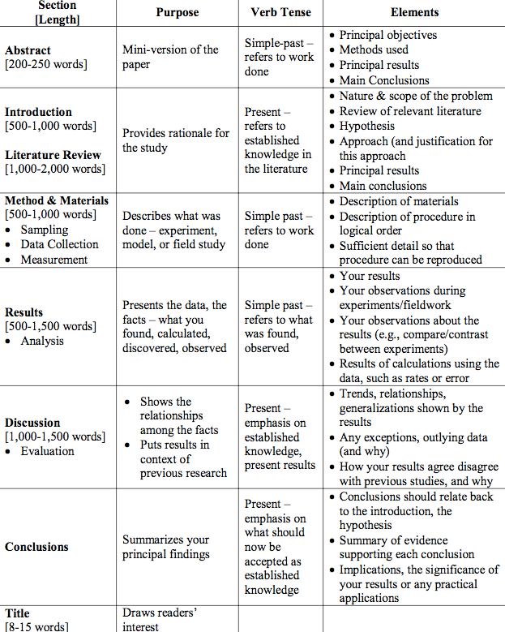
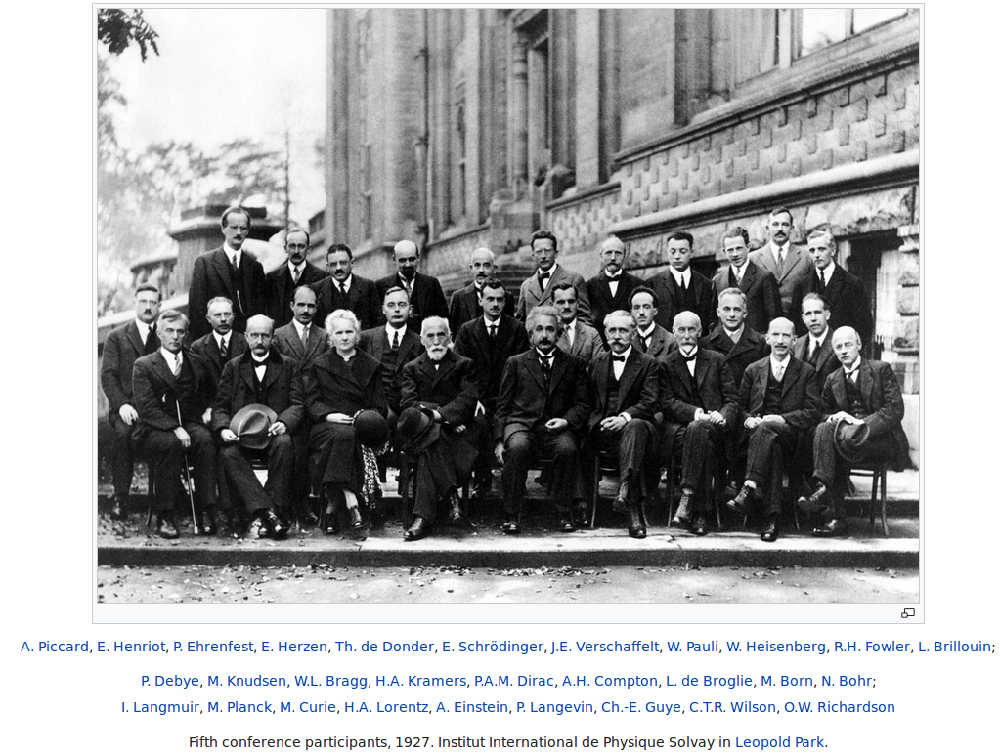
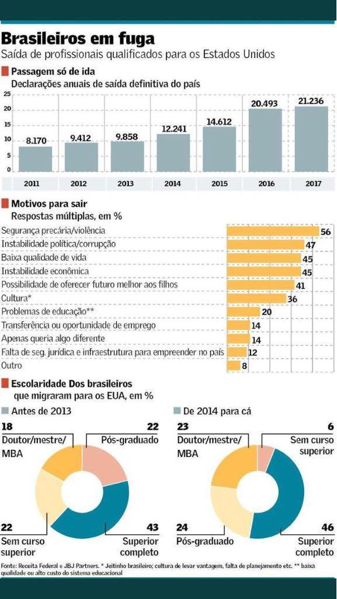
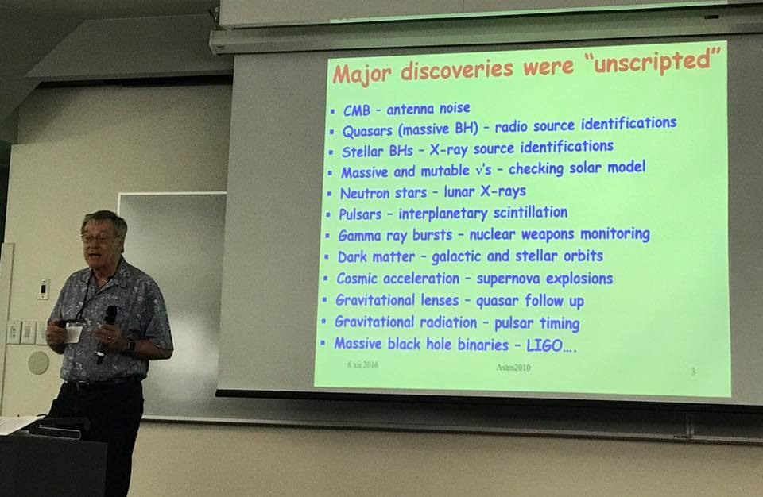

Doing Science
**************************
.. contents:: Table of contents

Seminars
==========
- On average, each word+space has ~7 chars (Portuguese).
- Titles: Less than 15 words == 100 chars.
- Abstracts: Less than 200 words == 1400 chars.

Writing tips
==============
- Scientists publish IDEAS. Keep that in mind.

- People love *stories*. This could be a good way of writing a motivational letter, for example.

- Avoid:
    - "modern": In most of cases you are trying to say "contemporary". 
    - "despite": In most of cases you are trying to say "although".
    - "due to": In most of cases you are trying to say "owing to" ("due to" has the sense of "attributable to")

    "Due to" means "caused by", however, "Owing to" means "because of" and it comes always at the beginning of the sentence. Besides "owing to" as a result or consequence of something.

        - Owing to illness, he missed the exam. (because of illness etc.)
        - His absence was due to illness. (His absence was caused by...)

- Avoid qualitative expressions like "it is very important". Write HOW it is important.

- `Eight listening-research findings <https://gianfrancoconti.wordpress.com/2017/08/15/eight-listening-research-findings-every-teacher-should-be-aware-of-and-their-implications-for-teaching-and-learning/>`_ every teacher should be aware of and their implications for teaching and learning

- `American and British English Spelling Differences <https://www.eslbuzz.com/american-and-british-english-spelling-differences/>`_

- `How language shapes the way we think -- Lera Boroditsky <https://www.youtube.com/watch?v=RKK7wGAYP6k>`_

- `Academia is built on exploitation. We must break this vicious circle <https://www.theguardian.com/higher-education-network/2018/may/18/academia-exploitation-university-mental-health-professors-plagiarism>`_

- `"I’ll work on it over the weekend": high workload and other pressures faced by early-career researchers <https://www.nature.com/articles/d41586-019-01914-z>`_

- `"Vermes de corda", fake e false news <http://revistaquestaodeciencia.com.br/questao-de-fato/2019/06/01/vermes-de-corda-nao-existem-logo-nao-causam-autismo>`_

Useful expressions
-------------------
- *Building on results* = aprofundamento de resultados, aprofundamento de resultados
    Building on results from the project, this study shows...

- It provides a useful organization of both observational signatures and theoretical predictions. 

- This paper aims to provide an initial classification of the observed properties...

- These goals are being achieved through large observing allocations at the X telescope.

- Although we consider..., two noteworthy objects require a brief mention. 

- We present results from the photometric monitoring of ...

- ... it is well short of the level required for the significant episodes to occur. 

- In this paper we argue that...

- The present paper develops a new model for this feature...

- I am **in** a unique position.

- I'm on a trip.

- For what it's worth (FWIW): considering what limited worth this advice, opinion, or suggestion might have for you; Used to soften the presentation of unsolicited advice or information that may not be relevant (it may be useful information, it may not be, or perhaps differs in opinion from that of the recipients).

- It is about the same age as they are.

Definitions
===============
- **Theorem** is a (mathematical) statement that is proved using rigorous mathematical reasoning. Is usually reserved for the most important results or those with long or difficult proofs. A **proposition** is a *theorem* of no particular importance (a statement with a simple proof).

- A **lemma** is a "helping theorem", a proposition with little applicability except that it forms part of the proof of a larger theorem. 

- An **axiom** or **postulate** is a statement that is accepted without proof and regarded as fundamental to a subject. Historically, *axiom* was regarded as "self-evident", but nowadays they are used to describe the assumptions of the subject of study.

- A **definition** is also accepted without proof since it simply gives the meaning of a word or phrase in terms of known concepts.

- An unproven statement that is believed true is called a **conjecture** (or sometimes a **hypothesis**).

- A **corollary** is a proposition that follows with little proof from another *theorem* or *definition*. Also a *corollary* is used for a *theorem* restated for a more restricted special case. A **generalization** is a *theorem* which includes a previously proven *theorem* as a special case and hence as a *corollary*.

- A **rule** is a *theorem* that establishes a useful formula.

- An **algorithm** is a procedure or formula for solving a problem.

- An **identity** is an equality between two mathematical expressions.

- A **law** or a **principle** is a theorem that applies in a wide range of circumstances.

- A **paradox** is a statement that can be shown to be both true and false.

Source: https://en.wikipedia.org/w/index.php?title=Theorem&oldid=684857654
 
.. figure:: ../figs/doing_sci-lawtheory.jpg
    :align: center

- Competências e Habilidades no ensino: o que são e como aplicá-las? https://www.somospar.com.br/competencias-e-habilidades/

Doing science
==============

.. figure:: ../figs/doing-sci_phys-color.jpg
    :align: center
    :width: 840 px

.. figure:: ../figs/doing-sci_handwrite.png
    :align: center

.. figure:: ../figs/doing-sci_nunca-viu.png
    :align: center

.. figure:: ../figs/doing-sci_vocab.jpg
    :align: center

- `Restrict researchers to one paper a year, says UCL professor <https://www.timeshighereducation.com/news/restrict-researchers-one-paper-ayear-says-ucl-professor>`_

- `Success in academia is as much about grit as talent <https://trabalhounido.blogspot.com/2019/05/success-in-academia-is-as-much-about.html>`_: in favor of Epistemological anarchism from Paul Feyerabend?

- `The Role of Luck in Life Success Is Far Greater Than We Realized <https://getpocket.com/explore/item/the-role-of-luck-in-life-success-is-far-greater-than-we-realized?utm_source=pocket-newtab>`_.

- `Pesquisadores exploram pós-doutorandos estrangeiros nos EUA <http://www.diretodaciencia.com/2018/11/23/pesquisadores-exploram-pos-doutorandos-estrangeiros-nos-eua-afirma-estudo/>`_

- `The Scientific Paper Is Obsolete. Here's what's next <https://www.theatlantic.com/amp/article/556676/>`_

- `What the New Sokal Hoax Reveals About Academia <https://www.theatlantic.com/ideas/archive/2018/10/new-sokal-hoax/572212/>`_

- `Métricas responsáveis <http://revistapesquisa.fapesp.br/2018/08/20/metricas-responsaveis/>`_

- `Dossiê mostra marginalização do ensino de humanidades <https://jornal.usp.br/atualidades/dossie-mostra-marginalizacao-do-ensino-de-humanidades/>`_

- `“Faço pesquisa no Brasil por paixão. Se levasse em conta a razão, não faria, a frustração é muito grande” <https://brasil.elpais.com/brasil/2018/08/08/ciencia/1533762807_199045.html?rel=mas>`_

- `Os principais obstáculos ao desenvolvimento da ciência na América Latina por Moysés Nussenzveig. (PDF) <../static/doing-sci_moyses.pdf>`_

- `Como e por quem a pesquisa científica deve ser avaliada <https://jornal.usp.br/atualidades/como-e-por-quem-a-pesquisa-cientifica-deve-ser-avaliada/>`_

- `Código de Boas Práticas Científicas FAPESP (PDF) <../static/doing-sci_boas-praticas-FAPESP-2014.pdf>`_

- `A escola não pode ser uma empresa porque a lógica da educação não é a do mercado <https://www.revistaprosaversoearte.com/escola-nao-pode-ser-uma-empresa-porque-logica-da-educacao-nao-e-mercado-nuccio-ordine/>`_

- `A evasão no ensino superior brasileiro (PDF) <../static/doing-sci_evasao.pdf>`_

- `The psychological aspects of a well-known issue (PDF) <../static/doing-sci_leaveastro.pdf>`_

- `Repensar a Universidade (PDF) <../static/doing-sci_repensar-a-universidade.pdf>`_

- `Success in Astronomy? Some Surprising Strategies <https://astrobites.org/2017/10/27/success-in-astronomy-some-surprising-strategies/>`_

- `Por que os alunos pensam em deixar a USP? <http://jpress.jornalismojunior.com.br/2016/07/alunos-pensam-deixar-usp/>`_

- `CAPES envia carta ao MEC por cortes no Orçamento de 2019 <http://www.sbfisica.org.br/v1/home/index.php/pt/acontece/750-conselho-da-capes-envia-carta-ao-mec-por-cortes-no-orcamento-de-2019>`_

- `CNPq diz que verba para pagar bolsas de setembro acabou <https://www.otempo.com.br/capa/brasil/cnpq-diz-que-verba-para-pagar-bolsas-de-setembro-acabou-1.1504973>`_

- `Estudo encontra 999 beneficiários do Bolsa Família que conquistaram 1.288 medalhas em olimpíada de matemática <https://g1.globo.com/educacao/noticia/2018/08/01/estudo-encontra-999-beneficiarios-do-bolsa-familia-que-conquistaram-1288-medalhas-em-olimpiada-de-matematica.ghtml>`_

- `Os problemas da USP são estruturais <https://jornalggn.com.br/noticia/os-problemas-da-usp-sao-estruturais-nao-de-falta-de-recursos-por-luis-nassif>`_

- `Não existe ciência exata (e vamos combinar que todas são humanas...) <http://cienciahoje.org.br/artigo/nao-existe-ciencia-exata-e-vamos-combinar-que-todas-sao-humanas/>`_

- `Done is better than perfect: overcoming PhD perfectionism <blogs.nature.com/naturejobs/2018/07/09/done-is-better-than-perfect-overcoming-phd-perfectionism>`_

- `Why it is not a 'failure' to leave academia <https://www.nature.com/articles/d41586-018-05838-y>`_

- `Livro investiga os três modelos mais influentes de educação superior <http://agencia.fapesp.br/livro_investiga_os_tres_modelos_mais_influentes_de_educacao_superior/27840/>`_

- `Alckmin critica Fapesp por pesquisas 'sem utilidade prática' <https://www1.folha.uol.com.br/ciencia/2016/04/1765028-alckmin-critica-fapesp-por-pesquisas-sem-utilidade-pratica.shtml>`_

- `Fapesp responde críticas de Alckmin sobre pesquisas "sem utilidade prática" <https://jornalggn.com.br/noticia/fapesp-responde-criticas-de-alckmin-sobre-pesquisas-sem-utilidade-pratica>`_

- `É preciso acabar com o formato das aulas de 50 minutos <https://brasil.elpais.com/brasil/2017/02/17/economia/1487331225_284546.html?id_externo_rsoc=FB_CC>`_ 

- `O doutorado é prejudicial à saúde mental <https://brasil.elpais.com/brasil/2018/03/15/ciencia/1521113964_993420.html?id_externo_rsoc=FB_BR_CM>`_

- `Suspensão do Brasil de consórcio astronômico reflete falta de política para ciência <https://oglobo.globo.com/sociedade/ciencia/suspensao-do-brasil-de-consorcio-astronomico-reflete-falta-de-politica-para-ciencia-22486965?utm_source=Twitter&utm_medium=Social&utm_campaign=compartilhar>`_

- `Educação para o Futuro <https://www.youtube.com/watch?v=B_x8EccxJjU&feature=youtu.be>`_

- `'Still working': Astronomers explain why they don't publish <http://www.sciencemag.org/news/2018/02/still-working-astronomers-explain-why-they-don-t-publish?utm_source=sciencemagazine&utm_medium=facebook-text&utm_campaign=dontpublish-17906>`_

- `Crise na ciência não se deve apenas à falta de recursos, avaliam cientistas <http://agencia.fapesp.br/crise_na_ciencia_nao_se_deve_apenas_a_falta_de_recursos_avaliam_cientistas/27103/>`_

.. figure:: ../figs/doing-sci_comoaprendemos.jpg

- `Universidade particular no Brasil não produz conhecimento <http://cartacampinas.com.br/2018/01/xrelatorio-internacional-mostra-que-universidade-particular-no-brasil-nao-produzem-conhecimento/>`_

- `Hate journal impact factors? New study gives you one more reason <http://www.sciencemag.org/news/2016/07/hate-journal-impact-factors-new-study-gives-you-one-more-reason?utm_source=sciencemagazine&utm_medium=facebook-text&utm_campaign=impactfactor-5531>`_

- `Capes descredencia cursos em universidades de ponta em 2018 <http://www.cartaeducacao.com.br/reportagens/capes-descredencia-cursos-em-universidades-de-ponta-2/>`_

- `Por que a filosofia é tão importante no ensino da ciência <https://www.nexojornal.com.br/externo/2017/11/19/Por-que-a-filosofia-%C3%A9-t%C3%A3o-importante-no-ensino-da-ci%C3%AAncia?utm_source=socialbttns&utm_medium=article_share&utm_campaign=self>`_

- `7 lies the academic world keeps telling you <https://www.linkedin.com/pulse/7-lies-academic-world-keeps-telling-you-mariana-cerdeira>`_

- `Pesquisadores precisam contrabandear material científico para preservar o que restou da ciência no país <https://revistatrip.uol.com.br/trip/sidarta-ribeiro-lygia-da-veiga-pereira-stevens-rehen-e-outros-pesquisadores-precisam-contrabandear-material-cientifico-para-preservar-o-que-restou-da-ciencia-no-pais>`_

- `Teses valorizam mais referências que argumentação <http://jornal.usp.br/universidade/teses-privilegiam-referencias-bibliograficas-em-detrimento-da-narracao/>`_

- `Backreaction: How Popper killed Particle Physics <http://backreaction.blogspot.com.br/2017/11/how-popper-killed-particle-physics.html?m=1>`_

- `What comes after a Ph.D.? Check out the data <http://www.sciencemag.org/careers/2017/07/what-comes-after-phd-check-out-data?utm_source=sciencemagazine&utm_medium=facebook-text&utm_campaign=whatcomesnext-14321>`_

- `Research is Hard <https://astrobites.org/2017/11/10/research-is-hard/>`_

- `History: Science and the Reformation <http://www.nature.com/nature/journal/v550/n7677/full/550454a.html?WT.mc_id=FBK_NatureNews&sf126572128=1>`_

- `Undermining your conclusion <https://schimelwritingscience.wordpress.com/2017/10/29/a-different-solution-to-example-9-9-undermining-your-conclusion/>`_

- `Por que nós doutorandos nos suicidamos? <https://medium.com/@MariliaMoscou/por-que-n%C3%B3s-doutorandos-nos-suicidamos-b694782f1c9a>`_

- `Swiss university dissolves astronomy institute after misconduct allegations <http://www.sciencemag.org/news/2017/10/swiss-university-dissolves-astronomy-institute-after-misconduct-allegations>`_

- `The Dark Side of Academia: Abuse, Power Games and Harassment <https://jobseachjournal.wordpress.com/2017/10/25/the-dark-side-of-academia-abuse-power-games-and-harassment/>`_

- `Cortes na ciência geram êxodo de cérebros, congelam pesquisas e vão punir Brasil por décadas, diz presidente da academia <http://www.bbc.com/portuguese/brasil-40504128>`_

- `Os seis conselhos de George Orwell para escrever melhor <https://brasil.elpais.com/brasil/2017/03/01/cultura/1488369509_805958.html?id_externo_rsoc=fb_BR_CM>`_

- `O Nobel que o Brasil ganhou e ninguém sabia <http://www.gazetadopovo.com.br/educacao/o-nobel-que-o-brasil-ganhou-e-ninguem-sabia-78pavf4xstt2d1pggqw16c5lj?utm_source=facebook&utm_medium=cpc&utm_campaign=gazeta-do-povo&utm_content=11-10-nobel>`_

- `The new phase of Bruno Latour <http://www.sciencemag.org/news/2017/10/latour-qa>`_

- `The true story of Stronzo Bestiale (and other scientific jokes) <https://www.parolacce.org/2014/10/05/the-true-story-of-stronzo-bestiale/>`_

- `Investimento privado em pesquisa e desenvolvimento não é a solução <https://www.nexojornal.com.br/ensaio/2017/Investimento-privado-em-pesquisa-e-desenvolvimento-n%C3%A3o-%C3%A9-a-solu%C3%A7%C3%A3o>`_

- `We hail individual geniuses, but success in science comes through collaboration <https://www.theguardian.com/commentisfree/2017/sep/30/we-hail-individual-geniuses-success-in-science-collaboration-nobel-prize?CMP=Share_iOSApp_Other>`_

- `Academia - Um Sistema de Interesses <https://youtu.be/QOSEFDGOq-0?t=1h50m22s>`_

- `Good data are not enough for Science <http://www.nature.com/news/good-data-are-not-enough-1.20906>`_

- `Um exército de Doutores desempregados <www.brasilpost.com.br/hugo-fernandesferreira/doutores-desemprego_b_9316594.html?ncid=engmodushpmg00000003>`_

- `Clinical trials revolution could change the future of medical research <https://amp.theguardian.com/science/head-quarters/2017/aug/24/clinical-trials-revolution-could-change-the-future-of-medical-research>`_

- `Facts, beliefs, and identity: The seeds of science skepticism <https://phys.org/news/2017-01-facts-beliefs-identity-seeds-science.html>`_

- `Como aumentar o impacto de artigos científicos <http://agencia.fapesp.br/como_aumentar_o_impacto_de_artigos_cientificos_/26143/>`_

- `There's an awful cost to getting a PhD that no one talks about <https://qz.com/547641/theres-an-awful-cost-to-getting-a-phd-that-no-one-talks-about/>`_

- `Ciência vive uma epidemia de estudos inúteis <http://brasil.elpais.com/brasil/2017/01/10/internacional/1484073680_523691.html?id_externo_rsoc=FB_CC>`_

- `Estudo não aumenta eficiência do trabalho no Brasil, diz pesquisa <http://trabalhounido.blogspot.com.br/2017/01/estudo-nao-aumenta-eficiencia-do.html>`_

- `Why Professors Are Writing Crap That Nobody Reads <http://www.intellectualtakeout.org/blog/why-professors-are-writing-crap-nobody-reads>`_

- `Impact of Declining Proposal Success Rates on Scientific Productivity <http://arxiv.org/abs/1510.01647>`_

- `Survey of software use in astronomy <http://arxiv.org/pdf/1507.03989v1.pdf>`_

- `Downloads, Citations, and Positional Effects in the arXiv <http://scholarlykitchen.sspnet.org/2009/07/29/arxiv-position-effects/>`_

- `Unconscious bias <https://implicit.harvard.edu/implicit/takeatest.html>`_

- `Job crisis in astronomy <http://adsabs.harvard.edu/abs/2015arXiv151202223C>`_

- `Academics Admit Feeling Pressure To Embellish Possible Impact Of Research <http://www.iflscience.com/editors-blog/academics-admit-feeling-pressure-embellish-possible-impact-research>`_

- What Google Learned From Its Quest to Build the Perfect Team
    `google_perfect_team_comments-Moser.pdf <../static/google_perfect_team_comments-Moser.pdf>`_ 

- `Why Do We Procrastinate? (SciShow) <https://www.youtube.com/watch?v=pKyHX0zqynk>`_

- `Precisamos falar sobre a vaidade na vida acadêmica <http://www.cartacapital.com.br/sociedade/precisamos-falar-sobre-a-vaidade-na-vida-academica>`_

- `Is science realiable? (SciShow) <https://youtu.be/VcgO2v3JjCU>`_

- `Europe announces that all scientific papers should be free by 2020 <http://www.sciencealert.com/europe-announces-that-all-scientific-articles-should-be-freely-accessible-by-2020>`_

- `Análise sistêmica na academia <https://youtu.be/QOSEFDGOq-0?t=1h50m24s>`_
    
- `The Worst Nobel Prize Ever Awarded (SciShow) <https://www.youtube.com/watch?v=StrsvKSAbT8>`_

- `The Psychology of Trolling <https://www.youtube.com/watch?v=5gqHTlBp6iY>`_

- `Young researchers thrive in life after academia` <http://go.nature.com/2dwztqC>`_

- `Mystery deportation of particle physicist leads to swell of protest <http://www.nature.com/news/mystery-deportation-of-particle-physicist-leads-to-swell-of-protest-1.20587>`_

.. figure:: ../figs/doing_sci_citacoes.jpg
    :width: 800 px

- `Where science and nonsense collide <http://www.nature.com/news/where-science-and-nonsense-collide-1.21266>`_

- `CNPq e Organizações Sociais começam 2017 com orçamento sem lastro <http://ciencia.estadao.com.br/blogs/herton-escobar/cnpq-e-organizacoes-sociais-comecam-2017-com-orcamento-sem-lastro/>`_

- `A verdade matemática <http://cultura.estadao.com.br/blogs/estado-da-arte/a-verdade-e-a-mesma-em-cambridge-e-em-madras-dois-olhares-sobre-a-matematica-2/>`_

- Os custos da corrupção e da crise afetam não só economicamente nossa sociedade. Decisões equivocadas criam obstáculos sérios para o futuro da inovação e da ciência e também para a convivência social. É preciso recorrer aos valores  da integridade, da ética, da solidariedade e do respeito à alteridade, para recompor o tecido social. Educação e comunicação serão fundamentais nessa atividade. E assim também o papel do professor e do cientista. http://portal.if.usp.br/ifusp/pt-br/evento/coloquio-do-ifusp-com-o-dr-belisario-dos-santos-junior

- `Ensino de homeopatia veterinária é deficiente, afirma pesquisadora <http://jornal.usp.br/ciencias/ciencias-da-saude/ensino-de-homeopatia-veterinaria-e-deficiente-afirma-pesquisadora/>`_

- `A homeopatia é uma farsa <https://jornal.usp.br/artigos/a-homeopatia-e-uma-farsa-criminosa/>`_

- `What I learned as a hired consultant to autodidact physicists <https://aeon.co/ideas/what-i-learned-as-a-hired-consultant-for-autodidact-physicists>`_

- `Ensino, Domesticação e Desigualdade <http://rogeriocerqueiraleite.com.br/ensino-domesticacao-e-desigualdade/>`_

- `MEC reconhece centenas de programas de pós-graduação numa tacada só <http://www.diretodaciencia.com/2017/05/23/mec-reconhece-centenas-de-programas-de-pos-graduacao/>`_

- `Êxodo científico impede o país de superar suas crises <http://www.otempo.com.br/interessa/%C3%AAxodo-cient%C3%ADfico-impede-o-pa%C3%ADs-de-superar-suas-crises-1.1303881>`_

- `Depoimento Ulisses Capozzoli <http://www.fiocruz.br/brasiliana/cgi/cgilua.exe/sys/start.htm?infoid=90&sid=31>`_

- `Competitiveness at school may not yield the best exam results <http://www.economist.com/blogs/graphicdetail/2017/04/daily-chart-15>`_

-  `It's time for academics to take back control of research journals <https://www.theguardian.com/higher-education-network/2017/may/25/its-time-for-academics-to-take-back-control-of-research-journals?CMP=share_btn_fb>`_

- `Se tudo der certo, o Brasil será da molecada que trabalha <http://super.abril.com.br/blog/alexandre-versignassi/se-tudo-der-certo-o-brasil-sera-da-molecada-que-trabalha/>`_

- `'Nunca me sonharam' expõe realidades e utopias de alunos no ensino médio do país <http://www.redebrasilatual.com.br/entretenimento/2017/06/nunca-me-sonharam-expoe-realidades-e-utopias-do-ensino-medio-do-opais>`_

- `The Role of Gender in Asking Questions <https://astrobites.org/2017/06/09/the-role-of-gender-in-asking-questions/>`_

- `O que esperar e o que não esperar de um orientador <http://pesquisatec.com/new-blog/2013/5/31/o-que-esperar-e-o-que-no-esperar-de-um-orientador>`_

- `O artista paga alto preço por levar uma vida não convencional <http://zh.clicrbs.com.br/rs/entretenimento/noticia/2016/06/vitor-ramil-o-artista-paga-alto-preco-por-levar-uma-vida-nao-convencional-5825352.html>`_

- `Nova revisão invalida milhares de estudos sobre o cérebro <http://brasil.elpais.com/brasil/2016/07/26/ciencia/1469532340_615895.html?id_externo_rsoc=FB_CC>`_

- `Experiência encerrada [Balanço do Ciências sem Fronteiras] <http://revistapesquisa.fapesp.br/2017/06/19/experiencia-encerrada/>`_

- `Nunca se escreveu tanto, tão errado e se interpretou tão mal <https://www1.folha.uol.com.br/empreendedorsocial/2018/07/nunca-se-escreveu-tanto-tao-errado-e-se-interpretou-tao-mal.shtml>`_

- `Querido Observatório Nacional (ON): o seu curso EAD sobre Sistema Solar tá um tanto errado <https://medium.com/ci%C3%AAncia-descomplicada/querido-observat%C3%B3rio-nacional-on-o-seu-curso-ead-sobre-sistema-solar-t%C3%A1-um-tanto-errado-c651c273a331>`_

- `O Racismo Científico - A Falsa Medida do Homem <https://www.geledes.org.br/o-racismo-cientifico-falsa-medida-homem/#gs.cTIVFwQ>`_

- `Fez doutorado? Vêm aí as incertezas do pós-graduado <http://blogs.oglobo.globo.com/na-base-dos-dados/post/fez-doutorado-vem-ai-incertezas-do-pos-graduado.html?utm_source=Facebook&utm_medium=Social&utm_campaign=O+Globo>`_

- `Is the staggeringly profitable business of scientific publishing bad for science?  <https://www.theguardian.com/science/2017/jun/27/profitable-business-scientific-publishing-bad-for-science>`_

- `Why I left physics for economics <https://www.theguardian.com/science/life-and-physics/2017/jun/22/why-i-left-physics-for-economics?CMP=share_btn_fb>`_

- `Ensino de Ciências dá capacidade de análise crítica <http://jornal.usp.br/radio-usp/radioagencia-usp/ensino-de-ciencias-da-capacidade-de-analise-critica/>`_

- `O que todo calouro deveria saber antes de ingressar na UTFPR <http://hpc.ct.utfpr.edu.br/node/35>`_

- `Why I left academia <https://www.allisonharbin.com/post-phd/why-i-left-academia-part-1>`_

- `The human cost of the pressures of postdoctoral research <https://www.theguardian.com/science/head-quarters/2017/aug/10/the-human-cost-of-the-pressures-of-postdoctoral-research?CMP=share_btn_fb>`_

- `O que aconteceu com as mulheres na ciência da computação? <https://universoracionalista.org/o-que-aconteceu-com-as-mulheres-na-ciencia-da-computacao/>`_

- `O que você precisa saber sobre a pós-graduação no Brasil <http://flip.it/nLE.z4>`_

- `Why Men Don’t Believe the Data on Gender Bias in Science <https://www.wired.com/story/why-men-dont-believe-the-data-on-gender-bias-in-science/>`_

- `How do emotions affect productivity? <https://www.atlassian.com/blog/apps/new-research-emotional-intelligence-in-the-workplace>`_

- `Software citations (AAS policy) <http://journals.aas.org/policy/software.html>`_

- `'Thought Leader’ Gives Talk on 'Thought Leadership' <https://www.youtube.com/watch?v=_ZBKX-6Gz6A>`_

- `Duke's Scientific Writing Resource <https://cgi.duke.edu/web/sciwriting/index.php?action=lesson1>`_

- http://porvir.org/porfazer/usp-lanca-curso-online-sobre-producao-de-artigo-cientifico/20130806

- http://www.escritacientifica.com

- http://letramentoacademico.fflch.usp.br/

- `Library Genesis <http://gen.lib.rus.ec/>`_ is a scientific community targeting collection of books on natural science disciplines and engineering.

- `Sci-Hub <http://sci-hub.cc/>`_ is the first website in the world to provide mass & public access to research papers.

- `Riscos e benefícios da homeopatia <http://www.esquerda.net/artigo/riscos-e-benef%C3%ADcios-da-homeopatia/30934>`_

- `Why Most Published Research Findings Are False (Ioannidis, 2005) <https://journals.plos.org/plosmedicine/article?id=10.1371/journal.pmed.0020124>`_

Data tools
==================
Extracting data
-----------------
http://www.frantz.fi/software/g3data.php
    ``sudo apt-get install g3data``

http://arohatgi.info/WebPlotDigitizer/app/

Time series analysis
-----------------------
- `VARTOOLS <http://www.astro.princeton.edu/~jhartman/vartools.html>`_

- `Period04 <https://www.univie.ac.at/tops/Period04/>`_

Statistics
-----------
- `Ten Simple Rules for Effective Statistical Practice <http://journals.plos.org/ploscompbiol/article?id=10.1371%2Fjournal.pcbi.1004961>`_

3D plots and visualization
------------------------------
- `Blender3D <https://www.blender.org>`_
- `POV-Ray <http://www.povray.org/>`_
- `ParaView <http://www.paraview.org/>`_

Vocabulary
============
- Criticality: When a nuclear chain reaction in a mass of fissile material is self-sustaining, the mass is said to be in a critical state in which there is no increase or decrease in power.
- Demon core: a mass of plutonium that was involved in two criticality accidents.
- Faster-than-light speed: Gran Sasso neutrinos measurements. See https://en.wikipedia.org/wiki/CERN_Neutrinos_to_Gran_Sasso
- Fat Man: codename for the second atomic bomb detonated over Japan on 9 August 1945 (Nagasaki).
- Fermi problem: order of magnitude investigation of problems.
- Frame-dragging effect: measurement by Gravity Probe B satellite. See https://en.wikipedia.org/wiki/Gravity_Probe_B
- Little boy: codename for the first atomic bomb detonated over Japan on 6 August 1945 (Hiroshima).
- Trinity test: the first detonation of a nuclear weapon.
- `Einstein refrigerator <https://en.wikipedia.org/wiki/Einstein_refrigerator>`_
- `Milankovitch cycles <https://en.wikipedia.org/wiki/Milankovitch_cycles>`_
- `Duga radar (Russian Woodpecker at Chernobyl) <https://en.wikipedia.org/wiki/Duga_radar>`_
- `AeroVironment/DARPA Nano Hummingbird UAV flying  <https://www.youtube.com/watch?v=a8ZbtZqH6Io>`_
- `Semi-Automatic Ground Environment <https://en.wikipedia.org/wiki/Semi-Automatic_Ground_Environment>`_

Stories
==========
- `The rescue to Salyut 7 <https://arstechnica.com/science/2014/09/the-little-known-soviet-mission-to-rescue-a-dead-space-station/>`_

Movies
=========
- Fat Man and Little Boy (1989)
- The Great Global Warming Swindle (?)
- Feynman and the Challenger (2013)
- `My YouTube playlist <https://www.youtube.com/playlist?list=PLmw4hG7QKEw_mJ4WXnEpKcTd4M7cF8Ipp>`_

Publicação de Patentes
====================================
por Henri Suzuki 22 e 23/07/2019

Gerais
--------
"Patrocínio" da agência USP de notícias.

Nos formamos na graduação e na pós se termos visto sequer uma única patente, mesmo na USP.

Uma patente pode ter mais de uma classificação.

Para evitar conflito de interesses, não se deve convidar "patenteadores" externos à instituição. 

Nunca divulgar patentes antes do depósito formal.

Patentiabilidade = novidade / ausência de anterioridade.

Processo
---------
- Pede-se a patente. Nos EUA, processo ganha código YYYY/NUMBER; outros, A###...
- Fica em sigilo (*se aceito*) por 12 meses
- Se aceito, é publicado com código [US N,NNN,NNN].
- Não existe "patente internacional". O que existe é o PCT = Patent Cooperation Treaty. Patentes sob o PCT ganham código WO###...

Descobrir classificação de patentes de interesse
--------------------------------------------------
Exemplo: "Medicianal plant extract" -- Área de fitoterápicos. Consulta mostra facilmente que chineses, japoneses e coreanos dominam as patentes. 

É possível montar uma "apostila" de patentes a partir de buscas do Google > formato CSV > Algo da área/não é "busca de anterioridade"

Exemplo 2: Canudo biodegradável ["feito de mandioca"]. Não procurar por "canudo", mas "materiais" feitos de mandioca...

Há outras ferramentas (Patent scope...). Porém, Google é a mais simples e padrão. Quem não usa o Google, não consegue usar as outras.

Contexto de Patentes
-----------------------
Patente é só um tipo de Apropriação Intelectual. Há outros, como Direitos Autorais, Propriedade Industrial, etc. É importante conhecer diferenças e adequar o projeto. 

Exemplo: Direitos Autorais. Programas/Software, Manuais, Artigos Científicos. Não depende de registro formal. Válido até 70 anos após a morte do último co-criador. 70 anos é o direito material ($), porém o direito moral (reconhecimento da autoria) não expira.

Exemplo: Propriedade Industrial e Patentes dependem de depósito formal.

Exemplo: Marcas. Identidade de produtos e de empresas num dado segmento de mercado específico (objetivo: distintividade). Não pode ter funcionalidade associada. No Brasil, é somente visual, inclusive 3D. Nos EUA, pode ser sonora (exemplo: escapamento da Harley-Davison). Marca não expira nunca, e depende de depósito formal. 

Não existe a "patente da marca". Marca é somente registrada. Patente é a solução de um problema técnico.

Boa referência: cartilha da propriedade privada, OAB-RS 2015.

Site: "Ten Types of Innovation" -- https://www.doblin.com/ten-types/

    #. Profit Model
    #. Network
    #. Structure
    #. Process
    #. Product Performance
    #. Product System
    #. Service
    #. Channel
    #. Brand
    #. Customer engagement

Classificação: 
    - 1 a 4: Configuração
    - 5 e 6: Oferta
    - 7 a 10: Experiência

#4 a #6 são as mais relevantes para patentes. #5 Confunde-se como a única inovação. Em geral, é a mais facilmente copiada pelos concorrentes.

Indústria farmacêutica é uma das que mais dependem de patentes. 

Serviços ==  modelo de negócios não depende de patente. Não gaste $ com patentes, estude! Grande parte das patentes estão em domínio público!

"Business Model Canvas" == ferramenta visual para organizar ideias. 
"Personal Canvas" == de pessoa. 
"Lean Canvas" == para negócios nascentes. Diferenciais competititos == "unfair advantages".

Canvas == proposta de valor -- resolver um problemade maneira única.

R$ 70 custos iniciais de pedido de patente. "Pedido" não é uma métrica, pois pode-ser depositar "qualquer coisa". 

USP recebeu R$ 2 milhões em Royalties (por 14 anos?). Maior patente da USP é da farmácia, Redigida por Henri Suzuki.

Lei de Propriedade Industrial -- Lei no. 9279/96. Toda Universidade/Instituição de Pesquisa deve ter uma "agência de inovação". Todos os pedidos de patentes devem vir por esta agência *de quaisquer pessoas ligadas a instituição*, inclusive alunos.

Patente é por definição um título de propriedade para *impedir terceiros de explorarem sua invenção*.

Batalhas judiciais
-------------------
O custo inicial de uma batalha judicial de patentes nos EUA pode facilmente chegar a US$ 2 milhões. 

Non-practicing entities (NPEs) are people who hold patents for a product or process without any intention of developing it. A type of NPE is patent trolls. These trolls gather a large number of patents and plan patent infringements suits. The suits go against individuals and companies that illegally used some of the patent's elements. To differentiate between trolls and NPE, the Federal Trade Commission uses the term patent assertion entities (PAEs) to describe trolls.

NPE são entidades especializadas nos processos de patentes, muito usadas por pequenos patenteadores.

Exemplo: inventor do "bina" == não deu em nada, em virtude da invalidação da redação das patentes.

Dinâmica: navios naufragados 
---------------------------------
- com bolinhas de "ping-pong"
- Telas ao redor do navio
- Sucção e válvulas
- "Bicarbonato" = capa mais densa que a água, e infla em contato com a água
- Balão p/ fazer as bolinhas entrarem

1 atm na praia + 1 atm a cada 10 metros de profundidade.

"Bomba peristáltica" = US 3,332,385.

Como fazer as buscas (e depósito!): "Aparato para trazer à superfície"... "Meios para propelir"... "I claim"... **reinvindicação é tudo**.

É considerado inovação (sujeito a patente) dependendo do estado da técnica à epoca (julgamento **subjetivo**). Julgamento inclui o grau de generalidade do "claim".

"Patent citation": quem a patent cita. "Cited by": quem citou a patente.

Exemplo busca: "Building Block? 5D Bottle Cap?", onde "5D" corresponde a 5 palavras de distância. Há a função "More like this"...

Patente é uma "nova atividade inventiva com aplicação industrial". Consultoria do processo de redação/depósito custa R$ 4000/dia, ou R$ 500/hora (no início de 2019). Como referência, um post-doc FAPESP recebe R$ 45/hora.

Resumo: o objetivo da patente é impedir terceiros. O direito de excluir terceiros não dá direito de explorar. Por exemplo, invenções de terceiros podem impedir de explorar. 

O uso da patente é livre para pesquisas e experimentos. A proibição é de exploração comercial, incluindo testes clínicos. 

Para se evitar engenharia reversa, usa-se "contrato de fornecimento", que não é patente.

Até o fim de 2019, o responsável pelo registro de patentes no Brasil era o INPI -- Instituto Nacional da Propriedade Industrial. Em dezembro de 2019, o governo propôs a fusão do INPI com a Agência Brasileira de Desenvolvimento Industrial (ABDI), que se tornaria Agência Brasileira de Desenvolvimento e Propriedade Industrial (ABDPI).

"Patente de invenção": 20 anos após o depósito, ou pelo menos 10 anos após a concessão.

Modelo de utilidade (objeto de uso prático): "manipulável" -- 15 (anos?) depósito / 7 (anos?) concessão.

Exemplo de "segredo industrial": fórmula da Coca-Cola.

"Patent it yourself": bom livro de referência.

"Prophetic patent example": se um exemplo da patente for localizada (por exemplo, na internet) esta se torna inválida ("patent unenforceable").

Como é e quanto custa o processo de patenteamento
----------------------------------------------------
Há publicações/taxas que precisam ser monitoradas e pagas **no prazo** determinado, com o risco do pedido de patente "morrer". Sugestão: cadastrar alarme no "Push INPI" (que as vezes falha) e contratar uma empresa especializada. Anuidade (patente?) ~R$ 150. Lá fora é bem mais caro.

Exame técnico/adequação do pedido == 4-5 anos depois do depósito. Exemplo: "prova de que o chá verde é mesmo inseticida".

Nulidade administrativa ou judicial == a patente pode ser anulada por pedido de terceiros. Se acontecer, é como se a patente nunca tivesse existido. 

Pagamento do PCT é de R$ 5000, até 12 meses após o depósito. USP não tem $$$. Então, custeio só com parcerias.

Se não pagar anuidade, a patente deixa de ser válida. 

A patente não precisa se concedida para ser vendida.

"Como se faz uma parceria"? **Antes** de depositar, encontrar a empresa interessada. 

Exemplos buscas
----------------
Orbit.com > log-in > easy search > A61K-036 > Show results

Select > graph analysis

EPxxx > patent europeia

Acrônimos:
    - EPO - European Patent Office
    - IPC - International Patent Classification
    - IPBI - Intelectual Property Business Inteligence
    - WIPO - World Intelectual Property Organization
    - CPC - Cooperative Patent Classification
    - Lapsed patent = patente abandonada

Scopus analytica > análise de publicações. Exemplo: "documents by funding sponsor".

DII = "Derwent Innovations Index", é como o Orbit, assinado pela CAPES (em meados em 2019). Grande banco de dados.

Bibliotecário hoje é um cientista da informação (eg., bibliotecário de referência).

SciFinder = Bando de dados de *química*. 

Orbit = $2000/ano 1 licença (ICB). $45.000/ano p/ campus.

Compendex Engineering Index (EI) = portal de engenharia. Desenho industrial tem database gratuito. "Free design database".

Materiais
------------
Guia Básico de Patentes - INPI = consulta

Resolução no.124 - Diretrizes = formatação = instrução normativa

Consiste de = *exatamente* (toda a lista de características). 

Compreende de = *incompleto* (lista de características).

*Descoberta* não é patenteável. Só o seu uso para resolução de um problema técnico. 

Exemplo: "Uber surge pricing".

Guias internacionais: National Patent Drafting Course (WIPO) -- Free of charge.

Encher de anterioridades facilita a visibilidade da patente. 

UCP - Universidade & Centro de Pesquisa -- 1/3 dos royalties vão para os pesquisadores. 

PPP - Patent Purchase Partnership.

"Cabe ao proprietário impedir o uso indevido da patente".

Segredo Industrial ou Desenho Industrial podem ser mais eficazes para proteção do projeto do que patente...

EPO - Case Law of the Boards of Appeal of the European Patent Office -- excelente referências históricas.

Livro Ivan Aller (Denis Barbosa?) -- Litígio de patentes.
