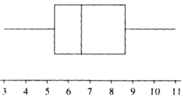
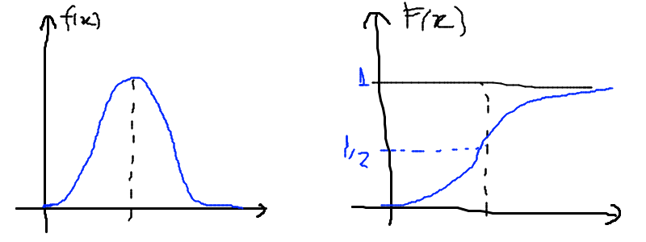
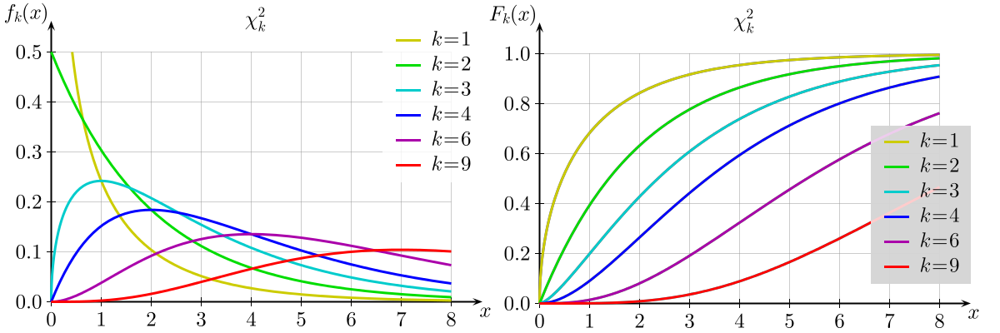

Notas em *estatística*
******************************

.. contents:: Índice

Lista de tópicos de referência
=================================

1. Delineamento experimental; 
2. População e amostra; 
3. Tabulação e apresentação de dados; 
4. Medidas de tendências centrais; 
5. Medidas de dispersão; 
6. Teste de hipótese; 
7. Regressão linear; 
8. Análise de variância; 
9. Correlação; 
10. Probabilidade.

Definições básicas
===================
*Estatística* é a disciplina que estuda a manipulação, análise, interpretação e apresentação de dados.

*Estatística descritiva*: extrai grandezas de um conjunto de variáveis. 

*Estatística inferencial*: infere grandezas para um todo (*população*) a partir da análise de uma parte (*amostra*).

O valor da uma variável de um elemento da amostra ou população é chamado de *observação*. Um conjunto de observações é chamado de conjunto de dados (*data set*).

Uma variável pode ser *qualitativa* ou *quantitativa*. As qualitativas podem ser nominais (p.e., homem ou mulher) ou ordinais (p.e., 1o., 2o., etc.). As quantitativas podem ser discretas (p.e., números inteiros) ou contínuas (números reais). 

*Classe* é um agrupamento dos valores de uma variável. Um *intervalo* (de valores) é um exemplo máximo de uma classe. 

*Densidade* de um agrupamento é definido por :math:`\Delta y/n_i` da classe, com *y* sendo o valor da variável e *n* o número de elementos das classe.

Uma *distribuição de freqüência* é um método de se agrupar dados em classes de modo a fornecer a quantidade (e/ou a percentagem) de dados em cada classe.

Uma *distribuição cumulativa de freqüências* (DCF) dá o número total de valores que caem abaixo do limite de certa classe numa distribuição de frequências. Também escrito como :math:`F(x)=P(x'<x)=n(x)/N`, onde n(x) é o número de observações menores ou iguais a *x*.
Propriedade: :math:`P(x_o\leq x<x_1)\equiv F(x_1)-F(x_0)`. Seja :math:`f(x)` a função densidade de probabilidade:

.. math::
    P(a\leq x<b)=\int_a^b f(x)dx=F(b)-F(a)

Uma distribuição cumulativa de freqüências pode ser representada graficamente por uma *ogiva*. Para construí-la representa-se os limites superiores das classes na abscissa e faz-se a altura dos pontos proporcionais à freqüência acumulada até esses limites.

*Resíduo* (*r*): valor do dado (*d*) menos o valor do modelo (*m*).

    *r = d - m*

Representações
-------------------
*Gráfico de dispersão* unidimensional:
Reta (horizontal) com indicação dos valores. Valores repetidos acumulam-se na vertical.

*Gráfico de ramo-e-folha*:
Gráfico onde, por exemplo, o valor da dezena define a classe e cada unidade dentro daquela dezena é indicada na classe.

*Histograma*:
Também conhecido como distribuição de frequências ou diagrama das frequências, é a representação gráfica, em colunas (retângulos), de um conjunto de dados previamente tabulado e dividido em classes **uniformes**. A base de cada retângulo representa uma classe e a altura de cada retângulo representa a quantidade ou frequência com que o valor dessa classe ocorreu no conjunto de dados.

A amplitude de classe :math:`\Delta` do histograma de modo a minimizar a maior distância entre o histograma e a densidade é:

.. math::
    \Delta=1.349\sigma\left(\frac{\log n}{n}\right)^{1/3}=d_q\left(\frac{\log n}{n}\right)

Onde :math:`\sigma` é um estimador do desvio padrão populacional. O número de classes *nc* do histograma será:

.. math::
    nc=\frac{x_{(n)}-x_{(1)}}{\Delta}

Medidas de tendência central
=============================
*Valor médio* ou *medidas de tendência central*: média, mediana e moda (população ou amostra).

.. math::
    \bar{x}\equiv \int_{x_0}^{x_f}xf(x)dx

A variância e o desvio padrão de um conjunto de dados mede a dispersão dos dados em torno de um valor médio. A variância de uma amostra de tamanho *n* é representada por :math:`S^2` e é dada por:

.. math::
    S^2=\frac{\sum(x-\bar{x})^2}{n-1}=\frac{\sum x^2-\left(\sum x\right)^2/n}{n-1}

A variância da população de tamanho *N* é representada por :math:`\sigma^2` e é dada por:

.. math::
    \sigma^2=\frac{\sum(x-\mu)^2}{N}=\frac{\sum x^2-\left(\sum x\right)^2/N}{N}

O desvio padrão é *S* para a amostra e :math:`\sigma` para a população. O desvio médio *dm* é definido como:

.. math::
    dm = \frac{\sum|x-\mu|}{N}

A mediana :math:`md = x_{(n+1)/2}` se n ímpar ou :math:`md = 0.5x_{n/2}+0.5x_{(n+1)/2}` se n par.

Medidas de tendência central para dados agrupados
----------------------------------------------------
A média de dados agrupados é:

.. math::
    \bar{x}=\sum xf/n

onde *x* representa a marca da classe (e.g., o centro do intervalo), *f* representa a frequência na classe, e :math:`n=\sum f`.

A variância para dados agrupados é:

.. math::
    S^2=\frac{\sum x^2f-\left(\sum xf\right)^2/n}{n-1}

Interpretações do desvio padrão
--------------------------------
Teorema de Chebyshev:
O teorema de Chebyshev fornece uma interpretação útil para o desvio padrão. O teorema de Chebyshev enuncia que a fração de dados de qualquer conjunto situada dentro de *k* desvios-padrões da média é **pelo menos**,  1-1/:math:`k^2`, onde *k* é um número maior do que 1. O teorema se aplicada tanto para amostras quanto populações.

Por exemplo, se :math:`k=2`, o teorema atesta que pelo menos 75% dos dados estarão entre :math:`\bar{x}-2S` and :math:`\bar{x}+2S`. De maneira análoga, para :math:`k=3`, o teorema atesta que pelo menos 89% dos dados estarão entre :math:`\bar{x}-3S` e :math:`\bar{x}+3S`.

Lei empírica ou Teorema Central do Limite (regra 68–95–99,7):
A lei empírica atesta que para um conjunto de dados tendo uma distribuição em forma de sino, aproximadamente 68% dos dados estarão à um desvio padrão da média, 95% estarão à dois desvios padrões e aproximadamente 99.7% estarão a três desvios padrões da média. A lei empírica aplica-se a (grandes) amostras ou populações.

Coeficiente de variação:
O coeficiente de cariação *CV* é igual a os desvio padrão dividido pela média. O resultado é geralmente multiplicado por 100 para expressar a porcentagem. É portanto:

Outras definições
------------------
O coeficiente de variação ẽ uma medida de variação relativa, enquanto que o desvio padrão é uma medida absoluta da variação.

.. math::
    CV = \frac{\mu}{\sigma}\times100\%

Índice *z*:
O índice *z* é o número de desvios padrões que uma dada observação *x* estã abaixo ou acima da média. Para uma amostra, o índice é:

.. math::
    z = \frac{x-\bar{x}}{S}

*Média aparada*:
média aparada a *p%* é a média calculada retirando-se os *p%* dos dados inferiores e superiores.

*Desvio mediano absoluto*:
calcula-se a mediana dos dados, depois todos os desvios absolutos da mediana e então o desvio (absoluto) mediano.

Medidas de posição
=====================
As medidas de posição são usadas para descrever a localização de uma observação particular em relação ao resto do conjunto dos dados (ordenados). Divisões comuns são os *percentis*, *decis* e *quartis*. Os percentis são valores que dividem os dados ordenados em 100 partes iguais. O *p-nésimo* percentil do conjunto é o valor no qual pelo menos *p* porcento das observações estão contidas naquele, ou num menor valor. 

Por exemplo, o número de observações em um conjunto menores do que 5.5 são 11. Onze dividido pelo total (45) é 0.244 e 0.244 multiplicado por 100 é 24.4%. Este porcento aredonda-se para 24. A quantidade 5.5. é o 24o. percentil e é expresso como  :math:`P_{24}=5.5`.

A associação entre percentis, decis e quartis é tal que vale a igualdade (que é a definição de mediana):

.. math::
    Median = P_{50} = D_5 = Q_2

O *intervalor interquantil*, designado por :math:`d_q` ou *IQR* (em inglês) é definido como:

.. math::
    d_q = IQR = Q_3 - Q_1 = 1.349\sigma

O intervalo interquantil mostra a dispersão da metade dos dados de valores intermediários, e não é afetadas por extremos no conjunto.

Quantis e simetria
--------------------
Quantis são quantidades definidas como a mediana, mas com distintos valores de *n*.

O *p-quantil* é definido por:

.. math::
    q(p) = \left\{ \begin{array}{l l}
    x_{(i)} & \quad \text{se }p=p_i=(i-0.5)/n, i=1,2,\ldots,n\\
    (1-f_i)x_{(i)}+f_i x_{(i+1)}    & \quad \text{se }p_i<p<p_{i+1}\\
    \end{array} \right.

Com :math:`f_i=(p-p_i)/(p_{i+1}-p_i)`. Ainda :math:`q(p)=x_{(1)}` se :math:`p<p_{(1)}` e :math:`q(p)=x_{(n)}` se :math:`p>p_{(n)}`.

*Instância interquantil* :math:`d_q=q_3-q_1=1.349\sigma`. 

.. math::
    F(Q(p))\geq p \equiv P(X\leq Q(p))

5 valores são importantes para avaliar a (as)simetria da distribuição de dados: :math:`x_{(1)},q_1,md,q_3,x_{(n)}`.

a. :math:`md-x_{(1)}\simeq x_{(n)}-md`
b. :math:`md-q_1\simeq q_3-md`
c. :math:`q_1-x_{(1)}\simeq x_{(n)}-q_3`
d. :math:`md-q_1` ou :math:`q_3-md\simeq 0.5*(q_3-q_1)`

Uma quantidade usada como medida de simetria é *A*:

..  math::
    A=\frac{(q_3-q_2)-(q_2-q_1)}{q_3-q_1}

Gráfico *caixa de bigodes* ou *box-and-whisker plot*
------------------------------------------------------
Um gráfico caixa de bigodes, algumas vezes denominado por *box plot*, é uma representação gráfica na qual uma caixa que extende-se de :math:`Q_1` a :math:`Q_3` e contém uma linha intermediária que corresponde à mediana dos dados. Linhas (chamadas de bigodes ou *whiskers*) em raras vezes ligam o :math:`Q_1` ao dado de menor valor (e :math:`Q_3` ao de maior), mas geralmente marcam a região além do referido quartil :math:`Q_i` até a 1.5 vezes a distância interquartil a partir do mesmo (:math:`L_i=Q_i\pm 1.5*d_q`).

Pontos além dos limites :math:`L_i` são chamados de *exteriores*. Se acreditamos que não devem pertencer a amostra, são chamados de *outliers*.
O intervalo entre os limites superior e inferior :math:`L_S-L_I` corresponde a 99,3% da distribuição normal.

Intervalos de confiança
=========================
O intervalo de confiança é tal que:

.. math::
    IC(\mu;\gamma)=]t_1,t_2[\equiv P(t_1<\mu<t_2)=\gamma

Se :math:`P(|\bar{x}-\mu|<1.96\sigma_\bar{x})=0.95`, onde :math:`\bar{x}` é o valor médio da amostra, o intervalo de confiança será :math:`]\bar{x}-1.96\sigma_\bar{x},\bar{x}+1.96\sigma_\bar{x}[`.
**Para** *n* **não muito grande,** a distribuição normal não pode ser usada, e deverá ser substituída pela **distribuição t de Student**. Escrevendo a dependência explícita com *n*:

.. math::
    IC(\mu;\gamma)=]\bar{x}-z(\gamma)\sigma_x,\bar{x}+z(\gamma)\sigma_x[

A amplitude do intervalo é :math:`2z(\gamma)\sigma/\sqrt{n}`, independente de :math:`\bar{x}`.

Probabilidades
================
A palavra probabilidade deriva do latim *probare* (provar ou testar). 
A ideia geral da probabilidade é frequentemente dividida em dois conceitos relacionados:

- *Probabilidade de frequência*, *probabilidade aleatória* ou *visão objetivista*, que representa uma série de eventos futuros cuja ocorrência é definida por alguns fenômenos físicos aleatórios. 
- *Probabilidade epistemológica*, *probabilidade Bayesiana* ou *visão subjetivista*, que representa nossas incertezas sobre proposições quando não se tem conhecimento completo das circunstâncias causativas. Tais proposições podem ser sobre eventos passados ou futuros.

É uma questão controversa se a probabilidade aleatória é redutível à probabilidade epistemológica.

Probabilidade condicional e independência
--------------------------------------------
*Probabilidade condicional* é chance de termos um evento *A* dado um fator *B*. 
Por exemplo, num dado curso tem-se 30 alunos, 20 dos quais mulheres. Qual a probabilidade *P* de que um aluno seja mulher?

    *P* (mulher|curso) = 2/3

Propriedades:

.. math::
    P(A|B)=\frac{P(A\cap B)}{P(B)}=\frac{P(A)\cdot P(B|A)}{P(B)}

Também conhecido por *regra do produto de probabilidades*. O último termo acima provém do Teorema de Bayes, comentado adiante.

.. math::
    \sum_i^N P_i(x_i)=1, P(\Omega)=1

Onde :math:`\Omega` é todo o espaço amostral.

Se :math:`P(A|B)=P(A)`, *A* é dito *independente* de *B*.

Dados os eventos *A* e *H*, diz *(re)união* (*OR* lógico) para :math:`A\cup H` e *intersecção* (*AND* lógico) para :math:`A\cap H` tal que:

.. math::
    P(A\cup H)=P(A)+P(H)-P(A\cap H)

Tem-se que :math:`P(A\cap H)=0` se *A* e *H* são eventos mutualmente exclusivos (p.e., homem ou mulher).

.. math::
    P(A\cap B \cap C)=P(A)P(B|A)P(C|A\cap B)

Teorema de Bayes
------------------
A probabilidade de ocorrência do evento :math:`C_i`, supondo-se a ocorrência do evento *A*, é dada por:

.. math::
    P(C_i|A)=\frac{P(C_i)P(A|C_i)}{\sum_{j=1}^n P(C_j)P(A|C_j)}

O termo :math:`P(C_i)` é chamado de *probabilidade a priori*. Os termos :math:`P(A|C_i)`, :math:`P(A|C_j)` são chamados de *verossimilhanças* e :math:`P(C_i|A)` é chamado de *probabilidade a posteriori*.

Cálculos de probabilidades a posteriori são chamados de inferências bayesianas. Antes de vermos um exemplo, definimos a probabilidade a posterior a partir de um e dois eventos :math:`B` e :math:`B_2`. Vamos indicar por :math:`A^c` o complementar de um evento qualquer :math:`A`, e teremos então:

.. math::
    P(A)+P(A^c)=1

    P(E|B)=\frac{P(E)P(B|E)}{P(E)P(B|E)+P(E^c)P(B|E^c)}

    P(E|B,B_2)=\frac{P(E|B)P(B_2|E,B)}{P(E|B)P(B_2|E,B)+P(E^c|B)P(B_2|E^c,B)}

Exemplo: A previsão da bolsa é 10% de chance para queda no dia seguinte :math:`P(E)=0.10`. Uma nova informação :math:`B` surge, de alta do dólar. A experiência passada diz que 20% das vezes a queda foi precedida no dia anterior por este tipo de notícia :math:`P(B|E)=0.20` e 5% das vezes houve alta com a notícia :math:`P(B|E^c)=0.05`.

.. math::
    P(E|B)=\frac{(0.1)(0.2)}{0.1(0.2)+0.9(0.05)}=0.31

A previsão de queda para o dia seguinte inicialmente em 10% é então atualizada para 31%.
Supondo uma nova informação relevante :math:`B_2`, como o Banco Central irá reduzir a taxa de juros, queremos saber qual será a previsão de queda com estas duas informações combinadas :math:`P(E|B,B_2)`. O histórico é de que com alta do dólar (:math:`B`) e redução da taxa de juros (:math:`B_2`) 10% das vezes houve queda na bolsa :math:`P(B_2|E,B)=0.10` e 60% houve aumento :math:`P(B_2|E^c,B)=0.60`.

.. math::
    P(E|B,B_2)=\frac{(0.31)(0.10)}{P(E|B)P(B_2|E,B)+P(E^c|B)P(B_2|E,B)}=0.07

A previsão de queda para o dia em 31% é então atualizada para 7%.

Sumário das Probabilidades
----------------------------
.. tabularcolumns.... |c|l|

=============== =============
Event 	        Probability
=============== =============
A               :math:`P(A)\in[0,1]\,`
não A 	        :math:`P(A^c)=1-P(A)\,`
A ou B 	        :math:`\begin{align} P(A\cup B) & = P(A)+P(B)-P(A\cap B) \\ P(A\cup B) & = P(A)+P(B) \qquad\mbox{if A and B are mutually exclusive} \end{align}`
A e B           :math:`\begin{align} P(A\cap B) & = P(A|B)P(B) = P(B|A)P(A)\\ P(A\cap B) & = P(A)P(B) \qquad\mbox{if A and B are independent} \end{align}`
A dado B        :math:`P(A \mid B) = \frac{P(A \cap B)}{P(B)} = \frac{P(B|A)P(A)}{P(B)} \,`
=============== =============

Variáveis aleatórias discretas
===============================
Uma variável aleatória é variável cujo resultado (valor) depende de fatores aleatórios.

Matematicamente, variável aleatória é uma função que associa elementos do espaço amostral a valores numéricos, ou seja, :math:`X: \Omega \to \mathbb{R}`.
A representação padrão é variáveis aleatórias por letras maiúsculas e suas ocorrências por letras minúsculas.

"Variável aleatória é um tipo de variável que pode assumir diferentes valores numéricos, definidos para cada evento de um espaço amostral :math:`\Omega`".

Distribuição uniforme
-----------------------
:math:`p(X)=cte`. A F(X) é uma reta, com valor 0 até :math:`x_0` e 1 a partir de :math:`x_f`.

Distribuição de Bernoulli
--------------------------
É uma variável binária, com:

.. math::
    F(X) = \left\{ \begin{array}{l l}
    0    & \quad \text{se }x<0\\
    1-p  & \quad \text{se }0\leq x\leq 1\\
    1    & \quad \text{se }x\geq1 \\
    \end{array} \right. 

Distribuição binomial
---------------------
*n* ensaios de Bernoulli geram *k* sucessos (e *n-k* fracassos). A probabilidade de tal sequência é :math:`p^k(1-p)^{n-k}`, e existem :math:`\binom{n}{k}=\frac{n!}{k!(n-k)!}` sequências, dados *n* e *k*.

A média é :math:`\bar{x}=np` e :math:`\sigma^2=np(1-p)`.

.. math::
    b(k;n,p)=P(X=k|n,p)=\binom{n}{k}p^k(1-p)^{n-k}

Distribuição hipergeométrica
-----------------------------
Adequada quando consideramos extrações **sem reposição**. Exemplo: *N* objetos, *r* dos quais são *A* e *N-r* são *B*. *n* elementos são escolhidos (sem reposição). Qual a probabilidade :math:`p_k` que esse grupo *n* contenha *k* elementos de *A*?

.. math::
    p_k\equiv\frac{\binom{r}{k}\binom{N-r}{n-k}}{\binom{N}{n}}

Os pares :math:`(k,p_k)` constituem a distribuição hipergeométrica.

Distribuição de Poisson
------------------------
Tomemos o caso binomial. Para *n* grande e *p* pequeno podemos aproximar o binômio por :math:`b(k; n,p)=\frac{e^{-np}(np)^k}{k!}=\frac{e^{-\lambda}(\lambda)^k}{k!}`.

Propriedade: :math:`\bar{x}=\sigma^2=\lambda`.

Exemplo clássico de Poisson é o decaimento radiativo. Se *p* é uma *taxa* no tempo, :math:`\lambda=\lambda't`, onde *t* tem as unidades de *p*.

Exemplo
^^^^^^^^^^
Considere um processo que têm uma taxa de 0.2 defeitos por unidade (de muitas). Qual a probabilidade de uma unidade qualquer apresentar:

a. dois defeitos?
b. um defeito?
c. zero defeito?

Neste caso, temos que :math:`X \sim \ \text{Poisson}(\lambda)` com :math:`\lambda=0.2`. Então:

a. :math:`\displaystyle\mathbb{P}(X=2)=\frac{e^{-0.2}(0.2)^2}{2!}=0.0164`;

b. :math:`\displaystyle\mathbb{P}(X=1)=\frac{e^{-0.2}(0.2)^1}{1!}=0.1637`;

c. :math:`\displaystyle\mathbb{P}(X=0)=\frac{e^{-0.2}(0.2)^0}{0!}=0.8187`.

Sumário das distribuições
--------------------------
.. |p11| replace:: :math:`\binom{n}{x}p^x(1-p)^{n-x},x=0,\ldots,n`
.. |p21| replace:: :math:`\frac{e^{-\lambda}\lambda^x}{x!},x=0,1,\ldots`
.. |p22| replace:: :math:`\lambda`
.. |p31| replace:: :math:`p(1-p)^{x-1},x=1,2,\ldots`
.. |p33| replace:: :math:`\frac{1}{p},\frac{(1-p)}{p^2}`
.. |p41| replace:: :math:`\frac{\binom{r}{k}\binom{N-r}{n-k}}{\binom{N}{n}},a\leq x\leq b`
.. |p42| replace:: :math:`N,r,n`
.. |p43| replace:: :math:`\frac{nr}{N},n\left(\frac{r}{N}\right)\left(1-\frac{r}{N}\right)\left(\frac{N-n}{N-1}\right)`

========== ============================ =========== ===========================
Modelo     *p(X=x)*                     Vars.       :math:`\bar{x}, \sigma^2`
========== ============================ =========== ===========================
Bernoulli  :math:`p^x(1-p)^{1-x},x=0,1` :math:`p`   :math:`p, p(1-p)`
Binomial   |p11|                        :math:`n,p` :math:`np,np(1-p)`
Poisson    |p21|                        |p22|       :math:`\lambda,\lambda`
Geométrica |p31|                        :math:`p`   |p33|
Hipergeom. |p41| [#]_                   |p42|       |p43|
========== ============================ =========== ===========================

.. [#] :math:`a=\max(0,n-N+r),b=min(r,n)`.

Variáveis aleatórias contínuas
===============================
Modelo uniforme
-----------------
.. image:: ../figs/estatistica_modunif.png
    :align: center
    :width: 500

.. math::
    \bar{x}=\frac{\alpha+\beta}{2}, \sigma^2=\frac{(\beta-\alpha)^2}{12}

Modelo normal
--------------

.. math::
    p(x;\mu,\sigma^2)=\frac{1}{\sigma\sqrt{2\pi}}e^{-\frac{(x-\mu)^2}{2\sigma^2}}

    \bar{x}=\mu; \sigma^2=\sigma^2

Lendo tabelas
^^^^^^^^^^^^^^
As tabelas em geral dão :math:`P(0\leq X \leq x')`, ou seja, **a integral de P entre 0 e** :math:`x'`.

Por exemplo, :math:`P(0\leq X\leq 1.73)=\frac{45818}{100000}=0.4582`. Se 1.73 for o valor de :math:`\sigma`, o valor acima **deve ser multiplicado por 2**.

Modelo exponencial
-------------------
.. image:: ../figs/estatistica_modexp.png
    :align: center
    :width: 500

Exemplo, tempo de vida de um equipamento.

.. math::
    p(t;\beta) = 1/\beta e^{-t/\beta}, \text{se }t\geq0

    \bar{x}=\beta; \sigma^2=\beta^2

Distribuição Gama
-------------------
Em matemática, a função gama é uma extensão da função factorial para o conjunto dos números reais e complexos. Essa distribuição tem como suas principais aplicações à análise de tempo de vida de produtos, além de ser matematicamente o caso geral de outras distribuições.

.. math::
    \Gamma(\alpha)\equiv \int_0^\infty e^{-x}x^{\alpha-1}dx, \alpha>0

A função gama nos números reais:

.. image:: ../figs/estatistica_gamma_func.png
    :width: 400
    :align: center

Distribuição :math:`\chi^2`
--------------------------------
A distribuição :math:`\chi^2`, chi-quadrado, ou :math:`Y` é uma das distribuições mais utilizadas em estatística inferencial. Este teste de :math:`\chi^2` serve para avaliar quantitativamente a relação entre o resultado de um experimento e a distribuição esperada para o fenômeno. Isto é, ele nos diz com quanta certeza os valores observados podem ser aceitos como regidos pela teoria em questão. Muitos outros testes de hipótese usam, também, a distribuição :math:`\chi^2`.

A função densidade de probabilidade da distribuição :math:`\chi^2`:

.. math::
    f(\chi_k^2)=\frac{1}{2^{k/2}\Gamma (k/2)}(\chi_k^2)^{k/2-1}e^{-\chi_k^2/2}, \text{se }\chi_k^2>0.

Seja :math:`k` o **número de graus de liberdade**. Para :math:`k>30`, podemos usar a aproximação **normal** a distruição :math:`\chi^2`.

"*O quadrado de uma variável aleatória com distribuição normal é uma variável aleatória com distribuição* :math:`\chi^2(1)`":

.. math::
    X^2=f(\chi_1^2)

Lendo tabelas
^^^^^^^^^^^^^^
A tabela é em apresentada como :math:`P(f(\chi_k^2)>\text{VALOR})=%` (ÍNDICE).

Por exemplo, para :math:`k=2, P(f(\chi_k^2)>0.02)=99%`.

Distribuição t-Student
-----------------------
A distribuição t de Student é importante para inferências sobre médias populacionais a partir de amostras (quando o desvio padrão é desconhecido), além de outras aplicações.

.. image:: ../figs/estatistica_modtStu.png
    :width: 600
    :align: center

A forma da curva da distribuição é similar a normal, porém com asas maiores. Tente a curva normal para altos índices.

Se :math:`\nu=1`, temos a distribuição de Cauchy.

Lendo tabelas
^^^^^^^^^^^^^^
O valor *V* em geral dado é :math:`V(-t_c\leq t(\nu)\leq t_c)=1-p`, ou seja, **é a integral dos extremos até o valor** :math:`t_c`. É o contrário da área de :math:`\sigma`, por exemplo.

Distribuição F [de (Fisher-)Snedecor]
----------------------------------------
Mede a razão entre duas :math:`\chi^2` independentes. É a *"distribuição nula de uma estatística de teste, particularmente na análise da variância"*.

.. image:: ../figs/estatistica_moddistF.png
    :width: 600
    :align: center

Distribuição lognormal
-----------------------
Sobre aplicações da distribuição, ver tópico *Transformações e simulações*.

.. math::
    x'=\log x, \bar{x}'=e^{\mu+\sigma^2/2}, \sigma^2=\bar{x}'(e^{\sigma^2}-1)

Sumário das distribuições
--------------------------
.. |f11| replace:: :math:`\frac{1}{\beta-alfa},\alpha<x<\beta`
.. |f12| replace:: :math:`\alpha,\beta`
.. |f13| replace:: :math:`\frac{\alpha+\beta}{2}, \frac{(\beta-\alpha)^2}{12}`
.. |f14| replace:: :math:`\frac{x-a+1}{b-a+1}`
.. |f21| replace:: :math:`1/\beta e^{-t/\beta}, t>0`
.. |f22| replace:: :math:`\beta`
.. |f31| replace:: :math:`\frac{1}{\sigma\sqrt{2\pi}}e^{-\frac{(x-\mu)^2}{2\sigma^2}}, -\infty<x<\infty`
.. |f32| replace:: :math:`\mu,\sigma`
.. |f41| replace:: :math:`\beta^{-\alpha}/\Gamma(\alpha)x^{\alpha-t}e^{+x/\beta}, x>0`
.. |f42| replace:: :math:`\beta>0,\alpha>0`
.. |f51| replace:: :math:`\frac{2^{-\nu/2}}{\Gamma(\nu/2)}y^{\nu/2-1}e^{-\nu/2}, y>0`
.. |f52| replace:: :math:`\nu`
.. |f61| replace:: :math:`\frac{\Gamma\left((\nu+1)/2\right)}{\Gamma(\nu/2)\sqrt{\pi\nu}} \left(1+\frac{t^2}{\nu}\right)^{-(\nu+1)/2},-\infty<t<\infty`
.. |f62| replace:: :math:`\nu`
.. |f71| replace:: :math:`\frac{\Gamma\left(\frac{(\nu_1+\nu_2)}{2}\right)}{\Gamma\left(\frac{\nu_1}{2}\right)\Gamma\left(\frac{\nu_2}{2}\right)}\left(\frac{\nu_1}{\nu_2}\right)^{\nu_1/2}\frac{w^{(\nu_1-2)/2}}{\left(1+\nu_1 w/\nu_2\right)^{(\nu_1+\nu_2)/2}}, w>0`
.. |f72| replace:: :math:`\nu_1,\nu_2`
.. |f73| replace:: :math:`\frac{\nu_2}{\nu_-2},\frac{2\nu_2^2(\nu_1+\nu_2-2)}{\nu_1(\nu_2-2)^2(\nu_2-4)}`

============= ======= ========== ================================== ============
Modelo        *f(x)*  Parâmetros :math:`\bar{x}, \sigma^2`          *F(x)*
============= ======= ========== ================================== ============
Uniforme      |f11|   |f12|      |f13|                              |f14|
Exponencial   |f21|   |f22|      :math:`\beta,\beta^2`
Normal        |f31|   |f32|      :math:`\mu,\sigma^2`
Gama          |f41|   |f42|      :math:`\alpha\beta,\alpha\beta^2`
Qui-quadrado  |f51|   |f52|      :math:`\nu,2\nu`
t-Student     |f61|   |f62|      :math:`0,\frac{\nu}{\nu-2}`
F-Snedecor    |f71|   |f72|      |f73|
============= ======= ========== ================================== ============

Processo estocástico ou de Poisson
=====================================

Processo estocástico é uma coleção de variáveis aleatórias que, em geral, são utilizadas  para estudar a evolução de fenômenos (ou sistemas) que são observados **ao longo do tempo**. Assim, ao invés de descrevermos o sistema através de equações determinísticas (como, equações diferenciais ordinárias), que dado uma condição inicial, conhecemos toda a evolução do sistema, vamos utilizar processos estocásticos, para o qual, dado uma condição inicial, ainda temos diversas trajetórias possíveis para a evolução do sistema.    

A **cadeia de markov** é um processo estocástico caracterizado por seu estado futuro depender apenas do seu estado atual, sendo que os estados passados não influenciam no estado futuro. O nome cadeia de markov foi dado em homenagem ao matemático russo Andrey Markov.

Transformações e simulações
=============================
Vários procedimentos estatísticos são baseados na suposição de que os dados provêm de uma distribuição normal (ou em forma de sino, simétrica). Num caso assimétrico o que se propõem é efetuar uma transformação do valor das observações, de modo a se obter uma distribuição mais simétrica e próxima da normal. Uma família frequentemente utilizada é:

.. math::
    x^{(p)} = \left\{ \begin{array}{l l}
    x^p    & \quad \text{se p>0}\\
    \ln(p) & \quad \text{se p=0}\\
    -x^p   & \quad \text{se p<0}\\
    \end{array} \right. 

Simulando erros (padrões)
-------------------------
A ideia básica do *bootstrap* é reamostrar o conjunto disponível de dados para estimar o parâmetro :math:`\mu`, com o fim de criar dados replicados. A partir destas replicações, avalia-se a variabilidade de um estimador proposto para :math:`\mu`, sem recorrer a cálculos analíticos.

Variáveis multidimensionais
=============================
Distribuições marginais
----------------------------
Quando se tem duas variáveis aleatórias *X* e *Y*, pode-se criar uma tabela onde primeira e últimas colunas dão a distribuição de *Y (y,p(y))* e a primeira e última linhas dão a distribuição de *X (x,p(x))*.

Para obter as **probabilidades marginais**, basta somar as linhas e colunas. Se for calculado em relação a uma linha ou coluna, isto é chamado de **distribuição condicional**.

Exemplo: seja *f(x,y)=2x/y, 0<x<1, 1<y<e*. As distribuições marginais são :math:`f_x(x)=\int_1^e\frac{2x}{y}dy=2x` e :math:`f_y(y)=\int_0^1\frac{2x}{y}dx=\frac{1}{y}`.

Covariância
-------------
.. math::
    cov(x,y) = \frac{1}{n}\sum(x_i-\bar{x})(y_i-\bar{y})
    
    cov(X,Y) = \sum_i^n\sum_j^m[x_i-\bar{x}][y_i-\bar{y}]p(x_i,y_i)=\bar{XY}-\bar{x}\,\bar{y}

Com :math:`\bar{XY}=\iint xy f(x,y) dx dy`. O coeficiente de correlação é:

Correlação
------------
Variáveis qualitativas
^^^^^^^^^^^^^^^^^^^^^^^^^
:math:`\chi^2` de Pearson = :math:`\sum\frac{(o_i-e_i)^2}{e_i}=\sum_i^R\sum_i^S \frac{(n_{ij}-n_{ij}^*)^2}{n_{ij}}`

Coeficiente de contingência :math:`C=\sqrt{\frac{\chi^2}{\chi^2+n}}` apresenta intervalo variado.

O coeficiente :math:`T = \sqrt{\frac{\chi^2/n}{(r-1)(s-1)}}` varia entre 0 e 1.
*r* e *s* são o número de observações das respectivas variáveis

Uma variável qualitativa e uma quantitativa
^^^^^^^^^^^^^^^^^^^^^^^^^^^^^^^^^^^^^^^^^^^^^^^^^^
Seja :math:`\sigma^2` a variância padrão. :math:`\bar{\sigma}_x=\frac{\sum_i^k n_i\sigma_x^2}{\sum_i^k n_i}`, segue que sempre :math:`\bar{\sigma}_x<\sigma_x` (propriedade).

:math:`R^2=1-\frac{\bar{\sigma}_x}{\sigma_x}`; :math:`0\leq R^2\leq 1`.

Se :math:`R^2=0.415`, diz-se que 41,5% da variação da variável quantitativa é explicada pela variável qualitativa.

Variáveis quantitativas
^^^^^^^^^^^^^^^^^^^^^^^^^
Sejam *n* pares de :math:`(x_i,y_i)`.

.. math::
    corr(x,y) =
    \frac{1}{n}\sum\left(\frac{x_i-\bar{x}}{\sigma_x}\right) \left(\frac{y_i-\bar{y}}{\sigma_y}\right) = 
    \frac{\sum x_i y_i-n\bar{x}\,\bar{y}}{\sqrt{\sum x_i^2-n\bar{x}^2}\sqrt{\sum y_i^2-n\bar{y}^2}}

Com :math:`-1<corr(x,y)<1` (propriedade).

Coeficiente de correlação :math:`CC=\frac{cov}{\sigma_x\sigma_y}`.

.. math::
    corr(X,Y)=\frac{cov(X,Y)}{\sigma_x \sigma_y}

Correlação graficament
^^^^^^^^^^^^^^^^^^^^^^^^
.. image:: ../figs/estatistica_correl.png
    :alt: Several sets of (x, y) points, with the correlation coefficient of x and y for each set. Note that the correlation reflects the non-linearity and direction of a linear relationship (top row), but not the slope of that relationship (middle), nor many aspects of nonlinear relationships (bottom). N.B.: the figure in the center has a slope of 0 but in that case the correlation coefficient is undefined because the variance of Y is zero.
    :align: center

O coeficiente de correlação tradicionalmente definido (de Pearson) **não define** a forma desta correlação. Na figura a seguir 4 conjuntos de dados com a mesma correlação de 0.816 são apresentados.

.. image:: ../figs/estatistica_correl_problem.png
    :alt: Four sets of data with the same correlation of 0.816
    :align: center
    :width: 500

Propagação de incertezas
^^^^^^^^^^^^^^^^^^^^^^^^^
Seja :math:`f=f(a,b)`. A incerteza de *f* será dada por:

.. math::
    \sigma^2_f\approx\left| \frac{\partial f}{\partial a}\right| ^2\sigma^2_a+\left| \frac{\partial f}{\partial b}\right|^2\sigma^2_b+2\frac{\partial f}{\partial a}\frac{\partial f}{\partial b}\text{cov}_{ab}. 

Notar que as derivadas parciais que multiplicam a covariância **não** possuem módulo!

Gráfico :math:`q\times q`
^^^^^^^^^^^^^^^^^^^^^^^^^
Gráfico *quantis-quantis* é um gráfico dos dados ordenados em *X* contra os de *Y*. Mostra se os valores pequenos de *X* estão correlacionados com valores pequenos de *Y*.

Distribuições condicionais
----------------------------
A curva de regressão de Y sobre X:

.. math::
    E(Y|X)=\int_{-\infty}^\infty yF_{Y|X}(Y|x)dy

Onde :math:`f_{Y|X}(y|x)=\frac{f(x,y)}{f_X(x)}`.

Distribuição normal bidimensional
----------------------------------
.. math::
    f(x,y) = \frac{1}{2\pi\sigma_x\sigma_y\sqrt{1-\rho^2}} \exp\left\{- \frac{2}{2(1-\rho^2)} \left[\left(\frac{x-\mu_x}{\sigma_x}\right)^2 - 2\rho(x-\mu_x)(y-\mu_y) +\left(\frac{y-\mu_y}{\sigma_y}\right)^2 \right]\right\} 

Onde :math:`\rho` é o coeficiente de correlação. Se :math:`\rho=0`:

.. math::
    f(x,y) = \left[ \frac{1}{\sigma_x\sqrt{2\pi}} e^{-\frac{1}{2}\left(\frac{x-\mu_x}{\sigma_x}\right)^2} \right]
    \left[ \frac{1}{\sigma_y\sqrt{2\pi}} e^{-\frac{1}{2}\left(\frac{y-\mu_y}{\sigma_y}\right)^2} \right]
    

Introdução à Inferência Estatística
====================================
Como selecionar uma amostra
-----------------------------
- Controlar possíveis **viéses de selecão**.
- **Levantamentos amostrais**: amostras de uma população bem definida.
    - *Levantamento probabilístico*: mecanismos aleatórios de seleção dos elementos da amostra.
    - *Levantamento não-probabilístico*: seleção com critérios dos elementos.

- *Planejamento de experimento*: principal objetivo é o de analisar o efeito de uma variável sobre outra.

- *Levantamento observacional*: dados são coletados sem que o pesquisador tenha contre sobre as informações obtidas.

- :math:`W=X_{(n)}-X_{(1)}`: definição de amplitude amostral.

Se :math:`(X_1,\ldots,X_n)` for uma amostra aleatória com média :math:`\bar{X}` da população :math:`X`, de média :math:`\mu` e :math:`\sigma^2`, então:

.. math::
    Z = \frac{\bar{X}-\mu}{\sigma/\sqrt{n}}\sim N(0,1)=\frac{\sqrt{n}(\bar{X}-\mu)}{\sigma}

Onde :math:`\bar{X}-\mu=\frac{Z\sigma}{\sqrt{n}}` é o **erro amostral da média**. 
Da definição de :math:`Z`, segue que probabilidade que o erro amostral da média para :math:`n=1` esteja entre :math:`-\sigma` e :math:`\sigma` é 68.7%; para :math:`n=2`, que esteja entre :math:`-\sigma/\sqrt{2} e \sigma/\sqrt{2}` é 68.7%; e assim sucessivamente.

Exemplo 1
^^^^^^^^^ 
:math:`\rho=30%` dos estudantes de uma escola são mulheres. Com uma *AAS* de :math:`n=10, \^p` = proporção de mulheres da amostra. Qual a probabilidade de que :math:`\^p` difira de :math:`p` em menos de 0.01%, ou :math:`P(|\^p-p|<0,01)`?

Como :math:`\^p-p\sim N\left(0,\frac{p(1-p)}{n}\right), \sigma_{\^p}^2=\frac{0.3\times0.7}{10}=0.021`.

.. math::
    P=(|\^p-p|<0.01)=P\left(\frac{-0.01}{\sqrt{0.021}}<Z<\frac{0.01}{\sqrt{0.021}}\right) = P(-0.07<Z<0.07)

    P=(|\^p-p|<0.01) = 5.6%

(Usando tabela para :math:`0.007 = 2790\times2`).

Exemplo 2
^^^^^^^^^ 
Uma variável aleatória populacional tem variância igual a 25. Se uma amostra aleatória simples de tamanho 100 for obtida, a probabilidade de que o valor da média amostral não difira do da média populacional por mais de 0,5 é, aproximadamente, igual a

.. math::
    Z = \frac{\sqrt{n}(\bar{X}-\mu)}{\sigma}=\frac{\sqrt{10}(0.5)}{\sqrt{25}}=1

A diferença está a :math:`1\sigma` (*Z=1*), que equivale a 68,3%.

Caso geral
^^^^^^^^^^^
.. math::
    P(-\epsilon\leq\bar{X}-\mu\leq\epsilon)= P\left( \frac{-\sqrt{n}\epsilon}{\sigma}\leq Z \leq\frac{\sqrt{n}\epsilon}{\sigma}\right)\approx \gamma

    P(|\bar{X}-\mu|\leq\epsilon)\geq\gamma

    n=\left(\frac{\sigma z_\gamma}{\epsilon}\right)^2

Usar função **t de Student**.

Tipos de amostras
------------------
- **AAS**: amostragem aleatória simples, que pode ser **com** ou **sem** reposição.
- **AAE**: amostragem aleatória estratificada, i.e., população dividida em subpopulações (estratos), onde em geral é aplicado o AAS em cada estratos.
- **AAC**: amostragem aleatória por conglomerados. A amostra é subdividida em estratos, como no caso anterior mas com mais de um aglomerado por estrato. Depois, somente alguns aglomerados (em sua totalidade) são analisados.
- **AADE**: amostragem aleatória em dois estágios. Como no caso anterior, mas subamostras dos aglomerados são analisados.
- **AS**: amostragem sistemática. Observa-se indivíduos listados em *k* passos.

Amostras **sem** reposição de populações finitas
^^^^^^^^^^^^^^^^^^^^^^^^^^^^^^^^^^^^^^^^^^^^^^^^^^^^
Sejam :math:`\bar{x}=\mu` e :math:`\sigma_x=\frac{\sigma^2}{n}\frac{N-n}{N-1}`. :math:`\frac{N-n}{N-1}` é o chamado *fator de correção para populações finitas*.

Distribuição de máximo de uma amostra
^^^^^^^^^^^^^^^^^^^^^^^^^^^^^^^^^^^^^^^^^^^^^^^^^^^^
Qual a probabilidade de que um valor da amostra seja seu máximo :math:`m`? R.: :math:`F(m)`.
Aplicado em toda a amostra, temos :math:`[F(m)]^n`.

.. math::
    f_M(m)=F'(m)=n[F(m)]^{n-1}f(m)=P(M\leq m)

Onde :math:`F(m)` é a função de densidade acumulada e :math:`f(m)` função densidade da população.

Estimação
===========
Num dado questionário, os 500 sócios de um clube responderam se aprovavam (SIM) ou não (NÃO) uma proposta. Sabemos que o resultado foi 300 votos favoráveis, ou 300/500=60%. Mas e se não dispuséssemos de toda a informação (500), mas sim só de uma amostra? Com qual certeza poderíamos inferir este percentual?

Num variável aleatória binária, :math:`\bar{x}_{\^p}=p` e :math:`\sigma_{\^p}^2=p(1-p)/n`.

A variância será a variância da variância, :math:`\sigma_{\sigma_{\^p}}^2=\frac{2\sigma^4}{n-1}`.

No caso acima, a variância da variância permitiria estimar a variação com :math:`n` da variância.

Estimador de mínimos quadrados
---------------------------------
Encontrar :math:`\alpha` tal que :math:`\sigma` seja mínimo.

.. math::
    \sigma_x^2=\frac{1}{n}\sum_i^n(Y_i-\alpha X_i)^2

    \frac{d\sigma_x^2}{d\alpha}=\frac{\sum(Y_i-\alpha X_i)}{n}(-2X_i)=0

Com a derivação em relação a :math:`\alpha`!

Estimador de máxima verossimilhança (*likelihood*, ou EMV)
---------------------------------------------------------------
Sejam :math:`n` provas binárias com *P(sucesso)=p*, e *X* = número de sucessos. **Devemos tomar como estimador o valor de** *p* **que torna a a mostra observada a mais provável de ocorrer**.

:math:`n=3,x=2`. *L(p)* Função de Verossimilhança.

.. math::
    L(p) = p^2(1-p)

    \frac{dL}{dp}=L'(p)=2p(1-p)-p^2=0

    p(2-3p)=0

    p=2/3

:math:`L(\alpha;x_1,\ldots,x_n)=P(X_1=x_i|\alpha)\ldots P(X_n=x_n|\alpha)` é a Função de Verossimilhança.

Testes de Hipóteses
======================
A construção de um teste de hipóteses para um parâmetro populacional: existe uma variável *x* associada a dada população e tem-se uma hipótese sobre determinado parâmetro :math:`\mu` dessa população (p.e., o valor verdadeiro de :math:`\mu` é :math:`\mu_0`). Colhe-se uma amostra aleatória e deseja-se comprovar tal hipótese.

.. math::
    H_0: \mu=\mu_0 \\
    H_1: \mu\neq\mu_0

Erro tipo I: rejeitar :math:`H_0` quando é verdadeira:

    :math:`\alpha` = P(erro do tipo I) = P(rejeitar :math:`H_0`|:math:`H_0` é verdadeira) :math:`\equiv` *nível de significância*.

Erro tipo II: não rejeitar :math:`H_0` quando é falsa:

    :math:`\beta` = P(erro do tipo II) = P(não rejeitar :math:`H_0`|:math:`H_0` é falsa).

Exemplo 1
---------
Um fábrica que usa parafusos diz que o modelo A tem resistência à tração de 145 kg, com desvio padrão de 12 kg. Já o modelo B tem média 155 kg, com desvio padrão 20 kg.

Um lote será leiloado, de onde pode-se analizar somente um pequena amostra. Como decidir se ele é do tipo A ou B?

Por exemplo, *se* :math:`\bar{x}\leq150` (o ponto médio entre 145 e 155), *diremos que os parafusos são tipo A; caso contrário são do tipo B* (isto é, :math:`\bar{x}>150`).

O resultado da amostragem de 25 parafusos foi :math:`\bar{x}=148`. É possível que os parafusos nesta amostra sejam B? Seguramente!

:math:`H_0`: os parafusos são de origem B. :math:`H_1` significa que os parafusos são de origem A.

Erro do tipo I: Dizer que os parafusos são A, quando na verdade são B.

Erro do tipo II: Dizer que os parafusos não são A, quando na verdade o são!

.. math::
    P(\text{erro I}) = P(\bar{X}\leq150|\bar{X}\sim N[155,20^2/25])

    P\left(Z\leq\frac{150-155}{4}\right)=0.10565=10.56\%=\alpha

De modo análogo, quando :math:`H_1` for a alternativa verdadeira, teremos que a v.a. :math:`\bar{X}` é tal que :math:`\bar{X}\sim N[145; 5,76]`. Teremos, então,

.. math::
    P(\text{erro II}) = P(\bar{X}>150|\bar{X}\sim N[145; 5.76])

    P\left(Z\leq\frac{150-145}{2.4}\right)=P(Z>2,08)=0.0188=1.88\%=\beta

Observando eses dois resultados, notamos que estaremos cometendo o erro de tipo I com maior probabilidade do que o erro de tipo II (no critério adotado).

Seja :math:`\bar{x}_c` o valor de critério para determinar se os parafusos são A ou B. Se :math:`\bar{x}_c` for escolhido menor que 150, notamos que :math:`\alpha` diminuirá e :math:`\beta` aumentará. Logo, deve existir um ponto em que :math:`\alpha` seja igual a :math:`\beta`, ou seja, uma regra de decisão em que a probabilidade de errar contra A seja a mesma que contra B. Mostre que esse ponto é :math:`\bar{x}_c=148.75`, e nesse caso, :math:`\alpha=\beta=5.94%`.

Por exemplo, fixemos :math:`\alpha` em 5%, e vejamos qual a regra de decisão correspondente. Temos

.. math::
    5\% = P(\text{erro I})=P\left(\bar{X}\leq\bar{x}_c|\bar{X}\sim N[155,16]\right),

que é igual a :math:`P(Z\leq-1.645)`. Da transformação para a normal padrão sabemos que

.. math::
    -1.645=\frac{\bar{x}_c-155}{4},

ou seja, :math:`\bar{x}_c=148.42`. Então a regra de decisão será:

*Se* :math:`\bar{x}<148.42`, *dizemos que o lote é A; caso contrário, é B*.

Com essa regra, a probabilidade do erro de tipo II será ...

.. math::
    1-1

Exemplo 2
-----------
Uma máquina empacotadora de café tem média :math:`\mu` e variância 400 g2. A máquina foi regulada para :math:`\mu=500` g. Numa amostra com 16 pacotes para verificar a regulagem, a média foi de  :math:`\bar{x}=492` g. A máquina está ou não está regulada?

As hipóteses são :math:`H_0:\mu=500` g, e :math:`H_1:\mu\neq500` g.

Para qualquer regulagem :math:`\mu`, a amostra de 16 pacotes deve seguir a distribuição :math:`N[\mu, 400/16]`, o que dá :math:`\sigma_x=5`. Em particular, se :math:`H_0` for verdadeira, :math:`\bar{X}\sim N[500,25]`.

Vamos fixar :math:`\alpha=1%`. :math:`H_0` deve ser rejeitada quando :math:`\bar{X}` for muito grande ou muito pequena (diz-se que é um teste bilateral). A *região crítica* será a rabeira da gaussiana cuja área seja 0.5% (totalizando 1% nos dois lados). Assim temos que

.. math::
    z_1=-2.58=(\bar{x}_{c1}-500)/5 \rightarrow \bar{x}_{c1}=487.1

    z_2=2.58=(\bar{x}_{c2}-500)/5 \rightarrow \bar{x}_{c2}=512.9

Como :math:`\bar{x}` *não* pertence à região crítica, nossa conclusão será *não* rejeitar :math:`H_0`. Ou seja, *o desvio da média da amostra para a média proposta por* :math:`H_0` *pode ser considerado como devido apenas ao sorteio aleatório dos pacotes*.

A situação analisada não é muito realista: conhecer a variância da população. O caso mais geral, de média e variância desconhecidas, estão adiante.

Exemplo 3
-----------
Sabe-se que uma proporção populacional *p* de "sucessos" é igual a 0,2 ou a 0,5. Para testar :math:`H_0:p=0.2` *versus* :math:`H_1:p=0.5` serão realizadas cinco observações e será usado o critério que rejeita :math:`H_0` se o número de sucessos observado for maior ou igual a 2. Mostre que a probabilidade de erro tipo II associada a esse critério é igual a 0.1875.

Exemplo 4
-----------
Um fabricante afirma que seus cigarros não contém mais que 30 mg de nicotina. Uma amostra de 25 cigarros fornece média de 31.5 mg e desvio padrão de 3 mg. No nível de 5%, os dados refutam ou não a afirmação do fabricante?

As hipóteses aqui são :math:`H_0:\mu=30` e :math:`H_1:\mu>30`.

Supondo que :math:`X`, a quantidade de nicotina por cigarro, tenha distribuição :math:`N[\mu,\sigma^2]`, a estatística terá distribuição :math:`t(24)`:

.. math::
    T = \frac{\sqrt{25}(\bar{X}-30)}{S}

Por ser unilateral, devemos procurar o valor :math:`t_c` tal que seja 2 vezes o nível dado (5%), :math:`P(T>t_c)=0,10`. Da tabela obtemos :math:`t_c=1.711`, ou seja, a região crítica para a estatística :math:`T` é :math:`RC=[1.711; +\infty[`.

O valor observado da estatística é:

.. math::
    t_0=\frac{5(31.5-30)}{3}=2.5

Como :math:`t_0` pertence à região crítica, rejeitamos :math:`H_0`, ou seja, há evidências de que os cigarros contenham mais de 30 g de nicotina.

Outra maneira de proceder é calcular o valor-*p*, ou seja,

.. math::
    \hat{\alpha}=P(T>t_0|H_0)=P(T>2.5|H_0)=0.01.

Esse valor pequeno de :math:`\hat{\alpha}` leva a rejeição de :math:`H_0`. Para construir um IC(:math:`\mu`;0.95), verificamos na Tabela que o valor :math:`t_\gamma=2.064` e, portanto, IC(:math:`\mu`;0.95)=31.5 :math:`\pm` (2.064)3/:math:`\sqrt{25}` , ou seja, IC(:math:`\mu`;0.95)=]30.26;32.74[.

Referências
============
What is the question?
------------------------
Mistaking the type of question being considered is the most common error in data analysis

http://www.sciencemag.org/content/347/6228/1314.full
