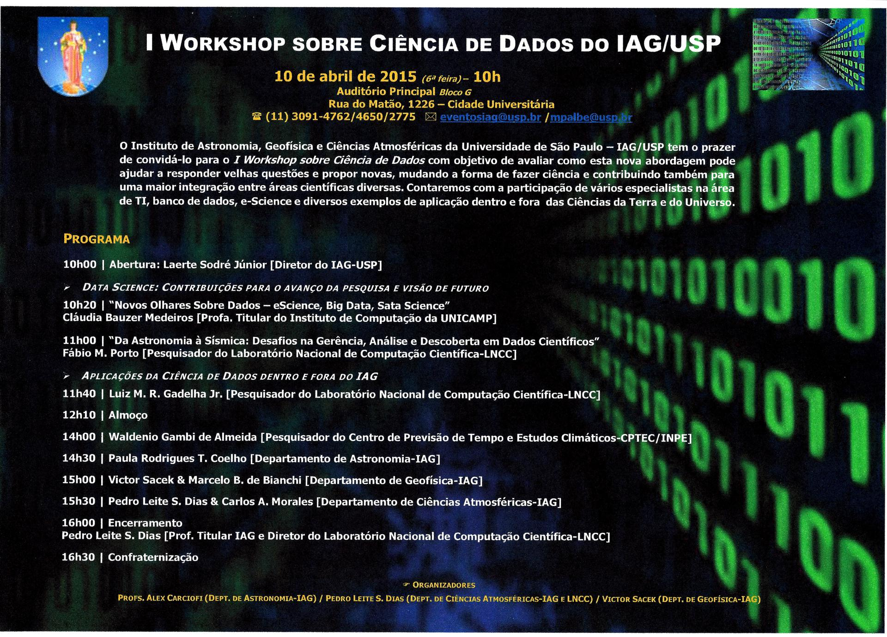

Events Notes
****************

.. contents:: Table of contents

2015-04 Workshop Ciência de Dados IAG
========================================

.. :height: 100px

Apresentação Laerte
----------------------

3 itens importantes: (i) Atualidade, (ii) Importância Institucional e (iii) Visibilidade.
Presença de big data nos 3 departamentos do IAG. Desafios: armazenamento, transferência e processamento.

Muitos post-docs estão arrumando empregos em ciência de dados. Exemplo Nature: PhD da Inglaterra trabalha com desenvolvimento de algoritmos para clientes escolherem suas roupas. 

Exemplo Astro: SDSS. Bilhôes de objetos, desde Sist.Solar à extra-gal.

Importância para o Instituto: 3 deptos. não interagem entre si. Big-data pode ser a ponta que falta para solidificar; Algoritmos e machine-learning para todos.
II Workshop internacional com 3 áreas: único. Visibilidade. Realizar a Escola FAPESP.

Claudia Bauzer Medeiros
---------------------------
Urban Informatics: sistema público da cidade de Nova York (CUSP-statistics2014, MPCSTAR 5.3)

Computational issues: to extract and present trends, patterns, anomalies, correlations from a (huge) set of *Heterogeneous data*, to *people* ...

Technologies: Hadoop, MapReduce...

eScience: *Joint* research effort (Comp. Science + {X}). With results in computation beyond {X}.

BigData: 3V
    - Volume
    - Velocity
    - Variety
    - Veracity (4V)
    - Variability (6V)
    - Visibility (6V)

Data Science = Big Data + Big Analytics (extrair informações dos dados).

Livros: data scientists at work; Hadoop for Dummies.

Revista básica: Communications of the ACM.

ukdataservice.ac.uk

Paradigma: de "quais dados tem tal valor" para quais dados "possuem determinado perfil"?

Fábio M. Porto (LNCC)
-----------------------
DEXL Lab: Dados crus, integração, análise

"Desenvolver técnicas, métodos, algoritmos para apoio à Gerência e Análise de Dados Científicos".

* Prêmio desafios da computação

"Scientists are spending most of their time manipulating, organizing, finding and moving data, instead of researching. And it's going to get worse".

Início: origem do dados humana. Quantidade podia ser analisada por um único homem.
Hoje: origem é automática/mecânica. Quantidade deve ser analisada de forma idêntica.

Cada dado tem VÁRIAS dimensões: valor, veracidade, velocidade, etc.
"One size does not fit all".

OLTP : Main memory database (comércio...)
OLAP : Column Stores
NoSQL : Grande scala
SciDB, Neo... = formas de acessar os dados (tecnologias).

* Procurar padrões

* Projeto NoDB (EPFL), SimDB (Dexl-MACC)...

Gruber : ontologia é uma conceitualização formal e compartilhada da especificação de um domínio.

Hive... = language do Handoop+HDFS+....

1 vs grupo e dados distribuídos = Handoop + Map-Reduce

MayBMS = banco de dados "incertos".

Bernardo Gonçalves, Fabio Porto, PVLDB 2014

Considerações finais:
    - Interesse em diversas versões (a medida q é processado)
    - O ponto de intervenção
    - Identificacao da essencia do problema

    
Luiz M. R. Gadelha Jr.
-----------------------
Gerenciamento biodiversidade...

iNaturalist = registro de ocorrências naturais, como identificação de espécies.

Paulo Rodrigues T. Coelho (Astro)
----------------------------------
Virtual Observatory: an Astronomy's answer to Big Data

Dados complexos e heterogêneos.

VO:

* The vision that astronomical datasets and other resources should work as a seamless whole (IVOA)
* A collection of interoperating data archives and software tools which utilize the internet to form an environment... (Wiki)
* A data discovery, access and integration facility (B. Hanisch)

Common language (standards, protocols, data models, etc).

* Standards (Registry, Protocols, Data Models)
* Tools (30+ VO-enabled applications, from 10+ VO projects)
* 300+ refereed papers (2015)

VO complied: Canadian Astronomy Data Centre; CdS; ESA (Archives)

BRAVO:

* To stimulate and to encourage the projrects...
* Organize workshops and schools
* Act as a partner of the IVOA

I e II WCCA
Track Astronomy in SBCC
Desafio BraVO
BraVO VO Schools (* Escola latino-americana)

VO Day = SAB 2012
IVOAInterop = 2012

Cluster LAi (FAPESP, 2012) e gina (INCT-A, 2011)

Casos de usuário (2011-2015?)

.. PyCUDA
 

Victor Sacek & Marcelo B. de Bianchi (Geofísica)
---------------------------------------------------
Victor: 
"Experiências do passado e desafios do futuro".

1957-1958 = Ano internacional Geofísico (IGY, em inglês).
* Teoria que unificou as feições da terra (continentes, cordilheiras, placas tecntônicas, etc). 

IGY World Data Centers (WDC): all observational data shall be available to scientists and scientific institutions in all countries.

* EarthCube
    * EC3
    * GeoDeepDive (Exemplo: comparação com Paleobiology Database)

Bianchi:
Grupo de sismologia. Dados e organização.

Seedlink? (protocol), StationXML... UML organizador.

http://en.wikipedia.org/wiki/Natural_language_processing, Machine learning,
iniciativa transversal. 

Pedro Leite S. Dias & Sergio... (Meteorologia)
-----------------------------------------------------------------------------
Modelos e evolução meteorologia... Centros regionais: problemas de padronização.

Meteorology ... University of Moscow.

IBM: How big data can boost weather forecasting

http://chuvaonline.iag.usp.br
http://www.starnet.iag.usp.br
(http://radar.iag.usp.br)

Sergio ... Ferreira... (CPTEC)
--------------------------------
[*Já cansado demais... detalhes de operação e armazenamento*]

(Encerramento)
----------------
Pela 1a. vez IAG se reune para discutir problemas históricos.

Dificuldade de recursos humanos = institutos como o IAG não podem contratar especialistas em computação. Necessidade de instituto transversais.

IME tem suporte para desenvolvimento de software livre.

Falta à universidade e ao Brasil uma programa de produção científica. Hoje os esforços são iniciativas individuais.

"Ciência da computação se confunde com a tecnologia da informação". 

Outros
--------
Banco de dados relacional (MySQL; aplicações comerciais) versus não relacional (aplicações científicas; dados complexos).

