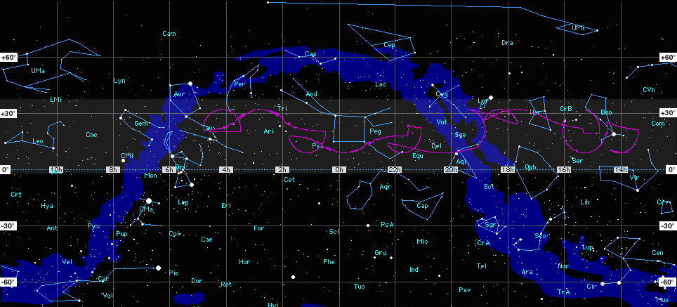
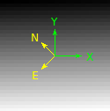

FITS images header and coordinates
###########################################

.. contents:: Table of contents

APLpy
=======
To make beautiful plots with Python: https://aplpy.github.io

FITS and WCS
=============
Intro
------
FITS header < **FITS format** from *IAU FITS Working Group*!

Official reference documentation: http://fits.gsfc.nasa.gov/fits_standard.html

The FITS header
----------------
It's the astronomical standard metadata! Specifies all useful information associate with
your data (obtaining conditions, reducing history, etc).

The header is a table with three possible fields:

- Keyword; Value; Comment

    - *Keywords* must start with a text character.
    - *Value* can be of multiple types (interger, float, string).
    - [Optional] *Comment* text.

FITS Header example
^^^^^^^^^^^^^^^^^^^^
.. code::

    SIMPLE  =                    T / Standard FITS format
    BITPIX  =                   16 / Number of bits for each pixel
    NAXIS   =                    2 / Number of axes in frame
    NAXIS1  =                 2148 / Number of pixels per row
    NAXIS2  =                 4100 / Number of rows
    BUNIT   = 'ADU     '           / Unit of original pixel value
    CTYPE1  = 'pixel   '           / Pixel coordinate system
    CTYPE2  = 'pixel   '           / Pixel coordinate system
    CRPIX1  =                    1 / Reference pixel in axis1
    CRVAL1  =                    1 / Physical value of the reference pixel
    CDELT1  =                    1 / Size projected into a detector pixel in axis1
    CRPIX2  =                    1 / Reference pixel in axis2
    CRVAL2  =                    1 / Physical value of the reference pixel
    CDELT2  =                    1 / Size projected into a detector pixel in axis2
    ...
    OBJECT  = ' BD+28.4211 '       / Target Description
    DATA-TYP= 'OBJECT  '           / Characteristics of this data
    RA      = '21:51:12.055'       / RA of the tracked pos. on the slit guide pos.
    DEC     = '+28:51:38.72'       / Dec of the tracked pos. on the slit guide pos.
    ...

Coordinates and projections
------------------------------
FITS conventions has been defined to specify the physical, or world, coordinates to be attached to each pixel of an N-dimensional image (http://fits.gsfc.nasa.gov/fits_wcs.html)

Paper I (units and world coordinates).

Paper II: celestianl coordinates and projection [!] schemes.

.. image:: ../figs/gai_fits-imgs_Lab3World_projections.jpg
    :width: 1024
    :align: center

.. image:: ../figs/gai_fits-imgs_map-projections.jpg
    :width: 800
    :align: center

FITS Header and the WCS
--------------------------
World Coordinate System (WCS) keywords in the header of a FITS or IRAF image file define the relationship between pixel coordinates in the image and sky coordinates. 

There are 25 projections of the proposed FITS WCS standard (http://tdc-www.harvard.edu/wcstools/wcstools.wcs.html):

    - AZP: Zenithal (Azimuthal) Perspective
    - SZP: Slant Zenithal Perspective
    - **TAN: Gnomonic = Tangent Plane**
    - SIN: Orthographic/synthesis
    - STG: Stereographic
    - ARC: Zenithal/azimuthal equidistant
    - ZPN: Zenithal/azimuthal PolyNomial
    - ZEA: Zenithal/azimuthal Equal Area
    - AIR: Airy
    - CYP: CYlindrical Perspective
    - CAR: Cartesian
    - MER: Mercator
    - CEA: Cylindrical Equal Area
    - COP: COnic Perspective
    - COD: COnic equiDistant
    - COE: COnic Equal area
    - COO: COnic Orthomorphic
    - BON: Bonne
    - PCO: Polyconic
    - SFL: Sanson-Flamsteed
    - PAR: Parabolic
    - AIT: Hammer-Aitoff equal area all-sky
    - MOL: Mollweide
    - CSC: COBE quadrilateralized Spherical Cube
    - QSC: Quadrilateralized Spherical Cube
    - TSC: Tangential Spherical Cube
    - NCP: North celestial pole (special case of SIN)
    - GLS: GLobal Sinusoidal (Similar to SFL) 

WCS Keywords basics
-----------------------
CTYPE1 and CTYPE2 indicate the coordinate type and projection.

CTYEP1 = xxxxyyyy / 'Comment'
CTYEP2 = xxxxyyyy / 'Comment'

The first four characters are **RA-- and DEC-**, GLON and GLAT, or ELON and ELAT, for equatorial, galactic, and ecliptic coordinates, respectively.

The second four characters contain a four-character code for the projection.

CRPIX1 and CRPIX2 are the pixel coordinates of the reference point to which the projection and the rotation refer.

CRVAL1 and CRVAL2 give the center coordinate as right ascension and declination or longitude and latitude in decimal degrees.

WCS rotation
---------------
Many astronomical instruments provide image files in which the **'x' and 'y' coordinate axes are not orientated with equatorial north** corresponding to 'up' (**and east == 'left'**). According to WCS, there are three options for the scale and rotation: 

Historically, CDELT1 and CDELT2 have been used to indicate the plate scale in degrees per pixel and **CROTA2** has been used to indicate the rotation of the horizontal and vertical axes in degrees. Usually the axes rotate together and CROTA2 is used to indicate that angle in degrees.

The FITS WCS standard uses a rotation matrix, **CD1_1, CD1_2, CD2_1, and CD2_2** to indicate both rotation and scale, allowing a more intuitive computation if the axes are skewed. This model has been used by HST and IRAF for several years.

- CD1_1 =  CDELT1 \* cos (CROTA2)
- CD1_2 = -CDELT2 \* sin (CROTA2)
- CD2_1 =  CDELT1 \* sin (CROTA2)
- CD2_2 =  CDELT2 \* cos (CROTA2)

The 1996 proposed FITS WCS standard used PC001001, PC001002, PC002001, and PC002002 to represent the rotation matrix but retained CDELT1 and CDELT2 for the scale. It is also read by this software, but *should not be used for new WCS's*. 

ALMA OST requeriments
----------------------
OST = Observation Support Tool, http://almaost.jb.man.ac.uk 

    - **[BUNIT:]** The physical units of the FITS image array values.
    - **CDELTn\***: Coordinate increment along axis n.
    - **[CROTAn]**: Coordinate system rotation angle.
    - **[CDn_n]**: Usually a matrix of four values which describe the mapping of the Coordinate system within the FITS image, i.e both increment and rotation. CDn_n matrix values and CDELTn and CROTAn are degenerate.
    - **CTYPEn**: Name of the CDELTn coordinate axis.
    - **NAXIS**: Number of axes.
    - **NAXISn**: Size of the axis n.

CRVAL3: good to save wavelength info.

From an image to ALMA!
-----------------------
Attention! ALMA OST do not rotate images for now. Instead it assumes that an uploaded image does have equatorial north corresponding to 'up' (http://almaost.jb.man.ac.uk/help/#Rotation).

Suggestion - use of PyHdust (http://github.com/danmoser/pyhdust).

One example: ramp image with 2 AU in size at 10 parsecs, rotated at 45 degree (by definition, to **east**) at 21 cm.

.. code:: python

    import numpy as np
    import pyhdust.phc as phc
    import pyhdust.interftools as intt

    img = np.arange(900).reshape((30,30))

    intt.img2fits(img, 21., [2*phc.au.cgs/phc.Rsun.cgs], 10, orient=45., \
    coordsinf=['21:51:12.055', '-28:51:38.72'], ulbd='cm', deg=True)
    
    intt.img2fits(img, 21., [2*phc.au.cgs/phc.Rsun.cgs], 10, rot=45., \
    coordsinf=['21:51:12.055', '-28:51:38.72'], ulbd='cm', deg=True, \
    outname='model_rotated')

Output - `Coordinate rotation`_:

Output - `Image rotation`_:

.. image:: ../figs/gai_fits-imgs_model_rotated.png

.. _`Coordinate rotation`: ../static/model.fits
.. _`Image rotation`: ../static/model_rotated.fits 
