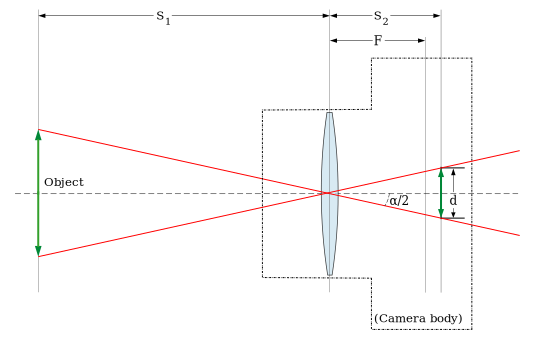

.. contents:: Table of contents

Instrumentation notes
#######################

Important topics for astronomical instrumentation
====================================================
- Astronomical Spectroscopy
- Imaging and photometry
- Active and Adaptive Optics
- Polarimetry and Spectro-polarimetry
- Characteristics of astronomical detectors in multiple wavelengths 
- Spectral imaging (IFU, Fabry-Perot and similar)
- Data treatment; Astronomical databases
- Technology of Large Telescopes
- Factors that affect astronomical observations
- Signal-to-noise analysis and errors

Engineering
=============
Steps in Engineering Problem Solving 
----------------------------------------
(originally `here <http://homepages.udayton.edu/~hardierc/ece203/Solution%20Strategy.htm>`_)

#. Understand the purpose of the problem.

#. Collect the known information. Realize that some of it might be discovered later to be unnecessary.

#. Determine what information you must find.

#. Simplify the problem only enough to allow the required information to be obtained. State any assumptions you make.

#. Draw a sketch and label any necessary variables.

#. Determine which of the fundamental principles are applicable.

#. Think about your proposed solution approach in general and consider other approaches before proceeding with the details.

    Interpret the mathematics. If the mathematics produces multiple answers, do not discard some of them without considering what they mean. The mathematics might be trying to tell you something, and you might miss an opportunity to discover more about the problem.

#. Label each step of the solution process.

#. Solve the problem. If you are solving the problem with a computer program:

    - State the problem concisely.
    - Specify the data to be used by the program. This is the “input”.
    - Specify the information to be generated by the program. This is called the "output".
    - Work through the solution steps by hand using a simple data set. 

        You may only be able to do a partial solution or nothing at all here.

    - Write and run the program.
    - Check the output of the program with your hand solution.

        Checking the dimensions and units and printing the results of intermediate steps in the calculation sequence can uncover mistakes.

    - Run the program with your actual input data (if different from your simple test data) and perform a reality check on the output.  That is, determine if the range of output values is reasonable for the problem at hand.

        Checking the dimensions and units and printing the results of intermediate steps in the calculation sequence can uncover mistakes.

    - If the program will be used as a general tool in the future, test it by running it for a range of reasonable input data values; perform a reality check on the results.

#. Present your solution using graphs and data tables to good effect. Do not state the answer with any greater precision than is justified by any of the following:

    - The precision of the given information.
    - The simplifying assumptions.
    - The requirements of the problem.

Assessing performance
-----------------------
Most of times, just one parameter at once!

Exemplo operação
------------------
O funcionamento dos VLTs. Eles funcionam assim: há um ar-condicionado em todo o enclosure do telescópio, com temperatura-alvo a esperada para o momento da abertura da cúpula. Além da estabilidade nas observações iniciais, o objetivo é não dar grandes choques térmicos nos instrumentos. Todos os racks tem a resfriamento pŕoprio. Muitos compressores de Hélio (com amortecimento de vibração) ou resfriamento de nitrogênio. E os Nasmyth tem a estabilidade mecânica completa mesmo. 

open vs closed loops
---------------------
Malha aberta é quando você faz uma correção de uma grandeza sem ter certeza se ela é a melhor possível. Malha fechada é quando a grande é monitorada por um sensor de tal forma que a correção aplicada é sempre a melhor possível. A palavra malha em Português vem de loop em Inglês, pois entre o sensor e o atuador, que aplica a correção, há um circuito que faz uma estimativa de quanto de correção precisa ser aplicada, então, se você desenhar um diagrama de controle vai haver o sistema a ser controlado, um sensor, um controlador e um atuador e esses componentes formam um circuito em loop fechado (como um circuito circular) entre uma entrada e uma saída.

Lookup table
^^^^^^^^^^^^^^^
In computer science, a lookup table is an array that replaces runtime computation with a simpler array indexing operation. The savings in terms of processing time can be significant. Used in **opened loops**.

FEA 
-------
Finite element analysis (FEA) is a computerized method for predicting how a product reacts to real-world forces, vibration, heat, fluid flow, and other physical effects. Finite element analysis shows whether a product will break, wear out, or work the way it was designed. FEA ou FEM (finite element method) uses variational methods from the calculus of variations to approximate a solution by minimizing an associated error function.

Controle
-----------
Tela sinó(p)tica
^^^^^^^^^^^^^^^^^^
No subsistema de controle há um display que fica no console de operação, que indica em uma tela gráfica sinó(p)tica, o estado atual do espetrógrafo, e.g., qual a temperatura dentro do espectrógrafo, qual a rede de difração utilizada, o ângulo das câmaras, a tensão de entrada, a pressão na entrada e na saída da linha de água de refrigeração, etc. Quem está de frente para esse painel/display tem acesso a todas as informações sobre o instrumento. As vezes uma tela somente não é suficiente, então há mais de uma tela em cada display, que pode ser trocada como no "windows", e mais de um display para que dois operadores possam ver telas diferentes ao mesmo tempo. Essa tela é gráfica com um desenho do espectrógrafo e tem pontos de leitura de forma intuitiva nos pontos do desenho. Também é possível operar válvulas, trocar redes de difração, mover as câmaras, etc, por essas telas. Esse sistema é chamado supervisório. Ele tem uma parte que é software e uma parte que é hardware (computadores que recebem as informações do PLC, e os displays).

Vocabulary
------------
- specular reflectance: 1-by-1 angle mirror

UT Classes
===========
- Computer-electronics interface (Labview) - Done
- Mechanical drawing and machining (Invetor+Workshop day) - On going
- Optical design (Zemax) - On going
- Electronics (MultiSim) - Near future

Electronics
============
Interesting chips
-------------------
- Arduino = ATmega8, ATmega168, ATmega328, ...
- Attiny85 = low power consumption micro-controller
- ESP8266 = low-cost WiFi chip

Acronyms
----------
- AC: Alternating Current
- ADC or A/D: analog-to-digital conversion
- DAC or D/A: digital-to-analog conversion
- DC: Direct Current
- DMA: Direct Memory Access
- DRT|TL: Diode|Resistor|Transistor-to-Transistor Logic
- DSP: Digital Signal Processing
- IEEE: Institute of Electrical and Electronics Engineers
- PCI: Peripheral Component Interconnect
- PXI: PCI eXtensions (for Instrumentation)
- RTSI: Real-Time System Integration bus
- SCC: Signal Conditioning Carriers
- transducer: voltage or current convertion to signal
- IC: Integrated Circuit

Motors
--------
The basic working principle of motors is a central permanent magnet surrounded by wires ("coils"). The passing current in a coil create a force that repeals the magnet, that turns (shaft). 
There are 3 basic types of motors:

DC motors
^^^^^^^^^^^
DC motors are continuously rotating motors. They follow two basic laws:

- Motor RPM is linearly proportional to the applied voltage
- Motor Torque is linearly proportional to the circuit current

2 wires only. Reversing the current makes the motor rotate in the opposite direction.

`How DC Motors work by Phidgets <https://www.youtube.com/watch?v=GBbdhQI1_f8&list=UU-mVNw_SPFez8OZGc0uNhkQ&index=13>`_

Servo motors
^^^^^^^^^^^^^^^^
Servo motors are designed to make movements between precise angles. It is not only a motor but an assembly, usually composed by: a DC motor, a potentiometer, and a control circuit. Servos are controlled by sending an electrical pulse of variable width, or Pulse Width Modulation (PWM). Servo motors are designed to operate at 50 Hz (1 pulse each 20 ms), at the typical pulse length is 1 to 2 ms. 

Examples: 

- positive pulse, 1 ms long = 0 deg position, anti-clockwise movement
- positive pulse, 1.5 ms long = 90 deg position, anti-clockwise movement
- positive pule, 2 ms long = 180 deg position, anti-clockwise movement
- negative pulse, 1.5 ms long = 90 deg position, clockwise movement

Step(per) motors
^^^^^^^^^^^^^^^^^^^^^^^^
Step motors are DC motors that rotates in steps. It can be precisely positioned without any feedback sensor, what represents an open-loop controller.

Between 4-8 wires.

Random
---------
Nyquist Theorem: "The maximum frequency one can detect is always less than half of the sampling rate".

Information can be folded in:
    - state
    - rate
    - level
    - shape
    - frequency content

**Arduino** is open source hardware and software project for creating (digital) microcontrollers.

Optics
========
Telescope Calculator
----------------------

.. math::

    f_T=D_T.f_{\#T} 

    D_T=f_T/f_{\#T}

    f_E=\text{known}

    D_E=2f_E\tan(\alpha/2) \rightarrow \tan\frac{\alpha}{2}=\frac{D_E}{2f_E}

Barlow = factor at magnification. The `Barlow lens <https://en.wikipedia.org/wiki/Barlow_lens>`_ is a diverging lens which, used in series with other optics in an optical system, increases the effective focal length of an optical system as perceived by all components that are after it. The practical result is the image magnification.

Exit pupil size, :math:`EP=D/M=D.f_E/f_T`; :math:`1\text{ mm}>EP>7\text{ mm}` (size of human pupil)

"Natural Telescope FoV", :math:`\alpha_{N}=2\tan^{-1}(D_T/2f_T)`

Apparent FoV, :math:`\text{AFOV}=\alpha=2\tan^{-1}(D_E/2f_E)`

True FoV, :math:`\alpha_T=2\tan^{-1}(D_E/2f_T)`

Magnification, :math:`M=f_T/f_E`

Power per inch, :math:`\text{PPI}=M/D_T\text{ [in]}`; :math:`30>\text{PPI}>15`; the lower, the brighter. It can be up to 50, but only under excellent sky conditions.

(optical) resolving power, :math:`\theta=1.22\lambda/D_T` [rad]; multiply by 206265 to [arcsec].

**Eye relief** is an eyepiece specification. It is the distance from the eyepiece lens to the point where your eye can best see the full field of view (larger the eye relief, likely larger the field of view).

Plate scale (in arcsec/mm), :math:`PE=206265/f_T\text{ [mm]}` 

ADC - Atmospheric Dispersion Corrector
------------------------------------------
An Atmospheric Dispersion Corrector is an optical device usually comprising two thin prisms which can rotate to compensate for the elongation of a star image caused by the wavelength dependence of the refractive index of air. At high airmasses, it is very easily seen on the guider that the star image is not round and small. Using the ADC will make the star look round and small again. The ADC can be left in the beam at all times since it does not absorb a lot of light and does not introduce polarization. It should be noted that the telescope focus will change dramatically when the ADC is moved in or out of the beam.

General
--------
- Adaptive optics: "Zernike 100/200", the order/speed of the wavefront corrections
- Adaptive optics: Isoplanatic angle, or "FoV" on which the wavefront conditions are roughly the same
- EE = Encircled energy, related to image quality. How much of the incoming energy is confined in the final resolution element (EE can also be Energy Efficiency).

Lentes a/esféricas
-------------------------------
Fiz uma pesquisa rápida, e recomendo eles dois links se vocês quiserem saber mais sobre a questão esférico/aesférico: 
    - https://en.wikipedia.org/wiki/Spherical_aberration
    - http://www.edmundoptics.com/resources/application-notes/optics/all-about-aspheric-lenses/

Basicamente é um problema que aparece principalmente em campos grandes: o ponto onde a lente faz foco muda em função da posição do objeto no campo (por exemplo, se o foco está para a estrela do centro da imagem, os objetos nas extremidades ficam desfocados - e vice-e-versa). Isso significa prática que somente 47% da área de uma lente esférica é usável para um foco completo.

Para corrigir isso, os fabricantes de lentes introduzem desvios nas superfície das lentes esféricas. Usando uma lente aesférica de mesmo tamanho que uma esférica, um campo muito maior se torna útil com as mesma condições mecânicas (isto é, peso e dimensões).

Mechanics
============
Gears rules
------------
.. figure:: ../figs/inst_mech_gears.jpg
    :align: center

Only gears with the same **diametral pitch** can work together. 

    diametral pitch = number of teeths/circular pitch 

    circular pitch = root diam.+working depth/2 = root diam.+(whole depth-clearence)/2

Usual diametral pitches: 12, 24, 36, 48, 64.

Gear trains
^^^^^^^^^^^^
Given :math:`w` the angular speed, and :math:`R` the pitch radius, and :math:`N` the number of teeths, the following rules apply:
    - :math:`\frac{w_1}{w_2}=\frac{R_2}{R_1}=\frac{N_2}{N_1}`
    
In a **serial** combination of gears, the number/size of intermediate gears are irrelevant. For example, in an 4-gear series :math:`\frac{w_1}{w_4}=-\frac{N_4}{N_1}`, independent of :math:`N_2, N_3`.
In a serial combination of gears, the even gears rotate on opposite direction of odd ones.

In a gear trains were the gears share the same rotational axis, the above rules do not apply. For example, in a 4-gear series where gears 2 and 3 share the same rotation, :math:`\frac{w_1}{w_4}=+\frac{N_2 N_4}{N_1 N_3}`.

Worm gear
^^^^^^^^^^
Works perpedicular to the **wormwheel**. The basic rule is: 

    one full rotation of the wormwheel = one teeth movement in the wormwheel
