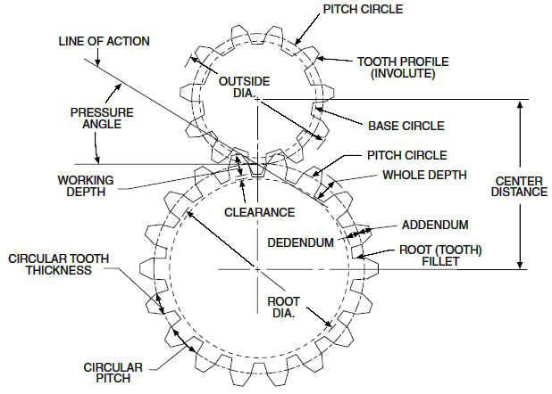

.. contents:: Table of contents

Instrumentation notes
#######################

Eletronics
===========
- AC: Alternating Current
- ADC or A/D: analog-to-digital conversion
- DAC or D/A: digital-to-analog conversion
- DC: Direct Current
- DMA: Direct Memory Access
- DRT|TL: Diode|Resistor|Transistor-to-Transistor Logic
- DSP: Digital Signal Processing
- IEEE: Institute of Electrical and Electronics Engineers
- PCI: Peripheral Component Interconnect
- PXI: PCI eXtensions (for Instrumentation)
- RTSI: Real-Time System Integration bus
- SCC: Signal Conditioning Carriers
- transducer: voltage or current convertion to signal
- IC: Integrated Circuit

Nyquist Theorem: "The maximum frequency one can detect is always less than half of the sampling rate".

Information can be folded in:
    - state
    - rate
    - level
    - shape
    - frequency content

Optics
========
Telescope Calculator
----------------------
.. figure:: ../figs/inst_Lens_angle_of_view.svg
    :align: center

.. math::

    f_T=D_T.f_{\#T} 

    D_T=f_T/f_{\#T}

    f_E=\text{known}

    D_E=2f_E\tan(\alpha/2) \rightarrow \tan\frac{\alpha}{2}=\frac{D_E}{2f_E}

Barlow = factor at magnification. The `Barlow lens <https://en.wikipedia.org/wiki/Barlow_lens>`_ is a diverging lens which, used in series with other optics in an optical system, increases the effective focal length of an optical system as perceived by all components that are after it. The practical result is the image magnification.

Exit pupil size, :math:`EP=D/M=D.f_E/f_T`; :math:`1\text{ mm}>EP>7\text{ mm}` (size of human pupil)

"Natural Telescope FoV", :math:`\alpha_{N}=2\tan^{-1}(D_T/2f_T)`

Apparent FoV, :math:`\text{AFOV}=\alpha=2\tan^{-1}(D_E/2f_E)`

True FoV, :math:`\alpha_T=2\tan^{-1}(D_E/2f_T)`

Magnification, :math:`M=f_T/f_E`

Power per inch, :math:`\text{PPI}=M/D_T\text{ [in]}`; :math:`30>\text{PPI}>15`; the lower, the brighter. It can be up to 50, but only under excellent sky conditions.

(optical) resolving power, :math:`\theta=1.22\lambda/D_T` [rad]; multiply by 206265 to [arcsec].

**Eye relief** is an eyepiece specification. It is the distance from the eyepiece lens to the point where your eye can best see the full field of view (larger the eye relief, likely larger the field of view).

Mechanics
============
Gears rules
------------

Only gears with the same **diametral pitch** can work together. 

    diametral pitch = number of teeths/circular pitch 

    circular pitch = root diam.+working depth/2 = root diam.+(whole depth-clearence)/2

Usual diametral pitches: 12, 24, 36, 48, 64.

Gear trains
^^^^^^^^^^^^
Given :math:`w` the angular speed, and :math:`R` the pitch radius, and :math:`N` the number of teeths, the following rules apply:
    - :math:`\frac{w_1}{w_2}=\frac{R_2}{R_1}=\frac{N_2}{N_1}`
    
In a **serial** combination of gears, the number/size of intermediate gears are irrelevant. For example, in an 4-gear series :math:`\frac{w_1}{w_4}=-\frac{N_4}{N_1}`, independent of :math:`N_2, N_3`.
In a serial combination of gears, the even gears rotate on opposite direction of odd ones.

In a gear trains were the gears share the same rotational axis, the above rules do not apply. For example, in a 4-gear series where gears 2 and 3 share the same rotation, :math:`\frac{w_1}{w_4}=+\frac{N_2 N_4}{N_1 N_3}`.

Worm gear
^^^^^^^^^^
Works perpedicular to the **wormwheel**. The basic rule is: 

    one full rotation of the wormwheel = one teeth movement in the wormwheel

