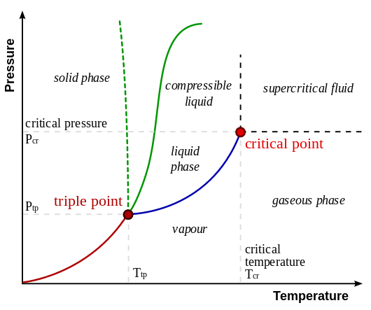
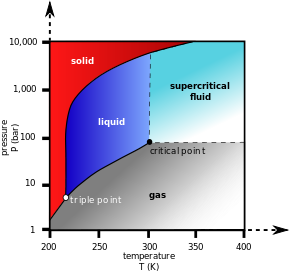

Thermal Sciences
###################

.. contents:: Table of contents

List of Topics
===============
(Isto não é o sumário...)

Leis da termodinâmica. Propriedades Termodinâmicas. Equações de estado para gases e líquidos puros. Transições de fase. Regras de mistura. Relações Termodinâmicas. Constante de equilíbrio. Mecanismo e leis básicas da transferência de calor. Condução uni e bidimensional em regime estacionário e transiente. Convecção. Radiação. Coeficientes e mecanismos de difusão demassa. Transferência simultânea de calor e massa. Escoamento monofásico, bifásico e multifásico. Escoamento através de restrições. Escoamento transiente e simuladores. Garantia de escoamento.

Bibliografia
=============
- AZEVEDO NETTO, Jose M. Manual de hidráulica. 8. ed. atual. São Paulo: Edgard Blucher, 1998. SILVESTRE, Paschoal. Hidráulica geral. 1 ed. Rio de Janeiro: LTC, 1982.
- BEJAN, Adrian. Transferência de calor. São Paulo: Edgard Blucher, 1996.
- BRAGA FILHO, Washington. Transmissão de calor. São Paulo: Pioneira Thomson Learning, 2004.
- CHISHOLM, D. Two-phase flow in pipelines and heat exchangers. London: Longman Group Limited, 1983.
- INCROPERA, Frank P.; BERGMAN, Theodore L.; DEWITT, David P. Fundamentos de transferência de calor e de massa. 6. ed. Rio de Janeiro: LTC, 2008.
- VAN WYLEN, Gordon John; SONNTAG, Richard Edwin. Fundamentos da termodinâmica clássica. 3. ed. São Paulo: E. Blucher, 1993.
- LEVENSPIEL, Octave. Termodinâmica amistosa para engenheiros. São Paulo: Edgard Blucher, 2002.

Laws of thermodynamics
=======================
The four laws of thermodynamics define fundamental physical quantities (temperature, energy, and entropy) that characterize thermodynamic systems. The laws describe how these quantities behave under various circumstances, and forbid certain phenomena (such as perpetual motion).

In short:

- 1st law: Conservação de energia (trocas e perdas)
- 2nd law: Aumento da entropia (*organização*)
- 3rd law: A entropia (*organização*) tende a um limite com a diminuição da temperatura.

Zeroth law of thermodynamics
-----------------------------
If two systems are in thermal equilibrium respectively with a third system, they must be in thermal equilibrium with each other. This law helps define the notion of temperature.

First law of thermodynamics
-----------------------------
- When energy passes, as work, as heat, or with matter, into or out from a system, its internal energy changes in accord with the law of conservation of energy. Equivalently, perpetual motion machines of the first kind are impossible.

.. math::

    \Delta U = Q - W

    dU = TdS - PdV

- O calor recebido por um sistema é igual à soma entre a variação da energia interna do sistema e o trabalho efetuado pelo sistema. 

Second law of thermodynamics
-----------------------------
- In a natural thermodynamic process, the sum of the entropies of the interacting thermodynamic systems increases. Equivalently, perpetual motion machines of the second kind are impossible.

.. math::

    W = Q_1 + Q_2

onde :math:`W` é o trabalho, :math:`Q_1` o calor fornecido e :math:`Q_2` o calor perdido (i.e., :math:`Q_2<0`).

.. math::

    \eta = \frac{Q_1}{W}

onde :math:`\eta` é chamada de *rendimento* (:math:`0<\eta<1`).

- É impossível remover energia térmica de um sistema a uma certa temperatura e converter essa energia integralmente em trabalho mecânico sem que haja uma modificação no sistema ou em suas vizinhanças. (*Enunciado de Kelvin*)

- Não há nenhum processo onde o único efeito de energia térmica seja o de transferir energia de um corpo frio para outro quente. (*Enunciado de Clausius*)

- É impossível que uma máquina térmica, operando em ciclos, tenha como único efeito a extração de calor de um reservatório e a execução de trabalho integral dessa quantidade de energia. (*Enunciado de Kelvin-Planck*)

Third law of thermodynamics
-----------------------------
- The entropy of a system approaches a constant value as the temperature approaches absolute zero. With the exception of glasses the entropy of a system at absolute zero is typically close to zero, and is equal to the log of the multiplicity of the quantum ground state.

.. math::

    \left( \frac{\Delta S}{\Delta T} \right)_{T\rightarrow0} = cte

Thermodynamics properties
==============================================
=================================== ================ =========== =========== =========== ============== ====================== =========== ==============
Property                            Symbol           Units       Extensive?  Intensive?  Conjugate      Potential?             State qty.? Process qty.?
=================================== ================ =========== =========== =========== ============== ====================== =========== ==============
Activity                            *a*               -                      Yes                                               Yes                    
Altitude                                             m           Yes                                                           Yes                    
Chemical potential                  :math:`\mu_i`    kJ/mol                  Yes         :math:`N_i`                           Yes
Compressibility (adiabatic)         \beta_S, \kappa  Pa-1                    Yes                                               Yes                    
Compressibility (isothermal)        \beta_T, \kappa  Pa-1                    Yes                                               Yes                    
Cryoscopic constant[1]              :math:`K_f`      K kg/mol                                                                  Yes                    
Density                             :math:`\rho`     kg/m3                   Yes                                               Yes                    
Ebullioscopic constant              :math:`K_b`                                                                                Yes                    
Enthalpy                            *H*              J           Yes                                    Yes                    Yes                    
   ↳ Specific enthalpy              *h*              J/kg                    Yes                                               Yes                    
Entropy                             *S*              J/K         Yes                     Temperature T  Yes        (entropic)  Yes                    
   ↳ Specific entropy               *s*              J/(kg K)                Yes                                               Yes                    
Fugacity                            *f*              N/m2                    Yes                                               Yes                    
Gas constant                        :math:`R,\bar R` J/K                     Yes                                               Yes                    
   ↳ Specific gas constant                                                                                                                          
      (for a particular substance)  :math:`R_S`      J/(kg K)                Yes                                               Yes                    
Gibbs free energy                   *G*              J           Yes                                    Yes                    Yes                    
   ↳ Specific Gibbs free entropy    *g*              J/(kg K)                Yes                                               Yes                    
Gibbs free entropy                  :math:`\Xi`      J/K         Yes                                    Yes        (entropic)  Yes                    
Grand / Landau potential            :math:`\Omega`   J           Yes                                    Yes                    Yes                    
Heat                                *Q*              J           Yes                                                                       Yes        
Heat capacity (constant pressure)   :math:`C_p`      J/K         Yes                                                           Yes                    
   ↳ Specific heat capacity                                                                                                                         
      (constant pressure)           :math:`c_p`      J/(kg K)                Yes                                               Yes                    
Heat capacity (constant volume)     :math:`C_v`      J/K         Yes                                                           Yes                    
   ↳ Specific heat capacity                                                                                                                         
      (constant volume)             :math:`c_v`      J/(kg K)                Yes                                               Yes                    
Helmholtz free energy               *A, F*           J           Yes                                    Yes                    Yes                    
Helmholtz free entropy              :math:`\Phi`     J/K         Yes                                    Yes        (entropic)  Yes                    
Internal energy                     *U*              J           Yes                                    Yes                    Yes                    
   ↳ Specific internal energy       *u*              J/kg                    Yes                                               Yes                    
Internal pressure                   :math:`\pi_T`    Pa                      Yes                                               Yes                    
Mass                                *m*              kg          Yes                                                           Yes                    
Particle number                     :math:`N_i`       -          Yes                     :math:`\mu_i`                         Yes
Pressure                            *p*              Pa                      Yes         Volume V                              Yes                    
Temperature                         *T*              K                       Yes         Entropy S                             Yes                    
Thermal conductivity                *k*              W/(m K)                 Yes                                               Yes                    
Thermal diffusivity                 :math:`\alpha`   m2/s                    Yes                                               Yes                    
Thermal expansion (linear)          :math:`\alpha_L` K-1                     Yes                                               Yes                    
Thermal expansion (area)            :math:`\alpha_A` K-1                     Yes                                               Yes                    
Thermal expansion (volumetric)      :math:`\alpha_V` K-1                     Yes                                               Yes                    
Vapor quality                       :math:`\chi`      -                      Yes                                               Yes                    
Volume                              *V*              m3          Yes                     Pressure P                            Yes                    
   ↳ Specific volume                *v*              m3/kg                   Yes                                               Yes                    
Work                                *W*              J           Yes                                                                       Yes        
=================================== ================ =========== =========== =========== ============== ====================== =========== ==============

.. math::

    \text{Entropia } \Delta S =\^c_V Nk\ln \left(\frac{T}{T_0}\right) + Nk\ln \left(\frac{V}{V_0}\right)

Heat capacities
-----------------
.. math::

    \^c_V = \frac{1}{nR}T \left(\frac{\partial S}{\partial T}\right)_V = \frac{1}{nR} \left(\frac{\partial U}{\partial T}\right)_V

    \^c_P = \frac{1}{nR}T \left(\frac{\partial S}{\partial T}\right)_P = \frac{1}{nR} \left(\frac{\partial H}{\partial T}\right)_P

    \^c_P = \^c_V + 1

    \gamma = \frac{\^c_P}{\^c_V} ~(=1.4 \text{ air})

Fugacity
----------
fugacity (f) of a real gas is an effective pressure which replaces the true mechanical pressure in accurate chemical equilibrium calculations. It is equal to the pressure of an ideal gas which has the same chemical potential as the real gas. For example, nitrogen gas (N2) at 0o C and a pressure of :math:`P=100` atm has a fugacity of f=97.03 atm. This means that the chemical potential of real nitrogen at a pressure of 100 atm is less than if nitrogen were an ideal gas; the value of the chemical potential is that which nitrogen as an ideal gas would have at a pressure of 97.03 atm.

Fugacities are determined experimentally or estimated from various models such as a Van der Waals gas that are closer to reality than an ideal gas. The ideal gas pressure and fugacity are related through the dimensionless fugacity coefficient :math:`\phi`

.. math::

    \phi = f/P \,

For nitrogen at 100 atm, the fugacity coefficient is 97.03 atm / 100 atm = 0.9703. For an ideal gas, fugacity and pressure are equal so :math:`\phi` is 1.

The contribution of nonideality to the chemical potential of a real gas is equal to RT ln :math:`\phi`. Again for nitrogen at 100 atm, the chemical potential is :math:`\mu=\mu_{id} + RT \ln 0.9703`, which is less than the ideal value :math:`\mu_{id}` because of intermolecular attractive forces.

Intensive and extensive properties 
-------------------------------------
Physical properties of materials and systems are often described as intensive and extensive properties. This classification relates to the dependency of the properties upon the size or extent of the system or object in question.

The distinction is based on the concept that smaller, non-interacting identical subdivisions of the system may be identified so that the property of interest does or does not change when the system is divided or combined.

An **intensive property** is a bulk property, meaning that it is a physical property of a system that **does not depend on the amount of material in the system** or the system size. Examples of intensive properties include **temperature, refractive index, density and hardness** of an object. When a diamond is cut, the pieces maintain their intrinsic hardness (until their size reaches a few atoms thick).

By contrast, an **extensive property** is additive for independent, non-interacting subsystems. The property **is proportional to the amount of material in the system**. For example, both the mass and the volume of a diamond are directly proportional to the amount that is left after cutting it from the raw mineral. **Mass and volume** are extensive properties, but hardness is intensive.

Equation of state of ideal gas and (pure) liquids
==================================================
In physics and thermodynamics, an equation of state is a relation between state variables. The most prominent use of an equation of state is to correlate densities of gases and liquids to temperatures and pressures. 

There are equations that model the interior of stars, including neutron stars, dense matter (quark–gluon plasmas) and radiation fields. A related concept is the perfect fluid equation of state used in cosmology.

In practical context, the equations of state are instrumental for PVT calculation in process engineering problems and especially in petroleum gas/liquid equilibrium calculations. A successful PVT model based on a fitting equation of state can be helpful to determine the state of the flow regime, the parameters for handling the reservoir fluids, piping and sizing.

Ideal gas
-----------
.. math::

    PV = n_{mols}RT = N_{particles}kT

    R = N_A k

    \^c_V = 3/2, \^c_P = 5/2

No sistema internacional:

- :math:`N_A = 6.022\times10^{23}`
- :math:`R = 8.314` J K-1 mol-1
- :math:`k = 1.381\times10^{-23}` J K-1

Liquids
-----------
For all intents and purposes, you can use an incompressible equation of state :math:`V = cte`.

Other
-------
.. math::

    \text{Joule's Law} U = \^c_V nRT

Phase transition
=======================
A phase **transition** is the transformation of a thermodynamic system from one phase or **state of matter to another** one by heat transfer. A phase of a thermodynamic system and the states of matter have **uniform physical properties**. During a phase transition of a given medium certain properties of the medium change, often discontinuously. The measurement of the external conditions at which the transformation occurs is termed the phase transition.

.. figure:: ../figs/thermal_phaseTr.png
    :align: center
    :width: 400

    Nomenclature of different phase transitions.

    
    A typical phase diagram. The dotted line gives the *anomalous behavior of water*.

Triple point
----------------
Triple point of a substance is the temperature and pressure at which the three phases (gas, liquid, and solid) of that substance coexist in thermodynamic equilibrium.

    Carbon dioxide pressure-temperature phase diagram showing the triple point and critical point of carbon dioxide

Critical point
----------------   
Critical point (or critical state) is the end point of a phase equilibrium curve. The most prominent example is the liquid-vapor critical point, the end point of the pressure-temperature curve that designates conditions under which a liquid and its vapor can coexist. At the critical point, defined by a critical temperature :math:`T_c` and a critical pressure :math:`P_c`, phase boundaries vanish.

.. figure:: ../figs/thermal_Real_Gas_Isotherms.svg.png
    :align: center
    :width: 400

    The critical isotherm with the critical point K

At the critical point:

.. math::

    \left(\frac{\partial P}{\partial V}\right)_T = \left(\frac{\partial^2P}{\partial V^2}\right)_T = 0 

Supercritical fluid
^^^^^^^^^^^^^^^^^^^^^
At :math:`T>T_c` and :math:`P>P_c` the substance behaves like a Supercritical fluid. Supercritical fluid is any substance where distinct liquid and gas phases do not exist. It can effuse through solids like a gas, and dissolve materials like a liquid. In addition, close to the critical point, small changes in pressure or temperature result in large changes in density, allowing many properties of a supercritical fluid to be "fine-tuned".

Rule of mixtures 
=======================
In materials science, a general rule of mixtures is a weighted mean used to predict various properties of a composite material made up of continuous and unidirectional fibers.
It provides a theoretical upper- and lower-bound on properties such as the elastic modulus, mass density, ultimate tensile strength, thermal conductivity, and electrical conductivity. In general there are two models, one for axial loading (Voigt model), and one for transverse loading (Reuss model).

Thermodynamic relations 
======================== 
In thermodynamics, the fundamental thermodynamic relation is generally expressed as an infinitesimal change in internal energy in terms of infinitesimal changes in entropy, and volume for a closed system in thermal equilibrium in the following way.

.. math::

    \mathrm{d}U= T\,\mathrm{d}S - P\,\mathrm{d}V\,

Here, U is internal energy, T is absolute temperature, S is entropy, P is pressure, and V is volume.

This is only one expression of the fundamental thermodynamic relation. It may be expressed in other ways, using different variables (e.g. using thermodynamic potentials). For example, the fundamental relation may be expressed in terms of the Helmholtz free energy (F) as:

.. math::

    \mathrm{d}F= -S\,\mathrm{d}T - P\,\mathrm{d}V\,,

Gibbs free energy
---------------------
The Gibbs free energy is defined as:

.. math::

    G(p,T) = U + pV - TS = H - TS

    \mathrm{d}(U-TS+pV)=V\mathrm{d}p-S\mathrm{d}T+\sum_{i=1}^k \mu_i \,\mathrm{d}N_i - \sum_{i=1}^n X_i \,\mathrm{d}a_i + \cdots
    
    \mathrm{d}G =V\mathrm{d}p-S\mathrm{d}T+\sum_{i=1}^k \mu_i \,\mathrm{d}N_i - \sum_{i=1}^n X_i \,\mathrm{d}a_i + \cdots

where:

- :math:`\mu_i` is the chemical potential of the ith chemical component. (SI unit: joules per particle or joules per mole)
- :math:`N_i` is the number of particles (or number of moles) composing the ith chemical component
- :math:`X_i` are external forces (for instance electrical or magnetical ones), which cause the external parameters of the system :math:`a_i` to change by an amount :math:`da_i`

Chemical potential is defined as:

.. math::

    \frac{G}{N} = \mu = \mu^\circ + kT\ln \frac{P}{{P^\circ }} = \mu^\circ + kT\ln \frac{V^\circ}{V}.

In non-ideal systems, fugacity comes into play.

Entalphy
-----------
.. math::
    H = U + PV

    dH = VdP + TdS

Problem
^^^^^^^^^^

Calculate the enthalpy (:math:`\Delta H`) for the process in which 45.0 grams of water is converted from liquid at 10o C to vapor at 25o C.

- 1: Heating water from 10.0 to 25.0 °C

    :math:`\Delta` kJ = 45.0 g H20 x (4.184J/gH2O oC) x (25.0 - 10.0) oC x 1kJ/1000J = 2.82 kJ

- 2: Vaporizing water at 25.0 oC

    :math:`\Delta` kJ = 45.0 g H2O x 1 mol H2O/18.02 g H2O x 44.0 kJ/1 mol H2O = 110 kJ

- 3: Total Enthalpy Change

    :math:`\Delta` H = 2.82 kJ + 110kJ

    
Thermodynamic equations 
-------------------------

Equilibrium constant 
=========================
The equilibrium constant of a chemical reaction is the value of the reaction quotient when the reaction has reached equilibrium. An equilibrium constant value is independent of the analytical concentrations of the reactant and product species in a mixture, but depends on temperature and on ionic strength. Known equilibrium constant values can be used to determine the composition of a system at equilibrium.

For a example of chemical equilibrium:

.. math::

    a A + b B \rightleftharpoons r R + s S

A constante de equilíbrio  é um valor que relaciona as concentrações das espécies reagentes e do produto **em reações reversívies** no momento em que ocorre o equilíbrio.

Onde :math:`K_c` representa o valor das constantes de equilíbrio em uma temperatura determinada, em função da concentração da espécies [ ] (e.g., mol L-1). Em caso da ocorrência da reação em fase gasosa, a constante é comumente expressa :math:`K_p`, em função das pressões parciais das espécies presentes no equilíbrio.

:math:`K_c\ll1` significa que temos muito mais reagentes que produtos (numa dada temperatura) e :math:`K_c\gg1`, o inverso.

Para a reação genérica acima:

.. math::

    K_c = \frac{ \text{[produtos]} }{ \text{[reagentes]} } = \frac{[R]^r[S]^s}{[A]^a[B]^b}

.. math::

    K_p = \frac{P(R)^r P(S)^s}{P(A)^a P(B)^b}

As substâncias presentes no equilíbrio podem estar em diferentes estados físicos (líquido, sólido e/ou gasoso), formando um equilíbrio heterogêneo. Nesse caso a constante :math:`K` não considera, as concentrações de líquidos e sólidos puros, uma vez que, nesse contexto a sua variação de concentração será desprezível.

Como exemplos temos a reação de calcinação do Carbonato de Cálcio, dada por:

.. math::

    CaCO_{3(s)} \rightleftharpoons CaO_{(s)} + CO_{2(g)}

    K_c = \frac{[CaO][CO_2]}{[CaCO_3]} = [CO_2]

Como o :math:`[CO2]` é uma espécie em fase gasosa podemos relacionar as constantes :math:`K_c` e :math:`K_p` de acordo com equação mencionada a seguir:

.. math::

    K_p = K_c R T^{\Delta n}

onde:

    - :math:`K_p` é a constante de equilíbrio em função da pressão.
    - :math:`K_c` é a constante de equilíbrio em função da concentração.
    - :math:`R` é a constante de Clapeyron ou seja R = 0,082 L atm-1
    - :math:`T` é temperatura em Kelvins (K) onde K = T em C + 273,15
    - :math:`\Delta n` é a variação do número de mols ou seja Δn = (n produto)-(n reagentes)

Relação das Constantes de equilíbrio e grandezas Termodinâmicas
================================================================
A variação de energia livre :math:`\Delta G` de um sistema representa a energia requerida para que seja realizado trabalho útil, em sua mudança de estado. No decorrer da reação observamos que a capacidade de realização de trabalho útil vai gradativamente diminuindo, com o consumo dos reagentes e formação de produto deste modo o sistema atinge o equilíbrio dinâmico, o que mostra que a :math:`\Delta G` tanto dos produtos quanto dos reagentes são iguais fornecendo :math:`\Delta G=0`. Conclui-se que:

- :math:`ΔG= 0`, O sistema atingiu equilíbrio dinâmico ;
- :math:`ΔG> 0`, Reação desfavorável (i.e., não espontânea);
- :math:`ΔG< 0`, Segue para o estado de equilíbrio (i.e., reação espontânea).

Ou expressando por meio da equação:

.. math::

    \Delta G=-RT \ln K_p

Bibliografia:

Vogel, Arthur Israel, 1905-Química Analítica Qualitativa / Arthur I. Vogel ; [tradução por Antonio Gimeno da] 5. ed.  rev. por G. Svehla.- São Paulo : Mestre Jou, 1981 .

James Brady, Humiston Gerard E. QUÍMICA GERAL - VOL. 2 - 2ª EDIÇÃO
Arquivado em: Físico-química, Termodinâmica

Heat transfer: Mechanisms and Basic Laws
=====================================================================
Heat transfer describes the exchange of thermal energy, between physical systems depending on the temperature and pressure, by dissipating heat. The fundamental modes (*mechanisms*) of heat transfer are **advection**, **conduction** or *diffusion*, **convection** and **radiation**.

Condução uni e bidimensional em regime estacionário e transiente
----------------------------------------------------------------------
https://en.wikipedia.org/wiki/Heat_equation#Heat_conduction_in_non-homogeneous_anisotropic_media

Convecção
-----------
Radiação
-----------

Coeficientes e mecanismos de difusão de massa (*Advection*)
------------------------------------------------------------------

Transferência simultânea de calor e massa
--------------------------------------------

Fluid flow
============
http://www.pdhonline.org/courses/m212/m212.htm

Escoamento monofásico, bifásico e multifásico
-------------------------------------------------------------------------------

Escoamento através de restrições
-------------------------------------------------------------------------------

Escoamento transiente e simuladores
-------------------------------------------------------------------------------

Garantia de escoamento
-------------------------------------------------------------------------------

Organizar
==========
LEIS BÁSICAS DA TRANSFERÊNCIA DE CALOR
-----------------------------------------
:math:`q` é :math:`Q/V`.

.. math::

    \text{Lei de Fourier } q = -k A \frac{\partial T}{\partial x}

    \text{Lei de Newton do resfriamento } q = h A (T_S - T_\infty)

    \text{Lei de Stefan-Boltzmann } q = \sigma\epsilon_1A_1(T_1^4-T_2^4)

com :math:`sigma=5.67\times10^{-8}` W m-2 K4.

.. math::

    \text{Energia gerada } q_{ger} = \dot{q}V

    \text{Energia acumulada } q=m\^c_P\frac{\partial T}{\partial t}

EQUAÇÃO DA DIFUSÃO DE CALOR
------------------------------
COORDENADAS CARTESIANAS

.. math::

    \frac{\partial u}{\partial t} =\eta\left(\frac{\partial^2 u}{\partial x^2}+\frac{\partial^2 u}{\partial y^2}+\frac{\partial^2 u}{\partial z^2}\right)

Aqui, :math:`u=u(x,y,z,t)` representa o campo de temperaturas e é a função incógnita. :math:`\eta` é o coeficiente de difusão térmica.

.. math::

    \frac{\partial u}{\partial t}=\eta\Delta u + f(x)\,

O operador :math:`\scriptstyle\Delta` também é escrito :math:`\scriptstyle\nabla^2` e é conhecido como Laplaciano. :math:`f(x)` indica a presença de fontes de calor.

COORDENADAS CILÍNDRICAS

.. math::

 	\nabla^2 = \frac{1}{\rho}\frac{\partial}{\partial\rho}\left(\rho \frac{\partial f}{\partial \rho}\right) + \frac{1}{\rho^2}\frac{\partial^2 f}{\partial \phi^2} + \frac{\partial^2 f}{\partial z^2} 

COORDENADAS ESFÉRICAS

.. math:: 

    \nabla^2 = 
	\frac{1}{r^2}\frac{\partial}{\partial r}\left(r^2 \frac{\partial f}{\partial r}\right)  + \frac{1}{r^2\sin\theta}\frac{\partial}{\partial \theta} \left(\sin\theta \frac{\partial f}{\partial \theta}\right)  + \frac{1}{r^2\sin^2\theta}{\partial^2 f}{\partial \phi^2}

ANALOGIA ENTRE CIRCUITOS ELÉTRICOS E TÉRMICOS

.. math::

    \text{Taxa de transferência de calor } q = \frac{\Delta T}{R_t}

    \text{Parede plana (condução) } R_t = \frac{L}{kA}

    \text{Parede cilíndrica (condução) } R_t = \frac{\ln (r_e/r_i)}{2\pi kL}

    \text{Parede esférica (condução) } R_t = \frac{1}{4\pi k} \left(\frac{1}{r_1}-\frac{1}{r_2} \right)

    \text{Convecção } R_t = \frac{1}{hA}

