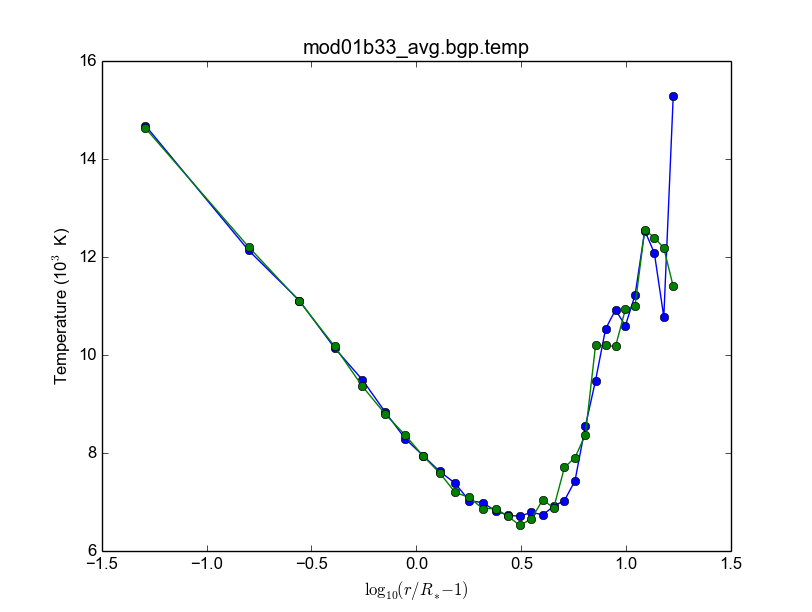
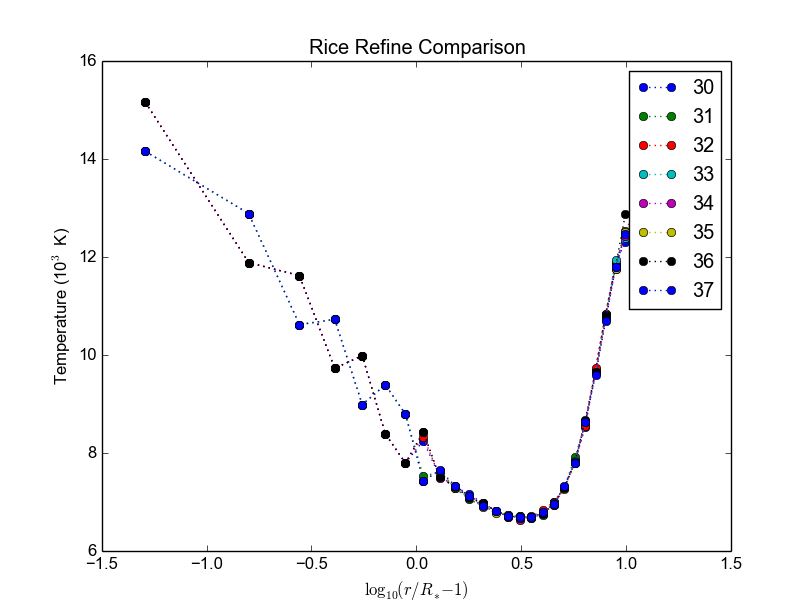

Parceria USP-Rice BlueGene (BG)
###########################################

.. contents:: Índice

III Workshop
================
Programação (parcial)
-----------------------
- 8:30 Registration, welcome reception and breakfast/café da manhã.
- 9:15 Opening talk. Vision of collaborative efforts between the universities and student exchanges. Prof. Dr. Vahan Agopyan (Vice-Reitoria da USP), Prof. Dr. José Eduardo Krieger (Pró-Reitoria de Pesquisa), Prof. Dr. José Onuchic (Rice University), Prof. Dr. João Eduardo Ferreira (STI – USP) and Prof. Dr. Carlos Antônio Ruggiero (IFSC) .
- 10:00 Prof. Dr. Paul Whitford (Rice University). The BG collaboration, Past, Present, Future. The new available resources.
- 10:30 Prof. Dr. Alfredo Goldman (IME) – Aula sobre Paralelização Automática.
- 11:45 Open forum for new and existing users’ questions and answers. Traditional HPC and regular cluster usage. 
- 12:00 Lunch Time
- 14:00 Eduardo Rodrigues – IBM Research Brasil:  “Programação paralela híbrida com MPI e OpenMP – uma abordagem prática”.

Infos
----------
- 24,576 cores = 84 teraflops

- Low-power processors, but massively parallel

- SMP mode ...
- VN (virtual node) 4 independent MPI process
- DUAL (dual node) 2 processors, 2 threads each

- SUSE Linux
- ppc450 compute cores

- BG/Q also requires cross compilation

"You should always start with scalability tests".

MPI, openMP, hybrid MPI+openMP...

Performance reproductible = compare the computing time a few times (and see if they are the same).

HPC Toolkit (Mellor-Crunmmey) = compreensive resources information (idle processors, etc...)

Possible competitive allocation process
- User need to show scaling data !!!!

USP-Rice Resources 
^^^^^^^^^^^^^^^^^^^
    **BG/Q**:

    - 2,1 GFLOPS/W
    - 16384
    - 16+1spare+1for O/S (cores per node)
    - 16GB per node
    - Possible threads per core 4
    - minimum nodes/job 32 (512 physical cores)
    - Scratch disk space 120TB (2 weeks)
        
    **DaVinci**:

    - 25 TeraFLOPS
    - GPGPUs (Fermi)
    - 2,8GHz intel westmere

    **PowerOmics**

    - 10 TeraFLOPS
    - 3,0GHz POWER8 12 core processors
    - For applications with very high memory demands

Other resources and infos
^^^^^^^^^^^^^^^^^^^^^^^^^^^^^^^^^^^^^^
If you need MILLIONS of CPU hours, XSEDE is for you.

- XSEDE requires a US researcher to be part of the them.
- In Europe, there is PRACE = similar opportunities.

AGORA: Transição no cluster, do "BlueGene P" para "BlueGene Q".

Paul Whitford (available for help) pcw2@rice.edu

10h30: Paralelização automática
---------------------------------
Modelo *polyhedral*

Exemplos práticos indo fonte original para GPU.

Evolução HPC rápida: heterogeneidade dos elementos de processadomente, GPU, FPGAS (Xilinx, Altera), Xeon Phi (arranjo de processadores).

Não há uma migração automática para usar as novas plataformas. Kits de desenvolvimento ainda não são maduros.

- Tradução *source-to-source* (via fonte)
- Tradução via binários!!!

Abordagens

    - Uso de diretivas de Compilação (principalmente C e Fortran). 
    - Paralelização automática

Diretivas de compilação:

    O código é anotado com diretivas de preprocessamento (``#pragma``)

    - OpenMP
    - hiCUDA
    - CGCM
    - PGI: OpenACGG
    - OpenMC (OpenMP para GPUs)

Paralelização automática:

    Nenhuma auteração do código

    - Par4All
    - KernelGen
    - PPCG
    - C-to-CUDA

Modelo Polyhedral a partir de laços.
Domínio, *scatering*, função de acesso à memória. **SCoPs**

Ferramentas que extraem: SCoPs, clan e pet

Gerador de código para C: ClooG...

PPCG usa as bibliotecas pet e isl ...

O Polly é um projeto do LLVM que implementa o modelo polyhedral para código intermediário (LLVM-IR).

LLVM (http://llvm.org) é um projeto que fornece uma infraestrutura para a construção de compiladores (University of Illinois at Urbana-Champaign).

Contato: Rogério Gonçalves (rogerioag@utfpr.edu.br) e Alfredo Goldman (gold@ime.usp.br).

14h00: IBM (HPC) Eduardo Rodrigues
---------------------------------------
Tutorial - Programação paralela hĩbrida com MPI e open MP = uma abordagem prãtica

IBM Research... Jobs open!

AMPI - load balancing

Paralelizações:

- Fork-join (compartilhamento de memória = multi-cores)
- Message passing

Why MPI/openMP ?? Answer: They are open standards !

MPI
^^^^^^^^^^^^^^^^^^^
6 comandos básicos:

- MPI_Init
- MPI_Finalize
- MPI_Comm_rank (tipo de id)
- MPI_Comm_size
- MPI_Send
- MPI_Recv

.. code::

    #include <mpi.h>
    #include <stdio.h>

    int main(int argr, char**, argv...)

    ...

    mpi_finalize();
    return 0

Send/Recv flavors

- MPI_Send, MPI_Recv (processador pára)
- MPI_Isend, MPI_Irecv (processador non-idle)
- MPI_Bsend
- MPI_Ssend
- MPI_Rsend

Collective communication (Broadcast)

- MPI_Bast
- MPI_All_Reduce

Livro: Peter Pacheco - Introduction to  pararallel...

(Some) New features

- Process creation (MPI_Comm_spawn); *não disponível no BG*.
- MPI I/O (melhor HDF5 sobre MPI I/O)
- Non-blocking collectives;
- One-sided communication

(Tudo isso sem se preocupar com threads).

4 Tipos de níveis:

- MPI_THREAD_SINGLE (sem threads)
- MPI_THREAD_FUNNELED - level 1: só um thread gera chamadas/comunicações
- MPI_THREAD_SERIALIZED - level 2: vários podem chamar, mas 1 de cada vez
- MPI_THREAD_MULTIPLE - level 3: todos ao mesmo tempo

int MPI_Init_thread(...)

openMP
^^^^^^^^^^^^^^^^^^^
...  OpenPower

AMPI
^^^^^^^^^^^^^^^^^^^
MPI em Charm++

Benefícios da virtualização: .......

14h45: Solving QCD: do BG/P ao BG/Q
---------------------------------------
Atillio IFSC

Quantum Chromodynamics (análogo a Eletrodinâmica).

QCD vs. QED !

Técnica: QCD on a Lattice

Antigo (Usando os recursos Rice)
===================================

Usando o BG/P
------------------------

E-mail + conversa no lcca@usp.br. Então, aprovação do Paul (ele me mandou um e-mail).

Acesso a máquina **bluegene.rice.edu** (aliased to bgp-fn.rcsg.rice.edu). If you are not on the Rice network, this is accomplished by tunneling a connection through shark.lcca.usp.br or gw.rcsg.rice.edu.

If you do not have an account on shark, contact LCCA.

gw.rcsg.rice.edu will use your Rice NetID account information.

*When using secure shell to transfer files, it helps to employ a simpler encryption algorithm, use '-c arcfour' to speed up transfers.*

E-mail para o lcca@usp.br em 17/04/15:

::

    Eu já recebi a aprovação do Paul. Quais são os próximos passos???
    
    - O username (Rice NetID) será automaticamente gerado??

        Foi. Userr dm#
    
    - Minha conta será para o BG/P, Q ou ambos? Pelo que eu entendi, o endereço bluegene.rice.edu apontará para o Q.
    Como acessar o P?

        Só o P. 
    
    - No site rice.usp.br, quando eu clico em "Getting Started on BG/P" ele automaticamente vai para a página do "Q"...
    Os procedimentos são os mesmos em ambos?
    
    - O número mínimo de cores a serem solicitados no Q são 512? Como (e onde) fazer os testes com meu código?
    Os testes deveriam ser feitos com menos cores...
    
    A referência do código desenvolvido pelo meu orientador é http://adslabs.org/adsabs/abs/2006ApJ...639.1081C/

Compilando
----------------------
mpi/gcc - erro no mpif90. Serial ok.

mpi/fast (XL IBM compiler). mpif90/mpif77; Não usar xlf90/xlf ou xlc, 
usar **bgxlf_r** e **bgxlc_r**; 

.. code::

    ...
    (.text+0x1f258): undefined reference to `fxdrrl'
    inicializa.o: In function `create_averaged_temp_file':
    (.text+0x1f9d0): undefined reference to `fxdrrl'
    inicializa.o: In function `create_averaged_temp_file':
    (.text+0x1f9ec): undefined reference to `fxdrrl'
    inicializa.o:(.text+0x1fa04): more undefined references to `fxdrrl' follow
    inicializa.o: In function `create_averaged_temp_file':
    (.text+0x1fb8c): undefined reference to `fxdrcls'
    inicializa.o: In function `create_averaged_temp_file':
    (.text+0x20050): undefined reference to `fxdrini'
    inicializa.o: In function `create_averaged_temp_file':
    ...
    make: *** [../../runs/hdust/hdustparv2.02.bc] Error 1

Help: https://docs.rice.edu/confluence/display/ITDIY/Request+Help+with+Research+Computing+Resources

The above link and HelpDesk are the same!!

Queues + Running
----------------------------
https://docs.rice.edu/confluence/display/ITDIY/IBM+Blue+Gene+Documentation

.. code::

    #@ job_name = hello_dm#
    #@ comment = "Hdust test"
    #@ error = $(job_name).$(jobid).err
    #@ output = $(job_name).$(jobid).out
    #@ environment = COPY_ALL
    #@ wall_clock_limit = 00:30:00
    #@ notification = error
    #@ job_type = bluegene
    #@ class = devel
    #@ group = pcw2
    #@ bg_size = 128
    #@ queue
     
    /bgsys/drivers/ppcfloor/bin/mpirun -exe /bgpscratch/dm#/hdust/hdustparv2.02.bc \
    -mode VN -np 512 -args " = hdust_bestar2.02.inp"

The queue managener commands ``llsubmit ./sample.bgq``, ``llq`` and ``llcancel bgp-fn.xxx``.

Tests
-----------------
*bestar2.02/mod01/mod01b.txt*; step1 = 500,000 photons; 33 \*.temp files in 20 minutes.

*bestar2.02/mod01/mod01b.txt*; step1 = 2,000,000 photons; 33 \*.temp files in 35 minutes.

Figure below: blue, distribution; green, BG/P.

Usando os recursos Rice II - Set/2015-Jan/2016
===============================================

Inscrição 
-----------

Os passos são:

#. E-mail para o LCCA pedindo uma conta (com info. do HDUST e mini-projeto)
#. (LCCA vai confirmar as infos. com o Alex, que responderá com um ok)
#. (O LCCA vai encaminhar um e-mail ao Paul, na Rice)
#. Preenche-se um formulário solicitando um Rice NetID (coloca-se senha, mas sem *username*). Informar o Paul como *sponsor*.
#. Receber o Rice NetID (*username*)
#. Preencher um segundo formulário pedindo acesso ao BG/Q
#. (O Paul vai liberar o acesso) e pronto! (UFA)

- Send the following information from your USP email address to lcca@usp.br: Your name, position (i.e. grad student, post-doc, professor), department, the name of the PI (make sure to cc the PI when making the request, since they will need to confirm the request), software you want to use on the BG, estimated number of cores per calculation, and a 1-2 paragraph description of the types of calculations you want to perform.

| Name: Daniel Moser Faes
| Position: PhD Student
| PI: Professor Alex Cavalieri Carciofi
| Institution: IAG-USP
| Code: User developed gfortran code with MPI
| Description of research problem: 3D Non-LTE Monte Carlo simulations of radiative transfer in astrophysics environments (HDUST Code). Our code is capable of simulate winds, disks and dust in interaction with a given radiation field. Our goal is to study the circumstellar disks around Be stars.
| Required software: Fortran and C compilers; MPI
| Requested number of core hours and the number cores per job: Initially, we will study around a hundred of models. Each model will require approximately one hour of computation in 256 core of 3GHz.

- After you receive confirmation from LCCA, request a Rice Guest Account here (https://my.rice.edu/GuestAccount/form.jsp). When requesting the Rice Account, indicate pcw2@rice.edu as your sponsor (DO NOT select "BlueGene USP Allocation" as the sponsor), and forward the LCCA approval email to that address. It is VERY important that you provide a valid email address when you request an account. If we can not contact you, then your accounts may be terminated without notice. Finally, if you do not obtain approval from LCCA first, the Rice Guest Account will not be approved.

When your guest account is approved, you will be assigned a Rice NetID.  This will be your login information for all resources located at Rice, so don't lose it. Typically, the Rice ID will be activated within 24 hours. Once the Rice ID is active, we will activate your account on the BG/P. You will also be added to the USP BGP listserve. If you don't receive confirmation within 3 business days about the listserve, or BG/P account, please inquire with the sponsor (Paul Whitford, pcw2@rice.edu).

Once your account is activated on the BG, you will need to connect via secure shell (bluegene.rice.edu). If you are not on the Rice network, this is accomplished by tunneling a connection through shark.lcca.usp.br or gw.rcsg.rice.edu. If you do not have an account on shark, contact LCCA. gw.rcsg.rice.edu will use your Rice NetID account information.

Dúvidas aqui:
http://usp.rice.edu

Primeiros passos
------------------
https://docs.rice.edu/confluence/display/ITDIY/Bluegene+Q+Getting+Started+Guide

1. $ ssh dm#@gw.rcsg.rice.edu
2. $ ssh bluegene.rice.edu
3. Módulos https://docs.rice.edu/confluence/display/ITDIY/Customizing+Your+Environment+with+the+Module+Command

    | $ module avail
    | $ module load mpi
    | $ module list
    | # $ module purge

4. mkdir /bgpscratch/`whoami`

Submit ALL jobs from your scratch directory, and job output should only be written to the scratch directory. Executables may remain in your home directory, but do not write to the home during a job.
Purge Policies

Files in the scratch directory that are more than 2 weeks old will be removed automatically.

5. Job scheduling is done via Loadleveler.

Cores are allocated in blocks of 512 CORES [bg_size=128(\*4)]. If you request less than this, you will still be allocated 512 CORES, meaning that the additional cores are going to be sitting idle. Whenever your number of cores is not an integer multiple of 512, there will be idle cores. Please ensure that you do not waste cycles unintentionally.

Exemplo transferencia de arquivos
-----------------------------------
.. code:: bash

    $ scp /data/hdust.zip dm#@gw.rcsg.rice.edu:/tmp
    The Rice University Network - Unauthorized access is prohibited
    dm#@gw.rcsg.rice.edu's password: 
    hdust.zip                         100%   35MB   3.9MB/s   00:09    

    $ scp gw.rcsg.rice.edu:/tmp/hdust.zip .
    Warning: Permanently added 'gw.rcsg.rice.edu,128.42.60.30' (RSA) to the list of known hosts.
    The Rice University Network - Unauthorized access is prohibited
    dm#@gw.rcsg.rice.edu's password: 
    hdust.zip                                           100%   35MB  35.2MB/s   00:00

Compilando e ajustando
-------------------------

.. code:: bash

    $ vim xdr/v1.06/Makefile

::

    CC = bgxlc_r
    COPTS =  -c -O -DAIX
    F77 = bgxlf_r
    FOPTS = -c -O

.. code:: bash

    $ vim fortran/hdustv2.02/Makefile

:: 

    CFLAGS = -O2
    FC = bgxlf95_r
    FC2 = bgxlf_r
    ...
    .f.o:
        $(FC2) $(CFLAGS) -c $*.f

.. code:: bash
    
    $ module load mpi
    # In the *special* hdustparv2.02 directory, i.e., replace the files with the following ones:
    $ wget http://dl.dropbox.com/u/6569986/transfer/hdustparv2.02bgp.zip
    #
    $ vim fortran/hdustparv2.02bgq/Makefile

:: 

    CFLAGS = -O2
    FC = mpixlf95_r
    FC2 = mpixlf77_r
    ...
    .f.o:
        $(FC2) $(CFLAGS) -c $*.f

E também tem que mudar a pasta temporária dos `controls`:

.. code:: bash

    $ cd /bgqscratch/`whoami`/hdust/runs/hdust
    $ mkdir ../tmp
    $ vim bestar2.02/controls/controls.txt
    # line 63:  Path = '../tmp/' 

Queues + Running
-------------------
https://docs.rice.edu/confluence/pages/viewpage.action?pageId=49974118

Create the file `job.cmd`:

:: 

    #@ job_name = hdust
    #@ comment = "HDUST run"
    #@ error = $(job_name).$(bg_size).err
    #@ output = $(job_name).$(bg_size).out
    #@ environment = COPY_ALL
    #@ wall_clock_limit = 24:00:00
    #@ notification = error
    #@ job_type = bluegene
    #@ class = usp
    #@ group = usp
    #@ bg_size = 32 
    #@ queue
     
    EXE="/home/dmf#/hdust/runs/hdust/hdustparv2.02.bc"
    ARGS=" = beauty/mod01/all.inp"
     
    runjob --np 512 --ranks-per-node=16 --exe $EXE --args $ARGS

.. code:: bash

    # Submit job
    $ llsubmit job.cmd
    # see the queue 
    $ llq
    # cancel jobs
    $ llcancel jobID
    
Testes
-----------
**BgQ** 512 cores:
- step1, 10000000, 3.2 min = ~6500 f/min/core
- step1_refine, 30000000, 8.5 min = ~6500 f/min/core
- SED (Sob=0), 22500000, 6 min = ~7300 f/min/core

**Acrux** 48 cores:
- step1, 2500000, 4 min = ~13000 f/min/core
- step1_refine, 12000000, 19 min = ~13000 f/min/core
- SED (Sob=0), 1350000000, 370 min = ~76013 f/min/core

Additional User Support on the BG
---------------------------------------

    There are many people available to help you if you encounter troubles when using the BG. For USP users, you can always email questions to LCCA. All users can also contact Paul Whitford (pcw2@rice.edu) for any questions that you may have. For assistance running specific applications, you can contact our technical staff member, Xiaoqin Huang at xh14@rice.edu.

    If you are running on BG, and you find that your jobs simply stop working, then there may be an issue with the BG/P itself.  In that case, it is recommended that you file a ticket with the RCSG staff, using the RCSG help request page (https://docs.rice.edu/confluence/display/ITDIY/Request+Help+with+Research+Computing+Resources).  When filing a ticket, the more information you provide, the more helpful they can be.  For example, send the full error message issued when the job crashed, what directory the job was sent from, what the job number was, etc.

Extra
--------
::

    Dear,
    After a code upgrade, we are trying to run our MPI fortran code (HDUST) again at BlueGene. We had some issues in the code last May (2015) still at BGP and Mr. Qiyou Jiang helped us at that time.

    The code different sources are:
    - Serial: /home/dmf7/hdust/fortran/hdustv2.02/
    - Parallel (v2.02 corrected version of Mr. Jiang): /home/dmf7/hdust/fortran/hdustparv2.02bgp/
    - Parallel (new version): /home/dmf7/hdust/fortran/hdustparv2.021/

    The GNU executables ends with .gc and XL with .bc (/bgqscratch/dmf7/hdust/)

    First issue: when I compile the serial code with GNU compilers, it works nicely. When I compile it with XL, I get
    "Ilegal instruction (core image recorded)"
    GNU: ./hdustv2.02.gc input = hdust_bestar2.02.inp
    XL: ./hdustv2.02.bc input = hdust_bestar2.02.inp
    Probably the source of the error is at the SUBROUTINE setup_rigid_star() [line 3672, input_v2.f90]

    comment: the codes makes use of a library called XDR. When compiling the parallel version of HDUST with MPI/GCC, the MPI only compiles if the XDR library was compiled with XL compilers (!?). 
    On the other hand, the GNU HDUST serial version only works if XDR was compiled with GNU compilers.

    Second: The new version (v2.021) is working on x86-based machines, but here it appears that there is an MPI communication error. For example, the status of each slave returning to the master is indicated by the number of photons in the output. It should never be zero, but this is what we are receiving (hdust*.out files).

    Could you help us again debugging the new version?
    Regards,
    Daniel 

Outros recursos
----------------

Acessos além do BG/P-Q devem ser negociados... DaVinci, STIC, etc...