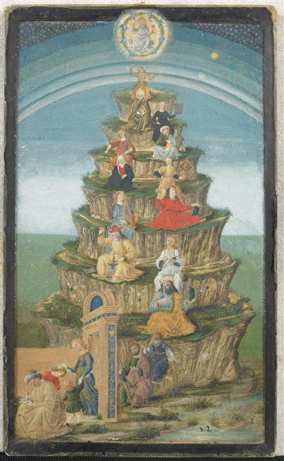
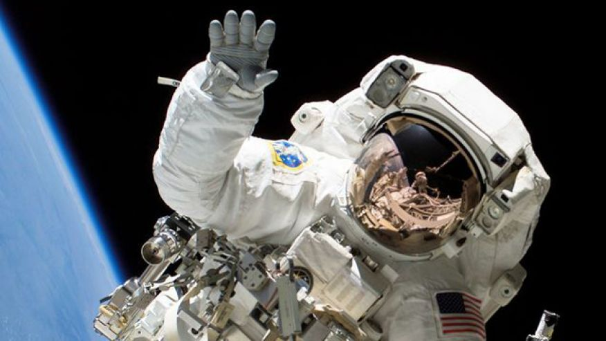
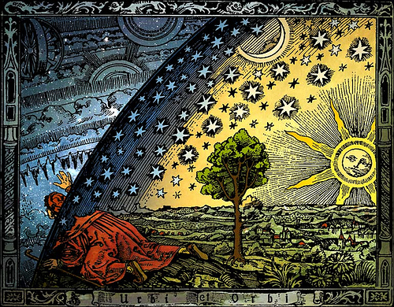

O céu e as nuvens
********************
.. contents:: Índice

Poesia
========

O Manifesto da Sociedade de Apreciadores de Nuvens
------------------------------------------------------------

| CREMOS que as nuvens são injustamente caluniadas
| e que a vida seria infinitamente mais pobre sem elas.
| 
| Nós pensamos que elas são poesia da natureza,
| e a mais igualitária de suas telas, uma vez que
| todos podem vê-las com uma vista fantástica.
| 
| Nós nos comprometemos a combater o "pensamento de céu azul" 
| onde quer que o encontremos. A vida seria maçante se tivéssemos 
| de olhar para monotonia sem nuvens dia após dia.
| 
| Procuramos lembrar as pessoas que as nuvens são expressões da
| humores da atmosfera, e pode ser lido como os de
| o rosto de uma pessoa.
| 
| Acreditamos que as nuvens são para sonhadores e sua contemplação 
| beneficia a alma. De fato, todos os que consideram as formas que 
| nelas vêem irão economizar dinheiro em consultas de psicanálise.
| 
| E assim dizemos a todos que irão ouvir:
| Olhem para cima, maravilhem-se com a beleza efêmera, 
| e vivam a vida com suas cabeças nas nuvens!

[https://cloudappreciationsociety.org/manifesto/]

A nuvem
---------
Eu sou a filha da Terra e da Água,
         E a criança de peito do Céu;
Eu passa através dos poros do oceano e riachos;
         Eu mudo, mas eu não posso morrer.
Para depois da chuva, quando em uma mancha
         O pavilhão do Céu está nu,
E os ventos e os raios de Sol com seus lampejos convexos
         construe a cúpula azul do ar,
Eu silenciosamente dou risada de minha própria lápide,
         E fora das cavernas de chuva,
Como uma criança no ventre, como um fantasma do túmulo,
         Eu me levanto e destruo isto novamente.

[Percy Bysshe Shelley, http://www.poetryfoundation.org/poem/174384]

Mar português
---------------------------------
| Ó mar salgado, quanto do teu sal
| São lágrimas de Portugal!
| Por te cruzarmos, quantas mães choraram,
| Quantos filhos em vão rezaram!
| 
| Quantas noivas ficaram por casar
| Para que fosses nosso, ó mar!
| Valeu a pena? Tudo vale a pena
| Se a alma não é pequena.
| 
| Quem quer passar além do Bojador
| Tem que passar além da dor.
| Deus ao mar o perigo e o abismo deu,
| Mas nele é que espelhou o céu.
 
[Fernando Pessoa]

Onde o céu é mais azul
-------------------------
| Eu já encontrei, um dia, alguém
| Que me perguntou assim, Iaiá:
| O seu Brasil, o que é que tem?
| O seu Brasil, onde é que está?
| 
| Onde o céu azul é mais azul
| E uma cruz de estrelas mostra o sul
| Aí se encontra o meu país
| O meu Brasil, grande e tão feliz
| 
| Que tem, junto ao mar, palmeirais
| No sertão, seringais
| E, no sul, verdes pinheirais
| Um jangadeiro que namora o mar
| Verde mar a beijar
| Brancas praias sem fim, quando paira o ar
| 
| Um garimpeiro, que lá no sertão 
| Procura estrelas raras pelo chão
| E um boiadeiro que tangendo os bois
| Trabalha muito pra sonhar depois
| 
| E se é grande o céu, a terra e o mar
| O teu povo bom não é menor
| Mas o que faz admirar...
| Eu vou dizer, guarde bem de cor:
| 
| Quem vê o Brasil que não tem fim
| Não chega a saber por que razão
| Este país tão grande assim
| Cabe inteirinho no meu coração...

[Alberto Ribeiro, Alcyr Pires Vermelho e João de Barro]

Figuras
=========
Nuvens
--------
.. figure:: ../figs/poetry_clouds_genera1.jpg
    :align: center
    :width: 800
    
Os aviões em geral viajam acima dos *altocumulus*... 
    
.. figure:: ../figs/poetry_clouds_genera2.gif
    :align: center
    :width: 800    

O *cirrostratus* gera um "halo" em torno do Sol (e da Lua, à noite).
    
.. figure:: ../figs/poetry_clouds_halo.jpg
    :align: center
    :width: 800    
    
Outros
--------

Eu conheço o quadro acima como "Alegoria das artes liberais". Pitágoras no topo, as artes dnos elevam. Os "sete céus" podem ser vistos, e Deus acima deles.

.. figure:: ../figs/poetry_clouds_delphos.jpg
    :align: center
    :width: 800

    O templo de Delfos.
    
.. figure:: ../figs/poetry_clouds_endlessriver.jpg
    :align: center
    
    O último álbum do Pink Floyd.
  
Astronomia
-----------
.. figure:: ../figs/LakeMyvatn_Brady_1080.jpg
    :align: center
    :width: 800

    Auroras and riscos de estrelas sobre a Islândia
    
.. figure:: ../figs/astrobasic_Comet_Lovejoy.jpg
    :align: center

    Constelação de Orion e o cometa Lovejoy dia-a-dia

A maioria das estrelas que vemos no céu são azuis.

O céu é um prisma!

.. figure:: ../figs/poetry_clouds_prism.jpg
    :align: center
    
Camille Flammarion
-------------------
.. figure:: ../figs/poetry_clouds_flam.jpg
    :align: center
    :width: 800
    
A figura do Flammarion era preto e branco. A minha coloração favorita é abaixo.

    

Música
==========
Seven Bridges Road - by The Eagles 
-------------------------------------- 
https://www.youtube.com/watch?v=c-q7Mih69KE

| Há estrelas no céu do sul
| Na medida em que caminhe ao sul
| Há o luar e musgo nas árvores
| Descendo a estrada das sete pontes
| 
| Agora eu te amei como a um bebê
| Como uma criança solitária
| E eu te amei de uma forma mansa
| E eu vos amei selvagemente
| 
| Às vezes, há uma parte de mim
| Tem que mudar de formato aqui e ir
| Correndo como uma criança dessas estrelas quentes
| Descendo a estrada das sete pontes
| 
| Há estrelas no céu do sul
| E se alguma vez você decidir que deve ir
| Há um sabor de tempo adoçado à mel
| Descendo a estrada das sete pontes

Southern Cross - by Crosby, Stills & Nash
--------------------------------------------
https://www.youtube.com/watch?v=0cBsnopTVmo

| Eu saí da cidade em um barco
| indo para as ilhas do sul.
| Navegando para além 
| do alcance de um mar.
| Ela estava fazendo comércios
| Do lado de fora,
| E o correndo colina abaixo
| para Papeete.
| Fora do vendo desta seção
| deitam-se as Marquesas.
| Temos oitenta pés da linha d'água.
| abrindo bom caminho.
| Em um bar barulhento em Avalon
| Eu tentei chamar você.
| Mas em uma observação de meia-noite eu percebi
| Porquê duas vezes que você fugiu.
| 
| Pense em quantas vezes
| eu caí
| Espíritos estão me usando,
| vozes maiores chamando.
| Que os céus juntaram você e eu
| não pode ser esquecido.
| Estive em todo o mundo,
| Produrando por esta mulher-menina,
| Quem sabe o quanto o amor pode suportar.
| E você sabe que vai.
| E você sabe que vai.
| 
| Quando você ver o Cruzeiro do Sul
| Pela primeira vez
| Você entenderá 
| Por que foi desta maneira
| Porque a verdade de que você está correndo
| pode ser tão pequeno.
| Mas é tão grande quanto a promessa
| A promessa de um dia chegando.
| Então, eu estou navegando para amanhã
| Meus sonhos são para morrer.
| E meu amor é uma âncora amarrada a você
| Amarrado com uma corrente de prata.
| Eu tenho o meu navio
| E todas as suas bandeiras estão tremulando.
| Ela é tudo o que me resta
| E a música é o nome dela.
| 
| Pense em quantas vezes
| eu caí
| Espíritos estão me usando,
| vozes maiores chamando.
| Que os céus juntaram você e eu
| não pode ser esquecido.
| Estive em todo o mundo,
| Produrando por esta mulher-menina,
| Quem sabe o quanto o amor pode suportar.
| E você sabe que vai.
| E você sabe que vai.
| 
| Então, nós enganados e mentimos
| E nós testamos
| E nós nunca falhamos em falhar
| Era a coisa mais fácil de fazer.
| Você sobreviverá em ser superado.
| Alguém legal
| Chegará junto
| Faça-me esquecer amar você.
| Ao Cruzeiro do Sul.

Ghost Riders in the Sky - by The Outlaws
------------------------------------------
https://www.youtube.com/watch?v=YmpvpypXKf0

| Yippee-I-aye, yippee-I-o
| Cavaleiros fantasmas no céu
| 
| Um velho boiadeiro foi andando para longe num dia escuro e ventoso
| Após um cume ele descansou enquanto prosseguia em seu caminho
| Quando repentinamente um poderoso bando de vacas de olhos vermelhos ele viu
| Rasgando através do céu esfarrapado num desenho nublado
| 
| Yippee-I-aye, yippee-I-o
| Cavaleiros fantasmas no céu
| 
| Suas marcas ainda estavam em chamas e os cascos eram feitos de aço
| Seus chifres eram negros e brilhantes e sua respiração quente que ele podia sentir
| Um raio de medo passou por ele quando relâmpagos atravessaram o céu
| E ele viu os cavaleiros vindo fortes e ouviu o seu clamor fúnebre
| 
| Yippee-I-aye, yippee-I-o
| Cavaleiros fantasmas no céu
| 
| Seus rostos magros, seus olhos estavam embaçados e suas camisas toda encharcadas de suor
| Eles estão cavalgando duro para pegar aquela manada, mas eles não vão pega-las ainda
| Porque eles tem que montar para sempre nesse percurso até o céu
| Em cavalos bufando fogo, pois eles montam ao ouvir o seu clamor
| 
| Yippee-I-aye, yippee-I-o
| Cavaleiros fantasmas no céu
| 
| Quando os cavaleiros passaram por ele, ele ouviu um chamar pelo seu nome
| "Se você quer salvar sua alma de cavalgar em nosso bando
| "Então, vaqueiro, mude sua maneira hoje - ou com a gente vai montar
| "Tentando pegar o rebanho do diabo através dos céus infinitos"
| 
| Yippee-I-aye, yippee-I-o
| Cavaleiros fantasmas no céu
| Cavaleiros fantasmas no céu

Space Oddity - by Chris Hadfield
----------------------------------
https://www.youtube.com/watch?v=KaOC9danxNo

| Controle de solo para Major Tom
| Controle de solo para Major Tom
| Fechar a escotilha da Soyuz e colocar o seu capacete
| Controle de solo para Major Tom
| Começando contagem regressiva, motores ligados
| Desacoplar da estação, e que o amor de Deus esteja com você
| 
| Este é o controle de terra para major Tom, você realmente atingiu a pontuação
| E os jornais querem saber de que marca são as camisas que veste
| Mas é hora de orientar a cápsula se você ousar
| 
| Aqui é o major Tom para o controle de solo, eu parti para sempre
| E eu estou flutuando em uma forma mais peculiar
| E as estrelas parece muito diferentes hoje
| Pois aqui estou sentado em uma lata fina
| Muito acima do mundo
| O planeta Terra é azul e não há mais nada a fazer
| 
| Embora eu tenha voado cem mil milhas
| Estou me sentindo muito parado
| E antes de ser muito tarde eu sei que é hora de partir
| Nosso comandante vem para baixo de volta à terra e sabe
| Controle de solo para Major Tom,
| O tempo está próximo, há não muito tempo
| Você pode me ouvir, Major Tom?
| Você pode me ouvir, Major Tom?
| Você pode me ouvir, Major Tom?
| Você pode...
| Aqui estou flutuando em minha lata fina
| Último vislumbre do mundo
| O planeta Terra é azul, e não há mais nada a fazer
| 
| - - -
| Ground control to major Tom
| Ground control to major Tom
| Lock your Soyuz hatch and put your helmet on
| Ground control to major Tom
| Commencing countdown, engines on
| Detach from Station, and may god's love be with you
| 
| This is ground control to major Tom, you've really made the grade
| And the papers want to know whose shirts you wear
| But it's time to guide the capsule if you da-a-a-are
| 
| This is major Tom to ground control, I've left forevermore
| And I'm floating in a most peculiar way
| And the stars look very different toda-a-a-ay
| For here am I sitting in a tin can
| Far above the world
| Planet Earth is blue and there's nothing left to do
| 
| Though I've flown one hundred thousand miles
| I'm feeling very still
| And before too long I know it's time to go
| Our Commander comes down back to earth and knows
| Ground control to major Tom,
| The time is near, there's not too long
| Can you hear me, Major Tom?
| Can you hear me, Major Tom?
| Can you hear me, Major Tom?
| Can you...
| Here am I floating in my tin can
| Last glimpse of the world
| Planet Earth is blue, and there's nothing left to do

Cloudy - by Simon & Garfunkel
---------------------------------
| Nublado
| O céu é cinzento e branco e turvo,
| Às vezes eu acho que ele está pendurado em cima de mim.
| E é uma carona de cem milhas.
| E eu sou uma criança farroupilha.
| Pontudo sorriso pintado à dedos.
| Eu deixei minha sombra esperando por mim descendo a rua por um tempo.
| 
| Nublado
| Meus pensamentos estão espalhados e eles são nublados,
| Eles não têm fronteiras, sem limites.
| Elas ecoam e eles incham
| A partir de Tolstoy para a Sininho.
| Indo de Berkeley para o Carmelo.
| Tenho algumas fotos no meu bolso e um monte de tempo para matar.
| 
| Hey luz do sol
| Eu não vejo você há um bom tempo.
| Por que você não vem mostrar o seu rosto e dobrar minha mente?
| Estas nuvens presas no céu
| Como questões flutuantes, por quê?
| E eles ficam paradas para morrer.
| "Eles não sabem para onde estão indo, e, meu amigo, nem eu".
| 
| Nublado,
| Nublado.

Videos
=========
Maracatu Time Lapse
---------------------
https://vimeo.com/88938999

