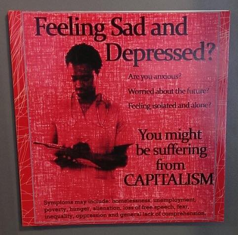
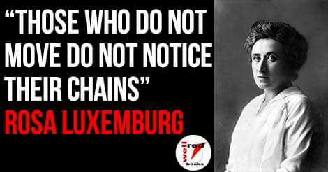
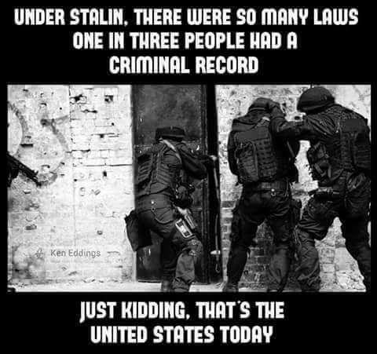
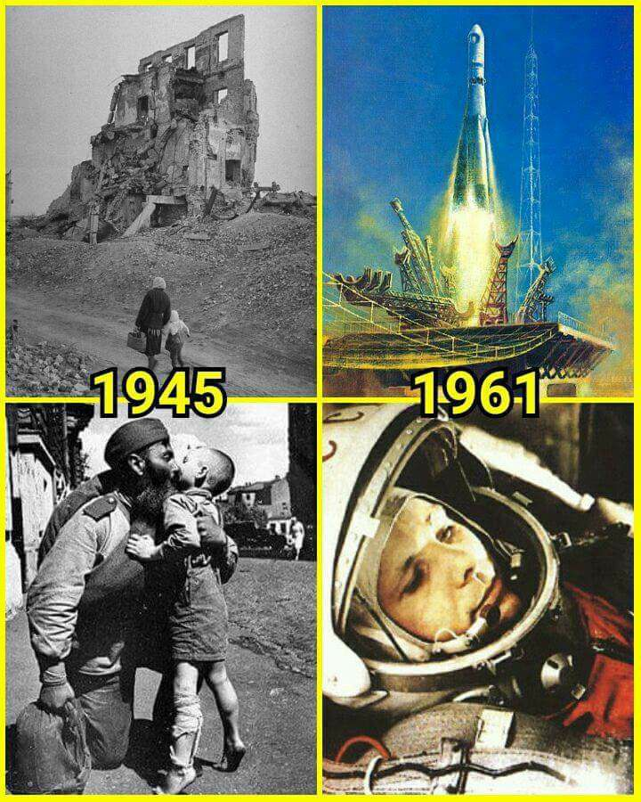

Politics
############

.. contents:: Table of contents

Democracy
*************
No passado, governos e oligarquias lutavam pelo controle da terra para exercer seu poder. Depois as máquinas (indústria) passaram a ser mais importantes que a terra. Hoje, a informação é mais importante que a terra e que as máquinas. A disputa agora é pelo controle da informação e o seu fluxo, e governos (China, por exemplo) e corporações (Google) concentram o acesso e a circulação de dados.

O perigo dessa nova fronteira é a ameaça que ela representa para a democracia. A concentração (de terra e de máquinas) foi derrotada, ou pelo menos enfraquecida, pela democracia (com a vitória dos países aliados sobre o fascismo dos países do Eixo, na Segunda Guerra Mundial). Mas a concentração da informação, seja pelo monopólio das empresas como Google e Facebook, que determinam o fluxo dos dados através de seus algoritmos, seja pela capacidade da Inteligência Artificial de processar dados e nos entregar verdades prontas muito acima da nossa capacidade crítica, não tem na democracia (pelo menos não nesse modelo de democracia que temos), uma oposição à altura.

Nas palavras de Yuval: "se algo pode manipular as emoções das pessoas de forma eficiente, a democracia vira um teatro de marionetes". Nossa fraqueza diante da concentração de poder de governos e oligarquias (para Yuval são as corporações que hoje nos governam efetivamente), é nossa falta de conhecimento sobre nós mesmos e sobre o mundo. Sem autocrítica, sem terapia, sem educação que estimule o questionamento e a investigação, nós estamos entregando nossa liberdade para uma corporação/governo que vai manipular nossas emoções e desejos mais profundos, nos fazendo acreditar que esse ser no espelho é nosso eu autêntico.

O maior perigo que agora confronta a democracia liberal é que a revolução na tecnologia da informação tornará as ditaduras mais eficientes e capazes de assumir o controle.

- `Why fascism is so tempting and how your data could power it <https://www.ted.com/talks/yuval_noah_harari_why_fascism_is_so_tempting_and_how_your_data_could_power_it>`_

- `Socialized Risks, Private Profits | Noam Chomsky <http://dl.dropbox.com/u/6569986/webpage/big/polits_chomsky.mp4>`_

- `Capitalism will eat democracy | Yanis Varoufakis <https://www.youtube.com/watch?v=GB4s5b9NL3I>`_

- `Why People Are Irrational about Politics | Michael Huemer <http://www.owl232.net/irrationality.htm>`_
    - `PT-BR <http://criticanarede.com/irracionalidadepolitica.html>`_

- `Dakota Access Pipeline - Honest Government Advert <https://www.youtube.com/watch?v=a9TR9G5bd7w>`_

- `Muhammad Ali - Racismo (Legendado PT-BR) - <https://www.youtube.com/watch?v=e5Gc0r45xMA>`_

- `Lutador <http://www.ocafezinho.com/2016/06/04/lutador/>`_

- `Teaching Quilombismo: An Afro-Brazilian Political Philosophy <Teaching Quilombismo: An Afro-Brazilian Political Philosophy>`_

Inequality
=============
Ted Talk
----------
We feel instinctively that societies with huge income gaps are somehow going wrong. Richard Wilkinson charts the hard data on economic inequality, and shows what gets worse when rich and poor are too far apart: real effects on health, lifespan, even such basic values as trust.

http://www.ted.com/talks/richard_wilkinson?language=en

Other
-----------
http://ideas.ted.com/the-data-shows-we-want-to-end-inequality-heres-how-to-start/

https://www.youtube.com/watch?v=slTF_XXoKAQ

[US] Founding Fathers
=======================
The term *Founding Fathers* refers to those who either signed the Declaration of Independence in 1776 or who were delegates to the 1787 Constitutional Convention and took part in drafting the proposed Constitution of the United States.

Personalities
===============
Thomas Jefferson
-----------------
(1743-1826) American Founding Father, the principal author of the Declaration of Independence (1776), and the third President of the United States (1801–1809).

Quotes
^^^^^^^^^
::

    Information is the currency of democracy.

"Who will govern the governors?" There is only one force in the nation that can be depended upon to keep the government pure and the governors honest, and that is the people themselves. They alone, if well informed, are capable of preventing the corruption of power, and of restoring the nation to its rightful course if it should go astray. They alone are the safest depository of the ultimate powers of government. http://famguardian.org/Subjects/Politics/ThomasJefferson/jeff0350.htm

The Safest Depository
    
    "Democrats... consider the people as the safest depository of power in the last resort; they cherish them, therefore, and wish to leave in them all the powers to the exercise of which they are competent." --Thomas Jefferson to William Short, 1825. ME 16:96

    "The mass of the citizens is the safest depository of their own rights." --Thomas Jefferson to John Taylor, 1816. ME 15:23

    "The people of every country are the only safe guardians of their own rights." --Thomas Jefferson to John Wyche, 1809.

    "I am not among those who fear the people. They, and not the rich, are our dependence for continued freedom." --Thomas Jefferson to Samuel Kercheval, 1816. ME 15:39

    "Aristocrats... fear the people, and wish to transfer all power to the higher classes of society." --Thomas Jefferson to William Short, 1825. ME 16:96

    "The people...are the only sure reliance for the preservation of our liberty." --Thomas Jefferson to James Madison, 1787. ME 6:392

Preventing the Corruption of Power

    "No government can continue good, but under the control of the people." --Thomas Jefferson to John Adams, 1819. ME 15:234

    "Unless the mass retains sufficient control over those entrusted with the powers of their government, these will be perverted to their own oppression, and to the perpetuation of wealth and power in the individuals and their families selected for the trust." --Thomas Jefferson to M. van der Kemp, 1812. ME 13:136

    "No other depositories of power [but the people themselves] have ever yet been found, which did not end in converting to their own profit the earnings of those committed to their charge." --Thomas Jefferson to Samuel Kercheval, 1816. ME 15:71

    "We fear that [violations of the Constitution] may produce insurrection. Nothing could be so fatal. Anything like force [used against the violators] would check the progress of the public opinion and rally them round the government. This is not the kind of opposition the American people will permit. But keep away all show of force and they will bear down the evil propensities of the government by the constitutional means of election and petition." --Thomas Jefferson to Edmund Pendleton, 1799. ME 10:105

    "Resort may be had to the people of the country, a more governable power from their principles and subordination; and rank and birth and tinsel-aristocracy will finally shrink into insignificance." --Thomas Jefferson to John Adams, 1813. ME 13:402

    "The influence over government must be shared among all the people. If every individual which composes their mass participates of the ultimate authority, the government will be safe, because the corrupting the whole mass will exceed any private resources of wealth, and public ones cannot be provided but by levies on the people. In this case every man would have to pay his own price." --Thomas Jefferson: Notes on Virginia Q.XIV, 1782. ME 2:207

    "If once [the people] become inattentive to the public affairs, you and I, and Congress and Assemblies, Judges and Governors, shall all become wolves. It seems to be the law of our general nature, in spite of individual exceptions." --Thomas Jefferson to Edward Carrington, 1787. ME 6:58

    "[Montesquieu wrote in Spirit of the Laws, XI,c.4:] 'Constant experience shows us that every man invested with power is apt to abuse it, and to carry his authority as far as it will go... To prevent this abuse, it is necessary from the very nature of things that power should be a check to power.'" --Thomas Jefferson: copied into his Commonplace Book.

An Informed People

    "I know no safe depositary of the ultimate powers of the society but the people themselves; and if we think them not enlightened enough to exercise their control with a wholesome discretion, the remedy is not to take it from them, but to inform their discretion by education. This is the true corrective of abuses of constitutional power." --Thomas Jefferson to William C. Jarvis, 1820. ME 15:278

    "The people, especially when moderately instructed, are the only safe, because the only honest, depositaries of the public rights, and should therefore be introduced into the administration of them in every function to which they are sufficient; they will err sometimes and accidentally, but never designedly, and with a systematic and persevering purpose of overthrowing the free principles of the government." --Thomas Jefferson to M. Coray, 1823. ME 15:483

    "There is one provision [in the new constitution of Spain] which will immortalize its inventors. It is that which, after a certain epoch, disfranchises every citizen who cannot read and write. This is new, and is the fruitful germ of the improvement of everything good and the correction of everything imperfect in the present constitution. This will give you an enlightened people, and an energetic public opinion which will control and enchain the aristocratic spirit of the government." --Thomas Jefferson to Chevalier de Ouis, 1814. ME 14:130

    "Whenever the people are well-informed, they can be trusted with their own government. Whenever things get so far wrong as to attract their notice, they may be relied on to set them to rights." --Thomas Jefferson to Richard Price, 1789. ME 7:253

    "Above all things I hope the education of the common people will be attended to; convinced that on their good sense we may rely with the most security for the preservation of a due degree of liberty." --Thomas Jefferson to James Madison, 1787. Madison Version FE 4:480

    "Enlighten the people generally, and tyranny and oppressions of body and mind will vanish like evil spirits at the dawn of day." --Thomas Jefferson to Pierre Samuel Dupont de Nemours, 1816. ME 14:491

The People's Interest in Order

    "I am among those who think well of the human character generally. I consider man as formed for society and endowed by nature with those dispositions which fit him for society." --Thomas Jefferson to William Green Munford, 1799.

    "Everyone, by his property or by his satisfactory situation, is interested in the support of law and order. And such men may safely and advantageously reserve to themselves a wholesome control over their public affairs and a degree of freedom which, in the hands of the canaille of the cities of Europe, would be instantly perverted to the demolition and destruction of everything public and private." --Thomas Jefferson to John Adams, 1813. ME 13:401

    "Every man being at his ease feels an interest in the preservation of order and comes forth to preserve it at the first call of the magistrate." --Thomas Jefferson to M. Pictet, 1803. ME 10:356

    "The mobs of the great cities add just so much to the support of pure government as sores do to the strength of the human body. It is the manners and spirit of a people which preserve a republic in vigor. A degeneracy in these is a canker which soon eats to the heart of its laws and constitution." --Thomas Jefferson: Notes on Virginia Q.XIX, 1782. ME 2:230

    "It was by the sober sense of our citizens that we were safely and steadily conducted from monarchy to republicanism, and it is by the same agency alone we can be kept from falling back." --Thomas Jefferson to Arthur Campbell, 1797. ME 9:421

    "To the sincere spirit of republicanism are naturally associated the love of country, devotion to its liberty, its right and its honor." --Thomas Jefferson: Reply to Virginia Legislature, 1809. ME 16:333

    "[It is the people's] conviction that a solid Union is the best rock of their safety." --Thomas Jefferson to C. W. F. Dumas, 1791. ME 8:197

    "The cement of this Union is in the heart-blood of every American. I do not believe there is on earth a government established on so immovable a basis." --Thomas Jefferson to Lafayette, 1815. ME 14:252

    "Possessed of the blessing of self-government and of such a portion of civil liberty as no other civilized nation enjoys, it now behooves us to guard and preserve them by a continuance of the sacrifices and exertions by which they were acquired, and especially to nourish that Union which is their sole guarantee." --Thomas Jefferson: Reply to New London Plymouth Society, 1809. ME 16:360

ME, FE = Memorial Edition, Ford Edition.

Aldous Huxley
---------------
(1894-1963)

Good biography: http://www.egs.edu/library/aldous-huxley/biography/

*While Aldous Huxley's early works would clearly be focused on defending a kind of humanism, he would become more and more interested in spiritual questions. He would particularly become interested in parapsychology and mysticism.*

:: 

    A democracy which makes or even effectively prepares for modern,
    scientific war must necessarily cease to be democratic.
    No country can be really well prepared for modern war unless
    it is governed by a tyrant, at the head of a highly trained
    and perfectly obedient bureaucracy. (1937)

*Brave New World* (1932) and *Brave New World Revisited* (1958).

::

    The perfect dictatorship would have the appearance of democracy,
    a prison without walls in which the prisoners would not dream of escape.
    A system of slavery where, through consumption and entertainment,
    slaves would love their servitude. (1932)

Henry David Thoreau 
---------------------
(1817-1862)

::

    Unjust laws exist; shall we be content to obey them, or shall we endeavor to 
    amend them, and obey them until we have succeeded, or shall we transgress them
    at once? Men generally, under such a government as this, think that they ought
    to wait until they have persuaded the majority to alter them. They think that,
    if they should resist, the remedy would be worse than the evil. But it is the
    fault of the government itself that the remedy is worse than the evil. It makes
    it worse. Why is it not more apt to anticipate and provide for reform? Why does
    it not cherish its wise minority? Why does it cry and resist before it is hurt?
    Why does it not encourage its citizens to be on the alert to point out its
    faults, and do better than it would have them?

Civil Disobedience and Other Essays (1849)

Brazil
*******************
Dictatorship
==============
Movie - Um Golpe contra o Brasil
-----------------------------------
By Alípio Freire.

http://www.nucleomemoria.org.br/noticias/internas/id/453

Refs
--------
- http://cartamaior.com.br/?/Editoria/Direitos-Humanos/Morte-e-ressurreicao-de-um-fantasma/5/33703

- `Por que pobre vota em direita? <https://www.youtube.com/watch?v=uGJQOiOPcKY>`_

- `Os 0,05% do Brasil <https://www.youtube.com/watch?v=H28ttzgVjUg>`_

- `Privatizações: a Distopia do Capital (2014) <https://www.youtube.com/watch?feature=player_embedded&v=A8As8mFaRGU>`_

Slavery
=========
Luís Gama
------------
(1830-1882) Brazilian Romantic poet, journalist, lawyer and a prominent abolitionist.
::

    O escravo que mata o senhor, seja em que circunstância for, mata sempre em legítima defesa.

Castro Alves
-------------
(1847-1871) Poet and playwright, famous for his abolitionist and republican poems. He won the epithet of "O Poeta dos Escravos" ("The Poet of the Slaves"). He wrote "O Navio Negreiro" (1880).

20th century thinkers
=========================
Milton Santos
----------------
(1926-2001) Geographer, who became known for pioneer works in various fields in geography, notably urban development in developing countries.

[Portuguese] A obra de Milton Santos é inovadora e grandiosa ao abordar o conceito de espaço. De território onde todos se encontram, o espaço, com as novas tecnologias, adquiriu novas características para se tornar um "conjunto indissociável de sistemas de objetos e sistemas de ações".

Gilberto Freyre
-------------------
(1900-1987) Sociologist, anthropologist, historian, writer, painter, journalist and congressman. He is commonly associated with other great Brazilian cultural interpreters of the first half of the 20th century, such as Sérgio Buarque de Holanda and Caio Prado Júnior. His best-known work is a sociological treatise named Casa-Grande & Senzala. Two sequels followed, The Mansions and the Shanties: the making of modern Brazil and Order and Progress: Brazil from monarchy to republic. The trilogy is generally considered a classic of modern cultural anthropology and social history.

Sérgio Buarque de Holanda
---------------------------
(1902-1982) Writer, journalist and historian.

[Portuguese] A partir de 1960, passou a coordenar o projeto da "História Geral da Civilização Brasileira".

Caio Prado Júnior
---------------------
(1907-1990) Historian. His works inaugurated a Brazilian historiographic tradition identified with Marxism, aiming at explaining the Brazilian colonial society. 

Florestan Fernandes
---------------------
(1920-1995) Sociologist and politician.

[Portuguese] A obra "A revolução burguesa no Brasil" (1975) renova radicalmente concepções tradicionais e contemporâneas da burguesia e do desenvolvimento do capitalismo no país, com interpretações alinhadas à dialética marxista.

Darcy Ribeiro
------------------
(1922-1997) Anthropologist, author and politician. His ideas of Latin American identity have influenced several later studies. He is known for his studies focusing Indians and education in the country.

20th century actors
=======================
Luís Carlos Prestes
---------------------
(1898-1990) was one of the organizers of the 1920s *tenente* revolts and the Communist opposition to the dictatorship of Getúlio Vargas in Brazil. Member of the PCB and partner of Olga Benário.

Lionel Brizola
----------------
(1922-2004) Launched in politics by Getúlio Vargas, Brizola was the only politician to serve as governor of two different states in Brazil. He was vice-president of the *Socialist International*, as well as Honorary President of that organization from October 2003 until his death in June 2004. 

Progressist presidents
========================
Getúlio Vargas
----------------
(1882-1954) [1930-1945] as "dictator" and [1951-1954] democratically elected.

João Goulart
--------------
(1918-1976) [1961-1964]. 
He is considered as the last left-wing President of the country until Luiz Inácio Lula da Silva took office in 2003.

Luiz Inácio Lula da Silva
---------------------------
(1945-) [2003-2010]. Founding member of the Workers' Party (PT – Partido dos Trabalhadores). He is often regarded as one of the most popular politicians in the history of Brazil and, at the time of his mandate, one of the most popular in the world. Social programs like Bolsa Família and Fome Zero are hallmarks of his time in office. Lula played a prominent role in recent international relations developments, including the nuclear program of Iran and global warming, and was described as "a man with audacious ambitions to alter the balance of power among nations." He was featured in Time‍ '​s The 100 Most Influential People in the World for 2010,[8] and has been called "the most successful politician of his time."

Dilma Rousseff
----------------
(1947-) [2011-2018]. She is the first woman to be president. She became a socialist during her youth, and following the 1964 coup d'état joined various left-wing and Marxist urban guerrilla groups that fought against the military dictatorship. Rousseff was eventually captured and was jailed between 1970 and 1972, where she was reportedly tortured.

After her release, Rousseff rebuilt her life in Porto Alegre with Carlos Araújo, who would be her partner for 30 years. Both helped found the Democratic Labour Party (PDT) in Rio Grande do Sul, participating in several of the party's electoral campaigns. She is involved in politics since then.

As grandes questões brasileiras
=================================
- Auditoria da dívida pública, principalmente a interna, e seu impacto no orçamento
- Transferência de capital público para iniciativa privada
- Desigualdade econômica, de renda e patrimonial
- Quantidade de dólares que brasileiros possuem no exterior
- Matriz tributária, sobretaxação do consumo, e consequentemente dos pobres
- Crise fiscal x crise financeira - benefícios do rentismo
- Dependência tecnológica, científica e cultural
- Royalties do Pré-Sal
- Matriz econômica, exportadora de produtos primários
- Latifúndios, multinacionais e desindustrialização
- Quantidade de agrotóxicos e transgênicos - agricultura familiar 75% dos alimentos na mesa dos cidadãos
- Formação de capital fixo = máquinals e equipamentos
- Imprensa: monopólio, centralização, conflito de interesses, acúmulo de meios - rádio, jornal, TV
- Inexistência de rádios comunitárias
- O judiciário brasileiro: sem participação popular, seletivo, lento, caro, carregado de privilégios
- Ausência de participação política dos brasileiros
- O sistema de ensino nacional
- Qualidade dos serviços públicos e suas métricas
- "Estado-laico": ética x religião x política
- Política e lei de responsabilidade fiscal - não inclusão de renegociação da dívida
- Não basta seguir as leis - injustiças historicamente são legalizadas
- Democratização do Banco Central e Ministério da Fazenda
- Grosso da corrupção é via sistema bancário - não cuecas ou malas
- Lava-Jato: consequência de junho de 2013, ou complemento?
- Taxas e seletividade do encarceiramento no Brasil
- Taxas de violência e mortes
- TV, Igrejas e Universidades = 3 grandes fatores de alienação
- Caracter essencialmente político da educação
- Pensamento crítico é "anti-acadêmico"
- Um conflito só se instala quando o apaziguamento é cancelado
- `A Progressividade na Tributação Brasileira (PDF) <../static/politcs_progressividade-imposto.pdf>`_

Termos
=======
- Esquerda festiva (e seus derivativos: cirandeira, rihappy, #maisamorporfavor entre outros): estamos falando de um discurso que parte, localizadamente, de uma minoria de classe média, branca e bem educada, com acesso a melhores instrumentos e aparelhos de cultura e educação, que se identifica com um discurso de esquerda (pelo bem comum, com perspectiva de igualdade e solidariedade). Mas há uma parte desse segmento que, no afã e inseguranças de posição, prefere (sim, porque isso é uma escolha) utilizar esses mesmos acessos e espaços para construir uma rifa social, e rifar corpos e vivências a partir de sua percepção perimetral do que a realidade convém. Essa rifa costuma colocar na mesma linha do jogo grupos marcados pelo que eles chamam de identitários, como mulheres, negros, população LGBT e imigrantes. E cruza, de maneira absolutamente arbitrária e socialmente insensível, com outros grupos que são seus adversários políticos, como novos movimentos jovens de direita etc. A comparação, feita com grande assimetria, é sempre pela ideia da tática: a suposta agressividade do discurso dos grupos identitários seria comparada a dos grupos de direita, ou seja, ambos usariam o ódio como forma de enfrentamento no debate público. http://www.justificando.com/2017/09/15/esquerda-festiva-que-pula-corpos/ "O MBL, está acostumado com a esquerda cirandeira, aquela que apanha, é assediada e ao invés de responder à altura, busca a solução nas instituições burguesas, no judiciário direitista e, até mesmo, pasmem na ingenuidade, fazendo boletim de ocorrência na própria polícia, guarda-costas do MBL."

- Esquerda caviar: é um termo pejorativo utilizado para descrever alguém que diz ser um socialista, mas que leva uma vida de luxos e glamour. O termo indica que os membros da esquerda caviar não são sinceros em suas crenças, uma vez que prega algo (uma sociedade socialista) e, de maneira hipócrita, faz outro completamente diferente (beneficia-se do sistema capitalista). Termos análogos podem ser champagne socialist no Reino Unido, Limousine Liberal nos Estados Unidos, radical chic em Itália, Chardonnay socialist na Austrália, Salonkommunist (comunista de salão) na Alemanha, red set no Chile, ou esquerda festiva no Brasil.

Latin America
***************
Personalities
===============
Simón Bolívar
--------------
(1783-1830) Venezuelan military and political leader who played an instrumental role in the establishment of Venezuela, Ecuador, Bolivia, Peru and Colombia as sovereign states independent of Spanish rule.

José de San Martín
-------------------
(1778-1850) Argentine general and the prime leader of the southern part of South America's successful struggle for independence from the Spanish Empire.

Ungrouped
==============
- `Latin American Revolutions: Crash Course <https://www.youtube.com/watch?v=ZBw35Ze3bg8>`_
- `War and Nation Building in Latin America: Crash Course <https://www.youtube.com/watch?v=v6xi8_7Fy6Y>`_

Definitions
------------
- peninsulares: white people, (*full European*) born in Europe, living in Latin America.
- creoles: white people (*full European descendant*), born in Latin America.
- mestizos: Mixture of Native American and white people. Same as *caboclo*.
- mulattos: Mixture of African (*black people*) and
- caboclos:
- pardos: 

Other
********

Ungrouped
============
- `Leandro Zayd YouTube Channel <https://www.youtube.com/user/leandrozaydvlog>`_

- `Capitalism and Socialism: Crash Course <https://www.youtube.com/watch?v=B3u4EFTwprM>`_

- `Money & Debt: Crash Course <https://www.youtube.com/watch?v=94BtOtGVqLw>`_

- `Politics and the English Language <http://www.orwell.ru/library/essays/politics/english/e_polit/>`_

- `Superhero movies are bad for democracy <http://www.salon.com/2017/06/02/superhero-films-are-bad-for-democracy/>`_

- `Charlottesville: Race and Terror - VICE News <https://www.youtube.com/watch?v=P54sP0Nlngg>`_

- `A grande mentira do carisma de Hitler <https://brasil.elpais.com/brasil/2018/08/09/ciencia/1533806960_942843.html?rel=mas>`_

Mandeville
-----------
    [...] numa nação livre em que não sejam permitidos escravos, a riqueza mais segura consiste numa porção de pobres laboriosos. Para fazer a sociedade (que, obviamente consiste de não trabalhadores) feliz, e o povo contente, mesmo nas piores circunstâncias, é necessário que a grande maioria permaneça tanto ignorante quanto pobre.
    (MANDEVILLE, 1728)

Pensadores Libertários
***********************
Mundo
======
- Noam Chomsky
- David Harvey, anthropologist and geographer
- Naomi Klein, author of "The Shock Doctrine"
- Hannah Arendt
- Aldous Huxley
- George Orwell
- Paul Farrell

AL
===
- Enrique Dussel, filósofo e historiador
- Eduardo Galeano

Brasil
=======
- Glauber Rocha, cineasta
- Milton Santos, geógrafo
- Chico Mendes, sindicalista
- Luís Carlos Prestes, político
- Paulo Freire, pedagogo
- Luiz Alberto Moniz Bandeira, cientista político
- José Walter Bautista Vidal, engenheiro e físico

Em atividade
-------------
- Leonardo Boff, teólogo
- Ruy Braga, sociólogo
- Jessé de Souza, sociólogo
- Ladislau Dowbor, economista
- Alysson Mascaro, jurista
- Luís Carlos Valois, jurista
- Eugênio Aragão, jurista
- Pedro Estevam Serrano, jurista

Jornalistas
------------
- Fernando Brito
- Miguel do Rosário
- Eduardo Guimarães

Anarquismo
===========
Figuras
-----------
- Mikhail Bakunin (1814-1876): Russian revolutionary anarchist. He is one of the principal founders of the social anarchist tradition.

- Pierre-Joseph Proudhon (1809-1865): French politician and the founder of mutualist philosophy. He was the first person to declare himself an anarchist.

Ideias
-----------
- Socialist anarchism is a non-state form of socialism and is considered to be the branch of anarchism which sees individual freedom as being dependent upon mutual aid. Social anarchist thought emphasizes community and social equality as complementary to autonomy and personal freedom.

- Mutualism is an economic theory and anarchist school of thought that advocates a society where each person might possess a means of production, either individually or collectively, with trade representing equivalent amounts of labor in the free market. Integral to the scheme is the establishment of a mutual-credit bank that would lend to producers at a minimal interest rate, just high enough to cover administration.

Figuras e ideias marxistas
===========================
Figuras
-----------
- Leon Trotski: revolucionário bolchevique, rival de Stálin após o golpe e morte de Lenin. Desempenhou um importante papel político no início da URSS. Assasinado no exílio, suas ideias deram origem ao trotskismo, corrente ainda hoje importante.

- Vladimir Lenin: revolucionário bolchevique, participou dos primeiros anos do governo da URSS, sendo depois perseguido e morto por Stálin. Suas ideias deram origem ao leninismo. 

- Karl Johann Kautsky: filósofo tcheco-austríaco, um dos fundadores da ideologia social-democrata e que teve papel importante na Segunda Internacional. 

- Antonio Gramsci (1891-1937): was an Italian neo-Marxist theorist and politician. Gramsci is best known for his theory of cultural hegemony, which describes how states use cultural institutions to maintain power in capitalist societies.

Teoria da dependência
^^^^^^^^^^^^^^^^^^^^^^^^^^^^^^^^^^
- Theotonio dos Santos
- Ruy Mauro Marini
- Vânia Bambirra
- André Gunder Frank
- Nildo Ouriques, IELA
- Marcelo Carcanholo, UFF
- Marisa Amaral, UFU

Ideias
--------
- Lei do desenvolvimento desigual e combinado: é a teoria atribuída a León Trotsky que contempla a ocorrência simultânea de aspectos avançados e atrasados no processo de desenvolvimento econômico dos países. Isso se revela especialmente nos países periféricos do sistema mundial, nos quais um setor extremamente moderno da economia pode existir de forma combinada com o mais atrasado, resultando numa formação social sem grandes contradições entre as classes dominantes (isto é, sem contradições entre burguesia e aristocracia) [ver Teoria da revolução permanente].

- Teoria da revolução permanente: Marx utiliza o termo para descrever a estratégia da classe revolucionária para continuar a buscar os interesses da classe de forma independente e sem o comprometer, apesar das aberturas para alianças políticas, e dos interesses políticos das camadas opostas da sociedade. Trotsky extendeu sua concepção para as particularidades de como o socialismo poderia ocorrer em sociedades que não tinham conseguido atingir o capitalismo avançado. A teoria contempla a impossibilidade do "socialismo em um só país" [ver Lei do desenvolvimento desigual e combinado].

- Teoria da dependência: análise dos processos de reprodução do subdesenvolvimento na periferia do capitalismo mundial, em contraposição às posições marxistas convencionais dos partidos comunistas e à visão estabelecida pela Comissão Econômica para a América Latina e o Caribe (CEPAL). A caracterização dos países como "atrasados" decorre da relação do capitalismo mundial de dependência entre países "centrais" e países "periféricos", sendo que os atrasados sempre continuarão em condições de dependência ("subdesenvolvimento").

- Ideias de Lenin: Nas concepções iniciais do século XIX, acreditava-se que a revolução socialista só ocorreria em países capitalistas avançados, onde existiria uma grande massa proletária. Para Lenin, essa linha não se aplicaria aos países de industrialização tardia, onde apenas o proletariado poderia cumprir as tarefas antes designadas como da revolução burguesa (como a reforma agrária, independência colonial, as condições básicas de educação, saúde, etc). Da mesma forma, Lenin combatia a visão da social democracia, na qual a rotina da classe operária em suas lutas econômicas poderia determinar uma consciência revolucionária de maneira objetiva. Para ele, adquirir essa consciência revolucionária dependia de um fator subjetivo, a intervenção do partido revolucionário nas massas. Para isso, defendia um partido que interviesse de maneira centralizada em todos os espaços de discussão e militância do proletariado (o centralismo democrático).

- Social-democracia: pensamento no qual a contínua luta da classe trabalhadora por melhores salários e condições de trabalho levá-los-ia a uma consciência revolucionária. Para os países atrasados, o kautskismo defendia o "etapismo", no qual uma revolução liderada pela burguesia nacional, estabeleceria a condição prévia para uma revolução proletária num futuro incerto.

- Hegemonia cultural: In Marxist philosophy, cultural hegemony is the domination of a culturally diverse society, by the ruling class who manipulate the culture of that society - the beliefs, explanations, perceptions, values, and mores - so that their imposed, ruling-class worldview becomes the accepted cultural norm; the universally valid dominant ideology, which justifies the social, political, and economic status quo as natural and inevitable, perpetual and beneficial for everyone, rather than as artificial social constructs that benefit only the ruling class.

História
---------
Karl Marx, e pensamento presente na Primeira Internacional, defendia a revolução do proletariado contra a burguesia, a tomada do poder e a construção de uma sociedade socialista. Marx dizia que isto só seria possível em um país onde o capitalismo já estivesse em um estágio avançado e onde o operariado, trabalhadores da indústria, tivesse uma mentalidade revolucionária. Essas concepções vinham do fato de que apenas num país onde o proletariado adquirisse uma consciência revolucionária, poderia-se concretizar o levante que criaria a ditadura do proletariado. A Segunda Internacional, organização herdeira do marxismo e liderada por Karl Kautsky, defendia uma linha economicista [ver "social-democracia"].

Terminologia
=============
- Comunismo: do latim communis, ou "coisa pública"; sociedade igualitária, sem classes sociais e apátrida, baseada na propriedade comum dos meios de produção.
- Inculturação: é a influência recíproca entre o cristianismo e as culturas dos países onde a fé cristã é praticada.
- Kautskismo: sinônimo de social-democracia, ou "socialismo progressivo".
- Lawfare: it is a form of asymmetric warfare, consisting of using the legal system against an enemy, such as by damaging or delegitimizing them, tying up their time or winning a public relations victory.
- Leninismo: procura adaptar a teoria marxista do século XIX à realidade do início do século XX, na fase do capitalismo do imperialismo [ver "Ideias de Lenin"]. Algumas ideais confundem-se com o trotskismo. 
- Quilombismo: ideologia baseada no entendimento de que os quilombos são centros para a promoção da igualdade e da democracia.
- Socialismo: administração e propriedade pública ou coletiva dos meios de produção e distribuição de bens. É atribuído a Vladimir Lenin a definição de "socialismo" como uma fase de transição entre o capitalismo e o comunismo.
- Teologia da Libertação: é uma corrente teológica cristã nascida na América Latina (anos 1970), que parte da premissa de que o Evangelho exige a opção preferencial pelos pobres e que a teologia, para concretar essa opção, deve usar também as ciências humanas e sociais.
- Trotskismo: defende o marxismo em sua versão "ortodoxa", contra a burocratização promovida por Stálin na União Soviética. Trótski desenvolve a ideia de Revolução Permanente e da "Lei do Desenvolvimento Desigual e Combinado". Algumas ideais confundem-se com o leninismo.

Citações
*************
Jessé Souza (*Elite do Atraso*)::

    Um “paradigma” é o horizonte histórico que define os pressupostos para qualquer tipo de conhecimento. (...) A questão principal para a superação dos paradigmas científicos é perceber seus pressupostos. É necessário ganhar distância em relação àquilo, precisamente, que é percebido como óbvio e evidente por todos. 

    Todo o discurso elitista e conservador do liberalismo brasileiro está contido em duas noções que foram desenvolvidas na USP e que depois ganharam o Brasil: as ideias de patrimonialismo e de populismo. (...) As noções de patrimonialismo e populismo são as ideias-guia que permitem à elite arregimentar a classe média. Elas, afinal, são as guardiãs da “distância social” em relação aos pobres, que é a pedra de toque da aliança antipopular construída no Brasil para preservar o privilégio, acesso aos capitais econômico e cultural, de 20% contra os 80% de excluídos. 

Noam Chomsky (*The Function of the University in a Time of Crisis*\*)::

    It is not difficult for members of the university community to delude themselves into believing that they are maintaining a "neutral, value-free" position when they simply respond to demands set elsewhere. In fact, to do so is to make a political decision, namely, to ratify the existing distribution of power, authority, and privilege in the society at large, and to take on a commitment to reinforce it. (...) The university will be able to make its contribution to a free society only to the extent that it overcomes the temptation to conform unthinkingly to the prevailing ideology and to the existing patterns of power and privilege. 

\*This essay is excerpted from Chomsky on Democracy and Education, ed. C. P. Otero (New York: Routledge Falmer, 2003), pp. 178-94.

Judas Tadeu de Campos (*Paulo Freire e as Novas Tendências da Educação*)::

    Para Paulo Freire (Pedagogia do oprimido, 1974) a escola tem uma função conservadora, já que reflete e reproduz injustiças da sociedade. Mas, ao mesmo tempo, é uma força inovadora, já que o professor tem uma autonomia relativa. Assim, o educador tem um papel político-pedagógico destacado, já que não existe educação neutra. 
