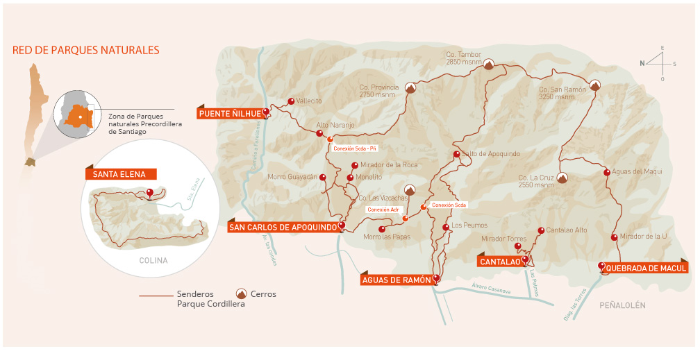

Santiago Blog and Info
#########################

.. contents:: Índice

Passeios
*********
- http://www.chileestuyo.cl
- https://www.airbnb.com
- http://www.booking.com

Resumo
========
- Santiago (metropolitano)

- Viagens curtas:
    - 1h15 Vinícola Concha y Toro
    - 1h30 de carro, Estações de Sky
    - 2h de carro, Valparaíso.
        - +1h00 norte, Playas de Cajas
        - +1h00 sul, Isla Negra
    - 2h de carro, Cajón del Maipo (**entrada** para El Morado)

- Viagens distantes:
    - 3h30 Termas próximo de Linares.
    - 4h de carro, **entrada** para Radal Siete Tazas
    - 5h30 de carro, La Serena (cidade).
        - +2h30 de carro, La Silla (observatório)
    - 13h00 de carro, Puerto Montt (**início** sul)
    - 18h00 de carro, Antofagasta (**início** norte)

Santiago
==========
- `E-Book <../static/santiago_ebook_v1-2-2.pdf>`_
- `Santiago Trip Advisor <http://www.tripadvisor.com/Attractions-g294305-Activities-Santiago_Santiago_Metropolitan_Region.html>`_

Bici
-----
- `Mapa ciclovias <https://www.google.com/maps/d/viewer?mid=zvBMMeqnQFNI.k_3VZmLi0Ab0&hl=en_US>`_

.. figure:: ../figs/santiago_CRV_mapa.jpg
    :width: 800px
    
    Circuito aos domingos

Region Baquedano
--------------------
- Cerro Santa Lucía 
- Feria (artesanal) Santa Lucía (comprar lapiz azul)
- Iglesia San Francisco (+ museo)
- Torre Telefonia (exposion)
- Museo Belas Artes (+ Parque Florestal)
- Zoologico (10h-18h, 3000 CLP)
- Funicular (10h-19h45, 2600 CLP)
- Cerro San Cristoval, la virgen (é legal ir à tardinha tipo 19, 20h para ver o entardecer)
- Teatro Municipal (http://www.municipal.cl)
- Cementerio de Santiago (ao norte)
- Bosque Santiago (ao norte)

Region La Moneda
--------------------
- Palacio de la moneda (necessita agendar. "Em baixo", tem coisas legais. 
    - cambio de guardia, para ver a troca da guarda, dia 24/01/16 e día 26/01/16, às 10AM. 

- Centro cultural del Palacio
- Museo de arte pre-colombino (martes-dom, 10h-18h, 4500)
- Correo nacional (+ museo; tem coisas antigas legais nos correios)
- Catedral de Santiago
- Mercado Central
- Estacion Mapocho
- Plaza de armas
- Museo de arte sagrado
- Museo histórico nacional

Region Central
--------------------
- Estación Central
- Parque O'Higgins
- Fantasilandia (12h-21h, todos los días, 13000)
- Museo Ciencias y Tec.
- Museo Ferroviario
- Museo Memoria y Derechos Humanos
- Museo Historial Natural. 

Region Las Condes/Vitacura/Providencia
----------------------------------------
- Costanera Center
- Los Leones (tiendas en la calle)
- Parque Bicentenario
- Parque Araucano
- Mall Parque Arauco
- `ESO Office <https://www.eso.org/public/brazil/about-eso/travel/vitacura/>`_

Restaurantes/Noite
==========================
- Patio Belavista (Belavista)
- Tangueria El Cachafaz (Pedro de Valdivia)
- Bar Irlandes Fiddlers www.fiddlers.cl (Manuel Montt)
- Pub Flannerys  (Tobalada)
- Fuente Alemana (pedir um "Lomito" y churasco; Pedro de Valdivia) 
- Bar Nacional (para comer os pratos do dia, é bem tradicional, e boa comida; Plaza de Armas & Santa Lucía & Tobalada) 
- Viña Concha y Toro, bem ao sul de Santiago, 12000/pessoa (necessita reservar).
- La Piojera (Catedral).
- Tiramisu (pizzas y pedir un "pisco sour al vaca"; El Golf)
- La Cav (chilena; Mall Alto las Condes; noroeste)
- Tanta (peruana; Mall Parque Arauco. Pedir "lomo saltado")
- Bar Azotea de Matilde (Belavista; hacer reserva!)
- Sarita Colonia (Santa Lucía; hacer reserva!)
- El Mesón Nerudiano (Belavista, com boa música. http://www.elmesonnerudiano.cl/)
- `Video Heineken <http://dl.dropbox.com/u/6569986/webpage/big/santiago_hein.mp4>`_
- Coreano Sukine (Patronato)
- Arabe (para comer Kebab) / Shawarma (Patronato)
- Bar Nacional (Plaza de armas & outros locais)
- Comida variada / espanhola COSTA BRAVA (Baquedano / Metro Universidad Catolica)
- Italiano DA RENZO (Providencia)
- Irlandes (cervejas e petiscos) THE SHAMROCK 
- Mapao Thai (Las Condes)

Trekking 
==========
- http://www.wikiexplora.com/index.php/Santiago
- http://alltrails.com/explore?q=Santiago,%20chile
- http://wikiloc.com Android App
    - http://wiki.openstreetmap.org/wiki/Mapsforge
    - http://www.openandromaps.org/en/
    - http://download.mapsforge.org/maps/

Cerro San Cristobal
----------------------
- Hasta el fin de la avenida Pedro de Valdivia. Mejor aller por el funicular.
- http://www.wikiexplora.com/index.php/Cerro_San_Crist%C3%B3bal

Cerro Pochoco
----------------
- Observatorio Achaya é o ponto de partida.
- http://www.wikiexplora.com/index.php/Cerro_Pochoco

Cerro Manquehue
-----------------
- http://www.wikiexplora.com/index.php/Cerro_Manquehue

Parque naturales Cordillera
-------------------------------
http://asociacionparquecordillera.cl/red-de-parques-naturales/

- Aguas de Ramón 
- San Carlos de Apoquindo (Las Condes)
- Puente Ñilhue 
- Quebrada de Macul
- Cantalao (\*Todas las visitas al Cantalao deben ser coordinadas y reservadas previamente. Las Palmas 385; ingreso costado Club de Campo Militar).

Cerro Provincia é um bom destino.

Viajes cortos
================
- https://www.denomades.com/pt/santiago
- Arriendo coches: 30000 CLP/día (pequeño) + seguro (que em geral, dobra o preço)
- (Tren) Sabores del Valle, 50000, 23/01/06 o 06/02/06.
- (Tren) Sabores del Malle, 60000, 30/01/06.
- Passeos en globo, 155000/persona; 3h coche de Santiago.
- http://www.observatorioroanjase.cl

Resorts de sky
--------------------
- Valle Nevado
- La Parva (Descida de bike!)
- Transportes para os resorts a partir de 15000: http://www.skitotal.cl/transporte/

Valparaíso/Viña del mar
----------------------------------------
- Buses desde 4500 !
- Viña Casas Del Bosque, o restaurante dizem que é bom. 
- Outras Viñas: Indomita, "Undurage" y "Morande"
- Playa Las Cajas (1h30 ao norte de Viña del mar)
- Termas: http://www.cityvoz.cl/article/travel-guide-hot-springs-and-thermal-spas-and-resorts-in-central-chile.html
- Isla Negra + (Casa de Neruda, 1h00 ao sul de Valparaíso)
- Hostal Napoli http://www.hostalnapoli.cl (bueno y cerca de la UV)

El Morado
------------
Roteiro (93 km de Santiago, por Puente Alto):

#. Rest. Calipso
#. "Cajon del Maipo"
#. Las Animas
#. Laguna (embalse) del Yeso
#. Terma el Plomo (camping +/- 4000)
#. El Morado

- `El Morado Trip advisor <http://www.tripadvisor.com/Attractions-g303680-Activities-San_Jose_de_Maipo_Santiago_Metropolitan_Region.html>`_
- http://www.cajondelmaipo.com/
- `Guia Turismo PDF <http://dl.dropbox.com/u/6569986/webpage/big/santiago_cajonmaipotur.pdf>`_

.. figure:: ../figs/santiago_cajonmaipo.jpg

Radal Siete Tazas
-------------------------------
- http://www.sietetazas.cl
- `Mapa <../static/santiago_mapa_7tazas.pdf>`_

Termas Panimávida, Quinamávida, Catillo
-----------------------------------------
- Cerca de Linares. 
- Tren SCL - Linares, ida-e-volta (22000)
- http://chile.travel/donde-ir/santiago-y-alrededores/atractivos-del-valle-central/termas/

Viajes lejanos
=================

Norte: Antofagasta, San Pedro de Atacama
-----------------------------------------
- Alma: aos sábados e domingos, http://www.eso.org/public/about-eso/visitors/alma/
- Paranal: aos sábados, http://www.eso.org/public/about-eso/visitors/paranal/
- Passeo en Bolívia + Saleira
- SCL - Calama (CJC), a partir de 60000 (promoção; ida-e-volta)
- SCL - Antofagasta (ANF), a partir de 70000 (promoção; ida-e-volta)
- Buses SCL - Antofagasta, a partir de 60000 (ida-e-volta)
- Buses SCL - Calama, a partir de 70000 (ida-e-volta)

::

    Agência de Turismo Ivero Travels
    Telefone: +569 42348087
    Rua Caracoles, 359-D, San Pedro de Atacama
    http://iverotravelschile.com/pt/tours-san-pedro-de-atacama-chile.html

La Serena
-----------
- Valle del Elqui
- Isla Damas (pinguinos)
- `La Serena Trip advisor <http://www.tripadvisor.com/Attractions-g303674-Activities-La_Serena_Coquimbo_Region.html>`_

Chillan
----------
- Termas: http://www.chileanski.com/por/termas-de-chillan/como-chegar.htm

Patagonia
------------
- "Carretera austral": é o nome dado a autopista chilena no. 7, entre as cidades Puerto Montt e Villa O'Higgins. 
- `My info carretera <patagonia.html>`_
- Hulio Hulio: inacreditáveis ($$$) hotéis no meio da reserva.
- https://www.denomades.com/torres-del-paine
- https://www.denomades.com/punta-arenas

Uteis
************
Aeroporto - centro Santiago
================================
Taxi: ~15000 CLPd.

Onibus: Duas empresas oferecem o serviço diariamente. Ambos saem do primeiro andar do aeroporto, em frente à saída 5, e fazem suas paradas nas entradas de algumas estações do metrô de Santiago.

Turbus 
----------------------
Onibus verde, ~1400 CLP.

SCL hasta Pajaritos, Las Rejas e Universidad de Santiago ("Terminal Alameda"). O serviço é prestado de 5 hs até 0 hs, a cada 20 minutos. De madrugada, sai um ônibus a cada hora, com destino até o Terminal Alameda.

Do centro para SCL, Terminal Alameda (plataformas 22 e 23) e Pajaritos.

Centropuerto
---------------
Onibus azul, ~1600 CLP.

De SCL, faz um trajeto mais longo que a Tur-Bus, parando nas estações Pajaritos, Las Rejas, Universidad de Santiago, Estación Central e finaliza o trajeto na Estación Los Héroes. 

No retorno ao Aeroporto, faz paradas nas mesmas estações, no sentido contrário (embarque em Los Héroes).

Arriendo
=========
- http://www.compartodepto.cl
- http://www.portalinmobiliario.com
- http://www.propiedades.emol.com
- http://www.goplaceit.com

Compras
***********
Dicas conversão
=================
:math:`BRL \rightarrow CLP = \times 200 - 10%`. Exemplo: 5 BRL :math:`\times` 200 - 10% = 900 CLP.

:math:`CLP \rightarrow BRL = \div 200 + 10%`. Exemplo: 2500 CLP :math:`\div` 200 = 12.5 + 10% = 14 BRL.

Voos
======
- Para voos durante a semana, pesquise tarifas entre 10h e 16h
- Procure comprar com mais de 28 dias de antecedência
- Tente permanecer no destino por 7 dias ou mais
- Para voos aos finais de semana, pesquise tarifas de sábado após o meio-dia e de domingo até o meio-dia

- http://www.skyscanner.com
- http://www.voegol.com.br/pt-br/promocoes/paginas/ofertas-da-semana.aspx
- http://www.melhoresdestinos.com.br/

Aplicativos
==============
- *XE Currency*: Muito usado em viagens para o exterior, este conversor de moedas tem boa provação entre os usuários. Converte mais de 180 moedas na interface de fácil acesso, além de armazenar os dados para acesso offline.

- *Hotwire*: Este aplicativo mapeia os maiores descontos em hotéis e mostra as melhores ofertas de acordo com a localização.

- *Desti*: O Desti reduz a busca de anúncios por meios de palavras-chave e traz resultados mais precisos sobre reservas de quartos, aluguel de veículos e outros serviços, priorizando os descontos mais interessantes.

- *Kayak*: O aplicativo permite que o usuário faça reservas de voos, hotéis e aluguel de carro, além de outros serviços. Também possibilita criar roteiros, checar status de voos e configurar alertas sobre promoções.

Sítios
========
- http://www.mercadolibre.cl (usada) 
- http://www.yapo.cl (usada) 
- http://www.easy.cl (nova) 
- http://www.homecenter.cl (nova) 
- http://www.falabella.cl (nova) 
- http://www.ripley.cl (nova) 

Bicicleta 
============
- Tem uma quadra no centro de santiago, que é especializada em bicicletas, lá deverias encontrar o melhor preço. Mas na verdade não é tão barato assim... Calle San Diego.

